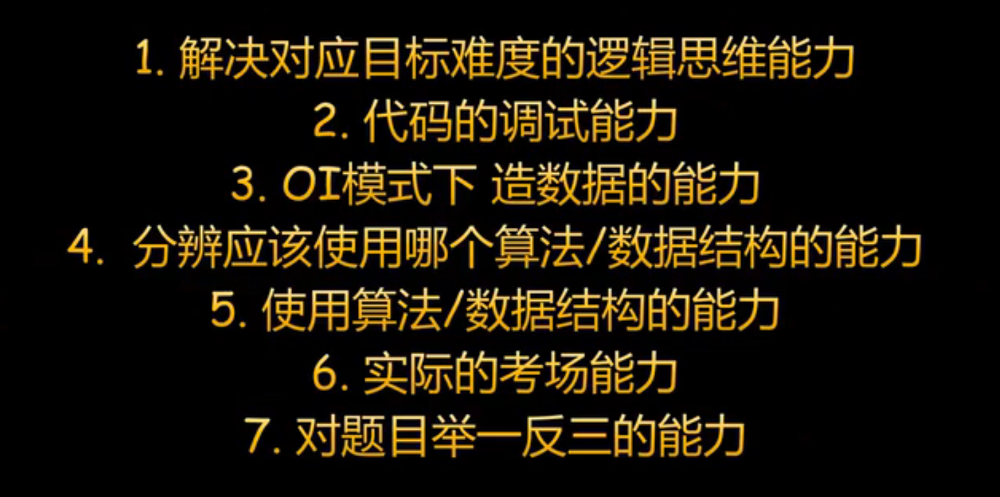

# 第一课 学习和训练方法

---

# 洛谷团队

https://www.luogu.com.cn/team/32128

---

# 怎么搞 OI？

【一个金牌选手的信竞攻略】 https://www.bilibili.com/video/BV1xSYxzDEPg/

by 杨宇辰（command_block）

---

# 竞赛的功利作用

- 上大学
    - 高风险高收益，赢者通吃。
    - 想考清北则不可忽视。
    - 缺乏中间选项，除部分顶部收益，其余性价比低下。

- 知识储备
    - 在大学，竞赛知识比高考知识显著有用。
    - 如果能学习相关专业，竞赛背景是很好的优势。

---

# 竞赛想成功，需要四样东西

- 资源
- 天赋
- 时间
- 训练策略

---

# 资源

- 类型：
    - 题目
    - 教学

- 资源不再是一个选择之后、饭来张口的东西，它必须被选手时刻考虑。
- 筛选和利用资源的能力非常重要，和你在科目本身的天分一样重要。

---

# 天赋

**第一天赋：积极性**

**第二天赋：心态和性格**

**第三天赋：脑子**

脑子的差距虽然很显著，但通常不及其他因素显著。

**常被误认为是天赋，误认为无法获得，实际上可以通过训练取得的东西：**
- 竞赛的重要思维方式
- 训练策略

---

# 时间

- 如何平衡竞赛与文化课？
- 如何控制退役后的可能风险？

这是要判断自己在竞赛中是否占据优势，是否值得进一步投入时间。

---

# 时间

- 如何判断自己的时间是充足还是紧张？
- 在什么时间节点应该开始全力投入时间？

这需要对整个生涯的进度有明确的判断。

总的来说，时间就是生命，大多情况下，快就是强。

比别人早一年学完，就多一年考试机会。这在低容错的竞赛中十分宝贵。

---

# 竞赛生涯的三个阶段

- 前期：学习知识
- 中期：锻炼思维，优化赛场表现
- 后期：提升稳定性

---

# 竞赛生涯的三个阶段：前期

知识没学完，没有上桌的资格。

知识没学 --> 某些题必然不会 --> 赛季报销

知识有漏洞，中期稳定性会差很多。

**前期的主要任务：尽量快、完成度尽量高地学习竞赛的主干知识。**

---

# 竞赛生涯的三个阶段：前期 

常见误区：

- 在主干知识有显著缺陷的情况下，投入大量时间学习冷门知识。

- 过早关注比赛表现，在生涯前期投入过多时间打简单比赛，拖慢学习进度。

---

# 竞赛生涯的三个阶段：前期 

在弱省/小市，一个知识体系健全（NOI标准）的选手，即成功度过前期的选手，已经很难得了。好的前期策略在这些地区有压倒性的优势。

绝大多数选手无法度过前期，难度日益提高的联赛在他们眼中像抽奖。

前期的两大问题：
- 如何获取资源？
- 如何高效利用资源？

---

# 高效利用资源

- 题怎么刷？
- 知识怎么学？

---

# 为什么要刷题？

刷题能锻炼四个能力：
- 知识点：怎么把知识运用到题目当中
- 思维：针对题目的具体情形，进行一些推理
- 代码实现：学习一个算法最经典、最主干的实现方式，养成自己的固有格式。（写熟）
- 代码调试：针对具体题目写出非套路的代码（变种、拼接），以及长时间的调试。

---

# 知识怎么学？

关键问题：
- 我如何知道有哪些知识需要学？
- 我如何知道知识之间的依赖和捷径？
- 哪些知识该先学？哪些知识该后学？

---

# 渗透学习法

对于一个算法

- 先知道它叫什么：有个算法叫 FFT
- 再知道它的地位：FFT 在多项式计数里很重要
- 再知道它的用途：FFT 可以快速计算多项式乘法
- 再知道它的核心原理：...
- 再知道它的具体原理：如此如此……这般这般……

我们都以最后一步为学习完成的标准，而忽视前期引导。实际上，前面的步骤虽然加起来没多少字，但同样重要。

---

# 归纳学习法

竞赛中，有很多知识是没有严格体系的，只能松散地聚在一起。

你持有一套不完整的、不精确的、不简练的结论，还要记忆和发展它们。

---

# 归纳学习法

如何应对陌生的知识：

- **化归**：尝试将其规约到我们熟悉的理论体系当中。
- **粘附**：尝试联想它和熟悉知识的相关性，关联越多，我们越能稳固地掌握它。

如果化归和粘附都失败，表明我们发现了一个孤例的新知识，即**初见**。

如果你觉得它是**重要的初见**，不管它长得多么奇怪，都应该记载它，学习它，等待下一个例子来与它印证。

---

# 归纳学习法

**更积极地进行粘附**：对于无体系的知识，粘附就是我们能做到的最好的组织形态。

即使没有理解障碍，也应该思考粘附的可能，它使我们的知识更加牢固，让我们能从多种视角看问题。

---

# 好记性不如烂笔头

为你学过的每个知识体系写一篇笔记。

- 用你自己的语言记载，方便复习。
- 你可以不断迭代对知识的理解，剔除过于熟悉的，整合臃肿多余的，最终精炼出关键的几句话。

---

# 如何利用开源知识

主要是博客。往往是其他选手初学知识的时候做的笔记，因此博客很容易出错，而且结构往往不那么好，内容也未必全面。

胜在数量多。只要肯挑选，总有你想要的。

阅读时，保持自己的思考，不仅要避开可能的错误，还要构建自己的思路，未必要跟着作者走。

---

---

# 信奥学习工具

1. 课堂笔记
2. 日常做题记录表
3. 模考总结表
4. CSP-J/S 知识点 拿分能力一览表

---

# 日常做题记录表

日期 题号 题目难度 知识点 多次提交分数 造数据 自我总结

对每个知识点的熟练度、做题量、解题能力有一个量化数据。你能以此为参考，看自己是否需要加练。

造数据：每题都造 2 组数据，逼迫自己锻炼在 OI 模式下的能力。
自我总结：做这题犯的错，解题思路，套路，小技巧，融汇贯通，举一反三。

---

# 模考总结表

考试难度 知识点 拿分情况 错误原因 考试复盘

---

# CSP-J/S 知识点 拿分能力一览表

题型/知识点 刷题量 拿分情况

观察一个知识点分不到每个难度上的 AC 率。

通过这个表，可以在考前/假期有针对性地复习和加练。
什么不行就练什么。

---

# 信奥赛J组选手应该具备的7种能力
https://www.bilibili.com/video/BV1y1421B76w/ by FayeTY

