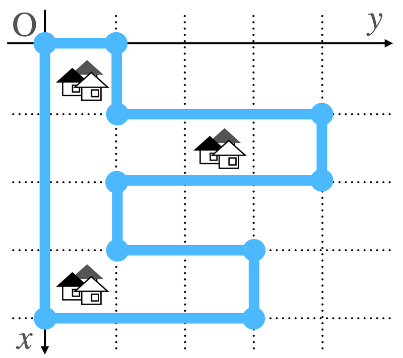
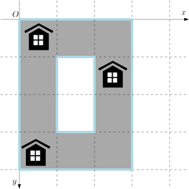
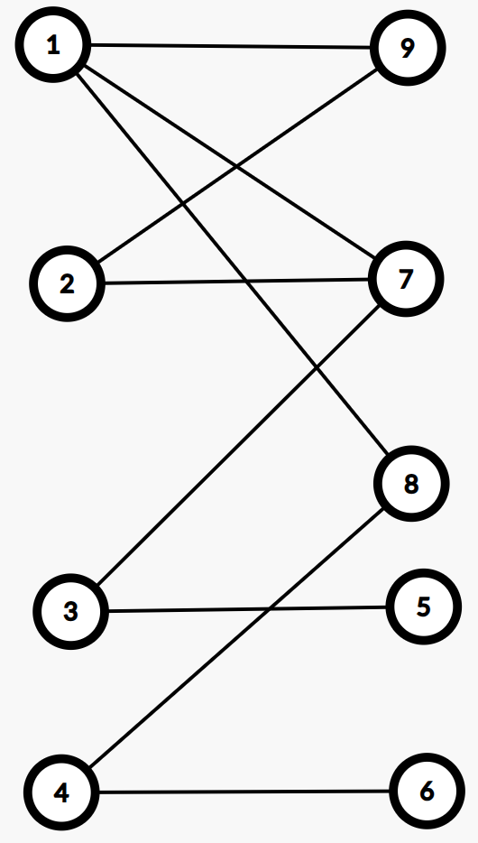
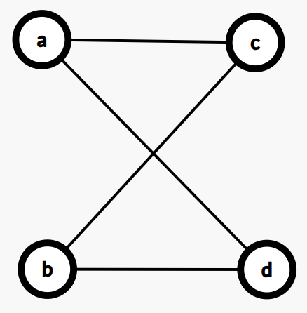
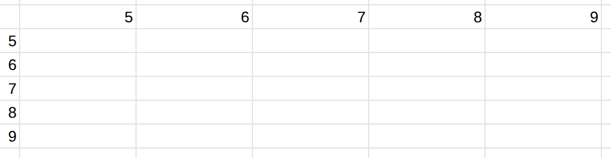
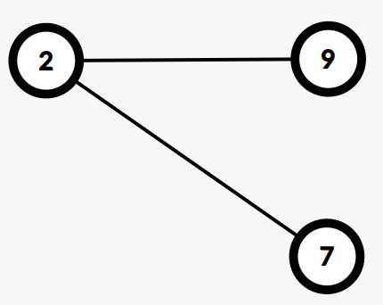

# 第一课 枚举法

枚举法是一种常用的问题求解方法。

对于求满足条件 $P$ 的东西的数量或最大/最小值这类问题，一个自然且暴力的想法是把满足条件 $P$ 的东西逐个枚举出来。

使用枚举法的难点在于
- 枚举什么？
- 枚举的范围？


---


# 例题： ABC 猜想 [abc227_c](https://atcoder.jp/contests/abc227/tasks/abc227_c)

给你一个正整数 $N$。

求满足下列条件的正整数三元组 $(A, B, C)$ 的数量。

- $A\leq B\leq C$ 且 $ABC\leq N$。


###### 限制

- $1 \leq N \leq 10^{11}$
- 答案小于 $2^{63}$。

---

<div class=columns>
<div>

### 样例输入 1

```
4
```

</div>

<div>

### 样例输出 1

```
5
```

</div>
</div>

满足条件的三元组有 $(1,1,1),(1,1,2),(1,1,3),(1,1,4),(1,2,2)$。


<div class=columns><div>

### 样例输入 2

```
100
```


</div><div>

### 样例输出 2

```
323
```

</div></div>

<div class=columns><div>

### 样例输入 3

```
100000000000
```

</div><div>

### 样例输出 3

```
5745290566750
```

</div></div>


---

# 解法

- 枚举 $A$、$B$，计算 $C$ 的个数。
  - $A$：$1, 2, \dots, ??$
    - $B$：$A, A+1, \dots, ??$
      - $C$：$B, B + 1, \dots, \lfloor N / (AB) \rfloor$
      - $C$ 的数量 = $\lfloor N /(AB) \rfloor - B + 1$

- **控制**枚举量：
    - $A\times A \times A \le N$
    - $A \times B \times B \le N$


---

# 代码

```cpp
int main() {
  long long ans = 0;
  long long n; cin >> n;
  long long cnt = 0;
  for (long long a = 1; a * a * a <= n; a++)
    for (long long b = a; a * b * b <= n; b++) {
      ans += n / a / b - b + 1;
    }
  cout << ans << '\n';
}
```

## Tips

- 乘法很快，你不需要 `cbrt()`。

---


# 代码足够快吗？

用最大的数据 $N = 10^{11}$ 验证。


---

# 估算枚举量

- $N^{1/3} N^{1/2} = N^{5/6}$
- $N^{1/3} N^{1/2} - (1 + 2 + \dots + N^{1/3}) \approx N^{5/6} - (1/2) N^{2/3}$

最直接的办法：运行程序算枚举次数。

---

# Tips

- 利用约束条件控制枚举范围，不要“傻瓜式”枚举。
- 用极限数据测运行时间。


---

# 例题： 等差数 [abc234_e](https://atcoder.jp/contests/abc234/tasks/abc234_e)


我们把满足下列条件的**正整数** $n$ 称为**等差数**。

- 设 $n$ 的十进制表示是 $\overline{d_1 d_2 \dots d_k}$（$d_1 \ne 0$）。 $(d_2-d_1)=(d_3-d_2)=\dots=(d_k-d_{k-1})$ 成立。 
    - 换言之，$(d_1,d_2,\dots,d_k)$ 是等差数列。
    - 特别地，一位数都是等差数。

例如 $234,369,86420,17,95,8,11,777$ 是等差数而 $751,919,2022,246810,2356$ 不是。

求不小于 $X$ 的最小等差数。


###### 限制

- $X$ 是整数。
- $1 \le X \le 10^{17}$

---

<div class=columns><div>

### 样例输入 1

```
152
```

</div><div>


### 样例输出 1

```
159
```

</div></div>


<div class=columns><div>

### 样例输入 2

```
88
```

</div><div>


### 样例输出 2

```
88
```

</div></div>


<div class=columns><div>

### 样例输入 3

```
8989898989
```

</div><div>


### 样例输出 3

```
9876543210
```

</div></div>


---

# 解法


- 不小于 $X$ 的最小等差数的位数跟 $X$ 相同。（为什么？）

- 设 $X$ 的位数是 $L$。
- 解空间：长度 $L$，各项是 $0$ 到 $9$ 的数字，首项不是 $0$，的等差数列。

- 等差数列由首项和公差确定。
    - 首项：$1, 2, \dots, 9$
    - 公差：$-9, \dots, 9$

- 枚举量小于 $200$。

---

# 代码

```cpp
int main() {
  long long x;
  cin >> x;
  int len = to_string(x).size();
  long long ans = x * 10;
  for (int a = 1; a <= 9; a++) {
    for (int d = -9; d <= 9; d++) {
      long long sum = 0;
      for (int i = 0; i < len; i++) {
        int t = a + d * i;
        if (t < 0 || t > 9) break;
        sum = sum * 10 + t;
      }
      if (sum >= x) {
        ans = min(sum, ans);
      }
    }
  }
  cout << ans << '\n';
}
```

---


# Tips

- 利用解的性质（明示的和隐含的）精准枚举。

---

# 例题：M <= ab [abc296_d](https://atcoder.jp/contests/abc296/tasks/abc296_d)

给你两个正整数 $N$ 和 $M$。

找到满足下列两条件的最小正整数 $X$。若不存在这样的整数，输出 $-1$。

- $X$ 可以表示为两个整数 $a$，$b$ 的乘积且 $1 \le a, b \le N$。这里，$a$ 和 $b$ 可以相同。
- $X \ge M$


###### 限制

- $1\leq N\leq 10^{12}$
- $1\leq M\leq 10^{12}$


---

我们要找两个数 $a, b$ 满足 
- $1 \le a, b \le N$
- $ab \ge M$

$ab$ 越小越好。

# 观察

- 如果 $a$ 确定了，$b$ 就能确定，$b= \lceil M/a \rceil$。
- $ab \le M$，$ab$ 越小越好。$a$、$b$ 中较小的那个不超过 $\lceil\sqrt{M}\rceil$。 

# 解法

- 枚举 $a$，从 $1$ 到 $\min(N, \lceil\sqrt{M}\rceil)$，算出 $b$。

---

# 代码

```cpp
int main() {
  long long N, M;
  cin >> N >> M;
  long long ans = -1;
  for (long long a = 1; a <= N; a++) {
    long long b = (M + (a - 1)) / a;
    if (b <= N) {
      if (ans == -1 || ans > a * b)
        ans = a * b;
    }
    if (a * a >= M)
      break;
  }
  cout << ans;
  return 0;
}
```

---

# Tips

- 对于两数相乘如何如何这种条件，通常去考虑两数当中较小的那个数的上界。

---

# 例题：校庆

给定正整数 $n$，求 $n$ 在几进制下的写法末尾的 0 最多。

输出两个数 $b$，$c$，表示 $n$ 在 $b$ 进制下末尾的 0 最多，有 $c$ 个；若有多个 $b$ 满足条件，输出最大的那个。

###### 限制

- $2 \le n \le 2^{63} - 1$。

---

# 分析

- $n$ 在 $b$ 进制下末尾的 0 的个数 = $n$ 能被 $b$ 整除的次数。
- $n$ 在 $n$ 进制下写成 10，末尾有一个 0。
- 我们试图找一个 $b$ 使得 $n$ 在 $b$ 进制下末尾至少有两个 0，也就是 $b^2 \mid n$。
- 我们可以枚举 $b$，从 $2$ 到 $\sqrt{n}$；可是 $n$ 太大，这样会超时。
- 我们枚举 $b$，从 $2$ 到 $n^{1/3}$。对于大于 $n^{1/3}$ 的 $b$，注意到 $n/b^2 < n^{1/3}$，我们可以通过枚举 $n/b^2$ 来找到 $b$。


---

# Tips

枚举因数类问题的一个常用技巧：

- 正整数 $n$ 的因数是成对的：如果 $a$ 是 $n$ 的因数，那么 $n/a$ 也是 $n$ 的因数；$a$ 越大，$n/a$ 就越小。


在《校庆》这道题中，我们要枚举 $n$ 的因数 $b^2$。当 $b$ 比较小时，我们直接枚举 $b$；当 $b$ 比较大时，我们转而去枚举较小的 $n/b^2$。


---

# 代码

```cpp
void solve(long long n) {
  int C = 1;
  long long B = n;
  for (long long b = 2; b * b * b <= n; b++) {
    if (n % (b * b) == 0) {
      long long t = n / (b * b);
      int cnt = 2;
      while (t % b == 0) {
        t /= b;
        cnt++;
      }
      if (cnt >= C) {
        C = cnt;
        B = b;
      }
    }
  }
  if (C <= 2) // 当 b > n**{1/3} 时，n 在 b 进制下末尾最多有 2 个 0
    for (int k = 1; k * k * k < n; k++)
      if (n % k == 0) {
        long long t = sqrt(n / k);
        if (t * t == n / k) {
          C = 2;
          B = t;
          break;
        }
      }
  cout << B << ' ' << C << '\n';
}
```


---

# 例题：数字和 [arc060_b](https://atcoder.jp/contests/abc044/tasks/arc060_b)

对于整数 $b$（$b \ge 2$）和 $n$（$n \ge 1$），定义函数 $f(b, n)$ 为 $n$ 写成 $b$ 进制时的数字和。例如
- $f(10,87654) = 8 + 7+ 6 + 5 + 4 = 30$
- $f(100, 87654) = 8 + 76 + 54 = 138$

给定整数 $n$ 和 $s$。判断是否存在整数 $b$（$b \ge 2$）使得 $f(b,n)=s$。若存在，找到满足条件的最小的 $b$。

###### 限制

- $1 \le n,s \le 10^{11}$

---

# 解法

对于 $b \le \sqrt{N}$，暴力枚举 $b$。对于 $b > \sqrt{N}$，注意到 $N$ 在 $b$ 进制下最多是两位数，且第二位上的数字小于 $\sqrt{N}$，此时可以暴力枚举第二位上的数字 $d$，那么第一位上的数字就是 $s - d$，然后检查是否有 $b\cdot d + (s - d) = N$。

---

# 例题：立方差 [abc397_d](https://atcoder.jp/contests/abc397/tasks/abc397_d)

给你一个正整数 $N$。判断是否有一对正整数 $(x, y)$ 使得 $x^3 - y^3 = N$。若有，输出一组解，否则输出 -1。

###### 限制

- $1 \le N \le 10^{18}$


---

# 推式子

分解因式
$$N = x^3 - y^3 = (x - y)(x^2 + xy + y^2)$$
**注意到**
$$
x^2 + xy + y^2 > x^2 - 2xy + y^2 = (x - y)^2
$$
所以
$$N > (x-y)^3$$
我们得到
$$x - y < N^{1/3}$$

---

# 枚举 x - y

设 $d = x - y$，枚举 $d$，从 $1$ 到 $N^{1/3}$。

然后怎么办？

---

# 办法一

以 $x=y+d$ 代入方程 $x^3 - y^3 = N$，得
$$
(y+d)^3 - y^3 = N.
$$ 
即
$$
3dy^2 + 3d^2y + d^3 - N = 0.
$$
解此二次方程就得到 $y$。

其实解这个方程也不是很容易。


---

# 办法二


我们有
$$
\begin{aligned}
 x^2 + xy + y^2  &= N/d \\
 x^2 - 2xy + y^2 &= (x-y)^2 = d^2
\end{aligned}
$$
两式相减，得
$$
xy = (N/d - d^2) /3
$$
那么
$$
(x+y)^2 = (x-y)^2 + 4xy = d^2 + 4((N/d - d^2) /3) 
$$
开平方根就得到 $x+y$。

有了 $x - y$ 和 $x + y$ 就能算出 $x$ 和 $y$。

---

# 代码


```cpp
void solve(long long N) {
  for (long long d = 1; d * d * d < N; d++) {
    if (N % d) continue;
    long long k = N / d - d * d;
    if (k % 3) continue;
    long long xy = k / 3;
    long long t = d * d + 4 * xy;
    long long s = sqrt(t);
    if (s * s != t) continue;
    // x + y = s;     x - y = d
    long long x = (s + d) / 2;
    long long y = s - x;
    cout << x << ' ' << y << '\n'; return;
  }
  cout << -1 << '\n';
}
```

---

# 例题：罐头和开罐器 [abc312_f](https://atcoder.jp/contests/abc312/tasks/abc312_f)


---


有 $N$ 个物品。每个物品是易拉罐头，普通罐头，或开罐器。

第 $i$ 个物品由一对整数 $(T_i, X_i)$ 描述：

- 若 $T_i = 0$，第 $i$ 个物品是易拉罐头；吃了它，你会获得 $X_i$ 点体力。
- 若 $T_i = 1$, 第 $i$ 个物品是普通罐头，需要使用开罐器打开；吃了它，你会获得 $X_i$ 点体力。
- 若 $T_i = 2$, 第 $i$ 个物品是开罐器；它可以开罐 $X_i$ 次。

你可以从 $N$ 个物品中拿走 $M$ 个。求最多能获得多少点体力。


###### 限制

- $1 \leq M \leq N \leq 2 \times 10^5$
- $1 \leq X_i \leq 10^9$

---

# 观察

- 每种东西，不论拿几个，都是优先拿 $X$ 值大的。
- 把“拿 $M$ 个物品”改为“拿不超过 $M$ 个物品”，答案不变。
- 加一个限制：拿的普通罐头都打开吃掉了。（没吃掉的干脆不拿。）
- 拿了几个普通罐头决定了需要拿几个开罐器。

---

# 解法

- 把物品的 $X$ 值按物品种类分组存放。
- 每种物品的 $X$ 值从大到小排序。
- 计算每种物品的 $X$ 值的前缀和数组。
- 枚举拿几个普通罐头，然后确定拿几个开罐器，然后确定拿几个易拉罐头。

---

# 代码

```cpp
int main() {
    int n, m; cin >> n >> m;
    vector<int> X[3];
    for (int i = 0; i < n; i++) {
        int t, x; cin >> t >> x;
        X[t].push_back(x);
    }
    for (int i = 0; i < 3; i++)
        sort(X[i].rbegin(), X[i].rend());
    
    vector<long long> sum[3]; // 前缀和
    for (int i = 0; i < 3; i++) {
        sum[i].resize(X[i].size() + 1);
        for (int j = 0; j < X[i].size(); j++)
            sum[i][j + 1] = sum[i][j] + X[i][j];
    }

    long long ans = 0;
    int j = 0; // 需要的开罐器的数量
    for (int i = 0; i <= (int) X[1].size(); i++) {
        if (i > m) break;
        if (sum[2][j] < i) j++;
        if (j > (int) X[2].size() || i + j > m) break;
        int k = min(m - i - j, (int) X[0].size()); // 拿的易拉罐的数量
        ans = max(ans, sum[0][k] + sum[1][i]);
    }
    cout << ans << '\n';
}
```

---

# Tips

有时候一个变量确定了，其他变量都确定了。

---

# 例题：偶数矩阵 [UVa 11464](https://uva.onlinejudge.org/index.php?option=com_onlinejudge&Itemid=8&category=26&page=show_problem&problem=2459)

给你一个 $n \times n$ 的 01 矩阵（每个元素非 0 即 1），你的任务是把尽量少的 0 变成 1，使得矩阵中每个元素的上、下、左、右的元素（如果存在的话）之和均为偶数。

有 $T$ 组数据。对于每组数据，输出被改变的元素的最小个数。如果无解，输出 $-1$。

###### 限制

- $T \le 30$
- $1 \le n \le 15$


---


# 例题：护城河 [abc129_e](https://atcoder.jp/contests/abc219/tasks/abc219_e)


坐标平面上有一些村庄。我们可以把一个村庄当成一个点。
我们要挖护城河来保护这些村庄。  

给你一个 $4 \times 4$ 矩阵 $A = (A_{i, j})$，矩阵的每一项是 $0$ 或 $1$。对于每一对整数 $(i, j)$（$1 \leq i, j \leq 4$），若 $A_{i, j} = 1$，则点 $(i - 0.5, j - 0.5)$ 处有一个村庄。

可以把护城河看成平面上的一个多边形。这个多边形要满足下列条件。

1. 多边形的边不自交。
2. 所有村庄都位于多边形内部。
3. 多边形的每个顶点的 $x$ 坐标和 $y$ 坐标都是 $0$ 到 $4$ 的整数（包括 $0$ 和 $4$）。
4. 多边形的每条边都平行于 $x$ 轴或 $y$ 轴。
5. 多边形的每个内角是 $90$ 度或 $270$ 度。

求挖护城河有多少种方式。


---

<div class=columns><div>

### 样例输入 1

```
1 0 0 0
0 0 1 0
0 0 0 0
1 0 0 0
```

</div><div>


### 样例输出 1

```
1272
```

</div></div>

下列两种护城河满足条件。

 

下列四种护城河不满足条件。
   


---

# 思路

- 枚举护城河（封闭的折线）不容易。
- 我们枚举被护城河包围的格子是哪些（从 $16$ 个格子里选一些，一共 $2^{16}$ 种情况）然后护城河就唯一确定了。
- 被护城河包围的格子需要满足：连通且没有洞。


如何判断是否有洞？

---

# 判断是否有洞

- 从最外面一圈未被选中的格子开始搜索四连通的未被选中的格子。若所有未被选中的格子都能索到，说明没有洞。


---

# 代码


```cpp
int a[4][4];
int vis[4][4];

int main() {
  for (int i = 0; i < 4; i++)
    for (int j = 0; j < 4; j++)
      cin >> a[i][j];
  int ans = 0;
  for (int s = 1; s < 1 << 16; s++) {
    memset(vis, 0, sizeof vis);
    for (int i = 0; i < 16; i++) {
      if (s >> i & 1) {
        vis[i / 4][i % 4] = 1; //给选中的格子打标记
      }
    }
    ans += check();
  }
  cout << ans << '\n';
}
```

---

```cpp
int dir[4][2] = {1, 0, -1, 0, 0, 1, 0, -1};

void dfs(int r, int c, int type) { // 搜连通块
  vis[r][c]++;
  for (int i = 0; i < 4; i++) {
    int x = r + dir[i][0], y = c + dir[i][1];
    if (0 <= x && x < 4 && 0 <= y && y < 4 && vis[x][y] == type)
      dfs(x, y, type);
  }
}
```

---

```cpp
int check() { // 检查
  for (int i = 0; i < 4; i++)
    for (int j = 0; j < 4; j++)
      if (a[i][j] == 1 && vis[i][j] == 0) //没有选择全部村庄
        return 0; 
  int sx, sy;
  for (int i = 0; i < 4; i++)
    for (int j = 0; j < 4; j++)
      if (vis[i][j]) {
        sx = i;
        sy = j;
      }
  dfs(sx, sy, 1);
  for (int i = 0; i < 4; i++)
    for (int j = 0; j < 4; j++)
      if (vis[i][j] == 1)
        return 0;// 选中的格子不连通
  for (int i = 0; i < 4; i++)
    for (int j = 0; j < 4; j++)
      if (vis[i][j] == 0 && (i == 0 || j == 0 || i == 3 || j == 3))
        dfs(i, j, 0);
  for (int i = 0; i < 4; i++)
    for (int j = 0; j < 4; j++)
      if (vis[i][j] == 0) // 选中的格子有洞
        return 0;
  return 1;
}
```


---

# Tips

自顶向下、逐步求精的模块化程序设计。

---

# 例题：假期计划 [P8817](https://www.luogu.com.cn/problem/P8817)

给定有 $n$ 个点 $m$ 条边的无向图 $G$，点从 $1$ 到 $n$ 编号。对 $i = 2, \dots, n$，点 $i$ 有分数 $s_i$。今要从点 $2, \dots, n$ 中选择四个**相异**的点 $a, b, c, d$，使得序列 $1, a, b, c, d, 1$ 中每相邻两点在图 $G$ 上距离都不大于 $k+1$。

求 $a, b, c, d$ 四点的分数之和的最大值。

保证存在满足条件的四个点。

###### 限制

- $5 \le n \le 2500$
- $1 \le m \le 10000$
- $0 \le k \le 100$
- $1 \le s_i \le 10^{18}$


---

# 思路


- 观察右图，注意到行程的**对称性**。$a, d$ 对称，$b, c$ 对称。
- 考虑枚举中间两点 $b, c$。
- 考虑 $a$ 和 $1, b$ 的关系（$d$ 和 $1, c$ 的关系也是这样）：
    - 点 $a$ 到点 $1$ 和 $b$ 的距离都不超过 $k+1$。
- 最优解中，$d, c$ 两点也可能与 $1, b$ 有上述关系。
- 无论 $d, c$ 两点为何，$a$ 一定在和 $1, b$ 有上述关系的点中，分数前三大者当中。


此思路也可说是 meet in the middle。

---

# 解法

- 对每个点 $v$，
    - 找出在距离点 $v$ 和点 $1$ 都不超过 $k+1$ 的那些点。
    - 取其中分数前三大的三个点，成集合 $S_v$。
- 枚举 $b, c$，从 $S_b$ 中选一点作为 $a$，从 $S_c$ 中选一点作为 $d$。

---

# Tips

- 对称性十分重要。


---

<div class=col46>

```cpp
const int maxn = 2500 + 5;
int n, m, k;
vector<int> g[maxn];
long long p[maxn]; //景点的分数
vector<int> cand[maxn];
int dist[maxn][maxn];
const int INF = 1e9;

void bfs(int s) {
  for (int i = 1; i <= n; i++)
    dist[s][i] = INF;
  queue<int> q;
  q.push(s);
  dist[s][s] = 0;
  while (!q.empty()) {
    int u = q.front();
    q.pop();
    for (int v : g[u])
    if (dist[s][v] == INF) {
      dist[s][v] = dist[s][u] + 1;
      q.push(v);
    }
  }
}

bool cmp(int i, int j) {
  return p[i] > p[j];
}
```

```cpp
int main() {
  cin >> n >> m >> k;
  for (int i = 2; i <= n; i++) cin >> p[i];
  for (int i = 0; i < m; i++) {
    int u, v; cin >> u >> v;
    g[u].push_back(v); g[v].push_back(u);
  }
  for (int i = 1; i <= n; i++) bfs(i);

  vector<int> ad;
  for (int i = 2; i <= n; i++)
    if (dist[1][i] <= k + 1) ad.push_back(i);
  sort(ad.begin(), ad.end(), cmp);
  
  for (int i = 2; i <= n; i++)
    for (int v : ad)
      if (v != i && dist[i][v] <= k + 1) {
        cand[i].push_back(v);
        if (cand[i].size() == 3) break;
      }

  long long ans = 0;

  for (int b = 2; b <= n; b++)
    for (int c = b + 1; c <= n; c++)
      if (dist[b][c] <= k + 1)
        for (int a : cand[b])
          for (int d : cand[c])
            if (a != c && a != d && b != d)
              ans = max(ans, p[a] + p[b] + p[c] + p[d]);
  cout << ans << '\n';         
}
```

---

# 例题：找四元环 [abc260_f](https://atcoder.jp/contests/abc260/tasks/abc260_f)


有一个简单无向图 $G$，图上有 $(S+T)$ 个点和 $M$ 条边。点和边都从 $1$ 开始编号。

编号为 $1, 2, \dots, S$ 的点之间没有边，编号为 $S+1, S+2, \dots, S+T$ 的点之间也没有边。

一个长度为 $4$ 的环称为四元环。


若图 $G$ 里含有四元环，从中任选一个，输出环上的四个点的编号（顺序任意）。若图 $G$ 里不含有四元环，输出 -1。 


- $2 \leq S \leq 3 \times 10^5$
- $2 \leq T \leq 3000$
- $4 \leq M \leq \min(S \times T,3 \times 10^5)$

---

# 样例

<div class=columns><div>

### 输入
$S=4$，$T=5$


</div><div>

### 输出

1 7 2 9


---


一个**二分图**，左边有 $S$（≤ 三十万）个点，右边有 $T$（≤ 三千）个点。要在上面找一个四元环。

# 观察

- 右边的点数显著少于左边。
- 二分图上的四元环形如右图。 


---

# 观察

- 我们要找两个左边的点 a, b 和两个右边的点 c, d 使得 a 和 c, d 都有边相连，b 和 c, d 都有边相连。


- 右边的点最多 $3000$ 个。点对 c, d 的选择至多 $3000^2$ 个，不很多。

---

# 解法

<div class=columns><div>

 

</div><div>



</div></div>

---

<div class=columns><div>

 

</div><div>


</div></div>

<div class=columns><div>



</div><div>

时间：$O(T^2)$

鸽笼原理

</div></div>

---

# 代码

```cpp
vector<int> a[300005];
int vis[3005][3005];

int main() {
  int S, T, M;
  cin >> S >> T >> M;
  while (M--) {
    int u, v;
    cin >> u >> v;
    a[u].push_back(v - S);
  }
  for (int u = 1; u <= S; u++) {
    for (int i = 0; i < a[u].size(); i++)
      for (int j = 0; j < i; j++) {
        int x = min(a[u][i], a[u][j]);
        int y = max(a[u][i], a[u][j]);
        if (vis[x][y] == 0) {
          vis[x][y] = u;
        } else {
          cout << vis[x][y] << ' ' << u << ' ' << x + S << ' ' << y + S;
          return 0;
        }
      }
  }
  cout << -1;
}
```

---

# Tips

- 仔细看数据范围。异常的数据范围往往暗示解法。
- 画图观察。

---

# 总结


许多问题不是需要用什么算法才能解决的，好好枚举就足够了。


