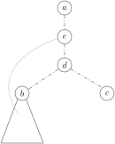
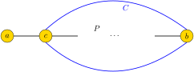
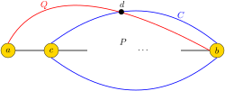
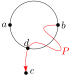
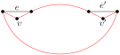
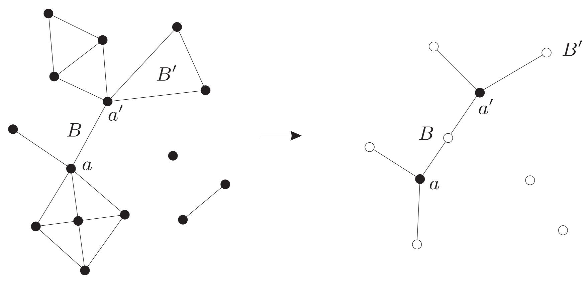
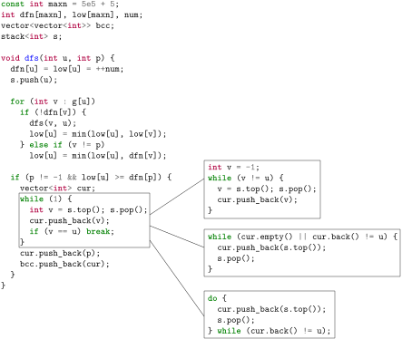
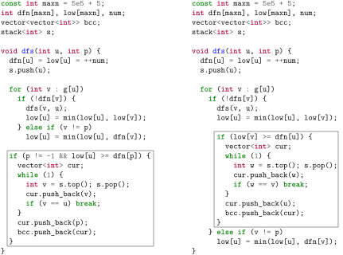
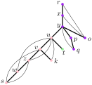

# 无向图上的深度优先搜索

depth-first search，DFS

<div class=hidden>

$\DeclareMathOperator{\dfn}{dfn}$
$\DeclareMathOperator{\low}{low}$
$\DeclareMathOperator{\pre}{pre}$
$\DeclareMathOperator{\post}{post}$
$\DeclareMathOperator{\parent}{parent}$
$\DeclareMathOperator{\size}{size}$
$\DeclarePairedDelimiter\ceil{\lceil}{\rceil}$
$\DeclarePairedDelimiter\floor{\lfloor}{\rfloor}$
</div>

<!-- ---

# 把无向图当作有向图

从应用来看，宜在有向图上讨论 DFS。为此，我们把无向图也当作有向图：把无向图的每条边看作有两个方向。具体地，设 $e=xy$ 是边，$e$ 一身两任，既是有向边 $x\to y$，也是有向边 $y \to x$；换言之，$e$ 既是 $x$ 的出边，也是 $y$ 的出边。

 -->


---

# 动画

---

# 树边，回边


设 $G$ 是连通图。从顶点 $r$ 出发，对 $G$ 做 DFS，把 $G$ 的边分成两类：
  - **树边**：导向新发现的点的边。
  - **回边**：导向已发现的点的边。

树边构成 $G$ 的生成树，称为 **DFS 树**，是以 $r$ 为根的有根树。

回边的两个端点在 DFS 树里是祖先—后代关系。


---

# DFS 序


<!-- 图 $G$ 的顶点被 DFS 发现的顺序符合 DFS 森林上的<ruby>**先序**<rt>preorder</rt></ruby>，而 $G$ 的顶点被 DFS 搜完的顺序符合 DFS 森林上的<ruby>**后序**<rt>postorder</rt></ruby>。 -->


顶点 $v$ 被 DFS 发现的序号称为 **$v$ 的DFS 序**，记作 $\dfn(v)$。

<!--  -->

---


# DFS的代码实现

<div class=columns3>
<div>

简易DFS
```cpp
vector<int> g[maxn];
bool vis[maxn];
void dfs(int u) {
    if (vis[u]) return;
    vis[u] = true;
    for (int v : g[u])
        dfs(v);
}
```
</div>

<div>

算DFS序
```cpp
vector<int> g[maxn];
int dfn[maxn];
int num = 0;
void dfs(int u) {
    if (dfn[u]) return;
    dfn[u] = ++num;
    for (int v : g[u])
        dfs(v);
}
```
</div>

<div>

树上DFS
```cpp
vector<int> g[maxn];
void dfs(int u, int p) {
    // 访问点u
    for (int v : g[u])
        if (v != p)
            dfs(v, u);
}
```

</div>

---


# 观察

在 DFS 树里，节点的DFS序有何特点？ 

---

# 一般无向图上的DFS

设 $G$ 是连通的无向图。考虑对 $G$ 进行 DFS，可见
- 自环定为回边。
- 一组重边要么都定为回边，要么其中一条定为树边而其余定为回边。

<!-- ---

# DFS 与无向图的结构

对一个无向图做一次 DFS 可以获得关于这个图的许多结构信息。

---

# 例题 [abc318_g](https://atcoder.jp/contests/abc318/tasks/abc318_g) Typical Path Problem

给定一个连通的简单无向图 $G$。图 $G$ 有 $N$ 个点和 $M$ 条边。点从 $1$ 到 $N$ 编号。

给定图 $G$ 上三个不同的点 $a, b, c$。判断是否有从 $a$ 到 $c$ 且经过 $b$ 的简单路径。

###### 限制

- $3 \leq N \leq 2\times 10^5$
- $N-1\leq M\leq\min\left(\frac{N(N-1)}{2},2\times 10^5\right)$
- $1\leq a, b, c \leq N$
- $a$，$b$，$c$ 两两不同。

---

# 思路

<div class=col73><div>

从点 $a$ 开始对图 $G$ 做一次 DFS，得到 DFS 树 $T$。

如果 $c$ 是 $b$ 的后代，那么从 $a$ 经 $b$ 到 $c$ 的简单路径。

如果 $c$ 不是 $b$ 的后代，设 $d$ 是 $b$ 和 $c$ 的最近公共祖先，情形如右上图。

如果子树 $b$ 里有回边到 $d$ 的父节点或更高的祖先，那么也有从 $a$ 经 $b$ 到 $c$ 的简单路径，情形如右下图。

如果子树 $b$ 里的回边最多到点 $d$，那么从 $a$ 到 $b$ 必定经过 $d$，从 $b$ 到 $c$ 也必定经过点 $d$。
</div><div>




</div></div> -->

---

# DFS 与二分图检验

<div class=columns>

```cpp
vector<int> g[maxn];
int color[maxn];
bool dfs(int u, int c) {
  if (color[u])
    return color[u] == c;
  color[u] = c;
  for (int v : g[u])
    if (!dfs(v, -c))
      return false;
  return true;
}

bool test_bipart(int n) {
  for (int i = 1; i <= n; i++)
    if (!color[i] && !dfs(i, 1))
      return false;
  return true;
}
```

[模板题](https://atcoder.jp/contests/math-and-algorithm/tasks/math_and_algorithm_ao)

---

# DFS 与图的结构

对图进行 DFS 可获得关于图的结构的信息。

- 割点，桥
- 2-连通图的性质
- 双连通分量
- 边双连通分量

---

# 复习：割点，桥

设 $G$ 是图，$v$ 是 $G$ 上一顶点，$e$ 是 $G$ 上一条边。若从图 $G$ 里删除点 $v$ 之后，连通块的数量增加，则 $v$ 是 $G$ 的<ruby>**割点**<rt>cutvertex</rt></ruby>。若从图 $G$ 里删除边 $e$ 后，连通块的数量增加，则 $e$ 是 $G$ 的<ruby>**桥**<rt>bridge</rt></ruby>。桥也称**割边**。


此图有割点 $v, x, y, w$ 和桥 $e = xy$。

---


# 观察

桥必是树边。什么样的树边是桥？

什么样的顶点是割点？


---


# 桥，割点与 DFS 树

设 $G$ 是连通图，$T$ 是 $G$ 的一个以 $r$ 为根的 DFS 树。

- 设 $uv\in T$ 是树边且 $u$ 是 $v$ 的父节点。边 $uv$ 是桥当且仅当没有回边从子树 $v$ 中连向 $u$ 或 $u$ 的祖先。

- 根 $r$ 是割点当且仅当 $r$ 有不止一个子节点。

- 设点 $u$ 不是根，$p$ 是 $u$ 的父节点。$u$ 是割点当且仅当 $u$ 有“脆弱”的孩子 $v$：子树 $v$ 中没有回边连向 $v$ 的“爷爷”$p$ 或 $p$ 的祖先。

---

# low 值

设 $G$ 是连通图。对 $G$ 做 DFS 得到 DFS 树。

对非根节点 $v$，要判断 $v$ 的父边是不是桥或 $v$ 的父节点是不是割点，我们需要知道从子树 $v$ 里发出的回边连向的最“高”的祖先有多“高”。为此定义点 $v$ 的 **low 值** $\low(v)$：
- 在图 $G$ 里从点 $v$ 出发“向下”走若干条树边再“向上”走**至多一条回边**到达的点的 DFS 序的最小值。


**注**：上述定义中，点的 DFS 序也可换为点在 DFS 树里的深度。


---

# 在简单无向图上算 low 值

<div class=columns>

<div>

用 DFS 序算 low 值
```cpp
vector<int> g[maxn];
int dfn[maxn], low[maxn];
int num = 0;
//在DFS树里p是u的父节点
void dfs(int u, int p) {
    low[u] = dfn[u] = ++num;
    for (int v : g[u])
        if (!dfn[v]) {
            dfs(v, u);//uv是树边
            low[u] = min(low[u], low[v]);
        } else if (v != p)//pu是树边
            low[u] = min(low[u], dfn[v]);
}
```
</div>

<div>

用深度算 low 值
```cpp
vector<int> g[maxn];
int depth[maxn];//点的深度
int low[maxn];
int num = 0;
//在DFS树里p是u的父节点
void dfs(int u, int p) {
    low[u] = depth[u] = depth[p] + 1;
    for (int v : g[u])
        if (!dfn[v]) {
            dfs(v, u);
            low[u] = min(low[u], low[v]);
        } else if (v != p)
            low[u] = min(low[u], depth[v]);
}
```
</div>


---

# 习题 [P3388](https://www.luogu.com.cn/problem/P3388) 割点 

给你一个 $n$ 个点 $m$ 条边的无向图，点从 $1$ 到 $n$ 编号。求图的割点。

###### 限制

- $1 \le n \le 2\times 10^4$
- $1 \le m \le 1\times 10^5$

---

# 代码

<div class=columns>

```cpp
const int maxn = 2e4 + 5;
vector<int> g[maxn];
int dfn[maxn], low[maxn], num;
bool mark[maxn];

void dfs(int u, int p) {
  dfn[u] = low[u] = ++num;
  int nc = 0; //孩子数

  for (int v : g[u])
    if (!dfn[v]) {
      dfs(v, u);
      nc++;
      low[u] = min(low[u], low[v]);
      //或 if (p && low[v] >= dfn[u])
      if (p && low[v] > dfn[p])
        mark[u] = true;
    } else if (v != p)
      low[u] = min(low[u], dfn[v]);

  if (p == 0 && nc > 1)
    mark[u] = true;
}
```

```cpp
void solve() {
  int n, m; cin >> n >> m;
  for (int i = 0; i < m; i++) {
    int u, v;
    cin >> u >> v;
    g[u].push_back(v);
    g[v].push_back(u);
  }
  for (int i = 1; i <= n; i++)
    if (!dfn[i])
      dfs(i, 0);
  
  int cnt = 0;
  for (int i = 1; i <= n; i++)
    cnt += mark[i];
  cout << cnt << '\n';

  for (int i = 1; i <= n; i++)
    if (mark[i])
      cout << i << ' ';
  cout << '\n';
}
```

---

# 习题 P4334 Policija

<div class=columns>
<div>

给你一个有 $N$ 个点 $M$ 条边的**简单连通无向图**。点从 $1$ 到 $N$ 编号。

回答 $Q$ 个询问，询问有两种类型

- 如果从图上删除连接点 $C$ 和点 $D$ 的那条边，点 $A$ 和点 $B$ 是否连通？
- 如果从图上删除点 $C$，点 $A$ 和点 $B$ 是否连通？
</div>
<div>

<!-- ###### 限制 -->

- $2 \le N \le 100000$
- $N-1 \le M \le 500000$
- $1 \le Q \le 300000$
- 对于第一种询问
    - $A \ne B$
    - $C \ne D$ 且有边连接 $C$ 和 $D$。
- 对于第二种询问
    - $A, B, C$ 互不相同。

</div>

---


# 解析

对所给的图做一次 DFS。

第一种询问，对于要删的边 $CD$，不妨设 $\dfn(C) < \dfn(D)$，我们有
- 删除边 $CD$ 后 $A, B$ 不连通 $\iff$ $CD$ 是桥且 $A, B$ 有且只有一个在子树 $D$ 里。
- $CD$ 是桥 $\iff \low(D) = \dfn(D)$。

如何判断点 $A$ 在不在子树 $D$ 里？

---


第二种询问，若删除点 $C$ 后 $A, B$ 不连通，则在DFS树中，$A, B$ 当中有一个，不妨设是 $A$，在 $C$ 的某个**脆弱子树** $D$ 里，而 $B$ 不在子树 $D$ 里。因此
- 首先判断 $A$ 是否在子树 $C$ 里。
- 若在，则要找出 $A$ 在 $C$ 的哪个子树里。（如何找？）
- 假设 $A$ 在 $C$ 的子树 $D$ 里，看 $D$ 是不是脆弱子树，即是否 $\dfn(D) \ge \dfn(C)$；若然，再看 $B$ 在是否在子树 $D$ 里。


---

# 代码

<div class=columns>

```cpp
const int maxn = 1e5 + 5;
int dfn[maxn], low[maxn], num = 0;
int last[maxn];

vector<int> g[maxn];
vector<int> child[maxn];

void dfs(int u, int p) { // p是u的父节点
  low[u] = dfn[u] = ++num;
  for (int v : g[u])
    if (dfn[v] == 0) {// uv 是树边
      child[u].push_back(v);
      dfs(v, u);
      low[u] = min(low[u], low[v]);
    } else if (v != p)// uv 是回边
      low[u] = min(low[u], dfn[v]);
  last[u] = num;
}

bool is_houdai(int a, int b) { //a是不是b的后代，a是否在子树b里
  return dfn[b] <= dfn[a] && dfn[a] <= last[b];
}

bool cmp(int a, int b) {
  return dfn[a] < dfn[b];
}

int which_child(int a, int b) { // 点a在点b的哪个孩子里
  if (dfn[a] <= dfn[b] || dfn[a] > last[b])
    return 0; //a不在b的子树里。
  auto it = upper_bound(child[b].begin(), child[b].end(), a, cmp);
  return *(it - 1);
}
```

```cpp
int main() {
  int n, m; cin >> n >> m;
  for (int i = 0; i < m; i++) {
    int u, v; cin >> u >> v;
    g[u].push_back(v);
    g[v].push_back(u);
  }

  dfs(1, 0); // 点1是DFS的起点

  int Q; cin >> Q;
  while (Q--) {
    int t, a, b, c, d;
    cin >> t;
    int cut = 0;
    if (t == 1) {
      cin >> a >> b >> c >> d;
      //c和d是祖先——后代关系，令d是c的后代。
      if (dfn[c] > dfn[d]) swap(c, d);
      cut = low[d] == dfn[d] && (is_houdai(a, d) ^ is_houdai(b, d));
    } else {
      cin >> a >> b >> c;
      for (int x : {a, b}) {
        int y = which_child(x, c);
        if (y && low[y] >= dfn[c] && !is_houdai(a + b - x, y)) {
          cut = 1;
          break;
        }
      }
    }
    if (cut) cout << "no\n";
    else cout << "yes\n";
  }
  return 0;
}
```

---

# 2-连通图的性质


回忆 $k$-连通的定义
> 称图 $G$ 是 **$k$-连通**的（$k\in\mathbb{Z}_{\ge 0}$），若 $|G| > k$ 并且对每个满足 $|X| < k$ 的子集 $X\subseteq V$ 都有图 $G-X$ 是连通的。

2-连通图就是至少有三个点且没有割点的连通图。根据定义有

**性质 B1** $\quad$ 设图 $G$ 2-连通。对于 $G$ 上任意不同的三点 $a, b, c$，图 $G$ 上有从 $a$ 到 $b$ 且不经过 $c$ 的路径。

---

**性质 B2** $\quad$ 设图 $G$ 2-连通。删除 $G$ 的任何一条边之后，图仍然连通。

**证明**：设 $e=uv$ 是 $G$ 的边，$G-e$ 不连通。$G$ 上有不同于 $u, v$ 的点 $w$，设在 $G-e$ 里 $w$ 所属的连通块是 $C$。则 $u, v$ 两点有且只有一个在 $C$ 里，若不然 $G$ 就不连通。不妨设 $u\in C$，那么在 $G-u$ 里，$w$ 和 $v$ 不连通，这与 $G$ 是 2-连通图矛盾。

---

**性质 B3** $\quad$ 设图 $G$ 2-连通。$G$ 的任何两点 $a, b$ 都在某个环上。换言之，对于 $G$ 的任何两点 $a, b$，$G$ 上有两条独立的 $a—b$ 路径。


**证明**：任取 $G$ 上两个不同的点 $a,b$，令 $P$ 为从 $a$ 到 $b$ 的一条路径。对路径 $P$ 的长度 $k$ 用归纳法。

$k = 1$ 时，$\set{a,b}$ 是 $G$ 上的一条边。任取 $G$ 上除 $a, b$ 之外的一点 $c$，令 $P_1$ 为从 $a$ 到 $c$ 且不经过 $b$ 的一条路径，$P_2$ 为从 $b$ 到 $c$ 且不经过 $a$ 的一条路径。令 $d$ 为 $P_1$ 上第一个在 $P_2$ 上的点。那么 $aP_1dP_2ba$ 就是一个环。


---

对于 $k \ge 2$，设 $P= ac \dots b$。由归纳假设知图 $G$ 上有经过点 $c$ 和点 $b$ 的环 $C$。若 $a$ 在 $C$ 上，命题成立，否则情形如下图



任取一条从 $a$ 到 $b$ 且不经过 $c$ 的路径 $Q$。设 $Q$ 和环 $C$ 的第一个交点是 $d$。如下图所示



$a \xrightarrow{Q} d \xrightarrow{C} b \xrightarrow{C} c \to a$ 就是一个经过点 $a$ 和点 $b$ 的环。


---

**性质 B4**$\quad$设图 $G$ 2-连通，$a,b,c$ 是 $G$ 上任意三点。$G$ 上有从 $a$ 到 $c$ 且经过 $b$ 的路径。

**证明**：根据性质 B3，任取一个经过点 $a$ 和点 $b$ 的环 $C$。若 $c$ 在 $C$ 上，则命题成立。否则，根据性质 B1，任取一条从 $b$ 到 $c$ 且不经过 $a$ 的路径 $P$，设 $d$ 为 $P$ 与 $C$ 的最后一个交点，那么 $a \xrightarrow{C} b \xrightarrow{C} d \xrightarrow{P} c$ 就是一条路径。



---

**性质 B5** $\quad$ 设图 $G$ 2-连通，$G$ 的任何两条边都在一个环上。

**证明**：设 $e, e'$ 是 $G$ 上的两条边。在 $e$ 中间加一个点 $v$，在 $e'$ 中间加一个点 $v'$，得到图 $G'$ 仍然 2-连通。$G'$ 上有经过 $v$ 和 $v'$ 的环。把这个环上和 $v$ 相连的两条边替换为 $e$，和 $v'$ 相连的两条边替换为 $e'$，就得到图 $G$ 上的一个包含边 $e$ 和 $e'$ 的环。



---

# 双连通，块

没有割点的连通图是<ruby>**双连通的**<rt>biconnected</rt></ruby>。据此，$K^1$  和 $K^2$  都是双连通的。

一个极大双连通子图称为一个<ruby>**块**<rt>block</rt></ruby>或<ruby>**双连通分量**<rt>biconnected component</rt></ruby>。据此，每个双连通分量或者是一个极大 $2$-连通子图，或者是桥（连同两个端点），或者是孤立点。反之，每个这样的子图也是双连通分量。


---

# 双连通分量的性质


- 根据双连通分量的极大性，$G$ 的不同双连通分量至多共有一个顶点，也是 $G$ 的割点。因此
  - $G$ 的每条边落在唯一的双连通分量里。
  - “属于同一双连通分量”是图 $G$ 的边集上的等价关系。
  - $G$ 是它的双连通分量的并。

- $G$ 的每个环都在 $G$ 的某个双连通分量里。

- 设 $e, f$ 是图 $G$ 的两条不同的边，
边 $e, f$ 属于 $G$ 的同一个双连通分量 $\iff$  边 $e, f$ 属于 $G$ 的同一个环。

---

# 块图

图 $G$ 的双连通分量构成了 $G$ 的粗粒度结构。令 $A$ 为 $G$ 的割点集，$\mathcal{B}$ 为 $G$ 的双连通分量集。在 $A\cup \mathcal{B}$ 上有一个自然的二分图，上面的边形如 $aB$，$a$ 是 $G$ 的割点，$B$ 是 $G$ 的双连通分量，并且 $a\in B$。这个图称为 $G$ 的<ruby>**块图**<rt>block graph</rt></ruby>。



不难想象，连通图的块图是树。

---

# 圆方树

连通图的块图是树。这个树，英文称作 block-cut tree，而中国 OI 界称之为**圆方树**。这是由于在画块图时，有一种习惯是把割点画成圆形而把双连通分量画成方形。

**注**：block-cut tree 是 block-cutvertex tree 的简写，即“块-割点 树”。


---

# 用 DFS 找双连通分量


设 $G$ 是非平凡的连通图，$T$ 是 $G$ 的一个 DFS 树，$B = (V', E')$ 是 $G$ 的一个双连通分量。 
- 在 $T$ 里，$V'$ 生成 $T$ 的一个子树 $T'$。
- 设 $T'$ 的根是 $u$，则 
  - $u$ 要么是割点要么是 $T$ 的根。
  - $u$ 有且只有一个子节点。设此子节点是 $v$，有 $\low(v) \ge \dfn(u)$。

---

# 双连通分量的标志


在 DFS 树中，满足 $\low(v) \ge \dfn(\parent(v))$ 的非根节点 $v$“开启”一个双连通分量。$v$ 的父边是此双连通分量里第一条被 DFS 走过的边。我们说 $v$ 是一个双连通分量的**标志**。

<div class=thm>

设 $G$ 是非平凡的连通图。$G$ 的双连通分量的数量等于 $G$ 的 DFS 树中满足 $\low(v) \ge \dfn(\parent(v))$ 的非根节点 $v$ 的数量。
</div>

---


# 路径经过的双连通分量

前面提到，图 $G$ 的双连通分量构成了 $G$ 的粗粒度结构。关于这一点，我们给出一个更为具体的结果：

<div class=thm>

设 $P,P'$ 是图 $G$ 上两条从 $a$ 到 $b$ 的路径。路径 $P$ 上的边依次所属的双连通分量和路径 $P'$ 上的边依次所属的双连通分量相同。
</div>


---

# 例题 双连通分量

给你一个有 $N$ 个点和 $M$ 条边的无向图，点从 $0$ 到 $N-1$ 编号。第 $i$ 条边连接点 $a_i$ 和 $b_i$。此图可能有重边但没有自环。 

把给你的图分解成双连通分量，并输出每个双连通分量里的点。

###### 限制

- $1 \leq N \leq 5\times 10^5$
- $0 \leq M \leq 5 \times 10^5$
- $0 \leq a _ i, b _ i \lt N$
- $a _ i \neq b _ i$


---

# 代码

<div class=columns>

```cpp
const int maxn = 5e5 + 5;
int dfn[maxn], low[maxn], num;
vector<vector<int>> bcc;
stack<int> s;

void dfs(int u, int p) {
  dfn[u] = low[u] = ++num;
  s.push(u);

  for (int v : g[u])
    if (!dfn[v]) {
      dfs(v, u);
      low[u] = min(low[u], low[v]);
    } else if (v != p)
      low[u] = min(low[u], dfn[v]);
  
  if (p != -1 && low[u] >= dfn[p]) {
    vector<int> cur;
    while (1) {
      int v = s.top(); s.pop();
      cur.push_back(v);
      if (v == u) break;
    }
    cur.push_back(p);
    bcc.push_back(cur);
  }
}
```

```cpp
int main() {
  int n, m;
  cin >> n >> m;
  for (int i = 0; i < m; i++) {
    int a, b;
    cin >> a >> b;
    g[a].push_back(b);
    g[b].push_back(a);
  }

  for (int i = 0; i < n; i++)
    if (g[i].empty())
      bcc.push_back({i});
    else if (!dfn[i])
      dfs(i, -1);
    
  cout << bcc.size() << '\n';
  for (auto b : bcc) {
    cout << b.size();
    for (int x : b)
      cout << ' ' << x;
    cout << '\n';
  }
}
```

---

# 循环的四种写法




---

# 找双连通分量的 DFS 的两种写法



---

<!-- 


设 $p, u, v \in T$ 且 $p$ 是 $u$ 的父节点而 $u$ 是 $v$ 的父节点。注意到
边 $uv$ 和边 $pu$ 属于同一个双连通分量 $\iff \low(v) \ge \dfn(u)$ 

- $G$ 的双连通分量的数量就是 DFS 树中满足 $\low(v) \ge \dfn(u)$ 的非根节点 $v$ 的数量，$u$ 是 $v$ 的父节点。

---


注意到回边一定在某个环里。设边 $va$ 是回边，$a$ 是 $v$ 的祖先，而 $u$ 是 $v$ 的父节点，那么边 $va$ 和 $v$ 的父边 $vu$ 必在同一个双连通分量里。因此，我们只需要找出哪些**树边**属于同一个双连通分量。

---

 -->


# 习题 [abc318_g](https://atcoder.jp/contests/abc318/tasks/abc318_g) Typical Path Problem

给定一个连通的简单无向图 $G$。图 $G$ 有 $N$ 个点和 $M$ 条边。点从 $1$ 到 $N$ 编号。

给定图 $G$ 上三个不同的点 $a, b, c$。判断是否有从 $a$ 到 $c$ 且经过 $b$ 的简单路径。

###### 限制

- $3 \leq N \leq 2\times 10^5$
- $N-1\leq M\leq\min\left(\frac{N(N-1)}{2},2\times 10^5\right)$
- $1\leq a, b, c \leq N$
- $a$，$b$，$c$ 两两不同。

---

# 解析

设以 $a$ 为起点对图 $G$ 做 DFS 得到以 $a$ 为根的 DFS 树 $T$。
设点 $b$ 的父边所在的双连通分量的标志是点 $b'$。

以下条件等价：
1. 图 $G$ 上有从 $a$ 经过 $b$ 到 $c$ 的路径。
2. 图 $G$ 上有一条从 $a$ 到 $c$ 的路径 $P$ 满足 $P$ 上有一条边跟 $b$ 的父边在同一个双连通分量里。
3. DFS 树上从 $a$ 到 $c$ 的路径 $aTc$ 上有一条（树）边在 $b$ 的父边所属的双连通分量里。
4. $b'$ 的父边在路径 $aTc$ 上。
5. $c$ 是 $b'$ 的后代。

解法：找到 $b'$，看 $c$ 是不是 $b'$ 的后代。

---

# 代码

<div class=columns>

```cpp
const int maxn = 2e5 + 5;
vector<int> g[maxn];
int dfn[maxn], num;
int low[maxn], parent[maxn];

void dfs(int u, int p) {
  low[u] = dfn[u] = ++num;
  parent[u] = p;
  
  for (int v : g[u])
    if (!dfn[v]) {
      dfs(v, u);
      low[u] = min(low[u], low[v]);
    }
    else if (v != p)
      low[u] = min(low[u], dfn[v]);
}
```

```cpp
int main() {
  int n, m, a, b, c;
  cin >> n >> m >> a >> b >> c;
  for (int i = 0; i < m; i++) {
    int u, v;
    cin >> u >> v;
    g[u].push_back(v);
    g[v].push_back(u);
  }

  dfs(a, 0);

  while (low[b] < dfn[parent[b]])
    b = parent[b];
  while (c) 
    if (c == b) {
      cout << "Yes\n";
      return 0;
    } else
      c = parent[c];
  cout << "No\n";
}
```

---

# 另一种写法


<div class=columns>

```cpp
const int maxn = 2e5 + 5;
vector<int> g[maxn];
int dfn[maxn], last[maxn], num;
int low[maxn], parent[maxn];

void dfs(int u, int p) {
  low[u] = dfn[u] = ++num;
  parent[u] = p;

  for (int v : g[u])
    if (!dfn[v]) {
      dfs(v, u);
      low[u] = min(low[u], low[v]);
    }
    else if (v != p)
      low[u] = min(low[u], dfn[v]);

  last[u] = num;
}
```

```cpp
int main() {
  int n, m, a, b, c;
  cin >> n >> m >> a >> b >> c;
  for (int i = 0; i < m; i++) {
    int u, v;
    cin >> u >> v;
    g[u].push_back(v);
    g[v].push_back(u);
  }

  dfs(a, 0);

  while (low[b] < dfn[parent[b]])
    b = parent[b];
  if (dfn[b] <= dfn[c] && dfn[c] <= last[b])
    cout << "Yes\n";
  else
    cout << "No\n";
}
```

---

# 扩展：处理多个询问。

设 $b$ 的父边所在的双连通分量的标志是 $b'$。

在 DFS 树 $T$ 里，路径 $aTc$ 上有一条边在 $b$ 的父边所在双连通分量里。

$b'$ 的父边在路径 $aTc$ 上。

---

# 边双连通

不含有桥的连通图是**边双连通的**。据此，边双连通图就是 $2$-边连通图以及 $K^1$。

图 $G$ 的一个极大边双连通子图称为 $G$ 的一个**边双连通分量**。据此，一个边双连通分量或者是极大 $2$-边连通子图，或者是孤立点。


---


# 边双连通分量的性质


- 根据边双连通分量的极大性，$G$ 的两个不同的边双连通分量不相交，$G$ 里连接二者的边至多有一条，且是桥。
- “属于同一个边双连通分量”是一个图的顶点集上的等价关系。
- $G$ 的每个环都在某个边双连通分量里。
- 把 $G$ 的所有桥删除，剩下的图上的每个连通块就是 $G$ 的边双连通分量。

---

# 用 DFS 找边双连通分量 




- $G$ 的每个边双连通分量的点在 DFS 树中张成一个子树，此子树的根 $u$ 满足 $\low(u) = \dfn(u)$。
- 满足 $\low(u) = \dfn(u)$ 的节点 $u$“开启”一个边双连通分量。

<div class=thm>

设 $G$ 是连通图。$G$ 的边双连通分量的数量等于满足 $\low(u) = \dfn(u)$ 的顶点 $u$ 的数量。
</div>

---

# 例题 边双连通分量
<div class=columns>
<div>

给你一个有 $N$ 个点和 $M$ 条边的无向图。第 $i$ 条边连接点 $a_i, b_i$。此图可能有自环或重边。将所给的图分解成边双连通分量。

###### 限制

- $1 \le N, M \le 2 \times 10^5$
- $0 \le a_i, b_i < N$

</div>
<div>

**重边**对边双连通分量是重要的


</div>
</div>

---

# 代码

<div class=columns>

```cpp
const int maxn = 2e5 + 5;
struct Edge { int from, to; };
Edge e[maxn];
vector<int> g[maxn];

int dfn[maxn], low[maxn], num;
stack<int> s;
vector<vector<int>> bcce;

void dfs(int u, int pe) { //pe是u的父边
  low[u] = dfn[u] = ++num;
  s.push(u);

  for (int id : g[u]) {
    int v = e[id].from ^ e[id].to ^ u;
    if (!dfn[v]) { 
      dfs(v, id);
      low[u] = min(low[u], low[v]);
    }
    else if (id != pe)
      low[u] = min(low[u], dfn[v]);
  }

  if (low[u] == dfn[u]) {
    vector<int> cur;
    while (1) {
      int v = s.top(); s.pop();
      cur.push_back(v);
      if (v == u) break;
    }
    bcce.push_back(cur);
  }
}
```

```cpp
int main() {
  int n, m;
  cin >> n >> m;
  for (int i = 0; i < m; i++) {
    int a, b;
    cin >> a >> b;
    e[i] = {a, b};
    g[a].push_back(i);
    g[b].push_back(i);
  }

  for (int i = 0; i < n; i++)
    if (!dfn[i])
      dfs(i, -1);

  cout << bcce.size() << '\n';
  for (auto b : bcce) {
    cout << b.size();
    for (int x : b)
      cout << ' ' << x;
    cout << '\n';
  }
}
```
