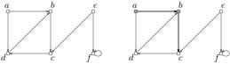
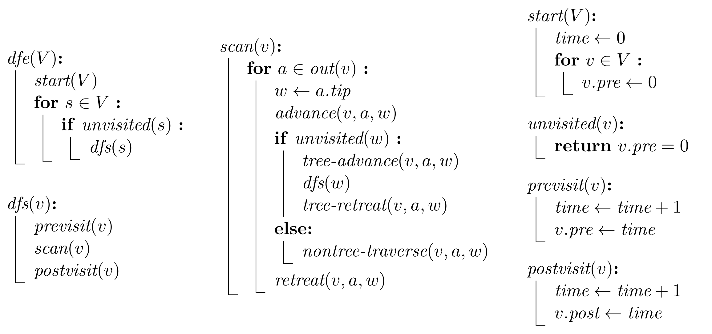
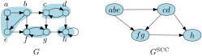
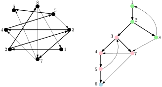
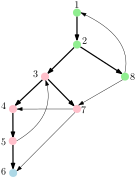
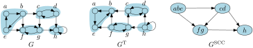
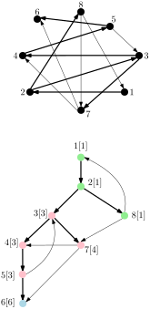
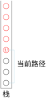
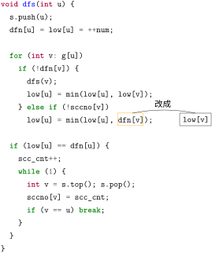

# 有向图上的深度优先搜索


<div class=hidden>

$\DeclareMathOperator{\dfn}{dfn}$
$\DeclareMathOperator{\low}{low}$
$\DeclareMathOperator{\pre}{pre}$
$\DeclareMathOperator{\post}{post}$
$\DeclareMathOperator{\parent}{parent}$

</div>

---

# 深度优先探索，深度优先搜索

对一个有向图的<ruby>**深度优先探索**<rt>depth-first exploration</rt></ruby>有规律地访问它的顶点和走过它的边。走过一条边分为两个阶段，先是在这条边上<ruby>**前进**<rt>advance</rt></ruby>，以后还要在这条边上<ruby>**回退**<rt>retreat</rt></ruby>。

维护一个<ruby>**当前点**<rt>current vertex</rt></ruby> $v$，最初是 null。把所有顶点标记为未访问过，所有边标记为未走过。

---

重复下列三种操作之一直到所有点都访问过，所有边都走过：

1. 当前点 $v$ 是 null 且有顶点未访问过。令 $v$ 是任一未访问过的点。**访问** $v$。这开启一次以 $v$ 为起点的<ruby>**深度优先搜索**<rt>depth-first search</rt></ruby>，将访问所有从 $v$ 可达的未访问过的顶点，走过所有从这些点发出的边。
2. 当前点不是 null 且有未走过的出边。任选一条这样的边 $e$，不妨设是从 $v$ 到 $w$ 的，沿着这条边**前进**。若 $w$ 已访问过，立即在 $e$ 上**回退**；否则以 $e$ 为进入点 $w$ 的**树边**，把当前点 $v$ 置为 $w$，**访问**这新的 $v$。
3. 当前点 $v$ 不是 null 且它没有没走过的出边。若 $v$ 是此次 DFS 的起点，将当前点 $v$ 置为 null。否则有一条树边 $e$ 进入点 $v$，设 $e$ 的起点是 $u$；在 $e$ 上**回退**，把当前点 $v$ 置为 $u$。


---

# 深度优先搜索的性质

我们常把深度优先搜索简称为 DFS。


---

**引理 D1** $\quad$ 一次深度优先探索产生一族**有根树**，以每次 DFS 的起点为根，它们的边是此次探索定义的树边。每个树的顶点是在起于它的根的那次 DFS 期间被访问的那些点。

**证明**：
- 每个点从未访问变成已访问只有一次，所以至多有一条进入它的树边。
- 每条新的树边都进入一个未访问过的点，此时还没有从它发出的树边，所以树边不成环。
- 每个点或者是一次 DFS 的起点，那样就没有树边进入它而它是一个树的根；或者不是起点，那样就有树边进入它而它不是根。
- 若 $e$ 是从 $v$ 到 $w$ 的树边，则访问了点 $v$ 的那次 DFS 也访问了点 $w$。

---

# DFS 树，DFS 森林

我们把一次深度优先探索产生的那些有根树称为 **DFS 树**。它们一起构成这次探索产生的 **DFS 森林**。


---

# 先序访问，后序访问，时间戳


深度优先探索以先序访问每个 DFS 树的顶点。我们称这些访问为<ruby>**先序访问**<rt>preorder visit</rt></ruby>或**初访**。此外，我们还考虑深度优先探索对每个顶点 $v$ 的第二次隐含的访问，就是上述情况 3，当 $v$ 是当前点但它没有未走过的出边时。我们把这些访问称为<ruby>**后序访问**<rt>postorder visit</rt></ruby>或**终访**，因为在每个 DFS 树上，这些访问发生的顺序是后序。

我们给这 $2n$ 次初访和终访每个赋予一个数，称为**时间戳**。我们把点 $v$ 的初访和终访的时间戳分别记作 $v.pre$ 和 $v.post$。这些时间戳的值不重要，只要能反映顺序：若一次访问发生在另一次访问之前，则前者的时间戳必小于后者。


---

# 回边，前向边，横叉边

一次深度优先探索把除树边和自环之外的边 $(v,w)$ 分成三类。

- **回边**：$w$ 是 $v$ 的祖先。也称返祖边。
- **前向边**：$w$ 是 $v$ 的后代。
- **横叉边**：$v$ 和 $w$ 无祖先——后代关系。


---

# 当前路径

DFS 维护一条从起点到当前点，由树边构成的路径。在一条树边上前进使此路径多一条边，而在一条树边上回退使它少一条边。我们称此路径为**当前路径**。




---

**引理 D2** $\quad$ 每个顶点 $v$ 在当前路径上是从它刚要被初访时开始直到它刚被终访过为止。在这段时间内，DFS 在 $v$ 的每条出边上前进和回退。


**证明**：一个点 $v$ 被初访是在它变成当前点并加入当前路径时。自此它在当前路径上直到被终访。如果在 $v$ 的某条出边上的前进还没发生，点 $v$ 的终访不可能发生。在 $v$ 的出边上前进时，$v$ 是当前点。假设在边 $e=(v,w)$ 上的前进刚刚发生。若 $w$ 访问过，在边 $e$ 上的回退随即发生。否则 $e$ 成为树边而 $w$ 变成当前点。在点 $v$ 再次成为当前点之前 $v$ 不会被终访，而那只能发生在 $w$ 被终访以后。在 $w$ 被终访之后，在 $e$ 上的回退立即发生，故而是在 $v$ 被终访之前。

---

**引理 D3** $\quad$ 下列四个条件等价：
- (1) 顶点 $w$ 是顶点 $v$ 的后代
- (2) $v.pre \le w.pre < v.post$
- (3) $v.pre \le w.post \le v.post$
- (4) $v.pre \le w.pre < w.post \le v.post$

**证明**：若 $w$ 是 $v$ 的后代，则 $w$ 被加入和删除当前路径时 $v$ 都在当前路径上。根据引理 D2，$v.pre \le w.pre < w.post \le v.post$。因此 (1) 蕴含 (2)，(3)，(4)。

若 $v.pre \le w.pre < v.post$，则 $w$ 被初访时 $v$ 在当前路径上，故 $w$ 是 $v$ 的后代；即 (2) 蕴含 (1)。类似地，若 $v.pre < w.post \le v.post$，$w$ 被终访时 $v$ 在当前路径上，故 $w$ 是 $v$ 的后代；即 (3) 蕴含 (1)。最后，(4) 蕴含 (2) 和 (3) 故也蕴含 (1)。

---

<!-- 刚要 or 即将，哪个词更合适？ -->
**引理 D4** $\quad$ 点 $w$ 是点 $v$ 的后代当且仅当在 $v$ 刚要被初访时有一条从 $v$ 到 $w$ 的路径，上面都是未访问过的点。

**证明**：
- 若 $w$ 是 $v$ 的后代，根据引理 D3，在 $v$ 刚要被初访时，所有从 $v$ 走树边到 $w$ 的路径上的点都未访问。
- 反之，设在 $v$ 刚要被初访时有一条从 $v$ 到 $w$ 的路径 $P$，上面的点都未访问。我们证明 $w$ 是 $v$ 的后代。
    - 若边 $(x,y)$ 在 $P$ 上而 $x$ 是 $v$ 的后代，则据引理 D2 有 $y.pre < x.post$，据引理 D3 又有 $x.post \le v.post$，故 $y.pre < v.post$。又根据条件，$v$ 刚要被初访时 $y$ 尚未被访问，故 $v.pre < y.pre$。综上，$v.pre < y.pre < v.post$，所以 $y$ 是 $v$ 的后代。
    - 于是可对路径 $P$ 的顶点数用**归纳法**，因为在 $P$ 上只有一个点 $v$ 时，$v$ 是自身的后代，结论成立。

---

**引理 D5** $\quad$ 设 $v$ 是顶点，$e$ 是从 $x$ 到 $y$ 的边。
(1) 若 $x$ 是 $v$ 的后代而 $y$ 不是，则 $y.pre < v.pre$。
(2) 若 $y$ 是 $v$ 的后代而 $x$ 不是，则 $v.post < x.post$。

**证明**：此引理是引理 D3 的推论。

(1) 设 $x$ 是 $v$ 的后代且 $v.pre \le y.pre$。由于 $x$ 是 $v$ 的后代，在边 $e$ 上从 $x$ 前进到 $y$ 发生在 $v$ 的终访之前，故而 $y$ 的初访也发生在 $v$ 的终访之前。即有 $y.pre < v.post$。根据引理 D3，此不等式和 $v.pre \le y.pre$ 蕴含 $y$ 是 $v$ 的后代。


(2) 设 $y$ 是 $v$ 的后代且 $x.post \le v.post$。由于在边 $e$ 上回退是在 $x$ 被终访之前，有 $y.pre < x.post \le v.post$。由于 $y$ 是 $v$ 的后代，有 $v.pre \le y.pre$。这些不等式合起来给出 $v.pre < x.post \le v.post$。据引理 D3，$x$ 是 $v$ 的后代。

---

**引理 D6** $\quad$ 若有从 $x$ 到 $y$ 的横叉边，则 $y.post < x.pre$。

**证明**：由于 $y$ 不是 $x$ 的后代，以 $v = x$ 代入引理 D5 (1) 给出 $y.pre < x.pre$。而根据引理 D3，$y.pre < x.pre$ 和 $x.pre < y.post$ 蕴含 $y$ 是 $x$ 的后代，矛盾。故而 $y.post < x.pre$。

---

# DFS 的递归实现



---

# 用 DFS 进行拓扑排序

<div class=columns>
<div>

确定是 dag
```cpp
vector<int> g[maxn];
bool vis[maxn];
vector<int> p;
void dfs(int u) {
  if (vis[u]) return;
  vis[u] = 1;
  for (int v : g[u])
    dfs(v);
  p.push_back(u);
}

void topo(int n) {
  for (int i = 1; i <= n; i++)
    dfs(i);
  reverse(p.begin(), p.end());
}
```
</div>

<div>

可能不是 dag
```cpp
vector<int> g[maxn];
int vis[maxn];
vector<int> p;
bool dfs(int u) {
  if (vis[u] == -1) return false;
  if (vis[u] == 1) return true;
  vis[u] = -1;
  for (int v : g[u])
    dfs(v);
  p.push_back(u);
}

void topo(int n) {
  for (int i = 1; i <= n; i++)
    if (!dfs(i)) {
      p.clear();
      return;
    }
  reverse(p.begin(), p.end());
}
```

</div>

---

# 强连通分量

在有向图 $G$ 上，称两顶点 $u, v$ **相互可达**，若有从 $u$ 到 $v$ 路径和从 $v$ 到 $u$ 的路径。相互可达是等价关系，它把顶点集分成等价类，称为 $G$ 的<ruby>**强连通分量**<rt>strongly connected component</rt></ruby>或<ruby>**强分量**<rt>strong component</rt></ruby>。只有一个强连通分量的有向图称为<ruby>**强连通的**<rt>strongly connected</rt></ruby>。

我们常把强连通分量简写为 SCC。

若把 $G$ 的每个 SCC 看成一个点，就得到 $G$ 的 SCC 图，它是一个 dag。




---

# 强连通分量的性质

---

# SCC 对路径封闭

<!-- TODO: 加图 -->

**引理 S1** $\quad$ 若 $u$ 和 $v$ 在同一个 SCC $S$ 里，则任一从 $u$ 到 $v$ 的路径上的顶点全在 $S$ 里。

**证明**：若 $u$ 和 $v$ 在 $S$ 里，则有一条从 $v$ 到 $u$ 的路径 $P_1$。若 $x$ 在从 $u$ 到 $v$ 的路径 $P_2$ 上，则 $x$ 在由 $P_1, P_2$ 构成的环上，因此 $x$ 在 $S$ 里。

---


**引理 S2** $\quad$ 在一个 SCC $S$ 里，$v.pre$ 最小的点 $v$ 也是 $v.post$ 最大的点，这个点是 $S$ 里每个点的祖先。


**证明**：此引理是引理 D4 的推论。$S$ 里 $v.pre$ 最小的点 $v$ 是 $S$ 里第一个被访问的点。根据引理 D4，$v$ 是 $S$ 里所有点的祖先。根据引理 D3，$v$ 也是 $S$ 里 $v.post$ 最大的点。


---

# 首领，随从

我们把一个 SCC 里 $v.pre$ 最小的点称为**首领**，而其余点称为首领的**随从**。
换言之，一个 SCC 的首领就是其中最早被 DFS 发现的点。

每个 DFS 树的根一定是它所属的 SCC 的首领，但是首领未必是 DFS 树的根。

**引理 S3** $\quad$ 若 $y$ 不是它所属的 SCC $S$ 的首领，则 $y$ 的父节点 $x$ 也在 $S$ 里。

**证明**：设 $v\ne y$ 是 $S$ 的首领。树边 $(x,y)$ 和一条从 $y$ 到 $v$ 的路径构成一条从 $x$ 到 $v$ 的路径。根据引理 S2，$y$ 是首领 $v$ 的后代，所以从 $v$ 走树边可以到 $y$，而且会经过 $x$。所以 $x$ 在 $S$ 里。


---

**引理 S4** $\quad$ 强连通分量把 DFS 树划分成子树：若我们从 DFS 森林里删除每一条进入 SCC 首领的树边，将会得到一族有根树，每个有根树的根是一个 SCC 的首领，顶点是此首领和其随从。



---


**引理 S5** $\quad$ 把强连通分量的首领们按后序从大到小排列给出强连通分量的拓扑序：若 $e$ 是一条从 $x$ 到 $y$ 的边，$u, v$ 分别是 $x, y$ 所属的 SCC 的首领，则 $u.post \ge v.post$。

**证明**：若 $x$ 是 $v$ 的后代，则 $x, y$ 在同一个强连通分量里，因为边 $e=(x,y)$ 和一条从 $y$ 到 $v$ 的路径和从 $v$ 到 $x$ 的由树边构成的路径成一个环。于是 $u = v$ 而引理成立。若 $x$ 不是 $v$ 的后代，则根据引理 D3 和 D5 有 $
u.post \ge x.post > v.post$。

---

**引理 S6** $\quad$ 顶点 $v$ 是 SCC 的首领当且仅当<span style=color:red;>在 $v$ 所属的 SCC 之内</span>**不存在**一条路径从 $v$ 出发走若干条树边和一条非树边到达顶点 $w$ 而 $w.pre < v.pre$。

**证明**：令 $S$ 为 $v$ 所属的 SCC。必要性。设 $v$ 是 $S$ 的首领，则根据首领的定义，在 $S$ 之内**没有**路径从 $v$ 到顶点 $w$ 而 $w.pre < v.pre$。

充分性。若 $v$ 不是 $S$ 的首领，设 $u$ 是 $S$ 的首领，则 $u.pre < v.pre$ 而且在 $S$ 里有一条从 $v$ 到 $u$ 的路径 $P$。设 $y$ 是路径 $P$ 上第一个不是 $v$ 的后代的顶点，设边 $e=(x,y)$ 是 $P$ 上进入 $y$ 的边，则 $e$ 不是树边。由于 $x$ 是 $v$ 的后代，有一条从 $v$ 走树边到 $x$ 的路径。由于 $y$ 不是 $v$ 的后代，根据引理 D5，有 $y.pre < v.pre$。

**注**：在引理 S6 的表述中，要求“在 $v$ 所属的 SCC 之内”是不可缺少的，不然引理不成立。



---


# 用 DFS 找强连通分量

- Kosaraju 算法（两次 DFS）

- Tarjan 算法（一次 DFS）

---

# Kosaraju 的 SCC 算法

首先从 $h$ 开始 DFS，将搜到 $h$；然后从 $f$ 开始 DFS，搜到 $f,g$；再从 $c$ 开始搜，搜到 $c,d$；最后从 $a$ 开始搜，搜到 $a,b,e$。以这样的顺序进行 DFS，每次得到一个 SCC。

若从 $a$ 开始 DFS，将搜完整个图。换言之，这次 DFS 把所有 SCC 混在一起了。


如果我们按 SCC 图的拓扑序的逆序进行 DFS，就能每次只得到一个 SCC。

Kosaraju 算法便是基于这个思想的。

---

设有向图 $G$ 有 $k$ 个 SCC，$S_1, \dots, S_k$。对 $G$ 进行 DFS，设 $S_i$ 的首领是 $v_i$，$1\le i \le k$。对于两个不同的 SCC $S_i, S_j$，若在 $G$ 上 $v_i \leadsto v_j$，则对于每个顶点 $w\in S_j$ 都有 $v_i.post > w.post$。


Kosaraju 的 SCC 算法有三步：
1. 对 $G$ 进行 DFS。
2. 构建 $G$ 的**反图**（把 $G$ 的边方向反转得到的图） $G^{\text{T}}$。
3. 在 $G^{\text{T}}$ 上按 $v.post$ 从大到小的顺序进行 DFS。每次 DFS 访问的点就是一个强连通分量。



---

# 实现 Kosaraju 的 SCC 算法

<div class=columns3>

```cpp
vector<int> g[maxn];
bool vis[maxn];
vector<int> s;

void dfs(int u) {
  if (vis[u]) return;
  vis[u] = true;
  for (int v ：g[u])
    dfs(v);
  s.push_back(u);
}
```

```cpp
//g2是g的反图
vector<int> g2[maxn];
int scc_cnt, sccno[maxn];

void dfs2(int u) {
  if (sccno[u]) return;
  sccno[u] = scc_cnt;
  for (int v : g2[u])
    dfs2(v);
}
```

```cpp
void find_scc(int n) {
  scc_cnt = 0;
  s.clear();
  memset(sccno, 0, sizeof sccno);
  memset(vis, 0, sizeof vis);

  for (int i = 1; i <= n; i++)
    dfs(i);
  
  for (int i = n - 1; i >= 0; i--)
    if (!sccno[s[i]]) {
      scc_cnt++;
      dfs2(s[i]);
    }
}
```

---

# Tarjan 的 SCC 算法



Tarjan 的 SCC 算法只需要做一次 DFS 就能找出每个 SCC。

利用引理 S6，定义点 $v$ 的 **low 值** $\low(v)$ 为
- 从 $v$ 出发走若干条树边和至多一条非树边能到达的<span style=color:red>与 $v$ 在同一 SCC 里</span>的点 $w$ 的 $w.pre$ 的最小值。

$v$ 是 SCC 的首领当且仅当 $\low(v) = v.pre$。

可是怎么知道 $w$ 与 $v$ 是否在同一 SCC 里呢？
Tarjan 的 SCC 算法也是以 SCC 的逆拓扑序找出每个 SCC 的，每找出一个 SCC 之后，就把其中的点标记一下，这样如果有从 $v$ 到 $w$ 的路径而 $w$ 没被标记，那么它就一定与 $v$ 在同一 SCC 里。

---



怎么找出每个 SCC 里的点呢？

准备一个栈。当点 $v$ 被初访时，把 $v$ 放进栈里。当点 $v$ 被终访时，$\low(v)$ 已经算出来了，若 $\low(v) = v.pre$ 则 $v$ 是它所属的 SCC 的首领，此时栈里$v$ 以上的点就是 $v$ 的全部随从。把这些点弹出栈并打上标记。

---

# 实现 Tarjan 的 SCC 算法


<div class=columns>

```cpp
vector<int> g[maxn];
int dfn[maxn], low[maxn], sccno[maxn];
int scc_cnt, num;
stack<int> s;

void dfs(int);

void tarjan_scc(int n) {
  for (int i = 1; i <= n; i++)
    dfn[i] = sccno[i] = 0;
  scc_cnt = num = 0;
  for (int i = 1; i <= n; i++)
    if (!dfn[i])
      dfs(i);
}
```

```cpp
void dfs(int u) {
  s.push(u);
  dfn[u] = low[u] = ++num;

  for (int v: g[u])
    if (!dfn[v]) {
      dfs(v);
      low[u] = min(low[u], low[v]);
    } else if (!sccno[v])//v和u在同一SCC
      low[u] = min(low[u], dfn[v]);

  if (low[u] == dfn[u]) {
    scc_cnt++;
    while (1) {
      int v = s.top(); s.pop();
      sccno[v] = scc_cnt;//打标记
      if (v == u) break;
    }
  }
}
```

---

# Tarjan 的 SCC 算法的另一实现

把上一页的 DFS 做如下改动也是正确的：

<div class=columns>
<div>


</div>

<div>

**解释**：对每个点 $v$，当 $v$ 被初访时，$\low(v)$ 被赋予初始值 $\dfn(v)$，此后若 $\low(v)$ 改变，只会变小。换言之，自从 $v$ 被初访之后总有 $\low(v) \le \dfn(v)$。另一方面，不论 $\low(v)$ 如何变，它一定等于 $v$ 所属的 SCC 里某个点 $x$ 的 $\dfn(x)$。因此仍然有
- $v$ 是 SCC 的首领当且仅当在 $v$ 被终访时 $\low(v) = \dfn(v)$。

**注意**：这种写法算出的 low 值**不**是上面所说的含义。详见后面的回退路径。

</div>

---

# 简化代码

在上一实现的基础上，如果在找到一个 SCC 时，把其中的点的 low 值改为充分大的数，它就影响不到以后找到的 SCC。采用这种想法，代码可以简化

```cpp
void dfs(int u) {
  dfn[u] = low[u] = ++num;
  s.push(u);
  for (int v: g[u]) {
    if (!dfn[v]) dfs(v);
    low[u] = min(low[u], low[v]);
  }
  if (low[u] == dfn[u]) {
    scc_cnt++;
    while (1) {
      int v = s.top(); s.pop();
      low[v] = n;
      sccno[v] = scc_cnt;
      if (v == u) break;
    }
  }
}
```

---

# 空间优化：省去 dfn 数组

以 $2, 4, 6, 8, \dots$ 作为 DFS 序，当发现点 $u$ 的 low 值变小时，就把新的 low 值的二进制最低位设置为 1。

```cpp
void dfs(int u) {
  s.push(u);
  num += 2; low[u] = num;
  for (int v: g[u]) {
    if (!low[v]) dfs(v);
    if (low[v] < low[u]) low[u] = low[v] | 1;
  }
  if ((low[u] & 1) == 0) {
    scc_cnt++;
    while (1) {
      int v = s.top(); s.pop();
      low[v] = 2 * n;
      sccno[v] = scc_cnt;
      if (v == u) break;
    }
  }
}
```

---

# 模板题  强连通分量

给你一个有 $N$ 个点和 $M$ 条边的有向图。第 $i$ 条边是 $(a_i, b_i)$。可能有重边和自环。

将此图分解为 SCC 并以拓扑序输出这些 SCC。

###### 限制

- $1 \le N,M \le 500000$
- $0 \le a_i, b_i < N$

---

# 代码

<div class=columns>

```cpp
const int maxn = 5e5;
vector<int> g[maxn];
int low[maxn], num;
vector<vector<int>> scc;
stack<int> s;

void dfs(int u) {
  num += 2;
  low[u] = num;
  s.push(u);
  
  for (int v : g[u]) {
    if (!low[v]) dfs(v);
    if (low[v] < low[u])
      low[u] = low[v] | 1;
  }
  
  if ((low[u] & 1) == 0) {
    vector<int> cur;
    while (1) {
      int v = s.top(); s.pop();
      cur.push_back(v);
      low[v] = INT_MAX;
      if (v == u) break;
    }
    scc.push_back(cur);
  }
}
```

```cpp
int main() {
  int n, m;
  cin >> n >> m;
  for (int i = 0; i < m; i++) {
    int a, b;
    cin >> a >> b;
    g[a].push_back(b);
  }

  for (int i = 0; i < n; i++)
    if (!low[i])
      dfs(i);

  cout << scc.size() << '\n';
  for (int i = scc.size() - 1; i >= 0; i--) {
    cout << scc[i].size();
    for (int j : scc[i])
      cout << ' ' << j;
    cout << '\n';
  }
}
```

---


# 回退路径 :star:

我们称一条路径为**回退路径**，若 DFS 在这条路径的边上回退的顺序与边在路径上的顺序相反。

特别地，从一个点到自身的没有边的路径是回退路径。

走若干条树边再走一条非树边 $e=(x,y)$ 的路径 $P$ 是回退路径，因为当在边 $e$ 上回退时，路径 $P$ 扣掉边 $e$ 是当前路径或当前路径的一部分，而 $x$ 是当前节点。在 $P$ 的边当中，边 $e$ 上的回退最先发生，随后发生的是 $P$ 上的树边上的回退，顺序与这些树边在 $P$ 上的顺序相反。因此引理 S6 的证明里构造的路径是回退路径，于是给出以下引理：

**引理 S7** $\quad$ 顶点 $v$ 是 SCC 的首领当且仅当<span style=color:red;>在 $v$ 所属的 SCC 之内</span>**不存在**从 $v$ 到顶点 $w$ 的**回退路径**而 $w.pre < v.pre$。

 


---

我们可利用上述引理 S7 来找出 SCC 的首领。
- 把首访时间戳 $v.pre$ 定义为从 $1$ 开始的连续整数。
- 对每个顶点 $v$，我们计算 $\low(v)$，它等于 $w.pre$ 的最小值，点 $w$ 满足
  - 从 $v$ 出发走一条回退路径可到达 $w$ 并且 $w$ 和 $v$ 在同一 SCC 里。

如何计算 low 值？
- 当 $v$ 被初访时，初始化 $\low(v) \gets v.pre$。
- 当在边 $e=(v,w)$ 上回退时，更新 $\low(v) \gets \min\set{\low(v), \low(w)}$。
- 当 $v$ 被终访时，在 $v$ 的出边上的回退都已发生了，$\low(v)$ 就算出来了。
- 因此，$v$ 是 SCC 的首领当且仅当在 $v$ 被终访时 $\low(v) = v.pre$。

如何判断两点是否在同一 SCC 里？
- 每当找出一个 SCC 时，就把其中的点的 low 值设置为一个充分大的数。这样一来，这些 low 值就不影响以后的 low 值更新；当在 $v$ 的出边 $(v, w)$ 上回退时就可以无条件地更新 $\low(v)$，**不需要判断** $v, w$ 是否在同一 SCC 里。