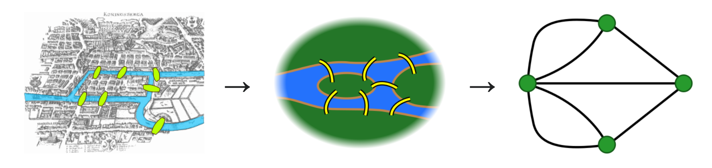
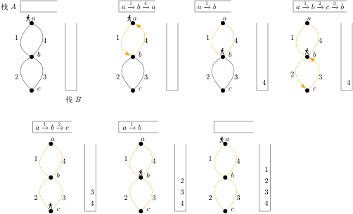
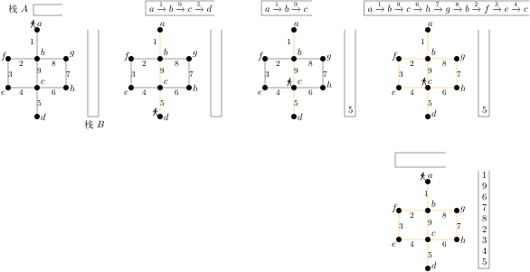
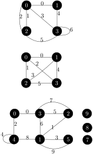

---
# try also 'default' to start simple
theme: seriph
# some information about your slides (markdown enabled)
title: 欧拉回路
info: |
  ## Slidev Starter Template
  Presentation slides for developers.

  Learn more at [Sli.dev](https://sli.dev)
# apply UnoCSS classes to the current slide
class: text-center
# https://sli.dev/features/drawing
drawings:
  persist: false
# slide transition: https://sli.dev/guide/animations.html#slide-transitions
transition: slide-left
# enable Comark Syntax: https://comark.dev/syntax/markdown
comark: true
colorSchema: light
lineNumbers: true
---

# 欧拉回路

---

# 柯尼斯堡七桥问题

<p> </p>



---

<div class=definition>

在一个图（有向或无向）中，起点和终点相同的路径叫作**回路**，走过每条边恰好一次的回路叫作**欧拉回路**。

</div>

- 欧拉回路可以多次经过一个点，也可以不经过一个点。

---

<div class=theorem>

一个**连通的无向图**有欧拉回路当且仅当每个点的度都是偶数。

</div>

<div class=proof v-click>

必要性：如果一个点在欧拉回路中出现了 $k$ 次（或 $k+1$ 次，若它是起点和终点），那么它的度是 $2k$。

充分性：对图 $G$ 的边数 $m$ 进行归纳。当 $m = 0$ 时显然成立。设 $m \ge 1$。由于每个点的度都是偶数，我们可以在 $G$ 中找到一个至少含有一条边，且经过每条边至多一次的回路。（从任一点出发，随意走，无路可走时一定回到了起点。）令 $W$ 是这样的回路中边数最多的一个。若 $W$ 包含图 $G$ 所有的边，那么 $W$ 就是一个欧拉回路。否则考虑把 $W$ 中的边从 $G$ 上删除所得的图 $G'$，$G'$ 上至少有一条边。

对于图 $G$ 里的每个点 $v$，跟点 $v$ 相连的边，落在 $W$ 里的有偶数条，所以在 $G'$ 里，点 $v$ 的度是偶数。由于 $G$ 连通，$G'$ 里有一条边 $e$ 连接 $W$ 里的某个点。根据归纳假设，$G'$ 里含有边 $e$ 的连通块 $C$ 有欧拉回路。把这个回路和 $W$ 拼起来，我们就得到一个比 $W$ 更大的回路，这跟 $W$ 是最大的回路矛盾。
</div>

---

<div class=definition>

在一个图（有向或无向）中，走过每条边恰好一次的路径叫作**欧拉路径**。

</div>

<div class=corollary v-click>

一个连通的无向图有欧拉路径当且仅当度是奇数的点不超过两个。
</div>

---

# 在无向图上找欧拉回路

逐步插入回路法（Hierholzer 算法）

1. 从任一点出发，随意走，每条边至多走一次，无路可走时停下来。此时得到一个回路。  
无路可走是说跟当前点相连的边都走过了。


2. 回退到有路可走的点。从这个点开始，做第 1 步，找下一个回路。如次重复，直到每条边都走过。

3. 把找到的那些回路拼成一个欧拉回路。

---



---



---

# 例题一

[Eulerian Trail (Undirected)](https://vjudge.net/problem/Yosupo-eulerian_trail_undirected)

给定有 $N$ 个点 $M$ 条边的无向图 $G$。点编号 $0$ 到 $N-1$，边编号 $0$ 到 $M-1$。第 $i$ 条边连接点 $u_i$  和 $v_i$。图 $G$ 上可能有重边、自环。

$G$ 的一条欧拉路是点的序列 $(v_0, \dots, v_M)$ 和边的序列 $(e_0, \dots, e_{M-1})$，二者满足下列条件。
- $(e_0, \dots, e_{M-1})$ 是 $(0, \dots, M-1)$ 的一个排列。
- 对于 $0 \le i \le M - 1$，边 $e_i$ 连接点 $v_i$ 和 $v_{i+1}$。

判断 $G$ 上是否有欧拉路，若有，输出一条欧拉路，否则输出 `No`。

一个输入文件里有 $T$ 组数据。


- $1 \le T \le 10^5$
- $1 \le N \le 2\times 10^5$
- $0 \le M \le 10^5$
- 所有测试数据的 $N$ 之和、$M$ 之和都不超过 $2\times 10^5$

---


## 样例



```
Yes
2 0 1 3 0 2 3 3
2 0 4 3 1 5 6
No
Yes
1 2 3 0 4 4 1 5 1 3 2
1 7 0 2 4 8 9 3 6 5
```


---

# 递归写法

```cpp
struct Edge {
  int from, to;
};

const int maxm = 2e5 + 5;
const int maxn = 2e5 + 5;

Edge edges[maxm];
vector<int> g[maxn];

bool used[maxm];
int res[maxm];
int ptr[maxn];
int write_ptr;
```

---


```cpp
int find_eulerian_path(int n, int m) {
  // 找起点：
  int s = -1;// 起点
  int odd = 0;
  for (int i = 0; i < n; i++) {
    if (g[i].size() & 1) {
      odd++;
      if (s == -1) s = i;
    }
  }
  if (odd > 2) return -1;
  if (s == -1) {
    s = 0;
    while (s < n && g[s].empty())
      s++;
    if (s == n) // 空图
      return 0;
  }
  // 找欧拉路
  for (int i = 0; i < m; i++) used[i] = false;
  for (int i = 0; i < n; i++) ptr[i] = 0;
  write_ptr = m;
  find(s);
  if (write_ptr != 0) // 不是每条边都走过
    return -1;
  return s;
}
```

---
layout: two-cols
layoutClass: gap-4
---

写法一：
```cpp
void find(int u) {
  while (ptr[u] < (int) g[u].size()) {
    int id = g[u][ptr[u]++];
    if (used[id])
      continue;
    used[id] = true;
    Edge &e = edges[id];
    int v = u ^ e.from ^ e.to;
    find(v);
    res[--write_ptr] = id;
  }
}
```

::right::


写法二：

```cpp
void find(int u) {
  for (int& i = ptr[u]; i < g[u].size(); i++) {
    int id = g[u][i];
    if (used[id])
      continue;
    used[id] = true;
    Edge &e = edges[id];
    int v = u ^ e.from ^ e.to;
    find(v);
    res[--write_ptr] = id;
  }
}
```

---
layout: two-cols
layoutClass: gap-4
---

```cpp
int main() {
  int T;
  cin >> T;
  while (T--) {
    int n, m;
    cin >> n >> m;
    // 存图：
    for (int i = 0; i < n; i++)
      g[i].clear();
    for (int i = 0; i < m; i++) {
      int u, v;
      cin >> u >> v;
      edges[i].from = u;
      edges[i].to = v;
      g[u].push_back(i);
      g[v].push_back(i);
    }
    int s = find_eulerian_path(n, m);
```
::right::

```cpp {*}{startLine:19}
    // 输出答案
    if (s == -1)
      cout << "No\n";
    else {
      cout << "Yes\n";
      cout << s;
      int v = s;
      for (int i = 0; i < m; i++) {
        Edge &e = edges[res[i]];
        v ^= e.from ^ e.to;
        cout << ' ' << v;
      }
      cout << '\n';
      for (int i = 0; i < m; i++)
        cout << res[i] << ' ';
      cout << '\n';
    }
  }
}
```

---

# 非递归写法


```cpp
struct Edge {
  int from, to;
};

const int maxm = 2e5 + 5;
const int maxn = 2e5 + 5;

Edge edges[maxm];
vector<int> g[maxn];

bool used[maxm];
int res[maxm];
int ptr[maxn];
```

---
layout: two-cols
layoutClass: gap-4
---


```cpp
int find_eulerian_path(int n, int m) {
  // 找起点
  int s = -1;// 起点
  int odd = 0;
  for (int i = 0; i < n; i++) {
    if (g[i].size() & 1) {
      odd++;
      if (s == -1)
        s = i;
    }
  }
  if (odd > 2)
    return -1;
  if (s == -1) {
    s = 0;
    while (s < n && g[s].empty())
      s++;
    if (s == n) // 空图
      return 0;
  }
  // 找欧拉路
  for (int i = 0; i < m; i++)
    used[i] = false;
  for (int i = 0; i < n; i++)
    ptr[i] = 0;
```


::right::

```cpp {*}{startLine:26}
  int v = s;
  int l = 0, r = m;
  while (1) {
    // 当前所在的点还有边没走过吗？
    bool found = false;
    while (ptr[v] < (int) g[v].size()) {
      int id = g[v][ptr[v]++];
      if (used[id])
        continue;
      used[id] = true;
      res[l++] = id;
      v ^= e[id].from ^ e[id].to;// 前进一步
      found = true;
      break;
    }
    if (!found) {
      if (l == 0)// 无路可退
        break;
      int id = res[--l];// 上一条边
      res[--r] = id;
      v ^= e[id].from ^ e[id].to;// 后退一步
    }
  }
  return r != 0 ? -1 : s;
}
```


