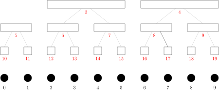
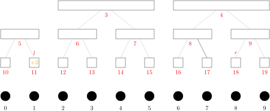
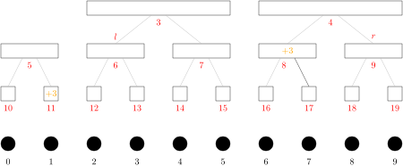
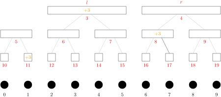
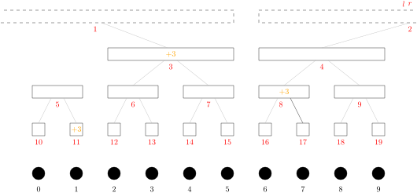
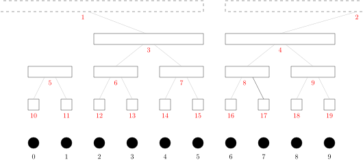
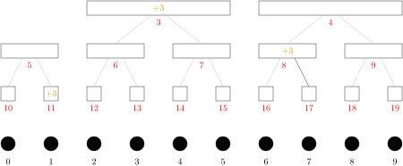
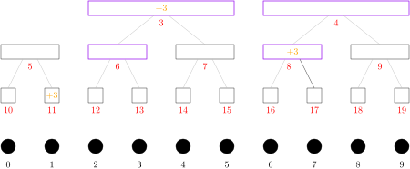

# 从分块到线段树

## 在线处理区间询问


---

# 序列分块

$n$ 个东西从左到右排成一行，编号 $0$ 到 $n - 1$，就是一个**序列**。

选择一个正整数 $1 \le B \le n$，把这个序列每 $B$ 个分成一**块**（block）。称 $B$ 为**块长**。


$n = 10$，$B = 3$


序列里编号 $i$ 的元素所在的块的编号是 $\color{red}\lfloor i/B \rfloor$。

---

# 数列分块入门 1

给你一个长为 $n$ 的整数序列 $a=(a_1, \dots, a_{n})$。处理 $n$ 个操作。操作有两类：
- `0 l r c`：把 $a_l, \dots, a_r$ 每个都加上 $c$。
- `1 l r c`：询问 $a_r$ 的值。（忽略 $l$ 和 $c$）

###### 限制

- $1 \le n \le 300000$
- $a_i$ 的初始值，$c$，每次修改过后的 $a_i$ 都在 long long 范围内。

---

取 $B = \lfloor \sqrt{n} \rfloor$，对序列 $a$ 进行分块。 

如果一次区间加操作会把第 $i$ 块里的每个数都加上 $c$，那么我们并不去修改这个块里数，而是把这个操作记录下来。

具体地，我们对第 $i$ 块维护一个变量 `add[i]`，表示区间加操作对这一块整体加的数的总和。

如果一次区间加操作只涉及第 $i$ 块里的一部分元素，那么我们就去逐个修改相关的元素。
注意到这样的块在区间两端，最多两个，需要修改的元素至多 $2(B - 1)$ 个。

第 $j$ 个数的真实值就是 `a[j] + add[j / B]`。

处理区间加操作的时间是 $O(\sqrt{n})$，回答询问的时间是 $O(1)$。

---

<div class=col46>

```cpp
int main() {
    ios::sync_with_stdio(0);
    cin.tie(0);
    int n;
    cin >> n;
    vector<long long> a(n);
    for (int i = 0; i < n; i++)
        cin >> a[i];
    int B = (int) sqrt(n);
    int NB = (n + B - 1) / B;
    vector<long long> add(NB);
    int q = n;
    while (q--) {
        int type, l, r; long long c;
        cin >> type >> l >> r >> c;
        if (type == 0) {
            --l;
            int lb = (l + B - 1) / B;
            int rb = r / B;
            if (lb > rb)
                for (int i = l; i < r; i++) {
                    a[i] += c;
                }
            else {
                for (int i = l; i < lb * B; i++)
                    a[i] += c;
                for (int i = lb; i < rb; i++)
                    add[i] += c;
                for (int i = rb * B; i < r; i++)
                    a[i] += c;
            }
        } else {
            r--;
            cout << a[r] + add[r / B] << '\n';
        }
    }
}
```

<div>

- 序列下标总是从 $0$ 开始。
- 总是用左闭右开的方式表示区间。
- `NB` 是块数。


`l` = $1$，`r` = $8$。
`lb` = $\color{red} 1$，`rb` = $\color{red} 2$。

对于区间 $[1, 8)$，$\color{red} 1$ 是**整块**，$\color{red} 0$ 和 $\color{red} 2$ 是**边块**。

一般的，[`lb`, `rb`) 是整块，`lb` - 1 和 `rb` 是边块。
</div>


</div>

---

# 线段树：多层次分块



---

# 给 $a_1$ 到 $a_7$ 加 $3$



---

# 给 $a_1$ 到 $a_7$ 加 $3$



---

# 给 $a_1$ 到 $a_7$ 加 $3$



---

# 给 $a_1$ 到 $a_7$ 加 $3$



---

<div class=columns>

```cpp
int main() {
    ios::sync_with_stdio(0);
    cin.tie(0);
    int n;
    cin >> n;
    vector<long long> a(2 * n);
    for (int i = 0; i < n; i++)
        cin >> a[i + n];

    int q = n;
    while (q--) {
        int type, l, r; long long c;
        cin >> type >> l >> r >> c;
        if (type == 0) {
            l--;
            l += n;
            r += n;
            while (l < r) {
                if (l & 1) a[l++] += c;
                if (r & 1) a[--r] += c;
                l /= 2;
                r /= 2;
            }
        } else {
            r--;
            r += n;
            long long ans = 0;
            while (r > 0) {
                ans += a[r];
                r /= 2;
            }
            cout << ans << '\n';
        }
    }
}
```
<div>

- 处理区间加操作的时间：$O(\log n)$
- 回答询问的时间：$O(\log n)$

</div>
</div>

---

# 数列分块入门 2

给你一个长为 $n$ 的整数序列 $a=(a_1, \dots, a_{n})$。处理 $n$ 个操作。操作有两类：
- `0 l r c`：把 $a_l, \dots, a_r$ 每个都加上 $c$。
- `1 l r c`：询问 $a_l, \dots, a_r$ 中小于 $c^2$ 的数的个数。

###### 限制

- $1 \le n \le 200000$
- $a_i$ 的初始值，$c$ 在 int 范围内。

---

## 分块

取 $B = \lfloor \sqrt{n} \rfloor$。

- 对每个块 $i$，维护对块 $i$ 的整体加的操作所加的数的总和 `add[i]`。
- 维护一个长为 $n$ 的数组 `a`。
对于每个 $j = 0, \dots, n-1$ 都有 $a_j$ 等于 `a[j] + add[j / B]`。

为了回答 $a_l, \dots, a_r$ 中小于 $c^2$ 的数的个数，
- 每个块 $i$，维护块内元素对应的那些 `a[j]` 的**有序**序列 `sorted[i]`。


---

## 区间加

- 对于整块 $i$，更新 `add[i]`。
- 对于边块 $i$，首先更新其中被修改的元素 $a_j$ 对应的 `a[j]`，然后**重建**块 $i$ 的有序列表 `sorted[i]`（重新排序）。

时间：$O(\sqrt{n} + \sqrt{n}\log \sqrt{n}) = O(\sqrt{n} \log n)$

## 区间查询

- 对于整块 $i$，在 `sorted[i]` 里做二分查找。
- 对于边块，逐个检查涉及的元素。

时间：$O(\sqrt{n} + \sqrt{n}\log \sqrt{n}) = O(\sqrt{n} \log n)$

---

<div class=columns>

```cpp
int main() {
    ios::sync_with_stdio(0);
    cin.tie(0);
    int n; cin >> n;
    vector<long long> a(n);
    for (int i = 0; i < n; i++)
        cin >> a[i];
    
    int B = (int) sqrt(n);
    int NB = (n + B - 1) / B;
    
    vector<vector<long long>> b(NB); // b 即 sorted
    vector<long long> add(NB);

    auto build = [&](int i) {
        int l = i * B, r = min(l + B, n);
        b[i].assign(a.begin() + l, a.begin() + r);
        sort(b[i].begin(), b[i].end());
    };

    for (int i = 0; i < NB; i++)
        build(i);
```

```cpp
    int q = n;
    while (q--) {
        int type, l, r; long long c;
        cin >> type >> l >> r >> c;
        l--;
        int lb = (l + B - 1) / B;
        int rb = r / B;
        if (type == 0) {
            if (lb > rb) {
                for (int i = l; i < r; i++)
                    a[i] += c;
                build(lb - 1);
            } else {
                for (int i = l; i < lb * B; i++)
                    a[i] += c;
                for (int i = rb * B; i < r; i++)
                    a[i] += c;
                for (int i = lb; i < rb; i++)
                    add[i] += c;
                if (l != lb * B)
                    build(lb - 1);
                if (r != rb * B)
                    build(rb);
            }
        } else {
            c *= c;
            int ans = 0;
            if (lb > rb) {
                for (int i = l; i < r; i++)
                    ans += (a[i] + add[lb - 1]) < c;
            } else {
                for (int i = l; i < lb * B; i++)
                    ans += (a[i] + add[lb - 1]) < c;
                for (int i = rb * B; i < r; i++)
                    ans += (a[i] + add[rb]) < c;
                for (int i = lb; i < rb; i++)
                    ans += lower_bound(b[i].begin(), b[i].end(), c - add[i]) - b[i].begin();
            }
            cout << ans << '\n';
        }
    }
}
```

</div>

---


# 一个优化

在处理区间加时，把边块重新排序，可以通过**归并**来实现。

对于边块来说，被加上 $c$ 的是其中的一段元素。修改之后，那一段仍是有序的。边块里没被修改的那些元素也是有序的。


---


# 数列分块入门 3

给你一个长为 $n$ 的整数序列 $a=(a_1, \dots, a_{n})$。处理 $n$ 个操作。操作有两类：
- `0 l r c`：把 $a_l, \dots, a_r$ 每个都加上 $c$。
- `1 l r c`：询问 $a_l, \dots, a_r$ 中小于 $c$ 的最大的数。若不存在小于 $c$ 的数，输出 -1。

###### 限制

- $1 \le n \le 200000$
- $a_i$ 的初始值，$c$，每次操作后的 $a_i$ 都在 int 范围内。

---

解法与《数列分块入门 2》类似。

<div class=columns>

```cpp
int main() {
    ios::sync_with_stdio(0);
    cin.tie(0);
    int n; cin >> n;
    vector<long long> a(n);
    for (int i = 0; i < n; i++)
        cin >> a[i];
    
    int B = (int) sqrt(n);
    int NB = (n + B - 1) / B;

    vector<vector<long long>> b(NB);
    vector<long long> add(NB);

    auto build = [&](int i) {
        int l = i * B, r = min(l + B, n);
        b[i].assign(a.begin() + l, a.begin() + r);
        sort(b[i].begin(), b[i].end());
    };

    for (int i = 0; i < NB; i++)
        build(i);
    int q = n;
    while (q--) {
        int type, l, r, c;
        cin >> type >> l >> r >> c;
        l--;
        int lb = (l + B - 1) / B;
        int rb = r / B;
```

```cpp
        if (type == 0) {
            if (lb > rb) {
                for (int i = l; i < r; i++)
                    a[i] += c;
                build(lb - 1);
            } else {
                for (int i = l; i < lb * B; i++)
                    a[i] += c;
                for (int i = rb * B; i < r; i++)
                    a[i] += c;
                for (int i = lb; i < rb; i++)
                    add[i] += c;
                if (l != lb * B)
                    build(lb - 1);
                if (r != rb * B)
                    build(rb);
            }
        } else {
            long long ans = LLONG_MIN;
            if (lb > rb) {
                for (int i = l; i < r; i++)
                    if (a[i] + add[lb - 1] < c)
                        ans = max(ans, a[i] + add[lb - 1]);
            } else {
                for (int i = l; i < lb * B; i++)
                    if (a[i] + add[lb - 1] < c)
                        ans = max(ans, a[i] + add[lb - 1]);
                for (int i = rb * B; i < r; i++) {
                    if (a[i] + add[rb] < c)
                        ans = max(ans, a[i] + add[rb]);
                }
                for (int i = lb; i < rb; i++) {
                    auto it = lower_bound(b[i].begin(), b[i].end(), c - add[i]);
                    if (it != b[i].begin())
                        ans = max(ans, *prev(it) + add[i]);
                }
            }
            if (ans == LLONG_MIN)
                ans = -1;
            cout << ans << '\n';
        }
    }
}
```

---

# 数列分块入门 4

给你一个长为 $n$ 的整数序列 $a = (a_1, \dots, a_n)$。处理 $n$ 个操作，操作有两类：

- `0 l r c`：把 $a_l, \dots, a_r$ 每个都加上 $c$。
- `1 l r c`：输出 $(a_l + \dots + a_r)$ 除以 $(c+1)$ 的余数。保证 $c \ge 0$。

###### 限制

- $1 \le n \le 3\times 10^5$
- $a_i$ 的初始值，$c$，每次操作后的 $a_i$ 都在 int 范围内。


---

## 分块

取 $B = \lfloor \sqrt{n} \rfloor$。

- 对每个块 $i$，维护对块 $i$ 的整体加的操作所加的数的总和 `add[i]`。
- 维护一个长为 $n$ 的数组 `a`。
对于每个 $j = 0, \dots, n-1$ 都有 $a_j$ 等于 `a[j] + add[j / B]`。
- 对每个块 $i$，维护块内元素对应的那些 `a[j]`，维护 `sum[i]`。


---

## 区间加

- 对于整块 $i$，更新 `add[i]`。
- 对于边块 $i$，更新其中被修改的元素 $a_j$ 对应的 `a[j]`，更新 `sum[i]`。

时间：$O(\sqrt{n})$

## 查询区间和

- 对于整块 $i$，其中元素的和等于 `sum[i] + add[i] * B`。
- 对于边块，把涉及的元素逐个加起来。

时间：$O(\sqrt{n})$

---

<div class=columns>

```cpp
int main() {
    ios::sync_with_stdio(0);
    cin.tie(0);
    int n;
    cin >> n;
    vector<long long> a(n);
    for (int i = 0; i < n; i++)
        cin >> a[i];
    
    int B = (int) sqrt(n);
    int NB = (n + B - 1) / B;

    vector<long long> add(NB);
    vector<long long> sum(NB);
    for (int i = 0; i < n; i++)
        sum[i / B] += a[i];
```

```cpp
    int q = n;
    while (q--) {
        int type, l, r, c;
        cin >> type >> l >> r >> c;
        l--;
        int lb = (l + B - 1) / B;
        int rb = r / B;
        if (type == 0) {
            if (lb > rb) {
                for (int i = l; i < r; i++) {
                    a[i] += c;
                    sum[lb - 1] += c;
                }
            } else {
                for (int i = l; i < lb * B; i++) {
                    a[i] += c;
                    sum[lb - 1] += c;
                }
                for (int i = rb * B; i < r; i++) {
                    a[i] += c;
                    sum[rb] += c;
                }
                for (int i = lb; i < rb; i++)
                    add[i] += c;
            }
        } else {
            long long ans = 0;
            if (lb > rb)
                for (int i = l; i < r; i++)
                    ans += a[i] + add[lb - 1];
            else {
                for (int i = l; i < lb * B; i++)
                    ans += a[i] + add[lb - 1];
                for (int i = rb * B; i < r; i++)
                    ans += a[i] + add[rb];
                for (int i = lb; i < rb; i++)
                    ans += sum[i] + add[i] * B;
            }
            ans %= c + 1;
            if (ans < 0) ans += c + 1;
            cout << ans << '\n';
        }
    }
}
```

</div>

---

# 用线段树处理「区间加，查询区间和」



对于每个块 $\color{red}i$，维护两个值
- 块 $\color{red}i$ 被整体加的数的总和 `add[i]`。
- 块 $\color{red}i$ 里的数之和 `sum[i]`。

---

## 给 $a_1$ 到 $a_7$ 加 $3$



1. 对于被区间 $[1,8)$ **部分覆盖**的块 $\color{red}j$，也就是 $\color{red} 5$ 和 $\color{red} 4$，**下传它的标记** `add[j]`。
2. 对于被区间 $[1,8)$ **完全覆盖**的**极大的块** $\color{red}i$，更新 `add[i]` 和 `sum[i]`。
块 $\color{red}i$ 极大是说，块 $\color{red}i$ 被完全覆盖，而它的父节点没被完全覆盖。
3. 对于被区间 $[1,8)$ **部分覆盖**的块 $\color{red}j$，更新 `sum[j]`。

---

## 查询 $a_3$ 到 $a_6$ 的和


---


## 查询 $a_3$ 到 $a_6$ 的和


被区间 $[3, 6)$ 部分覆盖的块 $\color{red}i$ 上的整体加**标记** `add[i]` 需要下传。
这样的块是哪些？

---

## 查询 $a_3$ 到 $a_6$ 的和



被区间 $[3, 6)$ 部分覆盖的块 $\color{red}i$ 上的整体加**标记** `add[i]` 需要下传。
这样的块是
- $\color{red} 13$ 的那些**不全在自己右边**的祖先，即 $\color{red}6$ 和 $\color{red} 3$。
- $\color{red} 17$ 的那些**不全在自己右边**的祖先，即 $\color{red}8$ 和 $\color{red} 4$。


---

## 查询 $a_3$ 到 $a_6$ 的和


节点（也就是块）$\color{red}i$ 的某个祖先 $\color{red}j$ 不全在 $\color{red} i$ 右边。也就是说从节点 $\color{red}i$ 走到祖先 $\color{red} j$ **不全是往右上走的**。也就是从说从 $\color{red}i$ 到 $\color{red}j$，节点编号不是一直除以 $2$ 的。

---


设 $\color{red} j$ 是 $\color{red} i$ 的第 $k$ 个祖先，那么 $\color{red}j$ 等于 `i >> k`。

从 $\color{red}i$ 走到祖先 $\color{red} j$ 不全是往右上走的，
- 也就是说 $\color{red}i$ 的二进制写法的末尾没有 $k$ 个连续的零。
- 也就是说 `i >> k << k != i`。

----

# 线段树有多少层


- 长为 $n$ 的序列的线段树有 $\lfloor\log_2 n\rfloor + 1$ 层。
- 最上面那一层可能用不到。

----

# 用线段树处理「区间加，查询区间和」

<div class=columns>

```cpp
int main() {
    ios::sync_with_stdio(0);
    cin.tie(0);
    int n; cin >> n;

    vector<long long> add(2 * n), sum(2 * n);

    for (int i = 0; i < n; i++)
        cin >> sum[i + n];
    for (int i = n - 1; i >= 0; i--)
        sum[i] = sum[2 * i] + sum[2 * i + 1];

    int LOG = bit_width((unsigned) n);

    auto apply = [&](int p, long long c, int len) {
        add[p] += c;
        sum[p] += c * len;
    };

    auto update = [&](int p) {
        sum[p] = sum[p * 2] + sum[p * 2 + 1];
    };

    auto push = [&](int p, int len) {
        apply(p * 2, add[p], len / 2);
        apply(p * 2 + 1, add[p], len / 2);
        add[p] = 0;
    };
```

```cpp
    int q = n;
    while (q--) {
        int type, l, r, c;
        cin >> type >> l >> r >> c;
        l--;
        l += n; r += n;
        if (type == 0) {
            for (int i = LOG - 1; i >= 1; i--) {
                if (l >> i << i != l) push(l >> i, 1 << i);
                if (r >> i << i != r) push(r >> i, 1 << i);
            }
            {
                int l2 = l, r2 = r;
                int len = 1;
                while (l < r) {
                    if (l & 1) apply(l++, c, len);
                    if (r & 1) apply(--r, c, len);
                    l >>= 1; r >>= 1;
                    len *= 2;
                }
                l = l2; r = r2;
            }
            for (int i = 1; i < LOG; i++) {
                if (l >> i << i != l) update(l >> i);
                if (r >> i << i != r) update(r >> i);
            }
        } else {
            for (int i = LOG - 1; i >= 1; i--) {
                if (l >> i << i != l) push(l >> i, 1 << i);
                if (r >> i << i != r) push(r >> i, 1 << i);
            }
            long long ans = 0;
            while (l < r) {
                if (l & 1) ans += sum[l++];
                if (r & 1) ans += sum[--r];
                l >>= 1; r >>= 1;
            }
            ans %= c + 1;
            if (ans < 0) ans += c + 1;
            cout << ans << '\n';
        }
    }
}
```

---

# 数列分块入门 5

给你一个长为 $n$ 的整数序列 $a = (a_1, \dots, a_n)$。处理 $n$ 个操作，操作有两类：

- `0 l r c`：把 $a_l, \dots, a_r$ 每个都开平方。也就是把 $a_i$ 变成 $\lfloor \sqrt{a_i}\rfloor$（$l \le i \le r$）。
- `1 l r c`：输出 $(a_l + \dots + a_r)$。

###### 限制

- $1 \le n \le 3\times 10^5$
- $0 \le a_i \le 2^{31} - 1$

---

对 $2^{31} - 1$ 开平方，开 5 次平方之后就会得到 $1$。

```cpp
int x = INT_MAX;
while (x > 1) {
    x = sqrt(x);
    cout << x << '\n';
}
```

输出
```
46340
215
14
3
1
```

---

## 分块

取 $B = \lfloor \sqrt{n} \rfloor$。

- 对每个块 $\color{red}i$，
    - 维护一个列表 `big[i]`，是这一块中大于 $1$ 的元素的下标。
    - 维护其中的元素之和 `sum[i]`。
- 维护一个长为 $n$ 的数组 `a`，即序列 $a$。


---

## 区间开平方

- 对于整块 $\color{red}i$，枚举列表 `big[i]` 中的下标 $j$，把 $a_j$ 开平方。若 $a_j$ 变成 $1$，则把 $j$ 从 `big[i]` 中删除。
- 对于边块 $\color{red}i$，把涉及的元素 $a_j$ 开平方。即使 $a_j$ 从大于 $1$ 变成 $1$，也不把 $j$ 从 `big[i]` 中删除。

一个元素在整块里被开平方至多 5 次。

## 查询区间和

- 对于整块 $\color{red}i$，其中元素的和等于 `sum[i]`。
- 对于边块，把涉及的元素逐个加起来。

时间：$O(\sqrt{n})$

---

<div class=columns>

```cpp
int main() {
    ios::sync_with_stdio(0);
    cin.tie(0);
    int n;
    cin >> n;
    vector<long long> a(n);
    for (int i = 0; i < n; i++)
        cin >> a[i];
    
    int B = (int) sqrt(n);
    int NB = (n + B - 1) / B;

    vector<vector<int>> big(NB);
    vector<long long> sum(NB);
    for (int i = 0; i < n; i++) {
        sum[i / B] += a[i];
        if (a[i] > 1)
            big[i / B].push_back(i);
    }

    auto update = [&](int i) {
        int x = (int) sqrt(a[i]);
        sum[i / B] += x - a[i];
        a[i] = x;
    };
```

```cpp
    int q = n;
    while (q--) {
        int type, l, r, c;
        cin >> type >> l >> r >> c;
        if (l > r) swap(l, r);
        l--;
        int lb = (l + B - 1) / B;
        int rb = r / B;
        if (type == 0) {
            if (lb > rb)
                for (int i = l; i < r; i++) update(i);
            else {
                for (int i = l; i < lb * B; i++) update(i);
                for (int i = rb * B; i < r; i++) update(i);
                for (int i = lb; i < rb; i++)
                    for (int j = 0; j < (int) big[i].size(); ) {
                        update(big[i][j]);
                        if (a[big[i][j]] == 1) {
                            swap(big[i][j], big[i].back());
                            big[i].pop_back();
                        } else {
                            j++;
                        }
                    }
            }
        } else {
            long long ans = 0;
            if (lb > rb)
                for (int i = l; i < r; i++) ans += a[i];
            else {
                for (int i = l; i < lb * B; i++) ans += a[i];
                for (int i = rb * B; i < r; i++) ans += a[i];
                for (int i = lb; i < rb; i++) ans += sum[i];
            }
            cout << ans << '\n';
        }
    }
}
```

</div>

---


# 数列分块入门 6

给你一个长为 $n$ 的整数序列 $a = (a_1, \dots, a_n)$。处理 $n$ 个操作，操作有两类：

- `0 l r`：在 $a_l$ 之前插入 $r$。
- `1 c`：询问 $a_c$ 的值。

###### 限制

- $1 \le n \le 3\times 10^5$
- $a_i$，$r$ 在 int 范围内。
- $1 \le l, c \le$ 操作时序列 $a$ 的长度。
- 测试数据随机生成：先随机等概率地生成类型（0 或 1），其余询问参数在所有合法的值中随机等概率地抽取。

---

序列 $a$ 的最终长度的期望值是 $1.5\cdot n$。

我们取块长 $B = \lfloor \sqrt{1.5 \cdot n} / 2 \rfloor$，对初始的序列 $a$ 分块。
把每一块存储在一个 `vector<int>` 里。

## 在位置 $p$ 插入元素 $x$

1. 找到 $x$ 应该插入到哪一块。
2. 把 $x$ 插入到那一块，用 `vector::insert()`。
3. 如果那一块的长度达到 $2B$，就把它分成两个长为 $B$ 的块。

---

这个数据结构叫作**块状链表**。

---


<div class=columns>

```cpp
int main() {
    ios::sync_with_stdio(0);
    cin.tie(0);
    int n; cin >> n;
    
    int B = 333;
    int NB = (n + B - 1) / B;

    vector<vector<int>> b(NB);

    for (int i = 0; i < n; i++) {
        int x; cin >> x;
        b[i / B].push_back(x);
    }
    int q = n;
```

```cpp
    while (q--) {
        int type; cin >> type;
        if (type == 0) {
            int p, x; cin >> p >> x;
            p--;
            for (int i = 0; i < (int) b.size(); i++) {
                if (p <= (int) b[i].size()) {
                    b[i].insert(b[i].begin() + p, x);
                    if ((int) b[i].size() == 2 * B) {
                        vector<int> t(b[i].begin() + B, b[i].end());
                        b.insert(b.begin() + i + 1, t);
                        b[i].resize(B);
                    }
                    break;
                }
                p -= (int) b[i].size();
            }
        } else {
            int p; cin >> p;
            p--;
            for (int i = 0; i < (int) b.size(); i++) {
                if (p < (int) b[i].size()) {
                    cout << b[i][p] << '\n';
                    break;
                }
                p -= (int) b[i].size();
            }
        }
    }
}
```

