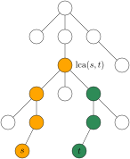

$\DeclareMathOperator{\lca}{lca}$
$\DeclareMathOperator{\parent}{parent}$

---

# 例题 Milk Visits

[洛谷P5838](https://www.luogu.com.cn/problem/P5838)

给你一个有 $N$ 个点的树。每个点有一个颜色，点 $i$ 的颜色是 $T_i$。

回答 $M$ 个询问。第 $j$ 个询问是
- 从点 $A_j$ 到点 $B_j$ 的路径上有没有颜色是 $C_j$ 的点？

输出一个长为 $M$ 的 01 串作为答案。

- $1 \le N, M \le 10^5$
- $1 \le T_i, C_j \le N$

---

我们来尝试把树上差分用在这题上。

---

---

## 分析

把点 $u$（$1 \le u \le n$）的深度记作 $\depth(u)$。
设某人，不妨称之为 A，从 $s$ 跑向 $t$。
- 对于上行段的每个点 $j$，A 被观察员 $j$ 观察到，当且仅当
    $$\depth(s) - \depth(j) = w_j$$
    即
    $$
    \depth(s) = \depth(j) + w_j.
    $$
- 对于下行段的每个点 $j$，A 被观察员 $j$ 观察到，当且仅当
    $$
    \depth(s) + \depth(j) - 2 \depth(\lca(s, t)) = w_j
    $$
    即
    $$
    2 \depth(\lca(s, t)) - \depth(s) = \depth(j) - w_j.
    $$
---

设人 A 从 $s$ 跑向 $t$
- A 被上行段的观察员 $j$ 观察到，当且仅当
    $$\depth(s) = \depth(j) - w_j.$$
- A 被下行段的观察员 $j$ 观察到，当且仅当
    $$
    2 \depth(\lca(s, t)) - \depth(s) = \depth(j) - w_j.
    $$

我们可以这样看
- 每个点 $j$ 有一个（多重）集合 $A_j$，最初为空。
- 对于每一条路径 $s \leadsto t$
    - 对上行段的每个点 $j$，向 $A_j$ 里添加一个数 $\depth(s)$
    - 对下行段的每个点 $j$，向 $A_j$ 里添加一个数 $2 \depth(\lca(s, t)) - \depth(s)$

那么，对树上的每个点 $j$
- 观察员 $j$ 观察到的人数 = 集合 $A_j$ 里 $\depth(j) - w_j$ 的个数.

---

设 $u, v$ 是树上两点，$u$ 是 $v$ 的祖先。向路径 $x \leadsto y$ 上每个点的集合里添加一个数 $x$，在差分序列上的效果就是
- 在点 $u$ 处加一个「添加一个 $x$ 」的操作，
- 在 $v$ 的父节点处加一个「删除一个 $x$」的操作。

然后，对每个点 $j$
- 求集合 $A_j$ 就化为对子树 $j$ 求和，
- 我们想要知道 $A_j$ 里多多少个 $\depth(j) - w_j$。

开一个数组 $\mathrm{cnt}$，在 DFS 过程中，用 $\mathrm{cnt}$ 来维护差分序列的前缀和。
这样，「集合 $A_j$ 有多少个 $\depth(j) - w_j$」就可以通过对两个前缀做差来得到。
