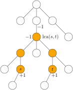
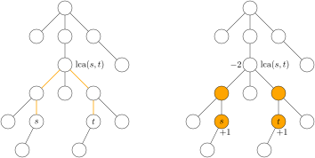
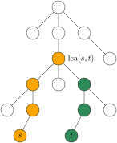

<div class=hidden>

$\DeclareMathOperator{\lca}{lca}$
$\DeclareMathOperator{\depth}{depth}$
$\DeclareMathOperator{\parent}{parent}$
</div>

# 子树求和

子树求和是指对一个**有根树**的每个子树求和。

这里所谓“求和”，不单是指把一堆东西加起来，也包括各式各样信息的汇总。
比如树的每个点上有一些操作，对子树求和可以是把一个子树里的所有操作作用于一个全局数据结构。

---

子树求和问题通常有三种解法。
1. 子树合并。
例如求子树 size 的那种合并法。
2. 把两个前缀和相减得到一个子树和。
3. dsu on tree
一种优化的子树合并。

---

# 方法一：子树合并

像求子树 size 那样，可以用直接的子树合并来解决的问题，大家想必都会了。

我们来介绍一个技巧，可以把对路径的询问或操作，转化为子树求和问题。

---

# 例题 Max Flow

[洛谷P3128](https://www.luogu.com.cn/problem/P3128)

给你一个 $N$ 个点的树。点从 $1$ 到 $N$ 编号。每个点有个权值，最初都等于 $0$。

有 $K$ 个操作，每个操作给你两个整数 $s, t$
- 把从 $s$ 到 $t$ 的路径上的每个点（包括点 $s$ 和点 $t$）的权值加 $1$。

求 $K$ 个操作过后，点的权值的最大值。

- $2 \le N \le 50000$
- $1 \le K \le 100000$

---


把点 $u$ 的权值记作 $w_u$。

我们可以把点 $u$ 的权值看作一种**子树和**。
也就是说，有一个序列 $a = (a_1, \dots, a_N)$，对每个点 $u$ 都有
$$
w_u = \sum_{v在子树 u 内} a_v. 
$$ 
把从 $s$ 到 $t$ 的路径上的每个点的权值加 $1$，对序列 $a$ 的效果恰是
- 给 $a_s$ 加 $1$，给 $a_t$ 加 $1$，给 $a_{\lca(s, t)}$ 减 $1$，给 $a_{\parent(\lca(s, t))}$ 减 $1$。

我们把这个技巧称为**树上差分**。

---

- 对序列 $a$ 求子树和结果就是序列 $w$.
- 所以我们不妨把 $a$ 看作 $w$ 在有根树这种结构上的差分序列。

$$
w_u = \sum_{v:\ u的后代} a_v \iff a_u = w_u - \sum_{v:\ u 的孩子} w_v.
$$

---

<div class=question>

在上述问题中，如果把点权换成边权。把操作改成
- 把从 $s$ 到 $t$ 的路径上的每条边的权值加 $1$。

又该如何处理呢？
</div>

---





- 对每个点 $u$，把连接 $u$ 和它的父节点的边，即 $u$ 的**父边**，的权值看作点 $u$ 的权值。 
- 根节点的父边不存在。
- 把从 $s$ 到 $t$ 的路径上每条边的权值加 $1$，也就是对从 $s$ 到 $t$ 的路径上，除了 $\lca(s, t)$ 之外的每个点的权值加 $1$。
- 对点权的差分序列 $a$ 的效果就是：给 $a_s$ 加 $1$，给 $a_t$ 加 $1$，给 $a_{\lca(s, t)}$ 减 $2$。


----

## 最近公共祖先

```cpp
const int maxn = 5e4 + 5;
vector<int> g[maxn];
int num, L[maxn], R[maxn];

bool is_ancestor(int a, int b) { // a 是不是 b 的祖先
    return L[a] <= L[b] && L[b] <= R[a];
}

int anc[maxn][16];

int lca(int u, int v) {
    if (is_ancestor(u, v)) return u;
    if (is_ancestor(v, u)) return v;
    for (int i = 15; i >= 0; i--) {
        if (anc[u][i] && !is_ancestor(anc[u][i], v))
            u = anc[u][i];
    }
    return anc[u][0];
}

void dfs(int u, int p) {
    L[u] = ++num;
    anc[u][0] = p;
    for (int i = 1; i < 16; i++)
        anc[u][i] = anc[anc[u][i - 1]][i - 1];
    for (int v : g[u])
        if (v != p) {
            dfs(v, u);
        }
    R[u] = num;
}
```

---


```cpp
int a[maxn];
void get_sum(int u, int p) { // 求子树和
    for (int v : g[u])
        if (v != p) {
            get_sum(v, u);
            a[u] += a[v];
        }
}

int main() {
    int n, k; cin >> n >> k;
    for (int i = 1; i < n; i++) {
        int u, v; cin >> u >> v;
        g[u].push_back(v);
        g[v].push_back(u);
    }
    dfs(1, 0);
    while (k--) {
        int s, t; cin >> s >> t;
        int u = lca(s, t);
        a[s]++; a[t]++;
        a[u]--; a[anc[u][0]]--;
    }
    get_sum(1, 0);
    cout << *max_element(a + 1, a + n + 1) << '\n';
}
```

---

# 例题 运输计划

[洛谷P2680](https://www.luogu.com.cn/problem/P2680)

给你一个有 $n$ 个点的树。点从 $1$ 到 $n$ 编号。
第 $i$ 条边（$1 \le i \le n-1$）连接点 $a_i$ 和 $b_i$，走过这条边需要花费时间 $t_i$。

有 $m$ 个运输计划。第 $i$ 个计划（$1 \le i \le m$）是从点 $u_i$ 到点 $v_i$。

你可以选一条边把它改造成虫洞，走过虫洞花费的时间是 $0$。

所有运输计划同时开始。求完成全部计划最少要花多少时间。

- $100 \le n \le 300000$
- $1 \le m \le 300000$
- $0 \le t_i \le 1000$

---

## 暴力

枚举边 $i$，把边 $i$ 变成虫洞，计算每条路径的总时间，求最大值。

---

## 二分答案

给定总时间的上限 $L$，
- 判断是否能通过把一条边改成虫洞，而使得每条路径的总时间都不超过 $L$。

考虑原本总时间大于 $L$ 的路径。
- 改成虫洞的那条边应当是这些路径的公共边。
- 如果有多条公共边，应当把耗时最多的那条改成虫洞。

问题化为
- 如何找出原本总时间大于 $L$ 的那些路径的公共边？

每条边有一个权值，最初都是 $0$。
- 设有 $C$ 条总时间大于 $L$ 的路径。对每条这样的路径，把上面的每条边的权值加 $1$。
- 最后权值等于 $C$ 的边，就是我们要找的公共边。

---

<div class=columns>

```cpp
long long dist[maxn]; // dist[i]：根到点i的距离
int we[maxn]; //we[i]：点i的父边的长度。
vector<int> postorder; //用非递归的方式计算子树和
void dfs(int u, int p) {
    L[u] = ++num;
    anc[u][0] = p;
    for (int i = 1; i < 19; i++)
        anc[u][i] = anc[anc[u][i - 1]][i - 1];
    for (auto [v, w] : g[u])
        if (v != p) {
            dist[v] = dist[u] + w; 
            dfs(v, u);
            we[v] = w;
        }
    R[u] = num;
    postorder.push_back(u);
}

int a[maxn];
int n, m;
int s[maxn], t[maxn], LCA[maxn];
long long len[maxn];
long long max_len;

bool check(long long k) {
    memset(a, 0, sizeof a);
    int cnt = 0;
    for (int i = 0; i < m; i++)
        if (len[i] > k) {
            cnt++;
            // 把 s[i] 到 t[i] 的路径上的边值加 1
            a[s[i]]++; a[t[i]]++;
            a[LCA[i]] -= 2;
        }
    //计算子树和
    for (int v : postorder)
        a[anc[v][0]] += a[v]; 
    for (int i = 1; i <= n; i++)
        if (a[i] == cnt && max_len - we[i] <= k)
            return true;
    return false;
}
```

```cpp
int main() {
    ios::sync_with_stdio(0);
    cin.tie(0);
    cin >> n >> m;
    for (int i = 1; i < n; i++) {
        int u, v, w; cin >> u >> v >> w;
        g[u].push_back({v, w});
        g[v].push_back({u, w});
    }
    dfs(1, 0);
    for (int i = 0; i < m; i++) {
        cin >> s[i] >> t[i];
        LCA[i] = lca(s[i], t[i]);
        len[i] = dist[s[i]] + dist[t[i]] - 2 * dist[LCA[i]];
    }
    max_len = *max_element(len, len + m);
    long long ok = max_len, ng = -1;
    while (ok - ng > 1) {
        long long k = (ok + ng) / 2;
        if (check(k))
            ok = k;
        else
            ng = k;
    }
    cout << ok << '\n';
}
```


---


# 方法二：把两个前缀和相减得到一个子树和

前缀：有根树的先序遍历所得序列的前缀。

---

# 例题 Tree Requests

[CF570D](https://codeforces.com/contest/570/problem/D)

给你一个有 $n$ 个点的有根树。点从 $1$ 到 $n$ 编号。
点 $1$ 是根。点 $i$ 的父节点是 $p_i$（$2 \le i \le n$）。每个点上有一个小写英文字母。

回答 $m$ 个询问。第 $i$ 个询问给你两个整数 $v_i, h_i$，问
- 子树 $v_i$ 里，深度等于 $h_i$ 的点上的那些字符能否构成一个回文串？

在本题里，约定根的深度为 $1$。

- $1 \le n, n \le 500000$
- $1 \le p_i < i$

---

# 解法

在 DFS 的过程中，我们维护 $n$ 个长度为 $26$ 的 01 序列，$p_1, \dots, p_n$。
- $p_i$：在已经访问过的深度等于 $i$ 的节点上，a 到 z 出现次数的奇偶性。0 偶，1 奇。

为了回答询问 $(v, h)$，在即将进入子树 $v$ 时，记录一下 $p_h$ 的值，在即将离开子树 $v$ 时，再记录一下 $p_h$ 的值。把这先后两个 01 序列异或，结果就是
- 子树 $v$ 里深度等于 $v$ 的那些点上，每种字符出现次数的奇偶性。

若结果中 1 不超过 $1$ 个，那些字符就能构成回文串。

---

```cpp
const int maxn = 5e5 + 5;

vector<int> g[maxn];
char c[maxn];
vector<pair<int,int>> query[maxn];

bitset<26> p[maxn]; //全局数据结构
bitset<26> ans[maxn];

void dfs(int u, int depth) {
    for (auto [h, id] : query[u])
        ans[id] = a[h];
    p[depth].flip(c[u] - 'a');
    for (int v : g[u])
        dfs(v, depth + 1);
    for (auto [h, id] :  query[u])
        ans[id] ^= p[h];
}

int main() {
    ios::sync_with_stdio(0);
    cin.tie(0);
    int n, m; cin >> n >> m;
    for (int i = 2; i <= n; i++) {
        int p; cin >> p;
        g[p].push_back(i);
    }
    for (int i = 1; i <= n; i++)
        cin >> c[i];
    for (int i = 0; i < m; i++) {
        int v, h; cin >> v >> h;
        query[v].push_back({h, i});
    }
    dfs(1, 1);
    for (int i = 0; i < m; i++)
        cout << (ans[i].count() < 2 ? "Yes" : "No") << '\n';
}
```

---

上面的解法是离线的，时间 $O(n)$。

还有一种类似的在线解法。

对每个 $d = 1, \dots, n$，定义一个有序的列表
- $\mathrm{order}_d$：深度为 $d$ 的点的 DFS 序号，从小到大排列构成的列表。

对每个 $i = 1, \dots, n$，设点 $v$ 的 DFS 序号是 $i$，定义
- $s_i$：和点 $v$ 在同一深度且 DFS 序号小于等于 $i$ 的那些点上，每种字符出现次数的奇偶性。

对于询问 $(v, h)$，设子树 $v$ 里的点的 DFS 序号范围是 $[L_v, R_v]$，在列表 $\mathrm{order}_h$ 上二分查找，找出子树 $v$ 里第一个和最后一个深度是 $h$ 的点的 DFS 序号。  


---

```cpp
bitset<26> s[maxn];
vector<int> order[maxn];
int L[maxn], R[maxn], num;

void dfs(int u, int depth) {
    L[u] = ++num;
    int prev = order[depth].empty() ? 0 : order[depth].back();
    s[num] = s[prev];
    s[num].flip(c[u] - 'a');
    order[depth].push_back(num);
    for (int v : g[u])
        dfs(v, depth + 1);
    R[u] = num;
}

int main() {
    ios::sync_with_stdio(0);
    cin.tie(0);
    // 输入 ...
    dfs(1, 1);
    for (int i = 0; i < m; i++) {
        int v, h; cin >> v >> h;
        bitset<26> ans;
        auto l = lower_bound(order[h].begin(), order[h].end(), L[v]);
        auto r = upper_bound(order[h].begin(), order[h].end(), R[v]);
        for (auto ptr : {l, r})
            if (ptr != order[h].begin())
                ans ^= s[*(ptr - 1)];
        cout << (ans.count() > 1 ? "No" : "Yes") << '\n';
    }
}
```

---

离线解法更好写。

---


# 例题 天天爱跑步

[洛谷P1600](https://www.luogu.com.cn/problem/P1600)


有一个有 $n$ 个点的树。点从 $1$ 到 $n$ 编号。

每天有 $m$ 个人在树上跑步，第 $i$ 个人的起点是 $s_i$，终点是 $t_i$。每天，所有人在第 $0$ 秒同时从自己的起点出发，以每秒跑一条边的速度，不间断地跑向各自的终点。

在每个点上都有一个观察员。一个人能被点 $j$ 上的观察员观察到，当且仅当此人在第 $w_j$ 秒恰好到达点 $j$。

求每个观察员会观察到多少人？

注意：设某人的终点是 $j$，如果他在第 $w_j$ 秒之前到达点 $j$，那么他**不**会被观察到。

- $991 \le n, m \le 299998$


---



考虑以点 $1$ 为根的有根树。
把点 $u$（$1 \le u \le n$）的深度记作 $\depth[u]$。

设某人从 $s$ 出发跑向 $t$。我们把这条路径上的点分成两段
- 上行：从 $s$ 到 $\lca(s, t)$
- 下行：从 $\lca(s, t)$ 到 $t$，不包括 $\lca(s, t)$。

---


<div class=question>

每个观察员会观察到多少个**上行**的人？
</div>

某人从 $s$ 跑向 $t$，上行经过点 $j$，且被观察员 $j$ 观察到，当且仅当
$$\depth(j) - \depth(s) = w_j$$
即
$$
\depth(s) = \depth(j) - w_j.
$$

我们可以这样看
- 每个点 $j$ 有一个（多重）集合 $A_j$，最初为空。
- 对于每一条路径 $s \leadsto t$ 的上行段的每个点 $j$，向 $A_j$ 里添加一个数 $\depth(s)$。

观察员 $j$ 观察到的上行人数 = 集合 $A_j$ 里 $(\depth(j) - w_j)$ 的个数.

---


<div class=question>

每个观察员会观察到多少个**下行**的人？
</div>

某人从 $s$ 跑向 $t$，下行经过点 $j$，且被观察员 $j$ 观察到，当且仅当
$$
\depth(s) + \depth(j) - 2 \depth(\lca(s, t)) = w_j
$$
即
$$
2 \depth(\lca(s, t)) - \depth(s) = \depth(j) - w_j.
$$

我们可以这样看
- 每个点 $j$ 有一个（多重）集合 $B_j$，最初为空。
- 对于每一条路径 $s \leadsto t$ 的下行段的每个点 $j$，向 $B_j$ 里添加一个数 $2 \depth(\lca(s, t)) - \depth(s)$。

观察员 $j$ 观察到的下行人数 = 集合 $B_j$ 里 $(\depth(j) - w_j)$ 的个数.

---

- 用树上差分来处理这里的「向一条路径上的每个点的集合里添加同一个数」的操作。

- 这里的路径是特殊的：两个端点是“祖先—后代”关系。

---

```cpp
const int maxn = 3e5 + 5;
int num, L[maxn], R[maxn];

bool is_ancestor(int a, int b) { // a 是不是 b 的祖先
    return L[a] <= L[b] && L[b] <= R[a];
}

int anc[maxn][19];
int lca(int u, int v) {
    if (is_ancestor(u, v)) return u;
    if (is_ancestor(v, u)) return v;
    for (int i = 18; i >= 0; i--) {
        if (anc[u][i] && !is_ancestor(anc[u][i], v))
            u = anc[u][i];
    }
    return anc[u][0];
}

vector<int> g[maxn];
int depth[maxn];
void dfs(int u, int p) {
    L[u] = ++num;
    anc[u][0] = p;
    depth[u] = depth[p] + 1;
    for (int i = 1; i < 19; i++)
        anc[u][i] = anc[anc[u][i - 1]][i - 1];
    for (int v : g[u])
        if (v != p) {
            dfs(v, u);
        }
    R[u] = num;
}
```

---

```cpp
int cnt[2 * maxn];
int ans[maxn];
vector<pair<int,int>> op[maxn];
void get_up(int u, int p) {
    int key = w[u] + depth[u];
    int before = cnt[key];
    for (auto [k, type] : op[u])
        cnt[k] += type;
    for (int v : g[u])
        if (v != p)
            get_up(v, u);
    ans[u] += cnt[key] - before;
}

int n, m;
void get_down(int u, int p) {
    int key = w[u] - depth[u] + n;
    int before = cnt[key];
    for (auto [k, type] : op[u]) {
        cnt[k] += type;
    }
    for (int v : g[u])
        if (v != p)
            get_down(v, u);
    ans[u] += cnt[key] - before;
}
```

---

```cpp
int main() {
    ios::sync_with_stdio(0);
    cin.tie(0);
    cin >> n >> m;
    for (int i = 1; i < n; i++) {
        int u, v; cin >> u >> v;
        g[u].push_back(v);
        g[v].push_back(u);
    }
    for (int i = 1; i <= n; i++)
        cin >> w[i];
    
    dfs(1, 0);

    vector<int> s(m), t(m), LCA(m);
    for (int i = 0; i < m; i++) {
        cin >> s[i] >> t[i];
        LCA[i] = lca(s[i], t[i]);
        ans[LCA[i]] += depth[s[i]] == depth[LCA[i]] + w[LCA[i]];
    }
    for (int i = 0; i < m; i++) {
        int k = depth[s[i]];
        op[s[i]].push_back({k, 1});
        op[LCA[i]].push_back({k, -1});
    }
    get_up(1, 0);

    memset(cnt, 0, sizeof cnt);
    for (int i = 1; i <= n; i++)
        op[i].clear();
    
    for (int i = 0; i < m; i++) {
        int time = depth[s[i]] + depth[t[i]] - 2 * depth[LCA[i]];
        int k = time - depth[t[i]] + n;
        op[t[i]].push_back({k, 1});
        op[LCA[i]].push_back({k, -1}); 
    }
    get_down(1, 0);
    for (int i = 1; i <= n; i++)
        cout << ans[i] << ' ';
    cout << '\n';
}
```

---


# 方法三：DSU on Tree


---

