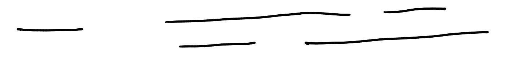

# 贪心法


<div class=hidden>

$\DeclarePairedDelimiter\ceil{\lceil}{\rceil}$
$\DeclarePairedDelimiter\floor{\lfloor}{\rfloor}$
$\DeclareMathOperator{\rotr}{rotr}$

</div>


---

# 目录

- 认识/回顾贪心法 
- 几个关于区间的典型问题
- 贪心法和字典序
- 寻找最优排列


---

# 贪心策略

对于一些**组合最优化**问题，我们可按照一个简单的**策略**，**逐步**得到一个**最优解**。

这个策略告诉我们每一步应该怎么做。

一般来说，每一步所做的事情是相似的。

我们把这样的策略叫做**贪心**策略。


---

# 组合最优化问题

泛指那些寻求一个（按某种标准）最优的组合对象的问题。组合对象包括
- 组合（子集）
- 排列
- 配对
- 分组
- 图
- ……

---

# 例题：摩天轮

有 $n$ 个人要乘摩天轮，第 $i$ 个人的重量是 $p_i$。摩天轮的每个座舱最多能容纳两人且总重不得超过 $x$。至少需要多少个座舱？

###### 限制

- $1 \le n \le 2\times 10^5$
- $1 \le x \le 10^9$
- $1 \le p_i \le x$

---

# 尝试一下

尝试提出一个安排人坐摩天轮的策略。

---

# 贪心策略

- 若最重和最轻的人可以坐进一个座舱，就让这两人用一个座舱。否则让最重的人独自用一个座舱。

这样安排是最优解吗？为什么？


---

# 证明贪心策略正确性


要证明一个贪心策略是对的，只要证明**存在一个最优解包含此策略第一步的选择**。

常用**调整法**来证明。

考虑一个**最优解**，如果它不包含此策略第一步的选择，调整成有第一步的选择，并且证明调整之后的解不比原来的最优解差。


---

# 程序实现

1. 把所有人的重量从小到大**排序**。
2. 用**双指针**法实现上述贪心策略。

---

<div class=columns>
<div>

写法一
```cpp
int main() {
    int n, x;
    cin >> n >> x;
    vector<int> w(n);
    for (int i = 0; i < n; i++)
        cin >> w[i];
    sort(w.begin(), w.end());
    int l = 0, r = n - 1;
    int ans = 0;
    while (l < r) { //双指针
        if (w[l] + w[r] <= x) {
            l++;
            r--;
        } else {
            r--;
        }
        ans++;
    }
    if (l == r)
        ans++;
    cout << ans << '\n';
}
```
</div>

<div>

写法二
```cpp
int main() {
    int n, x;
    cin >> n >> x;
    vector<int> w(n);
    for (int i = 0; i < n; i++)
        cin >> w[i];
    sort(w.begin(), w.end());
    int l = 0, r = n - 1;
    int ans = 0;
    while (l <= r) { //双指针
        if (w[l] + w[r] <= x) {
            l++;
            r--;
        } else {
            r--;
        }
        ans++;
    }
    cout << ans << '\n';
}
```
</div>

---

# Tips

我们在寻找或理解一个贪心策略时，可以从“第一步怎么做？”入手。

通常，做了第一步以后，我们面临一个和原问题形式相同但规模更小的问题（子问题）。

贪心策略的关键常常是按照某种规则对所考虑东西进行**排序**。

---

# 例题：支架


有 $n$ 根木棍，第 $i$ 根木棍的长度为 $a_i$。

制作一个支架需要两根木棍。用长度为 $x$ 和 $y$ 的两根木棍制作的支架可以摆放一个重量不超过 $x \times y$ 的物品。

校长计划购买 $m$ 个重量一样的艺术品放在校园中，他请你制作 $m$ 个支架，把每个艺术品分别摆放在一个支架上。

请你告诉校长购买的单个艺术品的重量最大是多少。

###### 限制

- $1 \le n \le 10^6$
- $1 \le m \le \floor{n/2}$
- $1 \le a_i \le 10^5$

---

# 解法

不难看出应该用最长的 $2m$ 根木棍。问题是如何配对。

考虑四根木棍的情形，我们发现应该把最长和最短的木棍配成一对。
设四根木棍的长度是 $a \le b \le c \le d$。
- $a, b$ 一对，最小承重是 $ab$。
- $a, c$ 一对，最小承重是 $ac$。注意到 $ac \ge ab$。
- $a, d$ 一对，最小承重是 $\min(ad, bc)$。注意到 $ad \ge ac$ 且 $bc \ge ac$。

可见 $a,d$ 配对是最好的。

对于一般情况，设最短木棍的长度是 $a$，最长木棍的长度是 $d$。
考虑一个**最优解**。如果其中 $a,d$ 不是一对，假设和 $a$ 配对的木棍的长度是 $b$，和 $d$ 配对的木棍的长度是 $c$；我们有 $a \le b, c \le d$。改成 $a,d$ 一对、$b, c$ 一对，结果不会变差。

**贪心策略：每次拿最长和最短的木棍配成一对。**

---

# 例题：拿数

有 $N$ 个整数 $A_1, \dots, A_N$。甲乙二人轮流拿，每次拿一个数，甲先拿，拿完为止。两人的目标都是最后自己拿到的数的总和尽可能小。

甲乙二人都采取最优策略。求最后甲拿到的数的总和。

---

最优策略：每个人每次都拿剩下的数中最小的那个。

证明：对 $N$ 用**归纳法**。$N = 1, 2$ 时显然成立。

设 $A_1 \le \dots \le A_N$。设第一次甲拿了 $A_i$，根据归纳假设，以后两人都拿剩下的最小的数，那么
- 若 $i$ 是奇数，甲拿到的数是
  $$A_i, A_2, A_4, \dots, A_{i-1}, A_{i+2}, A_{i+4}, \dots$$
  不难验证，当 $i = 1$ 时，甲拿到的数总和最小。
- 若 $i$ 是偶数，甲拿到的数是
  $$A_i, A_2, A_4, \dots, A_{i-2}, A_{i+1}, A_{i+3}, \dots$$
  如果甲第一次拿 $A_1$，那么将会拿到
  $$A_1, A_3, \dots, A_{i-1}, A_{i+1}, A_{i+3}, \dots$$
  后者不比前者差。

---

# 例题：萨鲁曼的部队

直线上有 $N$ 个点，编号 $1$ 到 $N$。点 $i$ 的位置是 $X_i$。在同一位置可能有多个点。

从这 $N$ 个点中选择若干个，给它们加上标记。对每个点，到它的距离不超过 $R$ 的区域里（包括距离等于 $R$ 的点）必须有带标记的点（自己本身带有标记的点，可以认为与其距离为零的地方有一个带有标记的点）。在满足这个条件的情况下，希望能为尽可能少的点添加标记。请问至少要有多少个点被加上标记？

###### 限制

- $1 \le N \le 1000$
- $0 \le R \le 1000$
- $0 \le X_i \le 1000$


---

# 贪心策略

按从左到右的顺序考虑这些点。按以下策略选取下一个要标记的点

- 设当前第一个未被标记覆盖的点是 $x$，选 $[x, x+R]$ 范围内最后一个点打上标记。


---

# 代码

```cpp
void solve(int n, int r) {
  vector<int> x(n);
  for (int i = 0; i < n; i++)
    cin >> x[i];
  sort(x.begin(), x.end());
  int ans = 0;
  for (int i = 0; i < n; ) {
    int last = x[i];
    while (i < n && x[i] - last <= r)
      i++;
    int p = x[i - 1]; //在p处打上标记
    ans++;
    while (i < n && x[i] - p <= r)
      i++;
  }
  cout << ans << '\n';
}
```

---

# 例题：小木棍 :star:

<div class=col73><div>

用小木棍拼成的数字 0 到 9 如下
<span class=digit>0 1 2 3 4 5 6 7 8 9</span>
现在要用小木棍拼出一个**正**整数，满足下列条件：
- 拼出这个数**恰好**使用 $n$ 根小木棍；
- 拼出的数没有前导 $0$；
- 在满足以上两个条件的前提下，这个数尽可能小。

若存在满足以上条件的正整数，输出它，否则输出 `-1`。

你要处理 $T$ 个测试。

</div><div>

###### 限制

- $1 \leq T \leq 50$
- $1 \leq n \leq 10^5$

</div></div>


---

# 贪心策略

要让拼出的数尽可能小，
- 首先要让这个数的位数尽可能少。

  需要小木棍最多的数字是 <span class=digit>8</span>，它需要 $7$ 根小木棍。
  
  最好是用 $n$ 根木棍拼成 $\ceil{n/7}$ 个数字。

---

- 其次是让第一个数字尽可能小。

  第一个目标达成的前提下，第一个数字最好是<span class=digit>1</span>，其次是<span class=digit>2</span>，……
- 第三是让第二个数字尽可能小。
  前两个目标达成的前提下，第二个数字最好是 <span class=digit>0</span>，其次是<span class=digit>1</span>，……
- ……  

此外，注意到拼 <span class=digit>6，9</span> 不如拼 <span class=digit>0</span>，拼<span class=digit>3，5</span> 不如拼 <span class=digit>2</span>。

---

# 分类讨论

考虑按 $n$ 除以 $7$ 的余数分类讨论：

0：拼成 $n/7$ 个 <span class=digit>8</span>。 

1：$n=1$，无解。$n = 8$，拼成<span class=digit>10</span>，$n > 8$ 拼成<span class=digit>108</span>…<span 
class=digit>8</span>。

2：$n=2$，拼<span class=digit>1</span>。$n > 2$ 拼成<span class=digit>18</span>…<span class=digit>8</span>。

3：$n=3$，拼<span class=digit>7</span>。$n = 10$ 拼 <span class=digit>22</span>。$n = 17$ 拼 <span class=digit>200</span>。$n > 17$ 拼成<span class=digit>2008</span>…<span class=digit>8</span>。

4：$n=4$，拼 <span class=digit>4</span>。$n=11$ 拼成<span class=digit>20</span>。$n > 11$ 拼成<span class=digit>208</span>…<span class=digit>8</span>。

5：$n=5$，拼 <span class=digit>2</span>。$n > 5$ 拼成 <span class=digit>28</span>…<span class=digit>8</span>。

6：$n=6$，拼 <span class=digit>6</span>。$n > 6$ 拼成 <span class=digit>68</span>…<span class=digit>8</span>。

---

# 打表找规律

```cpp
vector<int> need = {6, 2, 5，5, 4, 5, 6, 3, 7, 6};
vector<int> best(100000);
for (int x = 1; x <= 10000; x++) {
  int y = 0;
  for (char c : to_string(x))
    y += need[c - '0'];
  // 拼 x 需要 y 根木棍 
  if (best[y] == 0)
    best[y] = x; // 用 y 根木棍能拼成的最小正整数是 x
}
for (int i = 1; i <= 20; i++)
  cout << best[i] << ' ';
```

输出：
```
0 1 7 4 2 6 8 10 18 22 20 28 68 88 108 188 200 208 288 688 
```

---

# 总结

这道题，获得最优解的策略不是“每一步都如何如何”就足以描述的，而是分层次的。最优策略的表述形如

- 要获得最优解，首先要…，其次要…，第三要…，……

---

# 代码

```cpp
void solve() {
  int n; cin >> n; int r = n % 7;
  if (r == 0) cout << string(n / 7, '8');
  else if (r == 1) {
    if (n == 1) cout << -1;
    else cout << 10 << string((n - 8) / 7, '8');
  } else if (r == 2) cout << 1 << string(n / 7, '8');
  else if (r == 3) {
    if (n == 3) cout << 7;
    else if (n == 10) cout << 22;
    else cout << 200 << string((n - 17) / 7, '8');
  } else if (r == 4) {
    if (n == 4) cout << 4;
    else cout << 20 << string((n - 11) / 7, '8');
  } else if (r == 5) cout << 2 << string(n / 7, '8');
  else if (r == 6) cout << 6 << string(n / 7, '8');
  cout << '\n';
}
```

---

# 另一种写法

```cpp
void solve() {
  int n; cin >> n; int r = n % 7, len = (n + 6) / 7;
  string ans;

  if (r == 0) ans = string(len, '8');
  else if (r == 1)
    ans = n == 1 ? "-1"s : "10" + string(len - 2, '8');
  else if (r == 2) ans = "1" + string(len - 1, '8');
  else if (r == 3)
    ans = n == 3 ? "7"s : n == 10 ? "22"s : "200" + string(len - 3, '8');
  else if (r == 4)
    ans = n == 4 ? "4"s : "20" + string(len - 2, '8');
  else if (r == 5) ans = "2" + string(len - 1, '8');
  else if (r == 6) ans = "6" + string(len - 1, '8');

  cout << ans << '\n';
}
```


---

# 几个关于区间的典型问题

- 区间安排问题
- 区间选点问题
- 区间覆盖问题
- 点和区间配对问题
- 区间分组问题


---

# 例题：区间安排问题

有 $N$ 个区间，第 $i$ 个区间是 $[L_i, R_i)$。从中最多能选出多少个两两不相交的区间？

###### 限制

- $1 \le N \le 300000$
- $0 \le L_i < R_i \le 86400$
- $L_i, R_i$ 是整数。

---

# 贪心策略

在可选的区间中，每次都选取右端点最小的区间。

---

# 代码

```cpp
struct S { int l, r; };

bool cmp(S a, S b) { return a.r < b.r; }

int solve() {
  int n; cin >> n;
  vector<S> a(n);
  for (int i = 0; i < n; i++)
    cin >> a[i].l >> a[i].r;
  sort(a.begin(), a.end(), cmp);
  int ans = 0, r = 0;
  for (S s : a)
    if (r <= s.l) {
      ans++;
      r = s.r;
    }
  return ans;
}
```


---

# 区间选点问题

数轴上有 $n$ 个区间 $[L_i, R_i]$。选取尽量少的点，使得每个区间内都至少有一个点（不同区间内含有的点可以是同一个）。

前面的《萨鲁曼的部队》可以看作区间选点问题的一个特例。

---

# 解法

如果某区间内已经有一个点被取到，则称此区间已经被满足。

把区间按右端点从小到大排序。按此顺序考虑每个区间，若当前区间未被满足，则选取它的右端点。

---

# 区间覆盖问题 1

数轴上有 $N$ 个区间 $[L_i, R_i]$，从中选择尽量少的区间覆盖 $[x, y]$。

###### 限制

- $0 \le L_i < R_i \le 10^9$
- $0 \le x < y \le 10^9$
- $x, y, L_i, R_i$ 是整数


---

# 策略

1. 在左端点小于等于 $x$ 的区间中选右端点最大的那个，设它是 $[a_1, b_1]$。若不存在这样的区间或 $b_1 \le x$，无解。若 $b_1 \ge y$，只需要选这一个区间。
2. 在左端点大于 $x$ 且小于等于 $b_1$ 的区间中选右端点最大的那个，设它是 $[a_2, b_2]$。若不存在这样的区间或 $b_2 \le b_1$，无解。若 $b_2 \ge y$，只需要选这两个区间。
2. ……


---

# 代码

```cpp
struct S { int l, r; }
S a[maxn];
bool cmp(S a, S b) { return a.l < b.l; }

int solve(int n, int x, int y) {
  sort(a, a + n, cmp);
  int r = 0, ans = 0;
  // x < y
  for (int i = 0; i < n; ) {
    while (i < n && a[i].l <= x) {
      r = max(r, a[i].r);
      i++;
    }
    if (r <= x) return -1; // 没有进展
    ans++; //选一个区间
    if (r >= y) return ans; // 够了
    x = r;
  }
  return -1;
}
```

---

# 例题：奶牛排班

一天有 $T$ 个时段。农夫约翰打算安排他的 $N$ 只奶牛来值班打扫牛棚卫生。每只奶牛都有自己的空闲时间。第 $i$ 只奶牛的空闲时间是从第 $S_i$ 个时段到第 $E_i$ 个时段（包括两端）。

只能把空闲的奶牛安排出来值班。每个时段必需有奶牛在值班。

最少需要动用多少奶牛参与值班？如果没有办法安排出合理的方案，就输出 $-1$。


###### 限制

- $1\le T\le 10^6$
- $1 \le N\le 2.5\times 10^4$
- $1\le S_i\le E_i\le T$。


---

# 提示

这道题里的区间指的是一段连续的整数（离散），而不是数轴上的区间（连续）。在处理区间端点时要注意和《区间覆盖问题 1》的区别。


---

# 代码

<div class=columns>

```cpp
struct S { int l, r; };
S a[maxn];
bool cmp(S a, S b) { return a.l < b.l; }

int solve(int n, int x, int y) {
  sort(a, a + n, cmp);
  int r = 0, ans = 0;
  // x <= y
  for (int i = 0; i < n; ) {
    while (i < n && a[i].l <= x) {
      r = max(r, a[i].r);
      i++;
    }
    if (r < x) return -1; // 没有进展
    ans++; //选一个区间
    if (r >= y) return ans; // 够了
    x = r + 1;
  }
  return -1;
}
```

```cpp
int main() {
  int N, T;
  cin >> N >> T;
  for (int i = 0; i < N; i++)
    cin >> a[i].l >> a[i].r;

  cout << solve(N, 1, T) << '\n';
}
```

---

# Tips

表示**范围**（序列里面连续的一段）时，采用**左闭右开**的方式比较好。

比如一列东西里从第 $l$ 个到第 $r$ 个这一个范围，我们用 $l$ 和 $r+1$ 这两个值来表示。

$l$ 这一项是在范围内，$r$ 这一项是不在范围内的。

---

# 采用左闭右开的方式表示范围（区间）

<div class=columns>

```cpp
struct S { int l, r; };
S a[maxn];
bool cmp(S a, S b) { return a.l < b.l; }

int solve(int n, int x, int y) {
  sort(a, a + n, cmp);
  int r = 0, ans = 0;
  // x <= y
  for (int i = 0; i < n; ) {
    while (i < n && a[i].l <= x) {
      r = max(r, a[i].r);
      i++;
    }
    if (r <= x) return -1; // 没有进展
    ans++; //选一个区间
    if (r >= y) return ans; // 够了
    x = r;
  }
  return -1;
}
```


```cpp
int main() {
  int N, T;
  cin >> N >> T;
  for (int i = 0; i < N; i++) {
    cin >> a[i].l >> a[i].r;
    a[i].r += 1;
  }

  cout << solve(N, 1, T + 1) << '\n';
}
```

---


# 区间覆盖问题 2


数轴上有 $N$ 个区间 $[L_i, R_i]$，选择尽量少的区间使得所选区间的并等于 $N$ 个区间的并。


---

# 解法

1. 排序：把 $N$ 个区间按左端点从小到大排序，左端点相同的区间，按右端点从大到小排序。设如此排序后的第 $i$ 个区间是 $[L_i, R_i]$。
2. 选择 $[L_1, R_1]$。
3. 找出下一个要选的区间：从第二个区间开始，枚举每个区间 $[L_i, R_i]$，若 $R_i \le R_1$，跳过此区间。对于第一个满足 $R_i > R_1$ 的区间，
    - 若 $L_i > R_1$，则下一个要选的区间就是 $[L_i, R_i]$。
    - 否则 $L_1 \le L_i \le R_1$ 而 $R_i > R_1$。下一个要选的区间是满足此条件的区间中，右端点最大的那个。


---

# 代码

```cpp
struct S { int l, r; };
bool cmp(S a, S b) {
  if (a.l != b.l) return a.l < b.l;
  return a.r > b.r;
}
S a[maxn];
int n;

vector<int> solve() {
  sort(a, a + n, cmp);
  vector<int> take = {0};
  int i = 1;
  while (i < n) {
    int last_r = a[take.back()].r;
    if (a[i].r <= last_r) { i++; continue; }
    if (a[i].l > last_r) { take.push_back(i); i++; }
    else {
      int j = i; i++;
      while (i < n && a[i].l <= last_r) {
        if (a[i].r > a[j].r) j = i;
        i++;
      }
      take.push_back(j);
    }
  }
  return take;
}
```


---

# 例题：公寓

有 $m$ 间公寓和 $n$ 个申请者。第 $i$ 间公寓的面积是 $b_i$（$1 \le i \le m$）。第 $j$ 个申请者想要的公寓面积是 $a_j$（$1 \le j \le n$），他会接受公寓 $i$ 当且仅当 $a_j-k \le b_i \le a_j + k$。

今要把这些公寓分配给申请者，不能把一间公寓分配给多个申请者。

最多能满足多少个申请者？

###### 限制

- $1 \le n, m \le 2 \cdot 10^5$
- $0 \le k \le 10^9$
- $1 \le a_i, b_i \le 10^9$

---

# 模型：点和区间配对

数轴上有 $m$ 个点和 $n$ 个区间，第 $i$ 个点是 $b_i$，第 $j$ 个区间是 $[a_j - k, a_j + k]$。

点 $i$ 和区间 $j$ 能配对当且仅当 $a_j - k \le b_i \le a_j + k$。

求最多能配成多少对。


---

# 贪心策略

注意到区间的长度都相同，可采用以下策略

- 让左边的区间和左边的点配对。


---

# 代码

```cpp
const int maxn = 2e5 + 5;
int a[maxn], b[maxn];

int main() {
  int n, m, k;
  cin >> n >> m >> k;
  for (int i = 0; i < n; i++)
    cin >> a[i];
  for (int i = 0; i < m; i++)
    cin >> b[i];

  sort(a, a + n);
  sort(b, b + m);

  int ans = 0;
  int j = 0;
  // 双指针
  for (int i = 0; i < m; i++) {
    while (j < n && b[i] > a[j] + k)
      j++;
    if (j < n && b[i] >= a[j] - k) {
      ans++;
      j++;
    }
  }
  cout << ans << '\n';
}
```


---


# 一般的点和区间配对问题

数轴上有 $M$ 个点和 $N$ 个区间，第 $i$ 个点是 $X_i$，第 $j$ 个区间是 $[L_j, R_j]$。

点 $i$ 和区间 $j$ 能配对当且仅当 $L_j \le X_i \le R_j$。

求最多能配成多少对。

---

# 贪心策略

按从小到大的顺序考虑每个点，如果有包含它的区间，那么选择右端点最小的那个区间和它配对。


---

# 朴素的实现

```cpp
int X[maxm], L[maxn], R[maxn];
bool used[maxn];
int M, N;
int solve() {
  sort(X, X + M);
  int ans = 0;
  for (int i = 0; i < M; i++) {
    int k = -1;
    for (int j = 0; j < N; j++)
      if (!used[j] && L[j] <= X[i] && X[i] <= R[j])
        if (k == -1 || R[j] < R[k])
          k = j;
    if (k != -1) { used[k] = true; ans++; }
  }
  return ans;
}
```
时间：$O(M\log M + MN)$

---

# 优先队列

想要快速实现上述过程，我们可使用 C++ 标准库提供的**优先队列** std::priority_queue。
设类型 T 具有小于号 <。
```cpp
priority_queue<T> q;
```
q 是一个存放 T 类型的东西的**容器**。它支持下列操作：


---

# 让 q.top() 返回最小元素

设类型 T 具有小于号 <。实际上，定义
```cpp
priority_queue<T> q;
```
的完整形式是
```cpp
priority_queue<T, vector<T>, less<T>> q;
```
若把 less\<T> 换成 greater\<T>，q.top() 就返回 q 的一个最小元素。

---

# 使用优先队列

1. 排序：把所有点从小到大排序，把所有区间按左端点从小到大排序。
2. 准备一个存放整数的小优先队列 q（q.top() 返回一个最小值）。
3. 枚举每个点 $X_i$，把满足 $X_{i-1} <L_j \le X_i$ 的那些区间 $j$ 的右端点 $R_j$ 放进 q 里。
找 q 里大于等于 $X_i$ 的最小整数。
    ```cpp
    int j = 0;
    for (int i = 0; i < M; i++) {
      while (j < N && L[j] <= X[i]) { q.push(R[j]); j++; }
      while (!q.empty()) {
        int r = q.top(); q.pop();
        if (r >= X[i]) { ans++; break; }
      }
    }
    ```

---

# 完整代码

```cpp
int X[maxn];
pair<int, int> LR[maxn];
int N, M;
int solve() {
  sort(X, X + M); sort(LR, LR + N);
  priority_queue<int, vector<int>, greater<int>> q;
  int ans = 0, j = 0;
  for (int i = 0; i < M; i++) {
    while (j < N && LR[j].first <= X[i]) {
      q.push(LR[j].second); j++;
    }
    while (!q.empty()) {
      int r = q.top(); q.pop();
      if (r >= X[i]) { ans++; break; }
    }
  }
  return ans;
}
```

---

# 例题：带区间限制的装箱问题 
<!-- abc214_e -->


有 $10^9$ 个盒子，编号 $1,2,\dots,10^9$ 和 $N$ 个球，编号 $1,2,\dots,N$。  
每个盒子最多能容纳一个球。  
判断能否把所有 $N$ 个球都放进盒子并且满足下列条件。
- 对每个 $i = 1, 2, \dots, N$，球 $i$ 在编号在 $L_i$ 到 $R_i$ 之间（包括两端）的盒子里。

你需要解决 $T$ 个测试。


###### 限制

- $1 \le T \le 2 \times 10^5$
- $1 \le N \le 2 \times 10^5$
- $1 \le L_i \le R_i \le 10^9$
- 所有测试的 $N$ 之和不超过 $2\times 10^5$

---

# 解析

不难看出，在这个问题中，盒子相当于点，球相当于区间。

不过这里有 $10^9$ 个点，像上面那样逐个枚举点不合适，我们要跳过那些用不上的点。

---


# 写法一

```cpp
pair<int, int> LR[maxn];
int N;//有N个区间
bool solve() {
  sort(LR, LR + N);
  priority_queue<int, vector<int>, greater<int>> q;
  int i = 1, j = 0;
  for (int t = 0; t < N; t++) {
    if (q.empty())
      i = LR[j].first;//跳过用不上的点
    while (j < N && LR[j].first <= i) {
      q.push(LR[j].second);
      j++;
    }
    if (q.top() < i)
      return false;
    q.pop();
    i++;
  }
  return true;
}
```

---

# 写法二

```cpp
pair<int, int> LR[maxn];
int N;//有N个区间
bool solve() {
  sort(LR, LR + N);
  priority_queue<int, vector<int>, greater<int>> q;
  int i = LR[0].first, j = 0;
  for (int t = 0; t < N; t++) {
    while (j < N && LR[j].first <= i) {
      q.push(LR[j].second);
      j++;
    }
    if (q.top() < i)
      return false;
    q.pop();
    if (q.empty())
      i = LR[j].first;//跳过用不上的点
    else i++;
  }
  return true;
}
```


---

# 点和带权的区间配对问题

数轴上有 $M$ 个点和 $N$ 个区间，每个区间有一个权值。第 $i$ 个点是 $X_i$，第 $j$ 个区间是 $[L_j, R_j]$，权值是 $W_j$（$W_j > 0$）。

点 $i$ 和区间 $j$ 能配对当且仅当 $L_j \le X_i \le R_j$。

今要选一些点和区间配对。求配对的区间的权值之和的最大值。

这个问题较难，我们先来看一个简单的特殊情况。

---

# 例题：代金券 [abc308_f](https://atcoder.jp/contests/abc308/tasks/abc308_f)

你到商店去买 $N$ 个物品。第 $i$ 个物品的价格是 $P_i$ 元。

你有 $M$ 张代金券。你可以用第 $i$ 张代金券去买一个价格至少是 $L_i$ 元的物品，获得 $D_i$ 元的优惠。 

每张代金券只能使用一次。不能把多张代金券用在同一个物品上，也不能把一张代金券用在多个物品上。

买 $N$ 个物品至少要花多少元？


###### 限制

- $1\leq N,M\leq 2\times 10^5$
- $1\leq P_i\leq 10^9$
- $1\leq D_i \leq L_i \leq 10^9$
- 输入的值都是整数。

---


# 解析

价格相当于点，代金券 $i$ 相当于区间 $[L_i, \infty)$，权值是 $D_i$。

目标：让用出去的代金券的总优惠金额最大。

原则：
- 优先使用优惠金额大的代金券。
- 多用代金券。


---

贪心策略：对于最小的价格，如果能用代金券，应该用 $D$ 值最大的代金券。

算法：
- 把价格从小到大排序，设 $P_1 \le P_2 \le \dots \le P_N$。把代金券按 $L$ 从小到大排序。
- 对于 $P_1$，把满足 $L_i \le P_1$ 的代金券的优惠金额 $D_i$ 放入优先队列；把其中最大的 $D$ 值用于 $P_1$。
- 依次处理 $P_2, \dots, P_N$。

---

# 代码

```cpp
int main() {
  int n, m; cin >> n >> m;
  vector<int> p(n);
  long long sum = 0;
  for (int i = 0; i < n; i++) {
    cin >> p[i];
    sum += p[i];
  }
  vector<pair<int,int>> a(m);
  for (int i = 0; i < m; i++)
    cin >> a[i].first;
  for (int i = 0; i < m; i++)
    cin >> a[i].second;
  sort(p.begin(), p.end());
  sort(a.begin(), a.end());
  priority_queue<int> d;
  int i = 0;
  for (int x : p) {
    while (i < m && a[i].first <= x) {
      d.push(a[i++].second);
    }
    if (!d.empty()) {
      sum -= d.top();
      d.pop();
    }
  }
  cout << sum << '\n';
}
```

---

# 另一个贪心策略

把优惠金额最大的代金券用在适用的物品中价格最小的那个。

为了实现此策略，我们需要把所有物品的价格，即整数 $P_1, \dots, P_N$，放在一个支持下述操作的容器中：
- 对于整数 $L$，查询容器中大于等于 $L$ 的最小整数。若有这样的整数，删除它。

C++标准库就提供满足上述需求的容器 std::multiset。

multiset（多重集）意谓容许重复元素的集合。

---

# std::multiset

设类型 T 具有小于号 <，multiset\<T> s; 是一种通用容器，支持下列操作


---

# 使用 multiset 


```cpp
struct S { int l, d; };
bool cmp(S a, S b) { return a.d > b.d; }

int main() {
  int n, m; cin >> n >> m;
  long long sum = 0;
  multiset<int> p;
  for (int i = 0; i < n; i++) { int x; cin >> x; p.insert(x); sum += x; }
  vector<pair<int, int>> a(m);
  for (int i = 0; i < m; i++) cin >> a[i].l;
  for (int i = 0; i < m; i++) cin >> a[i].d;
  sort(a.begin(), a.end(), cmp);

  for (int i = 0; i < m; i++) {
    auto it = p.lower_bound(a[i].l);
    if (it != p.end()) {//能把券i用掉
      sum -= a[i].d;
      p.erase(it);
    }
  }
  cout << sum << '\n';
}
```

---

# 例题：区间分组问题 [P2859](https://www.luogu.com.cn/problem/P2859) 

<!-- （[P2859](https://www.luogu.com.cn/problem/P2859) Stall Reservations） -->

有 $N$ 个区间，第 $i$ 个区间是 $[L_i, R_i]$。我们要把这些区间分成若干组，每一组里的区间两两不相交。

问题一：最少需要分成多少组?
问题二：给出一个组数最少的分组方法。

###### 限制

- $0 \le N \le 50000$
- $1 \le L_i \le R_i \le 10^6$
- $L_i, R_i$ 是整数。

---

# 样例 

<div class=columns><div>

输入
```
5
1 10
2 4
3 6
5 8
4 7
```

</div><div>

输出

```
4
1
2
3
2
4
```

</div></div>

---

# 一个想法

用区间安排问题的策略，每次选出最多个互不相交的区间作为一组。


---

# 反例

五个区间，如下图所示。




---

# 贪心策略

要构造一个最小分组方案，可采取以下贪心策略：
- 把左端点最小的那个区间拿出来（若有多个这样的区间，任选一个），若有它能进的组，任意挑一个把它放进去；否则新开一个组，把它放进去。

你能证明此策略的正确性吗？


---

# 代码

```cpp
struct S { int l, r, id; };
bool operator<(S x, S y) { return x.l < y.l; }
struct T { int r, group_id; };
bool operator<(T x, T y) { return x.r > y.r; }

void solve() {
  int n; cin >> n;
  vector<S> a(n);
  for (int i = 0; i < n; i++) {
    cin >> a[i].l >> a[i].r;
    a[i].id = i;
  }
  sort(a.begin(), a.end());
  priority_queue<T> q;
  vector<int> gid(n);
  int cnt = 0;
  for (S t : a) {
    if (q.empty() || q.top().r >= t.l) {
      gid[t.id] = ++cnt; //新增一组
      q.push({t.r, cnt});
    }
    else {
      int id = q.top().group_id;
      q.pop();
      q.push({t.r, id});
      gid[t.id] = id;
    }
  }
  cout << cnt << '\n';
  for (int x : gid)
    cout << x << '\n';
}
```

---

# 解法二

沿用上面的思路，我们可用下述方法一次构造出一组来：
- 挑出剩余区间中左端点最小的那个（若有多个，任选一个），设它是 $[\ell_1, r_1]$；在剩余的左端点大于 $r_1$ 的区间中挑出左端点最小个那个，设它是 $[\ell_2, r_2]$；……

---

# 代码


```cpp
struct S { int l, r, id; };
bool operator<(S x, S y) { return x.l < y.l; }

void solve() {
  int n; cin >> n;
  multiset<S> a;
  for (int i = 0; i < n; i++) {
    int l, r; cin >> l >> r;
    a.insert({l, r, i});
  }
  int cnt = 0;
  vector<int> gid(n);
  while (!a.empty()) {
    ++cnt;
    auto it = a.begin();
    do {
      gid[it->id] = cnt;
      auto it2 = a.upper_bound({it->r, 0, 0});
      a.erase(it);
      it = it2;
    } while (it != a.end());
  }
  cout << cnt << '\n';
  for (int x : gid)
    cout << x << '\n';
}
```

---

# 例题：廊桥分配 :star:

<div class=col64>
<div>

某新建的机场分为国内区和国际区，有 $n$ 个廊桥要分配给这两个区。

每架飞机到达后，如果相应的区还有空闲廊桥，就停靠在廊桥，否则就停靠在远机位。

有 $m_1$ 架国内航班飞机和 $m_2$ 架国际航班飞机将要到达机场。第 $i$ 架国内航班飞机在 $a_{1,i}$ 时刻到达，在 $b_{1,i}$ 时刻离开。第 $j$ 架国际航班飞机在 $a_{2,j}$ 时刻到达，在 $b_{2,j}$ 时刻离开。

你要分配廊桥，使停靠廊桥的飞机数量尽可能多。

求能够停靠廊桥的飞机数量的最大值。

</div>
<div>

###### 限制

- $1 \le n \le 10^5$
- $1 \le m_1, m_2$
- $m_1 + m_2 \le 10^5$
- $1 \le a_{1,i}, b_{1,i}, a_{2,j}, b_{2,j} \le 10^8$
- $a_{1,i} < b_{1, i}$
- $a_{2,j} < b_{2,j}$
- $a_{1,i}, b_{1,i}, a_{2,j}, b_{2,j}$ 相异。
- 输入的值都是整数。
</div>

---

# 解析

国内区和国际区是独立的，可分别考虑。以下只考虑国内区。

假设分配给国内区**足够多**的廊桥，给这些廊桥编号 1，2，3，……
每架国内航班飞机到达后，若国内区有空闲廊桥，就停靠在**编号最小**的那个。
这样，每架国内航班飞机停靠在哪个廊桥是确定的。

沿用**区间分组问题**的算法，我们先找出停靠在 1 号廊桥的那些飞机，然后在余下的飞机中找出停靠在 2 号廊桥的那些飞机，如此等等。

于是我们知道如果只有一个廊桥，有几架飞机可以停靠，如果只有两个廊桥，有几架飞机可以停靠，等等。

---

# 算法

对将要到来的国内区航班飞机，用区间分组问题的解法二，对每个 $i = 1,2, \dots, n$，算出停靠在 $i$ 号廊桥的飞机的数量 $c_{1,i}$。类似地，对国际区航班算出每个 $c_{2,i}$。

计算 $c_1$ 和 $c_2$ 的前缀和序列 $s_1$ 和 $s_2$。

答案是 $\max_{0 \le i \le n} (s_{1,i} + s_{2,n-i})$。


---

# 代码

<div class=columns>

```cpp
int main() {
  int n, m1, m2;
  cin >> n >> m1 >> m2;
  vector<int> s1 = solve(m1, n);
  vector<int> s2 = solve(m2, n);

  int ans = 0;
  for (int i = 0; i <= n; i++)
    ans = max(ans, s1[i] + s2[n - i]);
  cout << ans << '\n';
}
```

```cpp
vector<int> solve(int m, int n) {
  set<pair<int,int>> t;
  for (int i = 0; i < m; i++) {
    int a, b; cin >> a >> b;
    t.insert({a, b});
  }
  // cnt[i]：停在第i个廊桥的飞机的数量
  vector<int> cnt(n + 1);
  for (int i = 1; i <= n; i++) {
    int x = 0;// 当前时刻
    while (1) {
      auto it = t.upper_bound({x, INT_MAX});
      if (it == t.end())
        break;
      cnt[i]++;
      x = it->second;
      t.erase(it);
    }
  }
  for (int i = 1; i <= n; i++)
    cnt[i] += cnt[i - 1];
  return cnt;
}
```

---

# 算法二

同样的思路，还有另一个算法。

考虑国内区。假设分配给它 $n$ 个廊桥，从 $1$ 到 $n$ 编号。

把一架飞机的到达和离开当成两个**事件**， $m_1$ 架飞机一共 $2m_1$ 个事件。

按发生时间从早到晚的顺序枚举这些事件，用一个小优先队列存当前空闲廊桥的编号。


---

# 代码

<div class=col37>

```cpp
struct E {// 事件
  //时间
  int t;
   //类型：到达1，离开-1
  int type;
  // 飞机的编号
  int id; 
};
bool cmp(E a, E b) {
  return a.t < b.t;
}
```

```cpp
vector<int> solve(int m, int n) { // m：飞机数量, n: 廊桥数量
  priority_queue<int, vector<int>, greater<int>> lq; // 空余廊桥
  for (int i = 1; i <= n; i++)
    lq.push(i);
  vector<E> event; // 事件
  for (int i = 0; i < m; i++) {
    int arrive, leave; cin >> arrive >> leave;
    event.push_back({arrive, 1, i});
    event.push_back({leave, -1, i});
  }
  sort(event.begin(), event.end(), cmp);
  vector<int> cnt(n + 1); // cnt[i]：使用廊桥i的飞机的数量
  vector<int> b(m); // b[i]：编号i的飞机使用了哪个廊桥
  for (E e : event)
    if (e.type == 1) {
      if (lq.empty()) continue;
      b[e.id] = lq.top();
      cnt[lq.top()]++;
      lq.pop();
    } else if (b[e.id]) lq.push(b[e.id]);
  for (int i = 1; i <= n; i++)
    cnt[i] += cnt[i - 1];
  return cnt;
}
```


---

# 贪心法和字典序

---

# 最小排列 [abc299_g](https://atcoder.jp/contests/abc299/tasks/abc299_g)

我们有一个长为 $N$ 的序列 $A$，它由 $1$ 和 $M$ 之间的整数构成。从 $1$ 到 $M$ 的每个整数在 $A$ 里至少出现一次。在 $A$ 的满足下述条件的子序列中，找出字典序最小的那个。
- 长度是 $M$ 且每个整数 $1,\dots, M$ 在其中恰好出现一次。

###### 限制

- $1 \le M \le N \le 2\times 10^5$
- $1 \le A_i \le M$

---

<div class=col226>
<div>

样例 1

```
4 3
2 3 1 3
```

```
2 1 3
```
</div>

<div>

样例 2

```
4 4
2 3 1 4
```

```
2 3 1 4
```

</div>

<div>

样例 3

```
20 10
6 3 8 5 8 10 9 3 6 1 8 3 3 7 4 7 2 7 8 5
```

```
3 5 8 10 9 6 1 4 2 7
```

</div>
</div>

---

# 贪心策略

首要目标是让排列的第一个数尽可能小。

序列 $A$ 的哪些项可以作排列的第一项？

找出 $1$ 到 $M$ 中每个数在 $A$ 中最后一次出现的位置。
对 $x = 1, \dots, M$，设 $x$ 在 $A$ 最后一次出现的位置是 $p_x$。
设 $k = \min(p_1, \dots, p_M)$。
那么 $A_1, \dots, A_k$ 都可以作排列的第一项。

取 $A_1, \dots, A_k$ 中最小的作排列的第一项，若有多个，取最左边那一个。

确定了最优解的第一项以后，就变成一个规模减小一的**子问题**。

---

代码怎么写？

---

# 代码

```cpp
vector<int> a(n);

vector<int> cnt(m + 1);
for (int x : a)
  cnt[x]++;

vector<int> ans;
vector<bool> taken(m + 1);
for (int x : a) {
  if (!taken[x]) {
    while (!ans.empty() && cnt[ans.back()] > 0 && ans.back() > x) {
      // ans.back() 比 x 大，并且后面还有，所以让它排在 x 后面
      taken[ans.back()] = false;
      ans.pop_back();
    }
    ans.push_back(x);
    taken[x] = true;
  }
  cnt[x]--;
}

for (int x : ans)
  cout << x << ' ';
cout << '\n';
```


---


# 例题：第 K 小子序列

给你一个长为 $N$ 的整数序列 $A=(A_0, A_1, \dots, A_{N-1})$ 和一个正整数 $K$。求 $A$ 的所有不同的非空子序列中字典序第 $K$ 小的。保证有解。

对每个 $i=0, \dots, N-1$，有 $0 \le A_i \le M-1$。


###### 限制

- $1 \le N, M \le 5\times 10^5$
- $1 \le K \le 10^{18}$

###### 样例

<div class=columns3>

输入
$A=(1, 1, 1)$
$K= 2$

输出
$(1, 1)$

$A$ 的子序列有 $(1), (1, 1), (1, 1, 1)$，字典序第 $2$ 小的是 $(1, 1)$。
</div>

[P3728](https://www.luogu.com.cn/problem/P3728) 是弱化版。

---

# 提示

把答案，即序列 $A$ 的字典序第 $K$ 小的子序列，记作 $B$。
根据按字典序比大小的规则，考虑如何确定 $B$ 的第一项，$B_0$：
- 设 $A[0:]$ 中最小的元素（若有多个，取下标最小的那个）是 $A_i$。
- 若 $A[i:]$ 中以 $A_i$ 开头的子序列的数量大于等于 $K$，则 $B_0 = A_i$。问题变成求 $A[i+1:]$ 中字典序第 $K-1$ 小的子序列；
- 否则 $B_0 > A_i$。


---


# 代码

<div class=col64>

```cpp
// 返回 a 的本质不同的非空子序列中字典序第 k 小的，k从1开始数
// 若无解，返回空序列。
// 0 <= a[i] <= m - 1
vector<int> kth_subsequence(vector<int> a, int m, long long k) {
    int n = a.size();
    // 第一步：计算一堆东西
    vector<long long> f(n + 1);
    // f[i]：s[i..n-1] 中以 a[i] 开头的子序列的数量
    vector<int> next(n, n);
    // next[i]：a[i] 后面第一个等于 a[i] 的元素的位置，若不存在，next[i] = n。
    vector<int> last(m, n); // last[x]：上一个 x 的位置，0 <= x <= m - 1
    long long tot = 1; // 空序列
    for (int i = n - 1; i >= 0; i--) {
        f[i] = tot;
        if (tot < k + 1) { // tot 增长到 k + 1 就够了
            tot = tot - f[last[a[i]]] + f[i];
            if (tot > k + 1)
                tot = k + 1;
        }
        next[i] = last[a[i]];
        last[a[i]] = i;
    }
    if (tot < k + 1) return {}; // 无解
```

```cpp
    // 第二步：贪心
    list<int> p; // 用一个链表来做
    for (int x = 0; x < m; x++) {
        if (last[x] < n)
            p.push_back(last[x]);
    }
    vector<int> ans;
    int i = 0;
    while (k > 0) {
        auto it = p.begin();
        while (1) {
            while (*it < i) {
                *it = next[*it];
            }
            if (*it == n) {
                it = p.erase(it);
                continue;
            }
            if (f[*it] < k) {
                k -= f[*it];
                ++it;
            } else {
                ans.push_back(a[*it]);
                k--;
                i = *it + 1;
                break;
            }
        }
    }
    return ans;
}
```

---


---


# 寻找最优排列


---

# 例题：奶牛玩杂技


有 $N$ 头奶牛，从 $1$ 到 $N$ 编号。第 $i$ 头奶牛的重量是 $W_i$，力气是 $S_i$。现在要把这 $N$ 头牛摞起来。摞起来之后，每头奶牛支持不住的风险等于在它上面的牛的重量之和减去它的力气。

我们用下述指标来评价一个摞牛的顺序：
- 每头牛的风险的最大值越小越好。

求最优排列里每头牛的风险的最大值。

###### 限制

- $1 \le N \le 50000$
- $1 \le W_i \le 10000$
- $1\le S_i \le 10^9$
- $W_i$ 和 $S_i$ 是整数。

---

# 相邻交换不会更优

我们用 $1, 2, \dots, N$ 的一个排列 $P= (P_1, \dots, P_N)$ 表示一种摞牛的顺序，$P_1$ 是最上面那头牛的编号，$P_N$ 是最下面那头牛的编号。

如果 $P$ 是一个**最优**排列，那么对 $P$ 进行任何调整都不会得到**更优**的排列。
特别地，交换 $P$ 里任意相邻两项都不会得到更优的排列。

设 $i, j$ 是 $P$ 里相邻两牛，$i$ 排在 $j$ 之前。我们考虑一个条件：
- 交换 $i, j$ 结果**更坏**。

确切地说，交换 $i, j$ 之后，牛 $i$ 的风险和牛 $j$ 的风险的最大值变大了。设 $i$ 上面的牛的重量之和是 $t$，那么此条件可表为
$$
\max(t - S_i, t + W_i - S_j) < \max(t - S_j, t + W_j - S_i).
$$
把两边的 $t$ 都去掉，变成
$$
\max(- S_i, W_i - S_j) < \max(- S_j, W_j - S_i).
$$


---

# 分析 

$$\max(- S_i, W_i - S_j) < \max(- S_j, W_j - S_i)$$

我们尝试把小于号左边拆开，写成
$$
-S_i <  \max(-S_j, W_j - S_i)\quad  且 \quad W_i - S_j < \max(-S_j, W_j - S_i),
$$
由于 $W_j > 0$，有 $-S_i < W_j - S_i$，第一个不等式恒成立。于是只需要
$$W_i - S_j < \max(-S_j, W_j - S_i),$$
再把小于号右边拆开，写成
$$W_i - S_j < -S_j \quad 或 \quad W_i - S_j < W_j -S_i,$$
前者即 $W_i < 0$，不可能，于是需要
$$
W_i - S_j < W_j - S_i,
$$
或写成
$$
W_i + S_i < W_j + S_j.
$$


---

# 结论


如果排列 $P$ 满足
  - 对任意 $1 \le i, j \le N$，若 $W_i + S_i < W_j + S_j$ 则在 $P$ 里 $i$ 排在 $j$ 之前，

那么 $P$ 是一个最优排列。

你能证明吗？

---

# 代码

```cpp
struct Cow { int w, s; };
bool cmp(Cow a, Cow b) {
  return a.w + a.s < b.w + b.s;
}

void solve() {
  int n;
  cin >> n;
  vector<Cow> a(n);
  for (int i = 0; i < n; i++)
    cin >> a[i].w >> a[i].s;
  sort(a.begin(), a.end(), cmp);
  int sum = 0, ans = INT_MIN;
  for (int i = 0; i < n; i++) {
    ans = max(ans, sum - a[i].s);
    sum += a[i].w;
  }
  cout << ans << '\n';
}
```

---

# 例题：能量石 [Baekjoon OJ 23933](https://www.acmicpc.net/problem/23933)

Duda 收集了 $N$ 颗能量石作为午饭。他的嘴不大，一次只能吃一颗能量石。Duda 吃完第 $i$ 颗石头需要 $S_i$ 秒。

能量石的能量会衰减。第 $i$ 颗石头最初含有 $E_i$ 单位能量，每秒钟损失 $L_i$ 单位能量。当石头的能量衰减到零时就不再衰减。当 Duda 开始吃一块石头时，就立即获得这块石头的全部能量，不论他吃完这块石头需要多长时间。

Duda 通过吃能量石最多能获得多少能量？

有 $T$ 组测试数据。

###### 限制

- $1 \le T, N, S_i \le 100$
- $1 \le E_i \le 10^5$
- $0 \le L_i \le 10^5$


---

# 例题：史前程序 [P9446](https://www.luogu.com.cn/problem/P9446)

<div class=col73>
<div>

<!-- 由左括号 “(” 和右括号 “)” 构成的字符串称为**括号序列**。一个**平衡括号序列**是
- ()，或者
- (A)，其中 A 是平衡括号序列，或者
- AB，其中 A，B 都是平衡括号序列。 -->

给你 $N$ 个括号序列 $P_1, P_2, \dots, P_N$。把它们任意排列然后拼接，能否得到一个平衡括号序列？若能，任意输出一个排列顺序，否则输出 impossible。


###### 限制

- $1 \le N \le 10^6$
- $P_1, \dots, P_N$ 的长度之和不超过 $10^7$。

</div>

<div>

###### 样例一

<div class=columns>

```
5
(
))
((
))
(
```

```
1
5
3
4
2
```


</div>

###### 样例二

<div class=columns>

```
4
))
(
((
))(()
```

```
2
3
4
1
```


</div>

</div>


---


一个括号序列是平衡的当且仅当它满足下列两个条件
- 左括号和右括号一样多。
- 每个前缀里左括号都不比右括号少。

我们可以把这两个条件写成数学式子：把一个括号序列转化成一个正负一序列，`(` 对应 $1$，`)` 对应 $-1$。上面两个条件就成为
- 总和等于 $0$。
- 每个前缀和都不小于 $0$。
  

---

有这样一个解法：

- 先看左右括号总数是不是一样多。
- 对每个括号序列，先**把能配对的左右括号消掉**。这样，一个括号序列就变成若干个右括号后面接若干个左括号。例如 `())())(()` 变成 `))(`， `((()` 变成 `((`。

- 用数对 $(x, y)$ 表示一个化简之后的括号序列，是 $x$ 个右括号后面跟着 $y$ 个左括号。例如 `))(` 是 $(2, 1)$，`((` 是 $(0, 2)$。


现在来考虑如何排序。

---


排序方法：
- $(0, y)$ 排最前面，$(x, 0)$ 排最后面。
- $x \le y$ 的排在 $(0,y)$ 之后。按 $x$ 从小到大排列。
- $x > y$ 的排在 $x \le y$ 的之后。按 $y$ 从大到小排列。

第三点，怎么看出来要按 $y$ 从大到小排列的呢？

一个办法是**猜**。注意到第二点跟 $(0,y)$ 排最前面是一致的，那么第三点有可能跟 $(x, 0)$ 排最后面也是一致的，于是猜按 $y$ 从大到小排列。

第二个办法是利用**对称性**。如果从右往左看，`)` 就相当于从左往右看的 `(`，`(` 就相当于从左往右看的 `)`。

第三个办法是**交换相邻两项**来推导。


---

先看有两个这样的括号序列怎么排列更好。
设 $(x_1, y_1)$，$(x_2, y_2)$ 是两个括号序列，满足 $x_1 > y_1$ 且 $x_2 > y_2$。

对于排列 $(x_1, y_1), (x_2, y_2)$，考虑序列 $x_1, -y_1, x_2, -y_2$ 的最大前缀和，它是
$$\max(x_1, x_1 - y_1 + x_2),$$
而对于排列 $(x_2, y_2),(x_1, y_1)$，对应序列的最大前缀和是
$$
\max(x_2, x_2 - y_2 + x_1)
$$
如果第一个排列好于第二个，就是说
$$
\max(x_1, x_1 - y_1 + x_2) < \max(x_2, x_2 - y_2 + x_1)
$$
即 $x_1 < \max(x_2, x_2 - y_2 + x_1)$ **且** $x_1 - y_1 + x_2 < \max(x_2, x_2 - y_2 + x_1)$。第一个式子恒成立，第二个式子即
$$x_1 - y_1 + x_2 < x_2 - y_2 + x_1,$$
即
$$y_1 > y_2.$$


---

# 例题：拼数 [P1012](https://www.luogu.com.cn/problem/P1012)

给你 $n$ 个正整数 $a_1, \dots, a_n$。把它们的十进制写法任意排列，然后拼接，将得到一个新的正整数。这个数最大可能是多少？

###### 限制

- $1 \le n \le 20$
- $1 \le a_i \le 10^9$

---

我们给出拼数问题的一般的表述：
字符集 $\Sigma$ 上有一个全序 $<$，它给出 $\Sigma^{+}$ 里字符串的**字典序** $<$。

对于 $x, y \in \Sigma^{+}$，把关系 $xy < yx$ 记作 $x \prec y$。

定理：$\prec$ 是一个严格弱序.

证明：验证严格若序的四个性质。irreflexivity 和 asymmetry 是自明的。transitivity of incomparability，即
$$ \text{$ab = ba$ 且 $bc = cb$} \implies ac = ca.$$
$ab = ba$ 意味着 $|a|$ 和 $|b|$ 都是 $ab$ 的周期，根据字符串的**周期引理**，我们有 $\gcd(|a|, |b|)$ 也是 $ab$ 的周期。设 $s = a[0..\gcd(|a|,|b|))$，那么
$$ a = s^{|a|/|s|}, b = s^{|b|/|s|}. $$
类似地，由 $bc = cb$ 可知，存在字符串 $t$ 使得
$$ b = t^{|b|/|t|}, c = t^{|c|/|t|}.$$


