<div class=hidden>

$\DeclareMathOperator{\sz}{sz}$

</div>


# 树的结构

---

# 内容

- 树的直径
- 树的重心
- 重心分解

---

# 树的直径


---

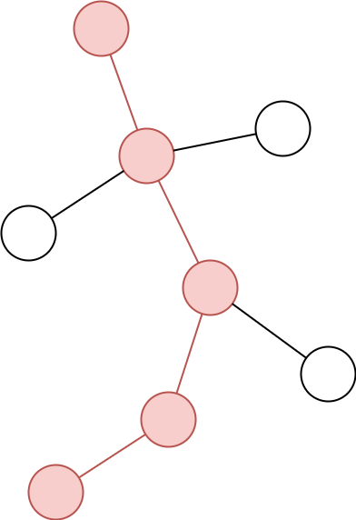

## 直径

树上的一条最长的路径。


---

## 如何看待直径


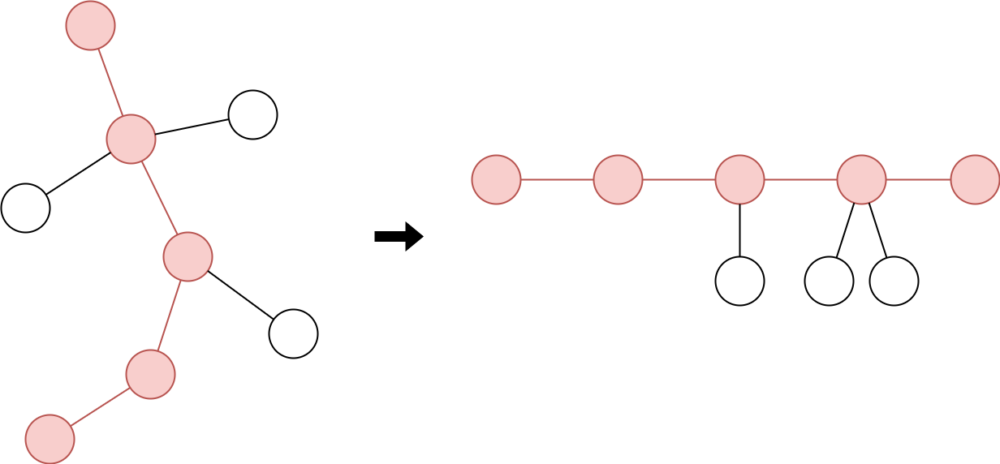


---

## 如何看待直径


- 把直径水平放置
- 剩余部分成为以直径上的点为根的子树

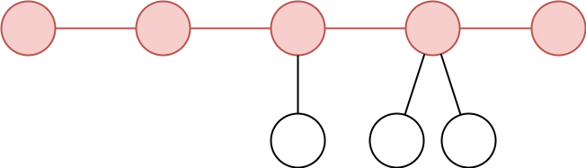

---

## 如何看待直径

- 虚线下面没有顶点

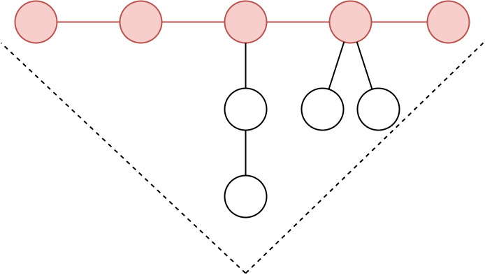

---

## 如何看待直径

- 虚线下面没有顶点

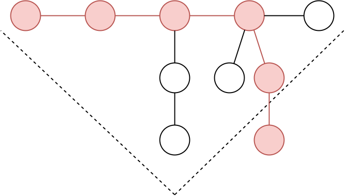

→ 红色的部分是直径

---

## 直径的性质

- 如果我们寻找距离某个点 $x$ 最远的点……

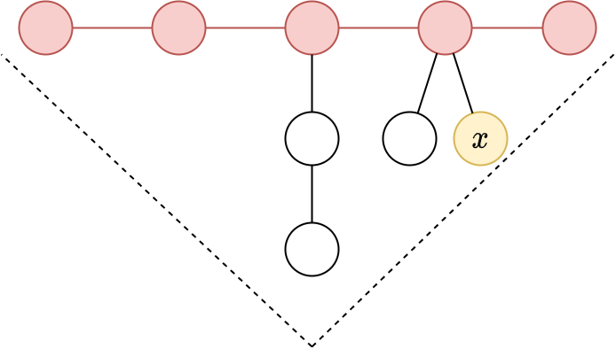

---

## 直径的性质

- 对于任意顶点 $x$，直径的某个端点一定是距离 $x$ 最远的点。

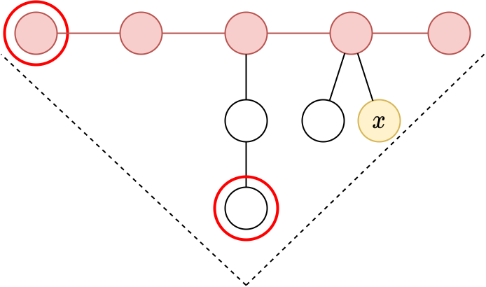


---

## 直径的性质

- 对于任意顶点 $x$，直径的某个端点一定是距离 $x$ 最远的点。

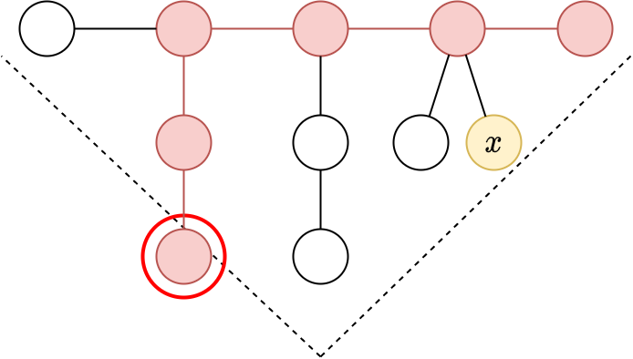

→ 红色的部分才是直径

---

## 求直径的方法

- 对于任意顶点 $x$，直径的某个端点一定是距离 $x$ 最远的点。

→ 反过来，对于任意顶点 $x$，任何一个距离 $x$ 最远的点一定是直径的端点。


---

## 求直径的方法

- 一旦找到了直径的一个端点，由于直径是最长的路径，距离那个点最远的点就是直径的另一个端点。


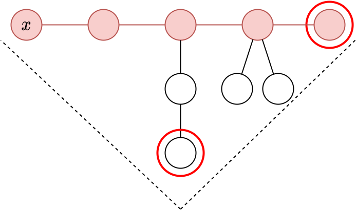

---

## 求直径的方法


1. 任选一个顶点 $a$。
2. 用 BFS 找出一个距离点 $a$ 最远的点，设它是顶点 $b$。
3. 用 BFS 找出一个距离点 $b$ 最远的点，设它是顶点 $c$。
4. 路径 $b$ — $c$ 就是直径。

时间 $O(N)$

---

## 问题

这个树的直径有哪些？

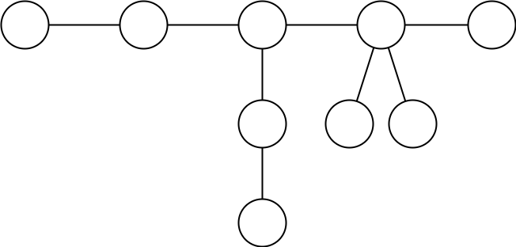

---

## 树的中心（直径长度是偶数时）

* 直径中心的那个顶点。
* 所有直径都经过树的中心。

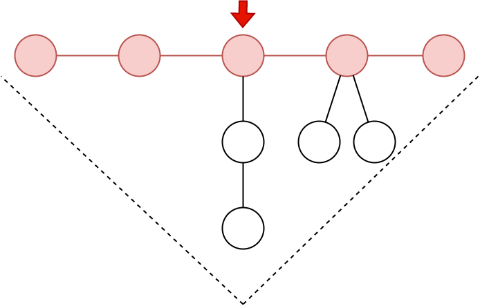

---

## 树的中心（直径长度是 $2h$ 时）

- 一些以中心为根的高度不超过 $h$ 的子树。

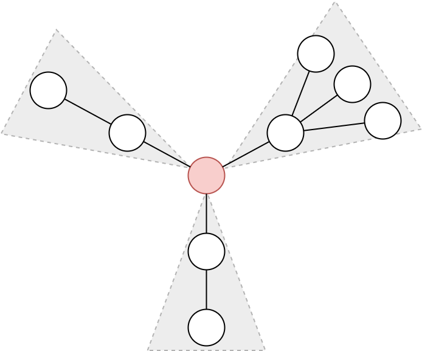

直径的个数？

---

## 树的中心（直径长度是 $2h$ 时）

- 一些以中心为根的高度不超过 $h$ 的子树。


直径的个数？

→ 从两个不同的子树中各选一个深度是 $h$ 的点，选择的方法数。

${1\over 2}\left((\sum_i c_i)^2 - \sum_i c_i^2\right)$

$c_i$：第一个子树里，深度是 $h$ 的点的个数。

---

## 树的中心（直径长度是奇数时）

- 直径中心的那条边

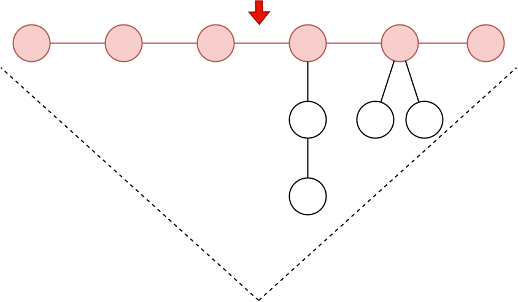

---


## 树的中心（直径长度是 $2h + 1$ 时）

- 直径中心的那条边
- 所有直径都通过树的中心

→ 由于虚线的限制，不通过树的中心的路径，长度不超过 $2h$。


---

## 树的中心（直径长度是 $2h + 1$ 时）

- 由中心和以中心的端点为根的两个高度等于 $h$ 的子树组成的结构。

直径的个数？

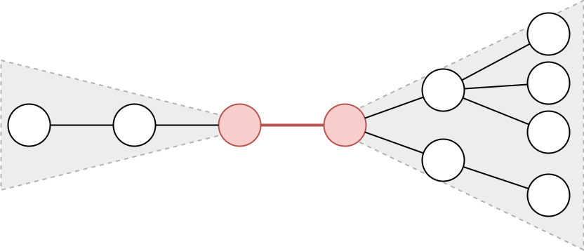

→ (左侧深度等于 $h$ 的顶点个数) $\times$ (右侧深度等于 $h$ 的顶点个数）


---

## 树的直径和中心另一种看法

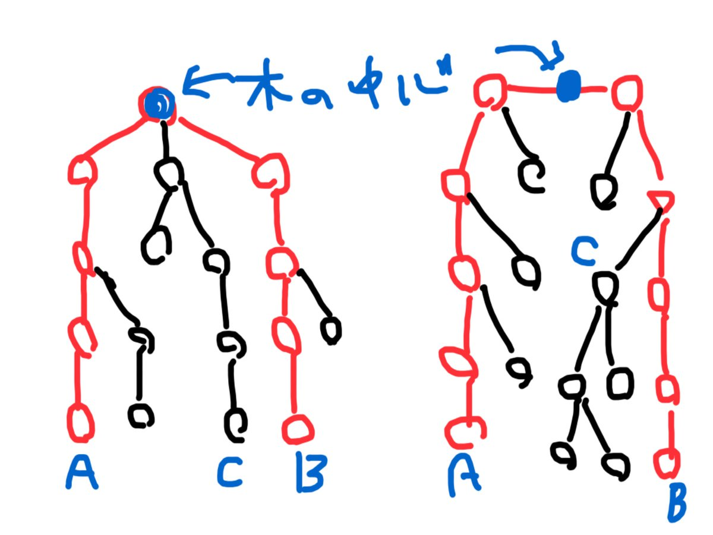

---

# 树的重心

---


## 重心是什么？

- 如果我们把某个顶点 $v$ 从树中删除……

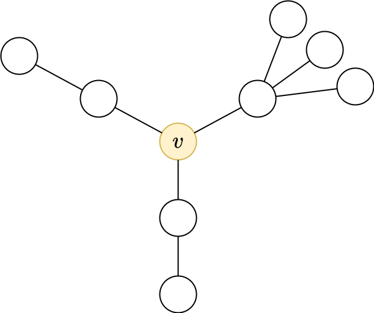


---

## 重心是什么？

- 如果把某个顶点 $v$ 从树中删除，树会分解成若干连通块。
- 使各连通块的 size 的最大值
（$\max\set{2,2,4} = 4$）最小的顶点 $v$ 就是树的重心。
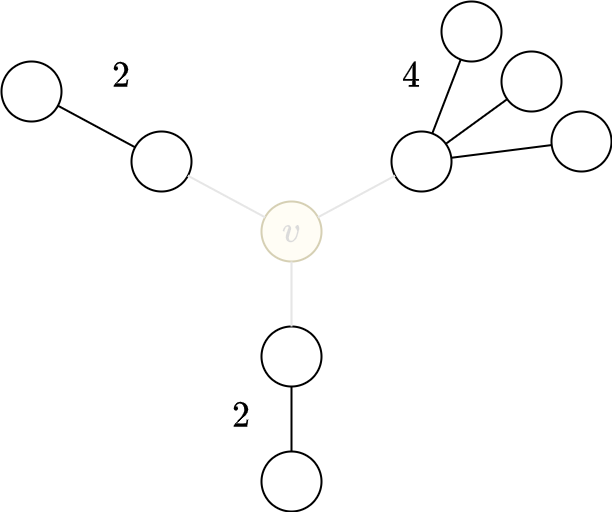

---

## 重心只有一个的情形


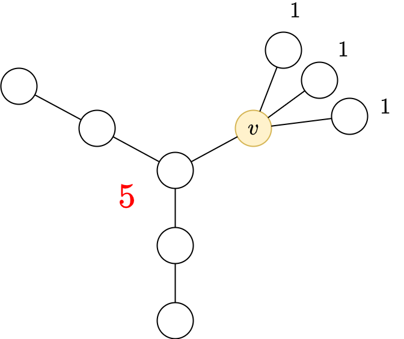

- 如果把某个顶点 $v$ 从树中删除，树会分解成若干连通块。
- 使各连通块的 size 的最大值
（$\max\set{2,2,4} = 4$）最小的顶点 $v$ 就是树的重心。

重心只有一个 $\implies$ 若把 $v$ 向最大的连通块（size 4）的方法移动一步，将造成一个更大的连通块（size 5）

$\implies$ 最大连通块（size 4）的大小不到整个树（size 9）的一半。

如果不是这样，是什么情形呢？

---

## 重心有两个的情形

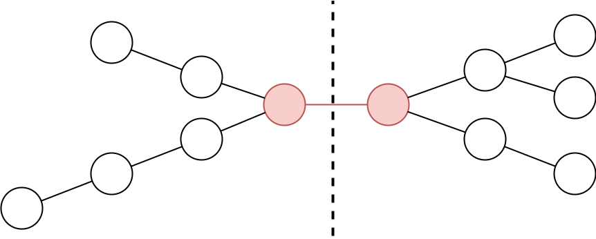

- 若重心不止一个，则有一条边把图分成大小相同的两半。
- 此时有两个重心。
- 有时候把中间那条边当作重心更为方便。

---

## 重心是什么？（再谈）

- 如果把某个顶点 $v$ 从树中删除，树会分解成若干连通块。
- 使各连通块的 size 的最大值
（$\max\set{2,2,4} = 4$）最小的顶点 $v$ 就是树的重心。

- 顶点 $v$，删除它之后，**最大的连通块的大小不超过整个树大小的一半**，就是重心。

（这两个定义等价）

---

## 重心的性质

- **删除重心之后，剩下的每个连通块的大小不超过原来树大小的一半**

---

## 重心的求法

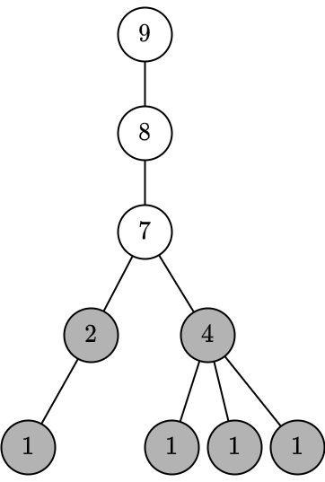

1. 任选一个点作为根，考虑有根树。
2. 求出每个子树的 size
3. 子树 size 不到整个树 size 一半的顶点不是重心。

---

## 重心的求法

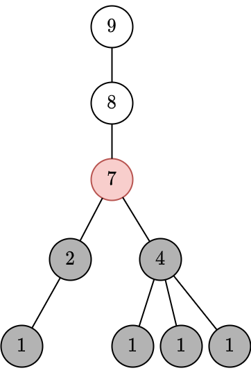

1. 任选一个点作为根，考虑有根树。
2. 求出每个子树的 size
3. 子树 size 不到整个树 size 一半的顶点不是重心。
4. 剩下的顶点中，子树 size 最小点的那个是重心。
5. 如果这个点的子树 size 恰是整个树的一半，那么它的父节点也是重心。

---

## 重心的求法

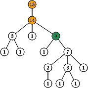

1. 任选一个点作为根，考虑有根树。
2. 求出每个子树的 size。
3. 从根出发，走到重心。
    - 若当点有一个子节点 size 超过整个树的一半，走到那个点。
    - 否则当前点就是重心，结束。

---

## 重心的求法

```cpp
vector<int> g[maxn];
int sz[maxn];
void get_size(int u, int p) {
    sz[u] = 1;
    for (int v : g[u])
        if (v != p) {
            dfs(v, u);
            sz[u] += sz[v];
        }
}

int n;
int centroid(int u, int p) {
    for (int v : g[u])
        if (v != p && sz[v] * 2 > n)
            return centroid(v, u);
    return u;
}
```

---

# 例题 树的重心

洛谷[P5666](https://www.luogu.com.cn/problem/P5666)

给你一个有 $n$ 个点树。点从 $1$ 到 $n$ 编号。
删除一条边后，分裂成两个子树。这样的树有 $2(n-1)$ 个。
求这些树的重心的编号之和。若一个树有两个重心，两个都算。

一个测试点有 $T$ 组数据。

- $1 \le T \le 5$
- $7 \le n \le 299995$


---


<!-- 对于有根树，我们把点 u 的 size 子树 u 的 size 视作同义词。 -->

<div class=proposition>

设 $u$ 是一个有根树的任意一点。那么 $u$ 是树的重心当且仅当点 $u$ 的 size 不小于整个树大小的一半，且点 $u$ 的每个孩子的 size 都不超过整个树 size 的一半。

</div>

---

## 记号、术语

对于有根树里的一个点 $u$，
- 把点 $u$ 的 size 记作 $\sz(u)$，
- 把点 $u$ 的 size 最大的孩子的 size 记作 $h(u)$。
- 设 $v$ 是 $u$ 的孩子，把子树 $v$ 叫作「$u$ 的子树 $v$」。

---

考虑以点 $1$ 为根的有根树。设删除的边是点 $k$ 的父边（$k\ne 1$），那么删除这条边后，分裂成的两块，一块是子树 $k$，另一块不妨称之为「剩余部分」。

对于每个点 $u$，我们计算有多少个点 $k$ 使得 $u$ 是某一部分的重心。
为此，我们分别两种情形
- $u$ 子树 $k$ 的重心。此时 $k$ 是 $u$ 的祖先。
- $u$ 是剩余部分的祖先。此时 $k$ 不是 $u$ 的祖先。

<!-- u 是求和指标，k 是计数对象。 -->

---

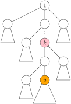

情况一：$k$ 是 $u$ 的祖先，$u$ 是子树 $k$ 的重心。

需要有 $\sz(u) \ge \sz(k) / 2$ 且 $h(u) \le \sz(k)/2$，即点 $k$ 需要满足
$$
2 \cdot h(u) \le \sz(k) \le 2 \sz(u).
$$

---

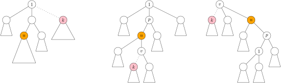

情况二：$k$ 不是 $u$ 的祖先，$u$ 是剩余部分的重心。此时还要细分

- $k$ 不是 $u$ 的后代。此时需要有 $2 \cdot h(u) \le n - \sz(k) \le 2 \sz(u)$，即点 $k$ 需要满足
    $$
    n - 2 \sz(u) \le \sz(k) \le n - 2 \cdot h(u).
    $$
- $k$ 是 $u$ 的严格后代。如果仍然把剩余部分视作以点 $1$ 为根的有根树，那么 $\sz(u)$ 和 $h(u)$ 就不再是跟 $k$ 无关的了。此时，设 $k$ 在 $u$ 的子树 $v$ 里，我们不妨把剩余部分视作以 $v$ 为根的有根树，这样 $h(u)$ 和 $\sz(u)$ 就跟 $k$ 无关了（但是跟 $v$ 有关）。

---

对于 $k$ 不是 $u$ 的严格后代的情况，为了能快速算出以 $v$ 为根时的 $h(u)$，我们需要
- 以点 $1$ 为根时的 $h(u)$。
- 以点 $1$ 为根时点 $u$ 的第二大的子树的 size。

```cpp
vector<int> g[maxn];
int sz[maxn], h[maxn], h2[maxn];
void get_size(int u, int p) {
    sz[u] = 1; h[u] = 0, h2[u] = 0;
    for (int v : g[u]) {
        if (v != p) {
            get_size(v, u);
            sz[u] += sz[v];
            if (sz[v] > h[u]) {
                h2[u] = h[u]; h[u] = sz[v];
            } else if (sz[v] > h2[u])
                h2[u] = sz[v];
        }
    }
}
```

---

对于我们要数的东西（计数对象），点 $v$，要们想要知道满足 $\sz(v)$ 在某个范围内的点 $v$ 有多少个。为此，我们使用一个**树状数组**。

```cpp
int a[maxn];
int n;
void add(int p, int v) {
    while (p <= n) {
        a[p] += v;
        p += p & -p;
    }
}
int sum(int p) {
    if (p < 0) return 0;
    if (p > n) p = n;
    int ans = 0;
    while (p > 0) {
        ans += a[p];
        p -= p & -p;
    }
    return ans;
}
int sum(int l, int r) {
    return sum(r) - sum(l - 1);
}
```

---

对于每个点 $u$，我们需要它的祖先中有多少点 $v$ 满足 $\sz(v)$ 在某个范围内。为此，在 DFS 的过程中，我们维护当前点的祖先（根除外）的 size 的列表。

这个列表是有序的，我们可以在上面**二分查找**。

```cpp
vector<int> anc;

int cnt_anc(int L, int R) {//anc是一个递减的序列
    return upper_bound(anc.rbegin(), anc.rend(), R)
        - lower_bound(anc.rbegin(), anc.rend(), L);
}
```

---

```cpp
int cnt[maxn]; // cnt[u]：点u做重心的次数。
void dfs(int u, int p) {
    if (p) {
        anc.push_back(sz[u]);
        add(sz[u], 1);
    }
    // case 1
    cnt[u] += cnt_anc(2 * h[u], 2 * sz[u]);
    // case 2
    int L = n - 2 * sz[u]; int R = n - 2 * h[u];
    // 去掉u的祖先的中满足条件的v
    cnt[u] -= cnt_anc(L, R);
    for (int v : g[u]) {
        if (v == p) continue;
        int new_h = (sz[v] == h[u] ? max(h2[u], n - sz[u]) 
                                : max(h[u], n - sz[u]));
        int new_sz = n - sz[v];
        int new_L = n - 2 * new_sz; int new_R = n - 2 * new_h;
        cnt[u] -= sum(new_L, new_R);
        cnt[u] += sum(L, R);
        dfs(v, u);
        cnt[u] -= sum(L, R);
        cnt[u] += sum(new_L, new_R);
    }
    if (p) anc.pop_back();
}
```

---

```cpp
int main() {
    int T; cin >> T;
    while (T--) {
        cin >> n;
        for (int i = 1; i <= n; i++) {
            g[i].clear();
            cnt[i] = 0;
            a[i] = 0;
        }
        for (int i = 0; i < n - 1; i++) {
            int u, v; cin >> u >> v;
            g[u].push_back(v);
            g[v].push_back(u);
        }

        get_size(1, 0);
        dfs(1, 0);

        long long ans = 0;
        for (int u = 1; u <= n; u++) {
            int L = n - 2 * sz[u];
            int R = n - 2 * h[u];
            cnt[u] += sum(L, R);
            ans += (long long) u * cnt[u];
        }
        cout << ans << '\n';
    }
}
```

---


## 重心的性质

重心到每个点的距离之和最小。

<div class=proposition>

考虑一个有 $N$ 个点树，对树上每个点 $v$，定义
$$
D(v) := \sum_{i=1}^{N} d(v, i).
$$
其中 $d(v, i)$ 表示点 $v$ 和点 $i$ 的距离。

那么，当且仅当 $v$ 是树的重心时 $D(v)$ 取到最小值。
</div>

证明？

---

## 问题

有一个有 $N$ 个点的树、每个点上有一个人，人 $i$ 在点 $i$ 上。选择一个 $1$ 到 $N$ 的排列 $P=(P_1, P_2, \dots, P_N)$。对于每个 $i$，人 $i$ 从点 $i$ 移动到点 $P_i$，费用是每个人的移动距离之和。求费用的最大值。


---

# 重心分解


---

## 分解

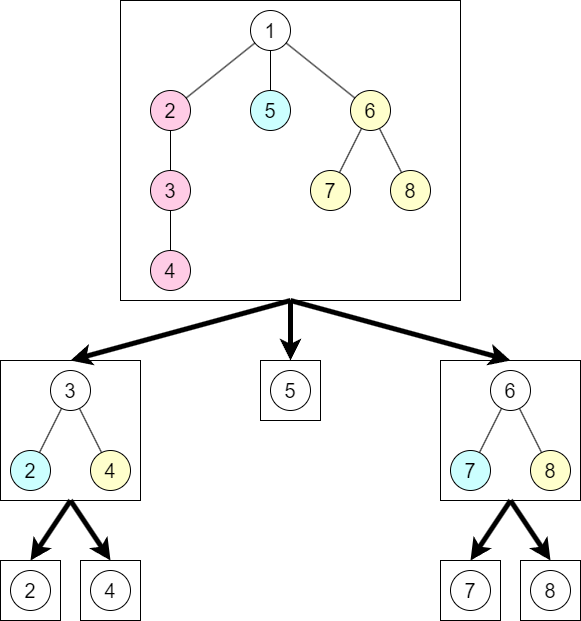

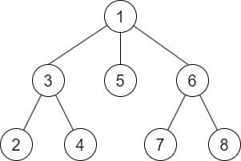

---

## 性质

1. 重心树的高度不超过 $\log n$。 
2. 点 $u$ 在它（重心树上）的祖先的连通块里。
3. 每一条从 $u$ 到 $v$ 的路径可以分解成两段，$u \leadsto w$ 和 $w \leadsto v$，其中 $w$ 是 $u$ 和 $v$ 在重心树上的最近公共祖先。