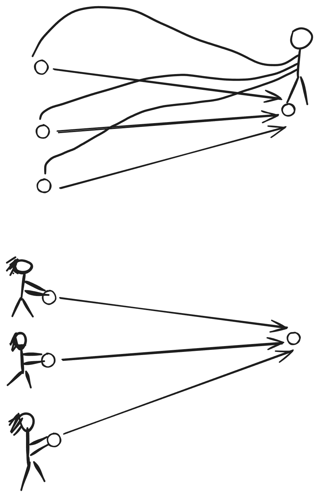
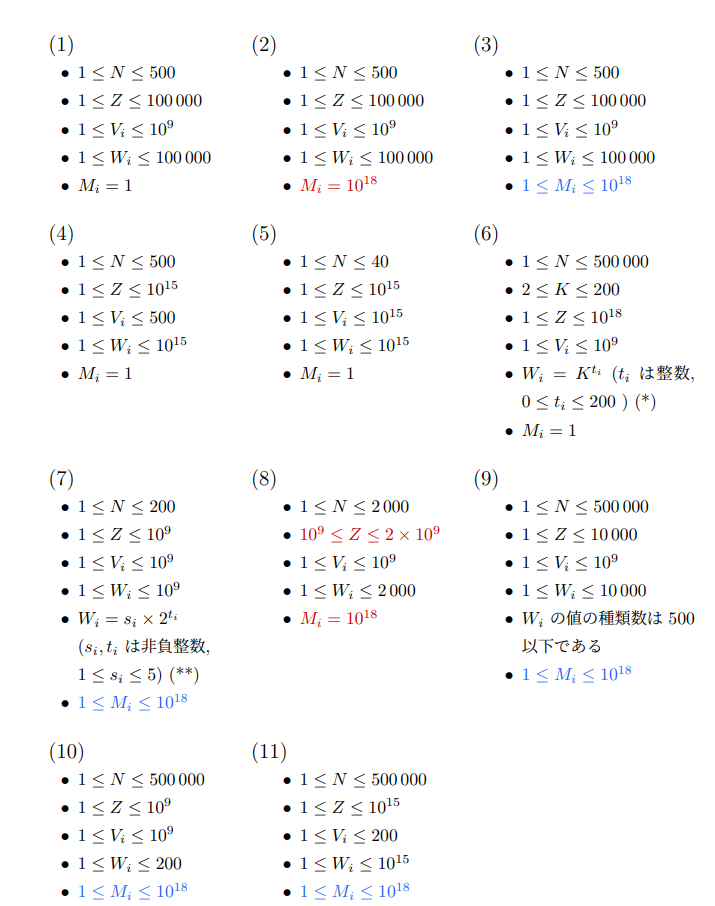

# 递推法/动态规划

---

# 目录

- 概述
- 背包类型动态规划

---


递推法常常用来解决
- 计数问题
- 组合最优化问题

<div class=hidden>

$\DeclareMathOperator{\lca}{lca}$
$\DeclareMathOperator{\size}{size}$

</div>

---

# <ruby>动态规划<rt>dynamic programming，DP</rt></ruby>

一种解题技术和算法设计方法。

- 狭义：用**子问题递推**的方法解决组合最优化问题。
- 广义：和递推法是同义词。

---


# 递推三要素

- 子问题（状态）
- 递推式（状态转移）
- 边界条件（边界状态）

> :warning: 这不是递推法/DP 的第一课，我们不会从头讲起。

---


有 $N$ 个东西排成一行，要从中选一些，可以一个也不选。相邻的两个东西不能都选。有多少种方法？

---

# 解法：递推

<div class="labeled-box">
  <span class="box-label">子问题</span>

从前 $i$ 个东西里选一些，相邻两个不能都选，有多少种方法？
这里，$i = 0, 1, 2, \dots, N$。
把答案记作 $f[i]$。
</div>

目标：$f[N]$。

边界条件：$f[0] = 1$，$f[1] = 2$。

递推式：$f[i] = f[i-1] + f[i-2]$，$i \ge 2$。


---

<!-- header: https://bs.daimayuan.top/p/112 -->
# 例题：构造序列

给你一个长为 $N$ 的整数序列 $T=(T_1, \dots, T_N)$。序列 $S$ 初始为空，我们要通过下列两种操作把 $S$ 变成 $T$。

-   批量添加：选定任意非负整数 $k,x$，在 $S$ 末尾添加 $k$ 个 $x$，花费 $A$ 个金币。
-   连续添加：选定任意非负整数 $k,x$，在 $S$ 末尾添加 $k$ 个从 $x$ 开始的连续整数，（即 $x, x + 1, \dots, x+k-1$），花费 $B$ 个金币。
    
求把 $S$ 变成 $T$ 最少要花多少个金币。

###### 限制

- $1 \leq N \leq 10^6$
- $1 \leq A, B ,T_i \leq 10^9$。


---

<!-- header: "" -->

# 递推

<div class="labeled-box">
<span class="box-label">子问题</span>

把 $S$ 变成 $(T_1, \dots, T_i)$ 最少要花多少金币。
这里 $i = 0, 1, \dots, N$。把答案记作 $f[i]$。
</div>

目标：$f[N]$

边界条件：$f[0] = 0$

怎么找递推式？

---

# 递推式

考虑把 $S$ 变成 $(T_1, \dots, T_i)$ 的**最后一步**。
有「批量添加」和「连续添加」两个选择，但是添加多少项却有 $i$ 个选择。
注意到
- 操作的费用和添加的项数无关
- $f[j] \le f[j + 1]$（$0 \le j < N$）

所以添加的项数越大越好。

---

# 阿弥陀签

又称鬼脚图、爬梯游戏，是一种游戏，也是一种简易决策方法，常被拿作抽签或决定分配组合。

先画几条平行的竖线，再画一些横线，每条横线连接相邻两条竖线。两条横线不能相交。

玩法：
1. 把画的横线盖住，选一条竖线。
2. 揭开盖子，从所选竖线的上端往下走，遇到横线就走过去，直到走到某条竖线的下端。

.png)

---

# 例题：阿弥陀签的数量

有 $W$ 条长度是 $H + 1$ 厘米的竖线，要画一些横线做成一个阿弥陀签。每条横线的两端点到竖线上端的距离必须是 $1$，$2$，……，或 $H$ 厘米。有多少种画法满足：
- 从第一条竖线的上端出发最后会走到第 $K$ 条竖线的下端。

输出答案模 $10^9+7$。

<div class=col37>
<div>

###### 限制

- $1 \le H \le 100$
- $1 \le W \le 8$
- $1 \le K \le W$

</div>
<div>

###### 样例


</div>


---

# 位置，一步


用一对整数 $(i, j)$ 表示**位置**：在第 $j$ 条竖线上，距离竖线的上端 $i$ 厘米。
$0 \le i \le H$，$1 \le j \le W$。

初始位置 $(0, 1)$，目标位置 $(H, K)$。

设当前位置是 $(i, j)$，称下述动作为**一步**
- 向下移动 1 厘米，到 $(i + 1, j)$。若 $(i+1,j)$ 处有横线，就沿着横线走过去。


---

# 递推

各行相互**独立**。从上到下考虑每一行。
<div class=labeled-box>
<span class=box-label> 子问题 </span>

$f[i][j]$：对前 $i$ 行，有多少种画法使得
- 从 $(0, 1)$ 经过 $i$ **步**到达 $(i, j)$。
</div>

边界条件：$f[0][1] = 1$。

转移：


---

<!-- header: https://bs.daimayuan.top/p/159 -->

# 例题：勇者斗恶龙

apiadu 正在与一头巨龙进行决战。这场战斗将持续 $n$ 个回合。
在第 $i$ 个回合，apiadu 可以从以下两种行动中选择一个：
- 提高攻击力：apiadu 花费整个回合来念咒，这会使他的攻击力永久提升 $a_i$ 点。
- 攻击：apiadu 释放一道冲击波攻击巨龙。冲击波的伤害值为他当前的攻击力 + $b_i$。

apiadu 的初始攻击力为 $0$。他的目标是合理安排每个回合的行动，使得在 $n$ 回合结束后，对巨龙造成的总伤害最高。

请你帮他计算能造成的最多伤害。

$1 \le n \le 3000$
$1 \le a_i, b_i \le 10^9$

---

<!-- header: "" -->



# DP 的两种实现方式


- 后向DP（填表法，pull DP）
- 前向DP（刷表法，push DP）

---

# 在各种结构上使用动态规划

- 序列
- 网格
- 树
- ……

---

# 序列上的动态规划

序列有两种子结构，前缀（用一个参数描述）和区间（用两个参数描述）。

- 用前缀定义子问题
- 用区间定义子问题

---

# 背包类型动态规划



---

<!-- footer: https://atcoder.jp/contests/dp/tasks/dp_e -->

# 例题：Knapsack 2

有 $N$ 个物品。编号 $1, 2,\dots, N$。第 $i$ 个物品的重量是 $w_i$，价值是 $v_i$。

太郎要从 $N$ 个物品中选一些放进背包带回家。背包的容量是 $W$，这意味着所选物品的重量之和不能超过 $W$。

求所选物品的价值之和的最大值。

<div class=columns><div>

###### 限制

- $1 \le N \le 100$
- $1 \le W \le 10^9$
- $1 \le w_i \le W$
- $1 \le v_i \le 10^3$
- 以上值都是整数。

</div> <div>

> 虽然这是个古老的问题，也许有人不知道，这里再提一下。

</div></div>

---

<!-- footer: "" -->

<div class=labeled-box>
<span class=box-label>子问题</span>

从前 $i$ 个物品中选一些，所选物品的总重量不超过 $j$，所选物品的总价值的最大值。
 </div>

这里，$0 \le i \le N$，$0 \le j \le W$，子问题有 $(N+1)(W + 1)$ 个，太多了。

---


注意到 $v_i \le 10^3$，$N \le 100$，这意味着全部物品的价值之和不超过 $10^5$。

<div class=labeled-box>
<span class=box-label>新的子问题</span>

从前 $i$ 个物品中选一些，所选物品的总价值等于 $j$，所选物品的**总重量的最小值**。
 </div>


这里，$0 \le i \le N$，$0 \le j \le 10^5$。

把这个问题的答案记作 $f[i][j]$，若无法做到，令 $f[i][j] = W + 1$。

边界条件：$f[0][0] = 0$，$f[0][j] = W + 1$，$j = 1, \dots, 10^5$。

递推式：对 $i = 1, \dots, N$，有
$$
f[i][j] = 
\begin{cases}
f[i - 1][j], & 0 \le j < v_i, \\
\min(f[i-1][j], f[i-1][j-v_i] + w_i), & v_i \le j \le 10^5.
\end{cases}
$$

---

<!-- footer: https://www.luogu.com.cn/problem/P14360 -->

# 例题：多边形 [CSP-J 2025]

有 $n$ 根木棍，第 $i$ 根木棍的长度是 $a_i$，要从中选择一些木棍拼成一个多边形，有多少种选法？

两种方案不同当且仅当选择的木棍的**下标集合不同**，即存在 $i$（$1 \le i \le n$），使得其中一种方案选择了第 $i$ 根木棍，但另一种方案未选择。

$m$ 根木棍，长度为 $l_1, l_2, \dots, l_m$，能拼成一个多边形当且仅当 $m \ge 3$ 且所有木棍的长度之和**大于**所有木棍的长度的最大值的两倍，即 $\sum_{i=1}^{m} l_i \ge 2 \times \max_{i=1}^{m} l_i$。

###### 限制

- $3 \le n \le 5000$
- $1 \le a_i \le 5000$


---

<!-- footer: "" -->

# 解法

所有木棍的长度之和大于所有木棍的长度的最大值的两倍，即
- 除了最长木棍之外的木棍的总长度大于最长木棍的长度。

把木棍按长度从小到大排序，以下假设有 $a_1 \le a_2 \le \dots \le a_n$。

设所选的编号最大的那一根木棍，也就是最长的那一根，的编号是 $i$，问题变成
- 从前 $i-1$ 根木棍中选一些，所选木棍的长度之和不小于 $a_{i} + 1$，有多少种选法。

---

  考虑 DP。

<div class=labeled-box> <span class=box-label>子问题</span>

$f[i][j]$：从前 $i$ 根木棍中选一些，所选木棍的长度之和不小于 $j$，有多少种选法。
 </div>

$0 \le i \le n - 1$，$0 \le j \le 5001$

边界条件
$f[0][j] = \begin{cases} 1, & j = 0; \\ 0, & 1 \le j \le 5001. \end{cases}$

递推式
$f[i][j] = \begin{cases} f[i-1][j] + f[i-1][0], & 0 \le j \le a_i -1; \\ f[i-1][j] + f[i-1][j - a_i], & a_i \le j \le 5001. \end{cases}$

最终答案
$\sum_{i=1}^{n} f[i-1][a_i + 1]$。

---

# 例题：盒饭 2

高桥为 Snuke 准备了 $N$ 个盒饭，从 $1$ 到 $N$ 编号。盒饭 $i$ 里有 $A_i$ 个鱼丸和 $B_i$ 个肉丸。

高桥可以把这些盒饭任意排列。Snuke 会按高桥排好的顺序吃这些盒饭，吃完一个盒饭之后，如果 Snuke 吃的鱼丸的总数**大于** $X$ 或者吃的肉丸的总数**大于** $Y$，Snuke 就不能再吃了。


高桥想让 Snuke 吃掉的盒饭的数量尽可能多。求 Snuke 最多能吃掉多少个盒饭。

###### 限制

- $1 \leq N \leq 80$
- $1 \leq A_i, B_i \leq 10000$
- $1 \leq X, Y \leq 10000$

---

# 分析

Snuke 至少吃一个盒饭。
在吃最后一个盒饭之前，他吃的鱼丸不超过 $X$ 个，肉丸不超过 $Y$ 个。

假设在吃的鱼丸不超过 $X$ 个且肉丸不超过 $Y$ 个的前提下 Snuke 最多能吃 $C$ 个盒饭，那么实际上他最多能吃 $\min(N, C + 1)$ 个盒饭。

我们可以用背包类型的动态规划来求 $C$。

<div class=labeled-box><span class=box-label>子问题</span>

$f[i][j][k]$：从前 $i$ 个盒饭中选 $j$ 个吃掉，吃和鱼丸总数不超过 $k$，吃的肉丸总数的最小值。
</div>

$C$ 就是满足 $f[N][j][X] \le Y$ 的最大的整数 $j$。

---

<!-- # [abc375_e](https://atcoder.jp/contests/abc375/tasks/abc375_e) 3 Team Division -->

# 例题：分成三队

有 $N$ 个人分成了三队。人编号 $1, 2, \dots, N$，队编号 $1, 2, 3$。现在，人 $i$ 属于队 $A_i$。

每人有一个强度值，人 $i$ 的强度是 $B_i$。一个队的强度定义为其成员的强度之和。判断能否通过改变某些人所属的队使得三个队的强度相同。若可能，输出最少要几个人换队。否则输出 $-1$。

###### 限制

- $3 \le N \le 100$
- $A_i \in \set{1, 2, 3}$
- $1 \le B_i$
- $\sum_{i=1}^{N} B_i \le 1500$
- 上述值都是整数。

<!-- footer: https://atcoder.jp/contests/abc375/tasks/abc375_e -->

---

# 分析

必要条件 1：$3$ 整除 $\sum_{i=1}^{N} B_i$。

令 $M = (\sum_{i=1}^{N} B_i) / 3$。注意到 $M \le 500$。

必要条件 2：$\max_{i=1}^{N} B_i \le M$。

<!-- footer: "" -->

---

<div class=labeled-box><span class=box-label>子问题</span>

把前 $i$ 个人分到三个队，1 队的强度是 $j$，2 队的强度是 $k$，最少有几个人换队？
</div>


把它的答案记作 $f[i][j][k]$。若无法做到，令 $f[i][j][k] = N + 1$。
这里 $0 \le i \le N$，$0 \le j , k \le M$。

目标：$f[N][M][M]$。

边界条件：$f[0][0][0] = 0$，$f[0][i][j] = N + 1$，$i \ne 0$ 或 $j\ne 0$。

递推式：
$$
f[i][j][k] = \min\begin{cases}
f[i - 1][j - B_i][k] + [A_i \ne 1],\quad B_i \le j \\
f[i - 1][j][k - B_i] + [A_i \ne 2],\quad B_i \le k \\
f[i - 1][j][k] + [A_i \ne 3]
\end{cases}
$$


---

# 例题：Diversity

<div class="col73"><div>

商店里有 $N$ 个商品在售，第 $i$ 个商品的价格是 $P_i$ 元，效用是 $U_i$，颜色是 $C_i$。

你要从这些商品中买一些（可以一个都不买）。所买物品的价格之和不得超过 $X$ 元。

你的满意度是 $S+T\times K$，其中 $S$ 是所买物品的效用之和，$T$ 是所买物品的不同颜色的数量，$K$ 是给定的常数。

求最大满意度。


</div><div>

###### 限制

- $1 \le N \le 500$
- $1 \le X \le 50000$
- $1 \le K \le 10^9$
- $1 \le P_i \le X$
- $1 \le U_i \le 10^9$
- $1 \le C_i \le N$
- 上述值都是整数。
</div></div>

<!-- footer: https://atcoder.jp/contests/abc383/tasks/abc383_f  -->

---

<!-- footer: "" -->

# 思路一

把 $N$ 个商品按颜色排列，颜色相同的排一起。

<div class=labeled-box><span class=box-label>子问题</span>

$f[i][j]$：从前 $i$ 个商品里选一些，所选商品的总价格不超过 $j$，满意度的最大值。
</div>


考虑两种情况：
1. 不买商品 $i$，归结为 $f[i - 1][j]$。
2. 买商品 $i$。设商品 $i$ 的颜色是 $c$。分两种情况：
    1. 商品 $i$ 是买的第一个颜色为 $c$ 的商品。设上一种颜色的最后一个商品是第 $i'$ 个，归结为 $f[i'][j - P_i] + U_i + K$。
    2. 商品 $i$ 不是买的第一个颜色为 $c$ 的商品。归结为 $f[i - 1][j - P_i] + U_i$。

---


# 思路二

把物品按颜色分组。一次处理一批同色的物品。


<div class=labeled-box><span class=box-label>子问题</span>

从颜色是 $1, 2, \dots, i$ 的物品中选一些，所选物品的总价不超过 $j$，满意度的最大值？

把答案记作 $f[i][j]$。这里，$0 \le i \le N$，$0 \le j \le X$。
</div>


目标：$f[N][X]$。

边界条件：$f[0][j] = 0$，$0 \le j \le X$。

递推式：
对每种颜色 $i = 1, \dots, N$，
1. 置 $f[i][j] = f[i - 1][j]$，$0 \le j \le X$。
2. 对每个颜色是 $i$ 的物品 $(P, U)$，按 $j = X, X - 1, \dots, P$ 的顺序，置
$$
f[i][j] = \max(f[i][j], f[i - 1][j - P] + U + K, f[i][j - P] + U)
$$

---


# 例题：分组

给你 $N$ 个整数 $T_1, \dots, T_N$。要把它们分成若干组，每一组的极差之和不超过 $X$。求分组方法数，模 $10^9+7$。

一组整数的极差是最大值减最小值。

<div class=columns><div>

###### 限制

- $1 \le N \le 100$
- $0 \le X \le 5000$
- $0 \le T_i \le 100$

</div><div>

###### 样例

<div class=columns><div>

```
3 2
2 5 3
```

```
3
```

</div><div>

分组方法：
- (2), (3), (5)
- (2, 3), (5)
- (2), (3, 5)

</div></div>

</div></div>

---

把 $N$ 个数从大到小排序。

<div class=labeled-box><span class=box-label>子问题</span>

$f[i][j][k]$：对前 $i$ 个数分组，尚未分好的组（最小值尚未出现）有 $j$ 个，且满足
- 已分好的组的极差之和 + 未分好的组的最大值之和 ≤ $k$ 

有多少种方法？
</div>


注意到
- $0 \le i \le N$
- $0 \le j \le \lfloor N/2\rfloor \le 50$
- $0 \le k \le X + \lfloor N/2\rfloor \times \max(T_1, \dots, T_N) \le 10000$

目标：$f[N][0][X]$。

边界条件：$f[0][0][k] = 1$（$0 \le k \le X$），$f[0][j][\cdot] = 0$（$j \ne 0$）。

---


# 状态转移


---

# 例题：两场考试

$N$ 个人，从 $1$ 到 $N$ 编号，参加了国家队选拔考试。
考试有两场。第 $i$ 个人第一场考试的排名是 $P_i$，第二场考试的排名是 $Q_i$。每场考试都没有同分的，$P, Q$ 都是 $1, 2, \dots, N$ 的排列。

要选 $K$ 个人组国家队，选人规则是：
- 不能有两人 $(x, y)$ 满足 $P_x > P_y$ 且 $Q_x > Q_y$，$x$ 入选了而 $y$ 没入选。

求选人方案数，模 $998244353$。

###### 限制

- $1 \le K \le N \le 300$

---

# 思路

把 $N$ 个人按照第一场考试的排名从小到大（或者说从高到低）排序，按这个顺序写出每个人第二场考试的排名，把这个序列称为 $A$。不难看出 $A$ 是 $1, \dots, N$ 的一个排列。

例如，$P = (2, 4, 3, 1)$，$Q =(2, 1, 4, 3)$ 那么 $A = (3, 2, 4, 1)$。

问题变成
- 从序列 $A$ 中选 $K$ 项，满足：若选了 $A_i$ 那么 $A_i$ 左边比 $A_i$ 小的项都选了。或者说若没选 $A_i$ 那么 $A_i$ 右边比 $A_i$ 大的项都没有选。有多少种选法？

---

考虑 DP。

<div class=labeled-box><span class=box-label>子问题</span>

$f[i][j][k]$：从 $A_1, \dots, A_i$ 中选 $j$ 个数，没选数的数中最小的是 $k$，有多少种选法。
</div>


从 $f[i][j][k]$ 往后转移：
- 若 $A_{i+1} > k$，那么 $A_{i+1}$ 不能选，转移到 $f[i+1][j][k]$。
- 若 $A_{i+1} < k$，那么 $A_{i+1}$ 可选可不选。若选 $A_{i+1}$，转移到 $f[i+1][j + 1][k]$，否则转移到 $f[i+1][j][A_{i+1}]$。

---

# 例题：Candy

给定整数序列 $a= (a_1, a_2, \dots, a_{N})$，整数 $F$ 和整数 $T$。我们称交换 $a$ 里相邻的两项为一次**操作**。

要使 $a$ 的前 $F$ 项之和不小于 $T$，至少要进行多少次操作？

## 限制

- $1 \le N \le 100$
- $1 \le F \le N$
- $0 \le T \le 10^{11}$
- $0 \le a_i \le 10^9$（$1 \le i \le N$）

---

# 思路

设想我们已经选定了要放到前 $F$ 个位置的那 $F$ 个数，它们，在最初的序列 $a$ 里，是 $a_{i_1}, a_{i_2}, \dots, a_{i_F}$（$1 \le i_1 < i_2 < \dots < i_F \le N$）。

要把 $a_{i_1}, a_{i_2}, \dots, a_{i_F}$ 这 $F$ 个数移到前 $F$ 个位置，最少要操作多少次？

应该把 $a_{i_1}$ 移动到第 $1$ 位，把 $a_{i_2}$ 移动到第 $2$ 位，……，把 $a_{i_F}$ 移动到第 $F$ 位。
一共要操作 $(i_1 - 1) + (i_2 - 2) + \dots + (i_F - F)$ 次。


---

<div class=labeled-box><span class=box-label>子问题</span>

$f[i][j][k]$：从 $a_1, \dots, a_i$ 中选 $j$ 个数，把它们移动到前 $j$ 位需要操作 $k$ 次，所选的数之和的最大值。
</div>

$0 \le i \le N$，$0 \le j \le \min(i, F)$，$0 \le k \le (i - j)\cdot j$。


答案：满足 $f[N][F][k] \ge T$ 的最小的 $k$。

边界条件：
$f[i][0][0] = 0$
$f[i][0][k] = -\infty$（$k > 0$）
$f[0][j][k] = -\infty$（$j > 0$ 或 $k > 0$）

递推式：
$$
f[i][j][k] = 
\begin{cases}
f[i - 1][j][k], \quad & k < (i - j), \\
\max(f[i - 1][j][k], f[i - 1][j - 1][k - (i - j)] + a_i), \quad & k \ge (i - j).
\end{cases}
$$


---

# 例题：纪念品 :star:

已知未来 $T$ 天 $N$ 种纪念品每天的价格，第 $i$ 天第 $j$ 种纪念品的价格是 $P_{i,j}$。
每天，小明可以进行以下两种交易任意多次：
- 以当日价格买一个纪念品；
- 以当日价格卖出持有的一个纪念品。

每天卖出纪念品换回的金币可以立即用于购买纪念品。

小明会在第 $T$ 天卖出所有纪念品，他现在有 $M$ 枚金币，$T$ 天之后他最多有几枚金币？

###### 限制

- $T, N \leq 100$
- $1 \le P_{i,j} \le 10^4$
- $M \leq 10^3$
- 任意时刻，小明手上的金币数不超过$10^4$。

---

# 思路

「第一天买一个纪念品，第三天卖」相当于
「第一天买，第二天卖，第二天买，第三天卖」。

所有可能的操作都可变换为
- 第一天：买一些纪念品。
- 第二天：把第一天买的纪念品全卖出，再买一些纪念品。
- 第三天：把第二天买的纪念品全卖出，再买一些纪念品。
- ……
- 第 $T$ 天：把第 $T-1$ 天买的纪念品全卖出。

第一天买纪念品的目标应是让所买的纪念品在第二天卖出后收益最大。
- 解 $T-1$ 个**完全背包**问题。

---

# 例题：Emiya 家今天的饭 :star:

<!-- （CSP-S 2019 D2T1） -->

Emiya 掌握 $N$ 种**烹饪方法**，且会使用 $M$ 种**主要食材**做菜。

Emiya 做的每道菜都将使用**恰好一种**烹饪方法与**恰好一种**主要食材。Emiya 会做 $A_{i,j}$ 道不同的使用烹饪方法 $i$ 和主要食材 $j$ 的菜（$1 \leq i \leq N$、$1 \leq j \leq M$）。

Emiya 今天要做 $k$ 道菜，要满足下列条件
-  $k \geq 1$
- 每道菜的**烹饪方法互不相同**
- 每种**主要食材**至多在至多在**一半**的菜（即 $\lfloor \frac{k}{2} \rfloor$ 道菜）中被使用

求做菜方案数，模 $998244353$。

$1 \leq N \leq 100$
$1 \leq M \leq 2000$
$0 \leq A_{i,j} \lt 998244353$


---

# 思路

- 令 $S_i = A_{i,1} + A_{i,2} + \dots + A_{i,m}$。
- 满足条件一、二的做菜方案的数量为 $\left(\prod_{i=1}^{N} (S_i + 1)\right) - 1$。
- 考虑满足条件一、二但不满足条件三的做菜方案的数量。
    - 有主要食材在超过一半的菜中被使用。
    - 在超过一半的菜中被使用的主要食材只能有一种。

---

对于每一种主要食材 $x$（$1 \le x \le M$），计算 $x$ 使用次数超过一半的做菜方案。

<div class=labeled-box> <span class=box-label>子问题</span>

$f(i,j)$：从前 $i$ 个烹饪方法中选一些来做菜，主要食材是 $x$ 的菜与主要食材不是 $x$ 的菜数量之差是 $j$ 的做菜方案的数量。
</div>

$0 \le i \le N$，$-i \le j \le i$。

递推式
$$f(i,j) = f(i-1,j) + f(i-1,j-1) \times  a_{i,x} + f(i-1,j+1) \times (S_i - A_{i,x})$$

边界条件
$f(0,0) = 1$，$f(0,j) = 0$（$j \ne 0$）

---

<!-- # [abc288_e](https://atcoder.jp/contests/abc288/tasks/abc288_e) Wish List -->

# 例题：愿望清单

商店里有 $N$ 个商品，从 $1$ 到 $N$ 编号。商品 $i$ 的价格是 $A_i$ 元。
高桥想要 $M$ 个商品：商品 $X_1$，商品 $X_2$，…，商品 $X_M$。

他重复下述操作直到买齐他想要的商品。

> 令 $r$ 为当前尚未卖出去的商品的数量。选择一个整数 $j$ 满足 $1 \le j \le r$，买剩余物品中编号第 $j$ 小的那个物品，花的钱是那个物品的价格再加上 $C_j$ 元。

求高桥最少要花多少钱。

高桥也可以买他不想要的物品。

###### 限制

- $1 \le M \le N \le 5000$
- $1 \le A_i, C_i \le 10^9$
- $1 \le X_1 < X_2 < \dots < X_M \le N$

---

# 关键性质

- 编号大于 $X_M$ 的商品不影响高桥想买的物品的编号的排位，不用考虑。
不妨置 $N = X_M$。
- 何时买商品 $i$ 不影响对前 $i-1$ 个商品中任何一个的购买。
- 设最终在前 $i - 1$ 个商品中买了 $j$ 个，如果也买了商品 $i$，那么买它时，它的编号排名可以是 $i-j, i-j+1, \dots, i$ 中的任何一个。所以买商品 $i$ 的花费是 $A_{i} + \min_{i-j \le k \le i} C_k$。


---

<div class=labeled-box> <span class=box-label>子问题</span>

$f[i][j]$：在前 $i$ 个商品中买 $j$ 个，想要的商品的都买了，最少要花多少钱？
</div>


这里，$0 \le i \le N$，$0 \le j \le N$。
状态 $(i, j)$ 要满足
$$(前i个物品中必买的物品的数量) \le j \le i$$
才合理。
若状态 $(i,j)$ 不合理，令 $f[i][j] = \infty$。

目标：$\max_{M \le j \le N} f[N][j]$。

边界条件：$f[i][0] = 0$（$0 \le i < X_1$）

递推式：对 $1 \le i \le N$，$1 \le j \le N$
$$
f[i][j] = \begin{cases}
f[i - 1][j - 1] + A_{i} + \min_{i - (j-1) \le k \le i} C_k, \quad &商品 i 必买,\\
\min(f[i - 1][j], f[i-1][j-1] + A_{i} + \min_{i - (j-1) \le k \le i} C_k),\quad &商品 i 不必买.
\end{cases}
$$


---

# 例题：Goodstuff Deck Builder(Hard) 

[yukicoder 3077](https://yukicoder.me/problems/no/3077)

你在玩一个卡牌游戏。一开始，你有 $N$ 张卡牌，编号 $1$ 到 $N$，你可以用这些卡牌来攻击敌人。你还有 $M$ 点能量用来打出卡牌。

卡牌 $i$ 的初始费用是 $C_i$。打出卡牌 $i$ 消耗的能量等于它的费用，会对敌人造成 $D_i$ 点伤害。每打出一张牌后，剩下的牌的费用乘以 $2$。

一张牌只能用一次。不能让能量变成负数。

在以上规则下，你可以从手牌中任意选择若干张，按任意顺序使用。
计算你能造成的最大总伤害。

- $1 \le N \le 10^4$，$0 \le M \le 10^7$，$0 \le NM \le 2 \times 10^8$
- $0 \le C_i \le M$
- $1 \le D_i \le 10^9$


---

# 分析

<div class=labeled-box>

如果已经选定了要打出的牌，按什么顺序出牌消耗的能量最少？

按初始费用从高到低的顺序出牌。
</div>


把卡牌按初始费用从大到小排序。

考虑 DP。

<div class=labeled-box><span class=box-label>子问题</span>

$f[i][j][k]$：从前 $i$ 张牌中选 $j$ 张打出，消耗的能量不超过 $k$，最多能造成多少伤害？ 
</div>

$0 \le i \le N$，$0 \le j \le i$，$0 \le k \le M$。

状态太多。

---

# 优化

“每打出一张牌后，剩下的牌的费用乘以 $2$”，相当于“每打出一张牌后，剩下的牌的费用不变，玩家的能量减半”。

<div class=labeled-box><span class=box-label>新的子问题</span>

$f[i][j]$：从前 $i$ 张牌中选一些打出，剩余的能量是 $j$，最多能造成多少伤害？ 
</div>


---

<!-- # [abc373_f](https://atcoder.jp/contests/abc373/tasks/abc373_f) Knapsack with Diminishing Values -->

# 例题：价值衰减的背包问题


有 $N$ 种物品。第 $i$ 种物品的重量是 $w_i$ 价值是 $v_i$。每种物品有 $10^{10}$ 个。

高桥要选一些物品放进一个容量是 $W$ 的背包。他想让所选物品的价值之和最大又不想选太多个同种物品。于是他定义选 $k_i$ 个第 $i$ 种物品的满意度是 $k_i v_i - k_i^2$。

高桥想要选一些物品放进背包使得所有种类的总满意度最大而总重量不超过 $W$。求可以达到的最大总满意度。

###### 限制

- $1 \le N \le 3000$
- $1 \le W \le 3000$
- $1 \le w_i \le W$
- $1 \le v_i \le 10^9$

---


# 子问题

$f[i][j]$：从前 $i$ 种物品中选一些，所选物品的总重量不超过 $j$，总满意度的最大值。

最多能选 $\lfloor j/w_i \rfloor$ 个第 $i$ 种物品。有递推式

$$
f[i][j] = \max_{0 \le k \le \lfloor j/w_i \rfloor} f[i-1][j-kw_i] + kv_i - k^2.
$$

---

# 改写递推式

$$
f[i][j] = \max_{0 \le k \le \lfloor j/w_i \rfloor} f[i-1][j-kw_i] + kv_i - k^2
$$

令 $C = \lfloor j/w_i \rfloor$，$R  = j \bmod w_i$，那么 $j = R + C w_i$，把上式改写成
$$
f[i][R+Cw_i] = \max_{0 \le k\le C} f[i-1][R+kw_i] + (C - k) v_i - (C-k)^2
$$
整理成
$$
f[i][R+Cw_i] = \max_{0 \le k \le C} (f[i-1][R+kw_i] - kv_i - k^2) + 2Ck + (Cv_i - C^2)
$$
把 $f[i-1][R+kw_i] - kv_i - k^2$ 记作 $g_k$，求 $f[i][R+Cw_i]$ 归结为求
$$
\max_{0 \le k \le C} g_k + 2Ck.
$$


---

# 一些一次函数的最大值

对 $\max_{0 \le k \le C} g_k + 2Ck$，我们这样看：
- 有 $C+1$ 个一次函数，第 $k$ 个（$0 \le k \le C$）是 $f_k(x) = kx + g_k$。
求 $\max_{0 \le k \le C} f_k(2C)$。

求一些一次函数（直线）在某一点处的函数值的最大值。

例子：
<div class=columns>


- 有些直线始终取不到最大值。
- 可能取到最大值的直线，在其上取到最大值的 $x$ 值是一个区间。直线的斜率越大，这个区间越靠右。
</div>

---

# 为什么是这样

考虑两个一次函数 $f_1(x) = k_1x + b_1$，$f_2(x) = k_2x + b_2$，$k_1 < k_2$。

存在 $x_0$ 使得
- 当 $x < x_0$ 时，$f_1(x) > f_2(x)$
- 当 $x > x_0$ 时，$f_2(x) > f_1(x)$


---

# 概要

- 求 $f[i][R+C w_i]$ 归结为求 $\max_{0 \le k \le C} g_k + 2 C k$。
- 把 $g_k + 2Ck$ 看作一次函数 $f_k(x) = g_k + kx$ 在 $2C$ 处的值。
- 把问题归结为求函数 $\max_{0 \le k \le C}f_k(x)$ 在 $2C$ 处的值。
- 用函数图像来研究函数 $\max_{0 \le k \le C}f_k(x)$。

---

# 比较

- 求 $f[i][R + C w_i]$ 归结为求 $\max_{0 \le k \le C} f_k(2C)$。

- 求 $f[i][R + (C-1) w_i]$ 归结为求 $\max_{0 \le k \le C-1} f_k(2C-2)$。

考虑按 $C = 0, 1, 2, \dots$ 的顺序计算每个 $\max_{0\le k\le C} f_k(2C)$。

$\max_{0 \le k \le C} f_k(2C)$ 和 $\max_{0 \le k \le C-1} f_k(2C-2)$ 相比

- 多了一条直线 $f_{C}(x) = g_C + Cx$。它的斜率比 $f_0, \dots, f_{C-1}$ 都更大。
- 求值点右移。（从 $2C - 2$ 变成 $2C$）


---

# 维护一列直线

假设我们维护了一列对求值点 $x \ge 2(C-2)$ 有用的直线，按斜率从小到大排列。
那么 $x=2(C-2)$ 处函数值的最大值就是在这个序列中的第一个排列上取到的。

现在直线 $f_C$ 来了，此后的求值点 $x$ 满足 $x \ge 2C$。

## 关键性质

设 $0 \le k_1 < k_2 \le C$。若 $f_{k_1}(2C) \le f_{k_2}(2C)$，此后的最大值可以不在 $f_{k_1}$ 上取到。因此我们可以把 $f_{k_1}$ 扔掉。

---

# 例题：硬币问题


有 $N$ 种硬币，第 $i$ 种硬币有 $i$ 个，单个的价值也为 $i$。

从这些硬币中选出一些使得选中硬币的总价值**恰好**为 $N$，求有多少个不同方案。
答案模 $998244353$。

如果对于任意一种硬币，两个方案选中的数量不同，那么算作两种不同方案。

###### 限制

- $1\leq N \leq 10^5$

---

# 例题：翻转卡片 2

有 $N$ 张卡片，编号 $1$ 到 $N$。
第 $i$ 张卡片正面写着整数 $A_i$，背面写着整数 $B_i$。这里，$\sum_{i=1}^N (A_i + B_i) = M$。

对于每个 $k=0,1,2,...,M$，解决下述问题。

> $N$ 张卡片正面向上放在桌面上。你可以把一些（可以是零张）卡片翻转（反转过后，卡片背面向上）。
> 为了让所有卡片向上那一面上的数字之和等于 $k$，最少要翻转多少张卡片？
> 如果无法通过翻转卡片让所有卡片向上那一面上的数字之和等于 $k$，输出 $-1$。


###### 限制

- $1 \leq N \leq 2 \times 10^5$
- $0 \leq M \leq 2 \times 10^5$
- $0 \leq A_i, B_i \leq M$

---

# 例题：多重集合平均数

给定整数 $N$，$K$，$M$，对于每个整数 $x = 1, 2, \dots, N$，解决下述问题。

- 求满足下列条件的**非空多重集合** $S$ 的个数除以 $M$ 的余数：
    - $S$ 由 $1, 2, \dots, N$ 构成，每种数不超过 $K$ 个（可以是 $0$ 个）。
    - $S$ 里的数平均数是 $x$。


###### 限制

- $1 \leq N, K \leq 100$
- $10^8 \leq M \leq 10^9 + 9$
- $M$ 是素数。


---


# 例题：Yet Another Knapsack Problem

有 $N$ 种物品。第 $i$ 种物品有 $C_i$ 个，重量是 $i$，价值是 $v_i$。

我们要从一共 $\Sigma_{i=1}^{N} C_i$ 个物品中选一些，所选物品的总重量不超过 $N$。

对每个 $k = 1, \dots, N$，求选 $k$ 个物品，总价值可能达到的最大值。
在本题的限制条件下，对每个 $k = 1, \dots, N$，一定能选出 $k$ 个物品，总重量不超过 $N$.

###### 限制

- $1 \le N \le 2500$
- $1 \le C_i \le N$
- $C_1 = N$
- $-10^9 \le v_i \le 10^9$


