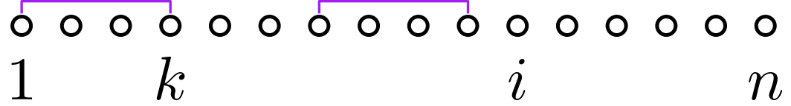
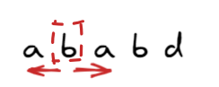
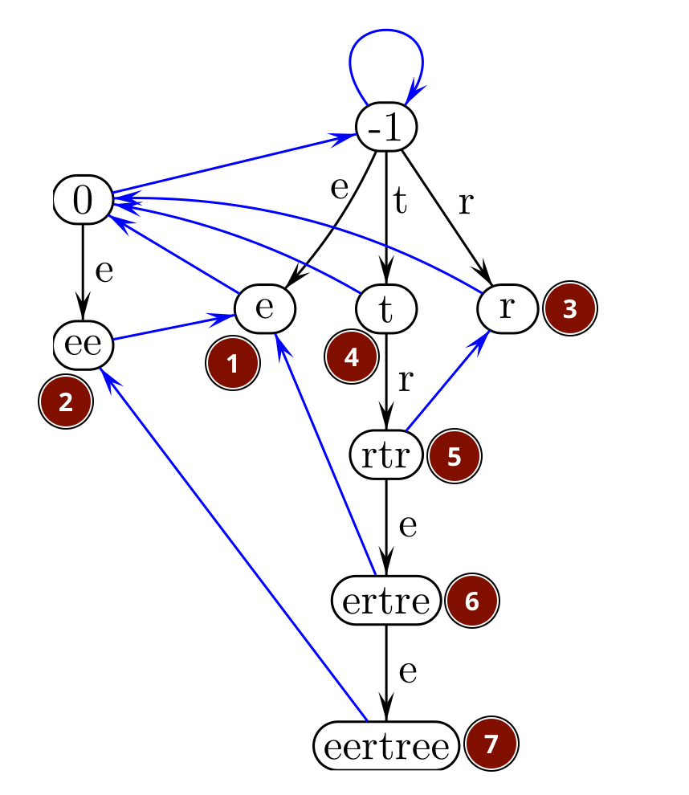

---
# try also 'default' to start simple
theme: seriph
# random image from a curated Unsplash collection by Anthony
# like them? see https://unsplash.com/collections/94734566/slidev
background: https://cover.sli.dev
# some information about your slides (markdown enabled)
title: 字符串
info: |
  ## Repetitions in Strings
# apply UnoCSS classes to the current slide
class: text-center
# https://sli.dev/features/drawing
style: |
  @import './styles/lecture.css'
drawings:
  persist: false
# slide transition: https://sli.dev/guide/animations.html#slide-transitions
transition: slide-left
# enable MDC Syntax: https://sli.dev/features/mdc
mdc: true
# duration of the presentation
duration: 35min
lineNumbers: true
---

# 字符串

Repetitions in Strings


<!--
The last comment block of each slide will be treated as slide notes. It will be visible and editable in Presenter Mode along with the slide. [Read more in the docs](https://sli.dev/guide/syntax.html#notes)
-->

---
transition: fade-out
---

# 今日内容


- border
- Z 数组
- 回文子串
- 周期


---

# 记号和约定

- 字符串下标从 $1$ 开始。
- 设 $x$ 是字符串，记号 $|x|$ 表示 $x$ 的长度。
- 符号 $\epsilon$ 表示空串。

---

# border

<div class="definition">

设 $x$, $y$ 是字符串。若 $y$ 是 $x$ 的前缀也是 $x$ 的后缀，并且 $y \ne x$，就称 $y$ 是 $x$ 的一个 **border**。
 </div>

- 例：`aabaabaa` 的 border 有 $\epsilon$，`a`，`aa`，`aabaa`。
- 例：`ab` 的 border 有 $\epsilon$。

<div class=topic-box v-click>

- 任何非空字符串至少有一个 border，$\epsilon$。
- $x$ 的 border 的 border 也是 $x$ 的 border。
</div>


---

# Border(x)

<div class="definition">

设 $x$ 是非空字符串。定义函数
$$
\operatorname{Border}(x) = \text{$x$ 的最长 border.}
$$
</div>

- 例：$\operatorname{Border}(\mathtt{aabaabaa}) = \mathtt{aabaa}$
- 例：$\operatorname{Border}(\mathtt{aa}) = \mathtt{a}$
- 例：$\operatorname{Border}(\mathtt{a}) = \epsilon$


---

<div class="proposition">

令 $x$ 是一个非空字符串，$m$ 是使得 $\operatorname{Border}^{k}(x)$ 有定义的最大整数 $k$（因此 $\operatorname{Border}^{m}(x) = \epsilon$）。那么 $x$ 的所有 border，按长度递减顺序列出来，是
$$\operatorname{Border}(x), \operatorname{Border}^2 (x), \dots, \operatorname{Border}^m(x).$$
</div>

- 例：`aabaabaa` 的 border 有 `aabaa`，`aa`，`a`，$\epsilon$。


---

# border 数组

<div class=definition>

设 $x$ 是一个长度为 $n$ 的非空字符串。我们定义数组 $\border$：$\border[1], \dots, \border[n]$。  
对 $i = 1, \dots, n$，
$$
\border[i] := |\mathrm{Border}(x[1..i])|.
$$

我们把数组 $\border$ 称为 $x$ 的 **border 数组**。

</div>


<div class=topic-box v-click>

- $x$ 的 border 数组记录了 $x$ 的每个前缀的最长 border 的长度。
- $0 \le \border[i] < i$。
</div>

---

<div class=example>

$x = \texttt{aabaabaa}$ 的 border 数组。

| $i$ | $x[1..i]$ |  $\border[i]$    |
|------|------|----------|
| 1 | $\texttt{a}$   | 0     |
| 2 | $\texttt{aa}$   | 1     |
| 3 | $\texttt{aab}$   | 0     |
| 4 | $\texttt{aaba}$ | 1 |
| 5 | $\texttt{aabaa}$  | 2 | 
| 6 | $\texttt{aabaab}$ | 3  |
| 7 | $\texttt{aabaaba}$ | 4 | 
|8 | $\texttt{aabaabaa}$ | 5 | 

</div>

<style>
.slidev-layout td, .slidev-layout th {
    padding: 0.2rem;
}
</style>


---

# 求 border 数组


<div class=question>

给定字符串 $x$，求 $x$ 的 border 数组。
</div>

<v-click>

用**递推法**求 $x$ 的 border 数组。

设 $x$ 的长度是 $n$。

根据定义，$\border[1] = 0$。  
对于 $i = 2, \dots, n$，我们利用 $\border[1], \dots, \border[i-1]$ 来算出 $\border[i]$。
</v-click>


---

对于正整数 $j = 1, 2, \dots, i-1$，我们注意到
<div class=topic-box>

$x[1..j]$ 是 $x[1..i]$ 的 border $\iff$ $x[1..j-1]$ 是 $x[1..i-1]$ 的 border 且 $x[j] = x[i]$
</div>

{width=60%}

<v-click>

为了求 $\border[i]$，我们从大到小**枚举** $x[1..i-1]$ 的每个 border 的长度 $k$，检查是否有 $x[k+1] = x[i]$。

{width=60%}
</v-click>

---

# 枚举 $x[1..i-1]$ 的 border 长度

<div class=topic-box>

设 $x[1..i-1]$ 有 $m$ 个 border，那么这 $m$ 个 border 的长度从大到小依次是
$$
\border[i-1], \border^2[i-1], \dots, \border^m[i-1].
$$
</div>

---

# 代码

```cpp
vector<int> border_array(string x) {
  int n = x.size();
  vector<int> border(n);
  border[0] = 0;
  for (int i = 1; i < n; i++) {
    int j = border[i - 1];
    while (j > 0 && x[j] != x[i]) {
      j = border[j - 1];
    }
    if (x[j] == x[i])
      j++;
    border[i] = j;
  }
  return border;
}
```

---
layout: two-cols-header
---

# 时间复杂度

::left:: 

````md magic-move 

```cpp
vector<int> border_array(string x) {
  int n = x.size();
  vector<int> border(n);
  border[0] = 0;
  for (int i = 1; i < n; i++) {
    int j = border[i - 1];
    while (j > 0 && x[j] != x[i]) {
      j = border[j - 1];
    }
    if (x[j] == x[i])
      j++;
    border[i] = j;
  }
  return border;
}
```

```cpp
vector<int> border_array(string x) {
  int n = x.size();
  vector<int> border(n);
  border[0] = 0;
  int j = 0;
  for (int i = 1; i < n; i++) {
    while (j > 0 && x[j] != x[i]) {
      j = border[j - 1];
    }
    if (x[j] == x[i])
      j++;
    border[i] = j;
  }
  return border;
}
```

````

:: right::


<v-click>

考查 `j` 的变化

- 第 8 行 `j = border[j - 1]` 让 $j$ 变小。
- 第 11 行 `j++` 让 $j$ 增加 1。
- `j` 的初始值是 0，`j` 始终大于等于 0。
- 第 11 行 `j++` 最多执行 `n - 1` 次。
</v-click>


<div class=topic-box v-click>

`j = border[j - 1]` 最多执行 $n - 1$ 次。
</div>


<style>
.two-cols-header {
  column-gap: 50px; /* Adjust the gap size as needed */
}
</style>

---

<div class=definition>

设 $x, y, z$ 是字符串。若 $z$ 是 $x$ 的前缀且 $z$ 是 $y$ 的前缀，则称 $z$ 是 $x$ 和 $y$ 的**公共前缀**（common prefix）。$x$ 和 $y$ 的最长公共前缀记作 $\lcp(x, y)$。
</div>

- 例：$\lcp(\texttt{ab}, \texttt{ac}) = \texttt{a}$
- 例：$\lcp(\texttt{ba}, \texttt{ac}) = \epsilon$

---

# Z 数组

<div class=definition>

设 $x$ 是一个长度为 $n$ 的非空字符串。我们定义数组 $Z$：$Z[2], Z[3],\dots, Z[n]$。  
对 $i = 2, 3, \dots, n$，
$$
Z[i] := |\lcp(x, x[i..n])|.
$$

我们把数组 $Z$ 称为 $x$ 的 **Z 数组**。
</div>


<div class=topic-box v-click>

$x$ 的 Z 数组记录了 $x$ 和它自己的每个后缀的最长公共前缀的长度。
</div>

<div class=remark v-click>

我们用不到 $Z[1]$，所以干脆不定义它。实际上 $Z[1]$ 也没有合适的定义。  
有的资料把 $Z[1]$ 定义为 $\lcp(x, x[1..n])$，也就是 $x$ 的长度。有的资料把 $Z[1]$ 定义为 $0$。
</div>


---

<div class=example>

$x = \texttt{aabaabaa}$ 的 Z 数组。

| $i$ | $x[i..8]$ |  $Z[i]$    |
|------:|------:|----------:|
| 1 | $\texttt{aabaabaa}$   |     |
| 2 | $\texttt{abaabaa}$   | 1     |
| 3 | $\texttt{baabaa}$   | 0     |
| 4 | $\texttt{aabaa}$ | 5 |
| 5 | $\texttt{abaa}$  | 1 | 
| 6 | $\texttt{baa}$ | 0  |
| 7 | $\texttt{aa}$ | 2 | 
|8  | $\texttt{a}$ | 1 | 

</div>

<style>
.slidev-layout td, .slidev-layout th {
    padding: 0.2rem;
}
table{ width:50%;}
</style>

---

# 计算 Z 数组

<div class=question>

给定长为 $n$ 的字符串 $x$，求 $x$ 的 Z 数组。

</div>

<v-click>

- 采用暴力比较的方法求 $Z[2]$。  
$\texttt{a{\color{green}a}baabaa}$  
$\texttt{ {\color{green}a}abaabaa}$
- 用**递推法**求 $Z[3], \dots, Z[n]$
</v-click>

---


$x = \texttt{abbabaabbabaaaabbabbaa}$。  
假设我们已经算出 $Z[2]$ 到 $Z[9]$，现在要计算 $Z[10]$。  


<v-click>

我们做一些**推理**

</v-click>
<v-clicks>

- 我们知道 $Z[7] = 7$，这意味着 $x[7..13] = x[1..7]$  
{width=60%}
- $x[7..13] = x[1..7] \implies x[10..13] = x[4..7]$  
{width=60%}
- 我们又知道 $Z[4] = 2$，这意味着 $x[4..5] = x[1..2]$ 且 $x[6] \ne x[3]$
- 又 $x[10..13] = x[4..7]$，所以 $x[10..11] = x[4..5] = x[1..2]$ 且 $x[12] = x[6] \ne x[3]$
- 所以 $Z[10] = 2$
</v-clicks>

<div class=topic-box v-click>

利用已经算出来的东西，我们可以避免不必要的字符比较。
</div>

<style>

img {
  margin-top: 0.5rem;
  margin-bottom: 0.6rem;
}

</style>

---

# Z-box

<div class=definition>

设 $x$ 是一个长为 $n$ 的字符串，对每个 $i = 2, \dots, n$，我们把区间 $[i, i+Z[i] - 1]$ 称为一个 **Z-box**。

</div>

{width=60%}
<div class=caption>

$Z[7] = 7$，$[7,13]$ 是一个 Z-box。
</div>


<div class=topic-box v-click>

Z-box 标志着一个等于前缀的子串。  
或者说 Z-box 标志着一个再次出现的前缀。
</div>

---

<div class=topic-box>

假设我们已经算出了 $Z[2], \dots, Z[i - 1]$，现在要计算 $Z[i]$。
</div>

<v-click>

我们维护目前发现的右端点最大的 Z-box，设它是 $[l, r]$，那么有 
$$r = l + Z[l] - 1 \quad \text{且} \quad r = \max_{2 \le j < i} (j + Z[j] - 1)$$
</v-click>

<v-clicks depth=2>

- 如果 $i > r$，那么我们采用暴力比较的方法算出 $Z[i]$。
- 如果 $i \le r$，那么根据 $x[l..r] = x[1..r-l+1]$ 可知
  $$x[i..r] = x[i-l+1..r-l+1]$$
  也就是说，子串 **$x[i..r]$ 在前面出现过**。
  - 如果 $Z[i - l + 1] < r - i + 1$，那么 $Z[i] = Z[i - l + 1]$。
  - 如果 $Z[i - l + 1] > r - i + 1$，那么 $Z[i] = r - i + 1$。
  - 如果 $Z[i - l + 1] = r - i + 1$，那么 $Z[i] \ge r - i + 1$。  
  我们从 $x[r + 1]$ 与 $x[r - i + 2]$ 开始继续比较。
</v-clicks>

---

```cpp
vector<int> z_array(string x) {
  int n = x.size();
  vector<int> z(n); // 字符串下标从 0 开始。
  int l = 0, r = 0; // [l,r) 是目前发现的右端点最大的 Z-box. 
  for (int i = 1; i < n; i++) {
      z[i] = i < r ? min(z[i - l], r - i) : 0;
    while (i + z[i] < n && x[z[i]] == x[i + z[i]])
      z[i]++;
    if (r < i + z[i]) {
      l = i;
      r = i + z[i];
    }
  }
  return z;
}
```


<v-clicks>

- 根据前一页的分析，只有 `z[i - l] == r - i` 时，第 9 行 `z[i]++` 才可能执行。  
- 此时 `z[i]` 的初始值是 `r - i`，所以 `z[i]++` 执行多少次，`r` 就增大多少。
- 最初 `r == 0`，又 `r` 始终不超过 `n`，所以第 9 行 `z[i]++` 执行至多 `n` 次。

我们可以在 $O(n)$ 时间内计算一个长为 $n$ 的字符串的 Z 数组。
</v-clicks>

---

# 字符串匹配

<div class=question>

给定长为 $m$ 的字符串 $P$ 和长为 $n$ 的字符串 $T$，求 $P$ 在 $T$ 里出现的位置。

如果 $T[i..i+m-1] = P$，我们说 $P$ 在 $T$ 的位置 $i$ 出现。

</div>

我们称 $P$ 为**模式串**（pattern），称 $T$ 为**文本串**（text）。

<div class=remark v-click>

我们总是假设 $m \le n$。
</div>


---

# 用 border 数组进行字符串匹配

1. 算出文本串 $P$ 的 border 数组。
2. 算一个数组 $a = a[1], \dots, a[n]$。  
    - $a[i]$ 的定义：既是 $T[1..i]$ 的后缀又是 $P$ 的前缀的字符串，最长有多长。
    - $P$ 在 $T$ 的位置 $j$ 出现 $\iff$ $a[j + m - 1] = m$

<div class=example v-click>

$\begin{aligned}
P &= \texttt{a b c a b c a c a b}, & m = 10. \\  
T &= \texttt{b a b c b a b c a b c a a b c a b c a b c a c a b \ c}, & n = 26.\\  
a &= \texttt{0 1 2 3 0 1 2 3 4 5 6 7 1 2 3 4 5 6 7 5 6 7 8 9 {\color{red}10} 3}.
\end{aligned}
$

</div>

---

用**递推法**计算 $a$ 数组

<div class=topic-box>

假设我们已经算出 $a[1], \dots, a[i - 1]$，现在要计算 $a[i]$。
</div>

<div class=example>

计算 $a[4]$.

$\begin{aligned}
P &= \texttt{a b c a b c a c a b}, & m = 10. \\  
T &= \texttt{b a b c b a b c a b c a a b c a b c a b c a c a b c}, & n = 26.\\  
a &= \texttt{0 1 2 ? }
\end{aligned}
$
</div>
<v-clicks>

- 注意到 $a[4] \le a[3] + 1$.
- 我们先看 $T[4]$ 是否等于 $P[a[3] + 1]$，也就是比较 $T[4]$ 和 $P[3]$.
- $T[4] = P[3]$，所以 $a[4] = a[3] + 1 = 3$.

</v-clicks>


---

<div class=example>

计算 $a[20]$.

$\begin{aligned}
P &= \texttt{a b c a b c a c a b}, & m = 10. \\  
T &= \texttt{b a b c b a b c a b c a a b c a b c a b c a c a b c}, & n = 26.\\  
a &= \texttt{0 1 2 3 0 1 2 3 4 5 6 7 1 2 3 4 5 6 7 ?}
\end{aligned}
$
</div>
<v-clicks>

- $a[19] = 7$ 而 $T[20] \ne P[8]$，所以 $a[20] \le 7$。
- 对于 $j = 1, \dots, 7$，我们注意到
  $$T[20-j+1..20] = P[1..j] \iff \text{$P[1..j-1]$ 是 $P[1..7]$ 的 border 且 $T[20] = P[j]$}$$  
- 借助 $P$ 的 border 数组，我们从大到小枚举 $P[1..7]$ 的每个 border 的长度 $k$，检查 $T[20]$ 和 $P[k+1]$ 是否相等。
- $\border[7] = 4$ 而 $T[20] = P[5]$，所以 $a[20] = 5$。
</v-clicks>

---

用**递推法**计算 $a$ 数组

<div class=topic-box>

假设我们已经算出 $a[1], \dots, a[i - 1]$，现在要计算 $a[i]$。

</div>

- 注意到 $a[i] \le a[i - 1] + 1$。
- 如果 $t[i] = p[a[i-1] + 1]$ 那么 $a[i] = a[i - 1] + 1$。
- 否则如果 $a[i] > 0$ 那么 $p[1..a[i] - 1]$ 是 $p[1..a[i - 1]]$ 的一个后缀，  
也就是说 $p[1..a[i] - 1]$ 是 $p[1..a[i - 1]]$ 的一个 border。  
  - 借助 $p$ 的 border 数组，我们可以从大到小枚举 $p[1..a[i] - 1]$ 的每个 border 的长度 $k$，检查是否有 $p[k+1] = p[i]$。

---

上面讲的用 border 数组进行字符串匹配的算法，我们称之为 **KMP 算法**。

<div class=remark v-click>

KMP 是 Knuth，Morris，Pratt 三个姓的缩写。

</div>

---

````md magic-move
```cpp
vector<int> kmp_search(string t, string p, const vector<int>& border) {
  vector<int> res;
  int n = t.size();
  int m = p.size();
  int k = 0;
  for (int i = 0; i < n; i++) {
    while (k > 0 && t[i] != p[k])
      k = border[k - 1];
    if (t[i] == p[k])
      k++;
    if (k == m) {
      res.push_back(i - m + 1);
      k = border[k - 1];
    }
  }
  return res;
}
```


```cpp
vector<int> kmp_search(string t, string p, const vector<int>& border) {
  vector<int> res;
  int n = t.size();
  int m = p.size();
  int k = 0;
  for (int i = 0; i < n; i++) {
    while (k > 0 && (k == m || t[i] != p[k])) // 把 k = border[k-1] 的操作写在一处
      k = border[k - 1];
    if (t[i] == p[k])
      k++;
    if (k == m) {
      res.push_back(i - m + 1);
    }
  }
  return res;
}
```

```cpp
vector<int> kmp_search(string t, string p, vector<int> border) {
  vector<int> res;
  int n = t.size();
  int m = p.size();
  int k = 0;
  for (int i = 0; i < n; i++) {
    while (k > 0 && t[i] != p[k]) // p[m] == '\0'，通常 t[i] != '\0'. 也就是说，通常 t[i] != p[m].
      k = border[k - 1];
    if (t[i] == p[k])
      k++;
    if (k == m) {
      res.push_back(i - m + 1);
    }
  }
  return res;
}
```

````

---

# 用 Z 数组进行字符串匹配

1. 算出模式串 $P$ 的 Z 数组。
2. 计算一个数组 $b = b[1], \dots, b[n]$。
    - $b[i]$ 的定义：$T[i..n]$ 和 $P$ 的最长公共前缀的长度。
    - $P$ 在 $T$ 的位置 $j$ 出现 $\iff$ $b[j] = m$。 

<div class=example v-click>

$\begin{aligned}
P &= \texttt{a b c a b c a c a b}, & m = 10. \\  
T &= \texttt{b a b c b a b c a b c a a b c a \ b c a b c a c a b c}, & n = 26.\\  
b &= \texttt{0 3 0 0 0 7 0 0 4 0 0 1 7 0 0 {\color{red}10}  0 0 4 0 0 1 0 3 0 0}.
\end{aligned}
$

</div>

---

计算数组 $b$ 和计算模式串 $P$ 的 Z 数组的方法是类似的。

```cpp
vector<int> z_search(string p, string t, vector<int> z) {
  vector<int> res;
  int m = p.size();
  int n = t.size();
  int l = 0, r = 0;
  for (int i = 0; i < n; i++) {
    int k = i < r ? min(r - i, z[i - l]) : 0;
    while (k < m && i + k < n && p[k] == t[i + k]) {
      k++;
    }
    if (r < i + k) {
      l = i;
      r = i + k;
    }
    // k 就是我们说的 b[i]
    if (k == m) {
      res.push_back(i);
    }
  }
  return res;
}
```

---


# 字符串匹配问题的简便写法

- `border_array()` 和 `kmp_search()` 的代码差不多。
- `z_array()` 和 `z_search()` 的代码也差不多。

实际上，我们可以用 `border_array()` 或 `z_array()` 来解决字符串匹配问题。
1. 用一个在模式串 $P$ 和文本串 $T$ 里都没出现过的特殊字符（比如 #）把 $P$ 和 $T$ 连接起来，得到一个新字符串
  $$ S = P\texttt{\#}T $$
2. 计算 $S$ 的 border 数组或 Z 数组。
    - $T[i,i+m-1] = P \iff S[i+m + 1, i+2m] = P \iff Z[i + m + 1] = m \iff \border[i+2m] = m$. 

---


<div class=definition>

设 $S = a_1 a_2 \dots a_n$ 是一个长为 $n$ 的字符串。  
我们把 $S$ 倒转过来得到的字符串记作 $\rev{S}$，也就是 $\rev{S} := a_n \dots a_2 a_1$.

如果 $S = \rev{S}$，就称 $S$ 是**回文串**（palindrome）。

特别的，空串是回文串。
</div>

- 例：`noon`，`madam`，`level`，`radar`，`racecar` 是回文串。`apple`,`aab`，`qop` 不是回文串。

<!-- 空串应不应该算作回文串？
eertree 论文里不把空串当作回文串是出于什么考虑？
 -->

<!-- > palindromes are one of the most important repetitive structures in strings. -->

---

<div class=question>

给你一个长为 $n$ 的字符串 $x$。求 $x$ 有多少个子串是回文串。  
也就是有多少对整数 $l, r$ 满足：$1 \le l \le r \le n$ 且 $x[l..r]$ 是回文串。
</div>

- 例：`aaa` 有 6 个回文子串。`banana` 有 10 个回文子串。

<div class=topic topic=暴力法 v-click>

枚举 $l, r$，判断 $x[l..r]$ 是不是回文串。时间 $O(n^3)$。

</div>

---


# 回文子串

<div class=definition>

设 $x$ 是一个长为 $n$ 的字符串。若子串 $x[l..r]$ 是回文串，则称之为 $x$ 的**回文子串**。

回文子串 $x[l..r]$ 的**中心**是 $(l+r)/2$，**半径**是 $\lfloor (r-l+1)/2 \rfloor$。
</div>

- 例：`a` 的半径是 $0$，`aa` 的半径是 $1$，`aaa` 的半径是 $1$，`noon` 的半径是 $2$，`madam` 的半径是 $2$。 

<div class=remark>

有些资料里，回文子串的半径定义是 $\lceil (r-l+1)/2 \rceil$。

</div>

---

# 回文中心、回文半径

<div class=definition>

设 $x$ 是一个长为 $n$ 的字符串。我们把 $x$ 里每个字符的位置称为一个**奇回文中心**，把 $x$ 里相邻两个字符之间的位置称为一个**偶回文中心**，把奇偶回文中心统称为**回文中心**。  

对于 $x$ 的一个回文中心，我们把以它为中心的最长回文子串的半径称为它的**回文半径**。
</div>


{width=200}
<div class=caption> 黑色的点是奇回文中心，橙色的点是偶回文中心。</div>


$$
\begin{matrix}
回文中心 & \texttt{a} & & \texttt{b} & & \texttt{b} & & \texttt{a} & & \texttt{b} & & \texttt{a} & &\texttt{b} & & \texttt{a} \\
回文半径 & 0 & 0 & 0 & 2 & 0 & 0 & 1 & 0 & 2 & 0 & 2 & 0 & 1 & 0 & 0
\end{matrix}
$$


---

<div class=remark>

- 字符串 $x$ 的一个回文中心是 $x$ 里的一个位置。
- 长为 $n$ 的字符串有 $2n - 1$ 个回文中心。
- 虽然 $x$ 最多有 $O(n^2)$ 个回文子串，但是回文子串的中心只有 $O(n)$ 个。
- 知道了每个回文中心的回文半径，就知道了 $x$ 的全部回文子串。
</div>

<div class=definition v-click>

设 $x$ 是一个长为 $n$ 的字符串，定义数组 $\rad = \rad[1], \dots, \rad[2n-1]$
$$
\rad[i] := \text{$x$ 的回文中心 $(i+1)/2$ 的回文半径}. 
$$
我们把数组 $\rad$ 称为字符串 $x$ 的**回文半径数组**。
</div>


---

# 计算回文半径数组

<div class=topic topic=中心延伸法>

枚举每个回文中心，依次比较中心点左右第一个字符，第二个字符，……，直到遇到一对不相同的字符。



时间 $O(n^2)$。

</div>

---

# 中心延伸法的程序实现

统一处理奇、偶回文中心

```cpp
vector<int> palindrome_radius(string s) {
  int n = s.size();
  vector<int> rad(2 * n - 1);
  for (int i = 0; i < 2 * n - 1; i++) {
    int p = i / 2;
    int q = (i + 1) / 2;
    int k = 0;
    while (0 <= q - k - 1 && p + k + 1 < n && s[q - k - 1] == s[p + k + 1]) {
      k++;
    }
    rad[i] = k;
  }
  return rad;
}
```

<div class=remark>

- 当 `i` 是偶数时，`p == q`。当 `i` 是奇数时 `p + 1 == q`。
- 从点 `p` 往右延伸，从点 `q` 往左延伸。
</div>

---

<div class=topic-box>

我们寻求更快的计算每个中心的回文半径的方法。

</div>

---

# Manacher 算法

在 $O(n)$ 时间计算字符串的回文半径数组

<div class=topic-box>

- 输入：一个长为 $n$ 的字符串 $x$。
- 输出：一个长为 $2n - 1$ 的数列，即 $x$ 的回文半径数组。
</div>


- 从左到右计算每个回文中心的回文半径。
- 维护两个下标 $l$ 和 $r$ 表示已经找到的右端点最大的回文子串的左、右端点。
- 在用中心延伸法求当前中心点的回文半径时，利用 (i) $x[l..r]$ 是回文串和 (ii) 已经求出的回文半径，不检查已知是回文子串的部分。
{width=900}  
此时我们知道 $\rad[12] \ge 2$。


<!-- - Manacher 算法的特点：**在线**。在算法开始时不需要知道整个的字符串 $x$。 -->

---

# Manacher 算法的程序实现

下标从 0 开始


{width=900}

- $l + r$ 就是回文子串 $x[l..r]$ 的中心（的编号），也就是上图中的对称轴。
- 当前回文中心点 $i$ 关于对称轴 $l+r$ 的对称点是 $2(l + r) - i$。

---


```cpp {all|8}
vector<int> manacher(string s) {
  int n = s.size();
  vector<int> rad(2 * n - 1);
  int l = 0, r = 0; // l r 是目前找到的右端点最大的回文子串的左右端点
  for (int i = 0; i < 2 * n - 1; i++) {
    int p = i / 2;
    int q = (i + 1) / 2; 
    int k = (r <= p ? 0 : min(r - p, rad[2 * (l + r) - i]));
    while (0 <= q - k - 1 && p + k + 1 < n && s[q - k - 1] == s[p + k + 1])
      k++;
    if (p + k > r) { 
      r = p + k;
      l = q - k;
    }
    rad[i] = k;
  }
  return rad;
}
```

<div v-after>

第 8 行，`r <= p` 不能写成 `r < p`。因为当 `r == p` 时 `2 * (l + r)` 可能小于 `i`。例如
{width=450}
</div>

---

# Manancher 算法的时间复杂度是 O(n)

```cpp
vector<int> manacher(string s) {
  int n = s.size();
  vector<int> rad(2 * n - 1);
  int l = 0, r = 0; // l r 是目前找到的右端点最大的回文子串的左右端点
  for (int i = 0; i < 2 * n - 1; i++) {
    int p = i / 2;
    int q = (i + 1) / 2; 
    int k = (r <= p ? 0 : min(r - p, rad[2 * (l + r) - i]));
    while (0 <= q - k - 1 && p + k + 1 < n && s[q - k - 1] == s[p + k + 1])
      k++;
    if (p + k > r) { 
      r = p + k;
      l = q - k;
    }
    rad[i] = k;
  }
  return rad;
}
```

- `r` 递增。
- 第 10 行 `k++;` 执行多少次，`r` 就增大多少。不过 `k++;` 不是 `r` 增大的唯一途径。
- 所以 `k++;` 执行的次数不超过 `r` 的增量，而 `r` 不超过 $n-1$。

---

如果我们只需要长度是奇数的回文子串，那么代码可以简化。

```cpp
vector<int> manacher_odd(string s) {
  int n = s.size();
  vector<int> rad(n); //奇回文中心有 n 个
  int l = 0, r = 0; // l r 是目前找到的右端点最大的奇回文子串的左右端点
  for (int i = 0; i < n; i++) {
    int k = (r <= i ? 0 : min(r - i, rad[(l + r) - i]));
    while (0 <= i - k - 1 && i + k + 1 < n && s[i - k - 1] == s[i + k + 1])
      k++;
    if (i + k > r) { 
      r = i + k;
      l = i - k;
    }
    rad[i] = k;
  }
  return rad;
}
```

类似地，如果我们只需要长度是偶数的回文子串，代码也可以简化。

---


# 利用回文半径数组

字符串 $s$ 的回文半径数组包含了 $s$ 的所有回文子串的位置信息。

有了回文半径数组，我们可以
- 在 $O(1)$ 时间判断子串 $s[l..r]$ 是不是回文串。  
按照我们的写法，条件可以表达为 `2 * rad[l+r] >= r - l` 或 `(l + r) / 2 + rad[l + r] >= r`。
- 算出 $s$ 的每个前缀的最长回文后缀的长度。（结尾在 $s[i]$ 的最长回文子串的长度。）
- 算出 $s$ 的每个后缀的最长回文前缀的长度。（开头在 $s[i]$ 的最长回文子串的长度。）
- 列举出 $s$ 的所有回文子串。

---

<div class="question">

已知字符串 $s$ 的回文半径数组，求 $s$ 的每个前缀的最长回文后缀的长度。

</div>

<div class=example>

$s = \texttt{abbababa}$。
$$
\begin{array}{l}
前缀 & 最长回文后缀的长度 \\
\texttt{a} & 1 \\
\texttt{ab} & 1 \\
\texttt{abb} & 2 \\
\texttt{abba} & 4 \\
\texttt{abbab} & 3 \\ 
\texttt{abbaba} & 3 \\
\texttt{abbabab} & 5 \\
\texttt{abbababa} & 5
\end{array}
$$

</div>

---

要知道 $s[1..i]$ 的最长回文后缀的长度，只要找出最小的回文中心 $c$，它满足：$c \le i$ 且以 $c$ 为中心的最长回文子串的右端点 $\ge i$.

```cpp
vector<int> rad = manacher(s);
vector<int> palindrome_suffix(n);
for (int i = 0, j = 0; i < n; i++) { // j 是回文中心
  while (j / 2 + rad[j] < i) {
    j++;
  }
  palindrome_suffix[i] = i - (j - i) + 1; // (j - i) 是左端点
}
```

类似地，我们也可以算出每个后缀的最长回文前缀的长度
```cpp
vector<int> palindrome_prefix(n);
for (int i = n - 1, j = 2 * n - 2; i >= 0; i--) {
  while ((j + 1) / 2 - rad[j] > i) {
    j--;
  }
  palindrome_prefix[i] = (j - i) - i + 1; // (j - i) 是右端点
}
```


---

<div class=lemma>

设 $x$ 是一个长为 $n$ 的字符串，$p$ 是 $x$ 的一个回文子串。设 $p$ 在 $x$ 里首次出现是在 $x[l..r]$，那么 $x[l..r]$ 是 $x[1..r]$ 的最长回文后缀。
</div>

证明：假设 $x[l..r]$ 不是 $x[1..r]$ 的最长回文子串。也就是说存在 $l'$ 满足 $x[l'..r]$ 也是回文子串且 $l' < l$。那么根据回文子串的对称性，有 $x[l'..(l'+r-l)] = x[l..r] = p$，这与 $x[l..r]$ 是 $p$ 的首次出现矛盾。

<div v-click class=corollary>

一个长为 $n$ 的字符串的**不同回文子串**的数量不超过 $n$。
</div>

<div v-click class=remark>

我们枚举字符串 $x$ 的每个前缀的最长回文后缀，就可以**不遗漏**地枚举 $x$ 的每一个不同的回文子串。
</div>


---

# 课堂练习 1

[洛谷P3805](https://www.luogu.com.cn/problem/P3805)

给你一个长为 $n$ 的由小写英文字母构成的字符串 $S$，求 $S$ 的最长回文子串的长度。

限制：$1 \le n \le 1.1\times 10^7$。

<div v-click>

```cpp
int main() {
  string s;
  cin >> s;
  vector<int> rad = manacher(s);
  int ans = 0;
  for (int i = 0; i < s.size(); i++)
    ans = max(ans, 2 * rad[i] + 1 - (i & 1));
  cout << ans << '\n';
}
```
</div>

---

# 课堂练习 2

[洛谷P4555](https://www.luogu.com.cn/problem/P4555) 最长双回文串

如果一个字符串可以分为非空的两部分，每一部分都是回文串，则称之为**双回文串**。  
例如 `ab`，`aabb` 都是双回文串。

给你一个长为 $n$ 的字符串 $S$，求 $S$ 的最长双回文子串的长度。

限制：$2 \le n \le 10^5$。

---

```cpp
int main() {
    string s;
    cin >> s;
    vector<int> rad = manacher(s);
    int n = s.size();
    vector<int> a(n - 1);
    // 计算每个前缀的最长回文后缀的长度
    for (int i = 0, j = 0; i < n - 1; i++) {
        while (j / 2 + rad[j] < i)
            j++;
        a[i] = i - (j - i) + 1; // 在 s[i] 处结尾的最长回文子串的长度
    }
    // 计算每个后缀的最长回文前缀的长度
    for (int i = n - 1, j = 2 * n - 2; i >= 1; i--) {
        while ((j + 1) / 2 - rad[j] > i)
            j--;
        a[i - 1] += (j - i) - i + 1; // 在 s[i] 处开头的最长回文子串的长度
    }
    cout << *max_element(a.begin(), a.end()) << '\n';
}
```

---

# 课堂练习 3

[洛谷P4287](https://www.luogu.com.cn/problem/P4287) 双倍回文

设 $x$ 是一个非空字符串，如果存在字符串 $w$ 使得 $x = w\rev{w}w\rev{w}$，则称 $x$ 是一个**双倍回文**。换句话说，若要 $x$ 是双倍回文，它的长度必须是 $4$ 的倍数，而且 $x$，$x$ 的前半部分，$x$ 的后半部分都要是回文。

给你一个长为 $n$ 的字符串 $S$，计算它的最长双倍回文子串的长度。

限制：$1 \le n \le 500000$。

<div class=algorithm>

1. 用 Manacher 算法求出 $S$ 的回文半径数组。
2. 利用 $S$ 的回文半径数组算出 $S$ 的每个前缀的最长回文后缀的长度。
3. 通过枚举 $S$ 的每个前缀的最长回文后缀的方式来枚举 $S$ 的每个回文子串。对于长度是 $4$ 的倍数的回文子串，检查它的前一半是不是回文子串。
</div>

---

```cpp
int main() {
  int n;
  string s;
  cin >> n >> s;
  vector<int> rad = manacher(s);
  int ans = 0;
  for (int i = 0, j = 0; i < n; i++) {
    while (j / 2 + rad[j] < i)
      j++;
    // 回文子串是 s[(j - i)..i]
    int len = i - (j - i) + 1;
    if (len % 4 == 0) {
      int k = i - len / 2 + 1; // 后一半是 s[k..i]
      if (rad[k + i] >= len / 4)
        ans = max(ans, len);
    }
  }
  cout << ans << '\n';
}
```
---

# 题目研究

Palindrome Construction [abc349_g](https://atcoder.jp/contests/abc349/tasks/abc349_g)

给你一个长为 $N$ 的非负整数序列 $A=(A_1, A_2,\dots, A_N)$。判断是否存在长为 $N$ 的正整数列 $S=(S_1,S_2, \dots, S_N)$ 满足下列条件，若存在，找出字典序最小的那个。
- 对每个 $i = 1, 2, \dots, N$，下列条件成立：
  - 序列 $(S_{i-A_i}, S_{i-A_i+1}, \dots, S_{i+A_i})$ 是回文列。
  - 如果 $2 \le i - A_i$ 且 $i + A_i \le N - 1$，那么序列 $(S_{i-A_i-1}, S_{i-A_i}, \dots, S_{i+A_i+1})$ 不是回文列。

#### 限制

- $1 \le N \le 2\times 10^5$
- $0 \le A_i \le \min(i - 1, N - i)$

<div class=topic-box v-click>

告诉你一个序列每个奇回文中心的回文半径，构造一个这样的序列。

</div>

---

<div class=question>

找出一个字符串的所有不同的回文子串。
</div>

- 例：`abbababa` 有 8 个不同的回文子串，是 `a`，`b`，`bb`，`aba`，`bab`，`abba`，`ababa`，`babab`。

<div v-click class=lemma>

设 $S$ 是一个字符串，$c$ 是一个字符。字符串 $Sc$ 至多含有一个 $S$ 没有的回文子串。  
这个新的回文子串是 $Sc$ 的最长回文后缀。
</div>

---

<div class=algorithm>

输入：一个长为 $n$ 的字符串 $S$。

输出：$S$ 的所有不同的回文子串。

从左往右，每次添加 $S$ 的一个字符。

我们用一种名为**回文树**（eertree）的数据结构来存储当前已知的 $S$ 的前缀的所有的回文子串。

当添加第 $i$ 个字符 $S[i]$ 时，我们已经知道 $S[1..(i-1)]$ 的所有回文子串，利用回文树我们可以找出 $S[1..i]$ 的最长回文后缀，并且判断它是否已经出现过。

</div>


---
layout: two-cols
---

字符串 `eertree` 的回文树

{width=300}

::right::

- 一个字符串的回文树是一个**有向图**。
- 黑色的圆圈是回文树的**节点**。每个节点有一个编号。
- 两个特殊节点：
  - 节点 $0$，对应空串。
  - 节点 $-1$，对应一个假想的长度是 $-1$ 字符串。
- 其他节点从 1 开始编号，和回文子串一一对应。
- 黑色的箭头是回文树的**边**。每条边上标着一个字符。
- 蓝色的箭头称为**后缀链接**（suffix link），指向一个节点的**最长回文严格后缀**。


---

{width=550}

---

# 回文树的代码实现

```cpp {*}{maxHeight:'405px'}
struct eertree {
  struct node {
    int len; //节点对应的回文子串的长度
    int link; //最长回文严格后缀对应的节点
    int go[26];
  };

  vector<node> a; //存储节点的数组
  vector<int> s; //当前字符串
  int p; //当前字符串的最长回文后缀对应的节点

  eertree() {
    a.push_back({-1, -1});
    a.push_back({0, 0});
    p = 1; // 当前字符串的最长回文后缀，1号点代表空串。把 p 的初始值设为 0 也可以。
  }

  int add(int c) { //在当前字符串 s 的末尾添加字符c，c是0到25的整数。返回(s+c)的最长回文后缀。
    int i = s.size(); // 已经添加了 i 个字符
    s.push_back(c);
    // 第一步
    while (p && (a[p].len == i || s[i - 1 - a[p].len] != c)) { // 沿着后缀链接跳
      p = a[p].link;
    }
    if (a[p].go[c] != 0) {
      p = a[p].go[c];
      return p; // 没有新的回文子串
    }
    // 第二步：新增一个节点，编号是 a.size()
    a[p].go[c] = a.size();
    int len = len[p] + 2;
    // 计算新节点的后缀链接
    int link;
    if (p == 0) link = 1;
    else {
      while (1) { // 沿着后缀链接跳
        p = a[p].link;
        if (s[i - 1 - a[p].len] == c) //即使 p == 0，a[p].len == -1 也不会越界
          break;
      }
      link = a[p].go[c];
    }
    p = a.size();
    a.push_back({len, link});
    return p;
  }
};
```

---

# 课堂练习 4

[洛谷P5496](https://www.luogu.com.cn/problem/P5496)

给你一个长为 $n$ 的字符串 $S$。对每个 $i = 1, 2,\dots, n$，计算 $S[1..i]$ 的回文后缀的个数。

限制：$1 \le n \le 5 \times 10^5$。**强制在线**：在算出 $S[1..i]$ 的答案之后才能知道 $S[i+1]$。

<div v-click class=algorithm>

1. 构建 $S$ 的回文树。$\mathsf{add}(S[i])$ 返回前缀 $S[1..i]$ 的**最长回文后缀** $\mathsf{maxSuf}(S[1..i])$。
2. 对回文树的每个节点 $u$，我们计算节点 $u$ 的**回文后缀**的个数，记作 $\mathsf{cntSuf}[u]$。有
    $$\mathsf{cntSuf}[u] = 1 + \mathsf{cntSuf}[\mathsf{link}[u]]$$  
    $\mathsf{link}[u]$ 表示 $u$ 的**最长回文严格后缀**节点，也就是 $u$ 的后缀链接指向的节点。
3. $S[1..i]$ 的回文后缀的个数就是 $\mathsf{cntSuf}[\mathsf{maxSuf}(S[1..i])]$。
</div>

---

```cpp
int main() {
  string s;
  cin >> s;
  int k = 0;
  eertree tree;
  vector<int> cnt_suff(s.size() + 2);
  for (char c : s) {
    int p = tree.add((c - 'a' + k) % 26);
    if (cnt_suff[p] == 0) { //节点p 是新的
      cnt_suff[p] = cnt_suff[tree.a[p].link] + 1;
    }
    k = cnt_suff[p];
    cout << k << ' ';
  }
  cout << '\n';
}
```

---

# 课堂练习 5

[洛谷P3649](https://www.luogu.com.cn/problem/P3649)

给你一个由小写英文字母组成的字符串 $s$。我们定义 $s$ 的一个子串的**出现值**（occurrence value）为这个子串在 $s$ 中出现的次数乘以这个子串的长度。

求 $s$ 的所有回文子串的最大出现值。

限制：$1 \le |s| \le 300000$。


<div v-click class=algorithm>

1. 找出 $s$ 的每个前缀 $s[1..i]$ 的最长回文后缀 $\mathsf{maxSuf(s[1..i])}$。  
2. 统计每个回文子串 $v$ 作为前缀的最长回文后缀而出现的次数，记作 $\mathsf{occAsMax}[v]$。  
    $\mathsf{occAsMax}[v]$ 就是有多少个 $i$ 满足 $\mathsf{maxSuf}(s[1..i]) = v$。
3. 把回文子串 $v$ 在 $s$ 中出现的次数记作 $\mathsf{occ}[v]$，我们有
    $$\mathsf{occ}[v] = \mathsf{occAsMax}[v] + \sum_{u\colon\mathsf{link}[u] = v} \mathsf{occ}[u]$$

</div>

---

````md magic-move
```cpp
int main() {
  string s;
  cin >> s;
  eertree tree;
  vector<int> max_suff;
  for (char c : s) {
    max_suff.push_back(tree.add(c - 'a'));
  }
  int m = tree.a.size();
  vector<int> occ_as_max(m);
  for (int i : max_suff)
    occ_as_max[i]++;
  vector<int> occ(m);
  for (int i = m - 1; i > 1; i--) {
    occ[i] += occ_as_max[i];
    occ[tree.a[i].link] += occ[i];
  }
  long long ans = 0;
  for (int i = 2; i < m; i++) {
    ans = max(ans, (long long) tree.a[i].len * occ[i]);
  }
  cout << ans << '\n';
}
```

```cpp
int main() {
  string s;
  cin >> s;
  eertree tree;
  vector<int> max_suff;
  for (char c : s) {
    max_suff.push_back(tree.add(c - 'a'));
  }
  int m = tree.a.size();
  vector<int> occ(m);
  for (int i : max_suff)
    occ[i]++;
  for (int i = m - 1; i > 1; i--) {
    occ[tree.a[i].link] += occ[i];
  }
  long long ans = 0;
  for (int i = 2; i < m; i++) {
    ans = max(ans, (long long) tree.a[i].len * occ[i]);
  }
  cout << ans << '\n';
}
```

```cpp
int main() {
  string s;
  cin >> s;
  eertree tree;
  vector<int> occ(s.size() + 2);
  for (char c : s) {
    occ[tree.add(c - 'a')]++;
  }
  int m = tree.a.size();
  for (int i = m - 1; i > 1; i--) {
    occ[tree.a[i].link] += occ[i];
  }
  long long ans = 0;
  for (int i = 2; i < m; i++) {
    ans = max(ans, (long long) tree.a[i].len * occ[i]);
  }
  cout << ans << '\n';
}
```

````

---

# 周期

<div class=definition>

设 $x$ 是一个非空字符串，$p$ 是整数，$1 \le p \le |x|$。如果对每个 $i = 1, 2, \dots, |x|-p$ 都有
$$
x[i] = x[i+p]
$$
就称 $p$ 是 $x$ 的一个**周期**（period）。

注意到 $x$ 至少一个周期，就是 $|x|$。我们把 $x$ 的最小周期记作 **$\mathrm{per}(x)$**。
</div>

- 例：字符串 $x = \texttt{aabaabaa}$ 的周期有 $3, 6, 7, 8$ 而 $x$ 的最小周期是 $\mathrm{per}(x) = 3$。

<div v-click class=proposition>

设 $p$ 是字符串 $x$ 的一个周期，$k$ 是正整数。如果 $kp \le |x|$，那么 $kp$ 也是 $x$ 的周期。

</div>

---

# border 和周期

border 和周期这两个概念是**对偶**的。

<div class=topic-box>

设 $x$ 是一个长为 $n$ 的字符串。对于正整数 $1 \le p \le n$，
$$
\text{$p$ 是 $x$ 的周期} \iff \text{$x[1..n-p]$ 是 $x$ 的 border}。
$$
</div>

{width=600}

---

# 周期引理

<div class=lemma>

设 $x$ 是非空字符串，$p, q$ 是正整数。如果 $p, q$ 是 $x$ 的周期并且
$$ p + q - \gcd(p, q) \le |x|,$$
那么 $\gcd(p, q)$ 也是 $x$ 的一个周期。
</div>


证明：$p = q$ 时显然成立。不妨设 $p < q$。

---

我们先来考虑一个问题：

<div class=question>

$q$ 个点等间距地分布在长为 $q$ 的圆周上。从 $q$ 个点中的任意一点出发，按顺时针方向在圆上走，每一步的长度是 $p$。走多少步之后首次回到出发点？

</div>

<div v-click>

走到出发点 $\iff$ 走过的距离是圆周长 $q$ 的倍数。所以
- 当走过的距离是 $p, q$ 的**最小公倍数** $\lcm(p, q)$ 时，首次回到起点，走了 $\lcm(p, q) / p$ 步。
- 在首次回到起点之前经过的点两两不同。一共经过了 $\lcm(p, q) / p = q/\gcd(p, q)$ 个点。

</div>

---


- $q$ 是 $x$ 的周期，就是说**下标模 $q$ 同余的位置**上的字符都相同。
- 模 $q$ 的同余类有 $q$ 个，用 $0, 1, \dots, q-1$ 表示。如下图所示（以 $q = 10$ 为例）
    {width=100}
- $p$ 是 $x$ 的周期，也就是说对于每个 $i = 1,2,\dots,|x| - p$ 有 $x[i] = x[i+p]$。因此 $i$ 和 $i+p$ 所属的**模 $q$ 同余类**对应的字符是相同的，在上图中，我们把两者连起来。得到下面的图（以 $p = 4$ 为例）
    

---


- 如果字符串 $x$ 不够长，有些边实际上不能连。例如，如果 $x$ 的长度小于 $13$，就不能从 8 连向 2。
- 如果 $|x| \ge p + q$，那么所有边都能连。
- $p$ 是 $x$ 的周期这件事把模 $q$ 的同余类分成 $q/(\lcm(p, q)/p) = \gcd(p, q)$ 组。每一组里有 $q/\gcd(p, q)$ 个同余类。只需要连 $q/\gcd(p,q) - 1$ 条边就可以让一组**连通**。
- “最后”的 $\gcd(p,q)$ 条边是不需要的。比如 $q = 10, p = 4$ 时，$8$ 到 $2$ 和 $9$ 到 $3$ 的边就是不需要的。


---

# 周期引理的推论

<div class=corollary>

设 $x$ 是非空字符串，$p$ 是 $x$ 的周期。如果 $p \le |x|/2$，那么 $p$ 是 $x$ 的最小周期的倍数。
</div>

<div class=topic-box>

设 $x$ 的最小周期是 $k$，那么 $x$ 的所有不超过 $|x|/2$ 的周期是 $k, 2k, 3k, \dots, \lfloor |x|/2k \rfloor k$。是个**等差数列**。
</div>

<div class=corollary>

设 $x$ 是非空字符串。$x$ 的所有 border 的长度构成 $O(\log |x|)$ 个等差数列。
</div>

---

<div class=definition>

设 $x$ 是非空字符串，$p$ 是正整数。若 $p$ 是 $x$ 的周期且 $p$ 整除 $|x|$，则称 $p$ 是 $x$ 的**整周期**。
</div>

每个非空字符串 $x$ 都至少有一个整周期，$|x|$。


<div class=corollary>

若 $x$ 的最小整周期不是 $|x|$，则 $x$ 的最小整周期是 $x$ 的最小周期。
</div>

<div class=corollary>

$x$ 的所有整周期都是最小整周期的倍数。
</div>
