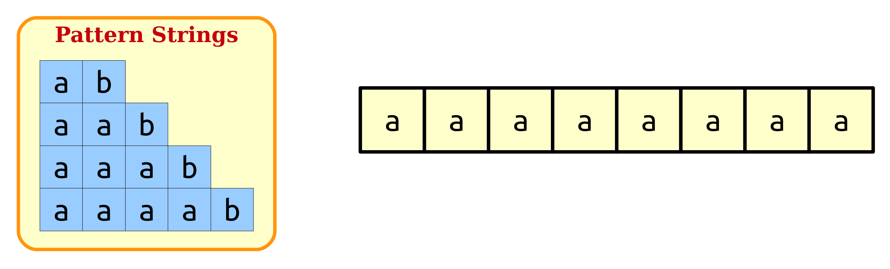
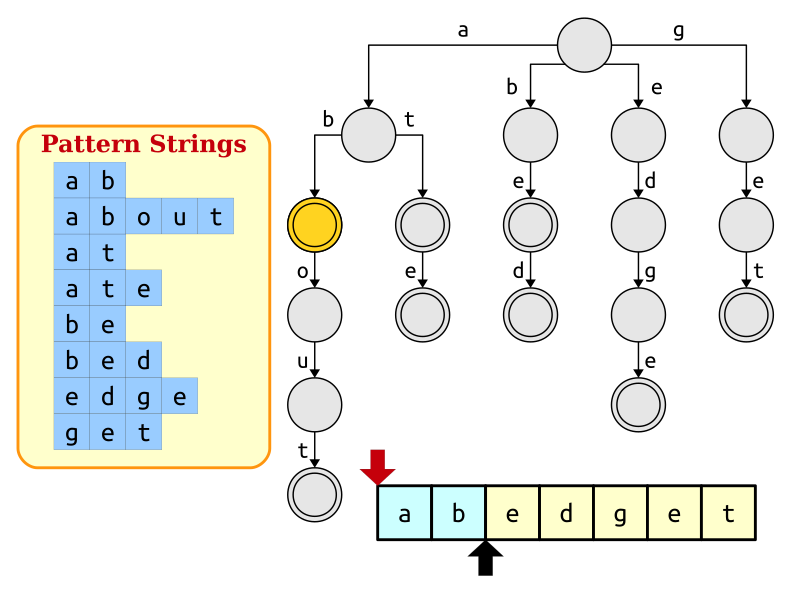
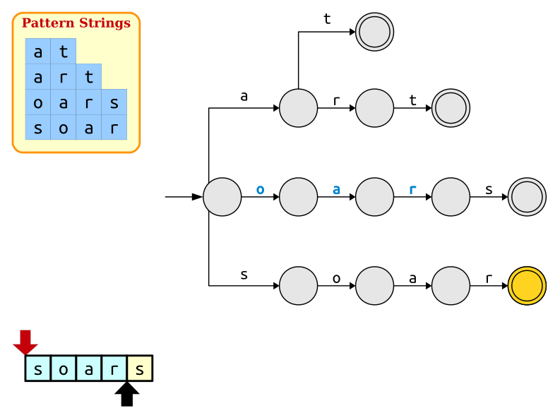
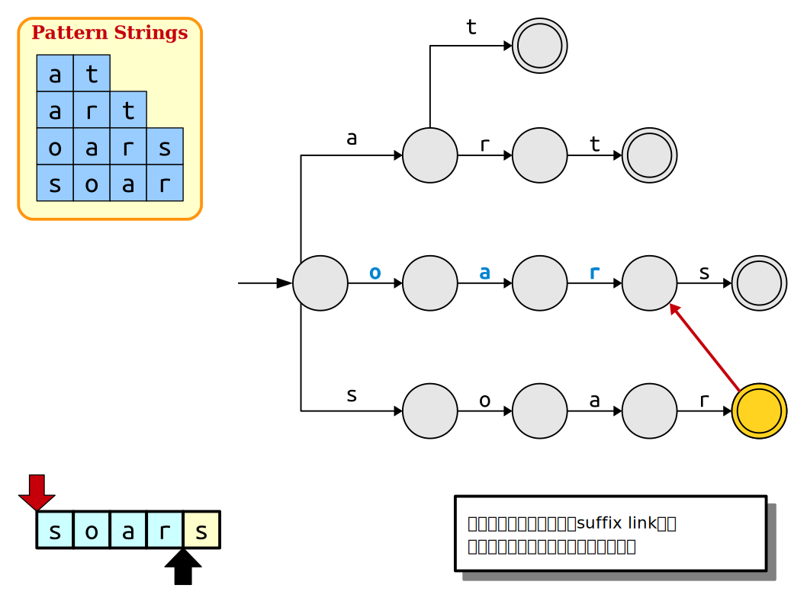
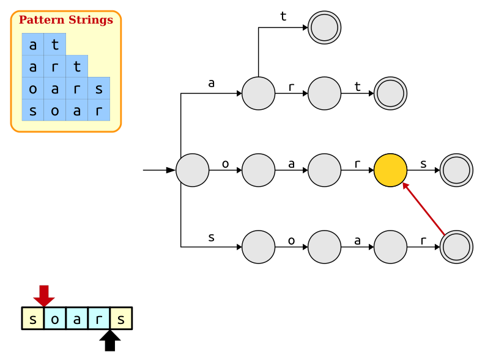
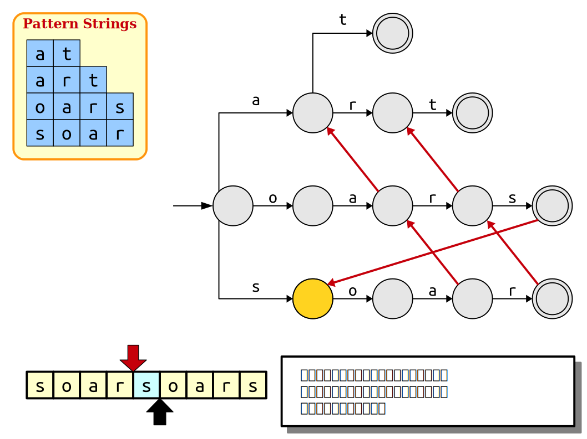
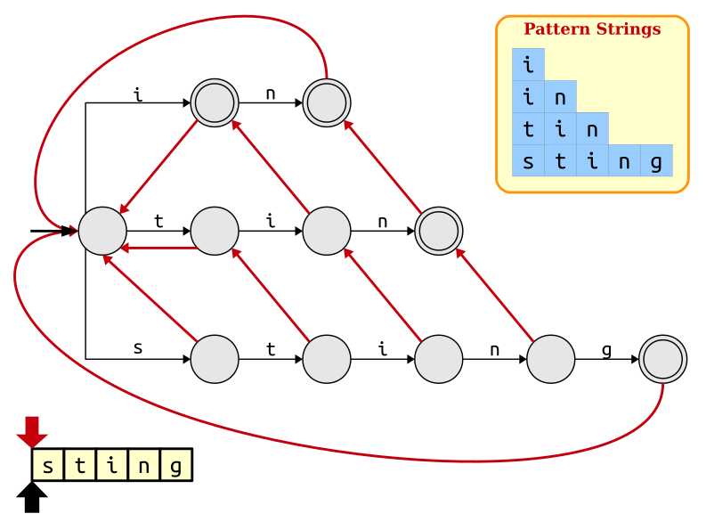
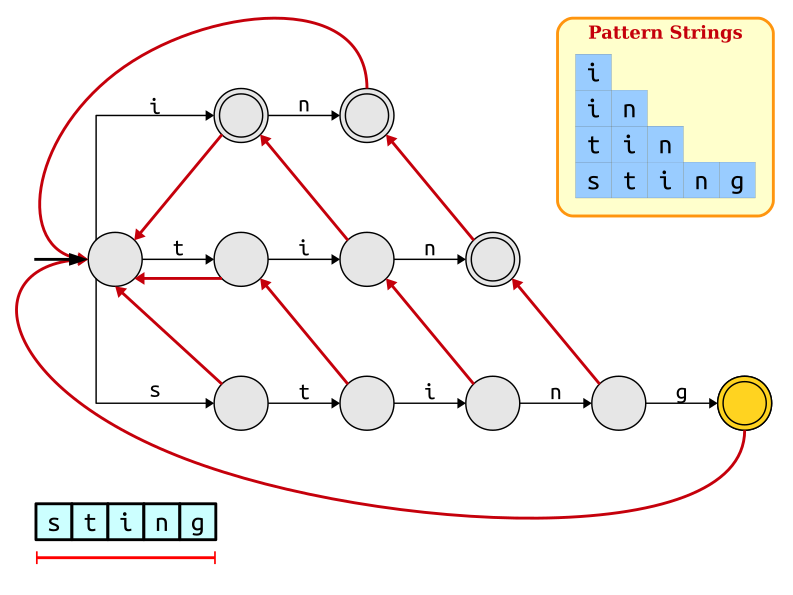
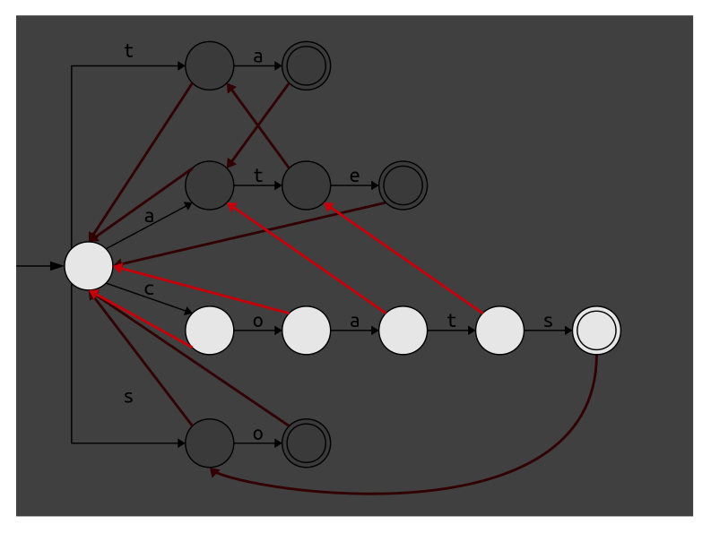

---
# try also 'default' to start simple
theme: seriph
# random image from a curated Unsplash collection by Anthony
# like them? see https://unsplash.com/collections/94734566/slidev
background: https://cover.sli.dev
# some information about your slides (markdown enabled)
title: 字典树和 AC 自动机
info: |
  ## Repetitions in Strings
# apply UnoCSS classes to the current slide
class: text-center
# https://sli.dev/features/drawing
style: |
  @import './styles/lecture.css'
drawings:
  persist: false
# slide transition: https://sli.dev/guide/animations.html#slide-transitions
transition: slide-left
# enable MDC Syntax: https://sli.dev/features/mdc
mdc: true
# duration of the presentation
duration: 35min
lineNumbers: true
---

# 字典树和 AC 自动机


<!--
The last comment block of each slide will be treated as slide notes. It will be visible and editable in Presenter Mode along with the slide. [Read more in the docs](https://sli.dev/guide/syntax.html#notes)
-->

---


<div class=question>

一部字典里 $N$ 个单词。回答 $Q$ 个询问，每个询问给你一个字符串 $s$，
问 $s$ 是不是 $N$ 个单词之一。单词和字符串 $s$ 都只含有小写英文字母。
</div>

---
layout: two-cols-header
---

有五个单词 a，abc，bac，bbc，ca。

为了判断一个字符串是不是单词，我们把全部单词组织成一个有根树，称为**字典树**（trie）。

::left::

{width=300}

::right::

- 一个节点对应单词的一个前缀
- 一条边对应一个字符
- 橙色节点对应单词，称为**单词节点**
- 叶子是单词节点，但单词节点未必是叶子
<div v-click class=algorithm>

要检验字符串 $s$ 是不是单词，就看能不能从根节点开始，沿着 $s$ 的每个字符往下走，最后恰好停在一个单词节点。
</div>

<div v-click class=remark>

利用字典树，我们可以在 $O(|s|)$ 的时间内判断 $s$ 是不是单词。已经是最优的了。

</div>

---

# 字典树的节点数量


- 字典树的每个节点对应单词的一个前缀。  
- 字典树的节点数量 = 全部单词的不同前缀的数量。
- 字典数的节点数量 ≤ (全部单词的长度之和 + 1)

<div v-click class=question>

有 $N$ 个单词，总长度是 $L$，字典树最多有多少个节点？
</div>

<div class=topic-box v-click>

让一个单词尽可能长，字典树的节点最多。

有 $N-1$ 个单词长度都是 $1$，一个单词的长度是 $L-N+1$ 时，字典树的节点最多。

问题的答案还跟**字符集**大小有关。
</div>

---

<div class=question>

一百万个长度是 $30$ 的 01 字符串，它们的字典树最多有多少个节点？

</div>

<div v-click class=topic-box>

要让字典树的节点尽可能多，就要让重复的前缀尽可能短、尽可能少。  
换言之，就要让各种前缀都有。

**占满**字典树的第 $m$ 层（从 $0$ 数起），需要 $2^m$ 个字符串。  
所以一百万个字符串最多能占满字典树的第 $⌊\log_2 10^6 ⌋ = 19$ 层。

最坏的情况下，第 $19$ 层以下的节点不会被两个单词共用。  
换言之，没有两个单词有长度大于 $19$ 的公共前缀。

此时字典树有
$$1 + 2 + 2^2 + \dots + 2^{19} + 10^{6}\cdot(30 - 19) = 12048575$$
个节点。
</div>

---

## 构建字典树

{width=800}

- 先创建根节点，再把单词逐个加入字典树。
- 在加入单词的过程中创建需要的节点。

---

## 字典树的代码实现

{width=800}

- 给每个节点一个编号，从 $0$ 开始。
- 用 vector 存储节点。

---

```cpp
template <int sigma_size, char alpha>
struct Trie {
  vector<array<int, sigma_size>> go;

  int new_node() {
    go.push_back({});
    return go.size() - 1;
  }

  Trie() {
    new_node(); //创建根节点
  }

  int add(string s) {
    int p = 0;
    for (char c : s) {
      int i = c - alpha;
      if (go[p][i] == 0) {
        go[p][i] = new_node();
      }
      p = go[p][i];
    }
    return p;
  }
};
```

---

# 字典树的应用

Word Combinations

给你一个长为 $n$ 的字符串 $S$ 和 $k$ 个单词。字符串 $S$ 和单词都由小写英文字母组成。  
用单词拼 $S$，每个单词可以使用多次，有多少种方式？  
输出答案除以 $10^9+7$ 的余数。

$1 \le n \le 5000$，$1 \le k \le 10^5$，单词的总长度不超过 $10^6$，单词两两不同。

<div v-click class=algorithm>

令 $f[i]$ 为用单词拼 $S[1..i]$ 有多少种方式。对于每个 $j = i + 1, \dots, n$，如果子串 $S[i+1..j]$ 是单词，那么就能从 $f[i]$ 转移到 $f[j]$。

构建 $k$ 个单词的字典树，就可以在 $O(n)$ 时间内，对每个 $j$ 检验 $S[i+1..j]$ 是不是单词。

</div>

---

```cpp {*}{maxHeight:'460px'}
int main() {
  string s;
  int k;
  cin >> s >> k;
  Trie<26, 'a'> trie;
  vector<int> id(k);
  for (int i = 0; i < k; i++) {
    string w;
    cin >> w;
    id[i] = trie.add(w);
  }
  vector<bool> is_word(trie.go.size());
  for (int i : id) {
    is_word[i] = true;
  }
  const int mod = 1e9 + 7;
  int n = s.size();
  vector<int> f(n + 1);
  f[0] = 1;
  for (int i = 0; i < n; i++) {
    int p = 0;
    for (int j = i; j < n; j++) {
      p = trie.go[p][s[j] - 'a'];
      if (p == 0)
        break;
      if (is_word[p]) {
        f[j + 1] += f[i];
        if (f[j + 1] >= mod)
          f[j + 1] -= mod;
      }
    }
  }
}
```

---

# 字典树的应用

Xor Sum

给你 $N$ 个正整数 $A_1, \dots, A_N$。回答 $M$ 个询问。每个询问给你一个正整数 $S$，输出 $\max_{1 \le i \le N} \set{A_i \oplus S}$。

- $1 \le N, M \le 100000$
- $1 \le S, A_i < 2^{32}$

<div class=topic topic=贪心>

先看有没有 $A_i$ 使得 $A_i\oplus S$ 的二进制最高位（第 $31$ 位）是 $1$，也就是看有没有 $A_i$ 和 $S$ 在第 $31$ 位不同。  
若有，就在这样的 $A_i$ 里选。

然后看能否让 $A_i \oplus S$ 的第 $30$ 位是 $1$，依此类推。
</div>

<div v-click>

为了实现上述过程，我们把每个 $A_i$ 的二进制写法看作一个长为 $32$ 的 01 串，构建这 $N$ 个 01 串的字典树。

这样的字典树的字符集是 0 和 1，我们称之为 **01 字典树**。

</div>

---

# 01 字典树的程序实现

```cpp {*}{maxHeight: '442px'}
struct binary_trie {
  int width; //二进制位数
  vector<array<int,2>> go;
  int new_node() {
    go.push_back({});
    return go.size() - 1;
  }

  binary_trie(int width) : width(width) {
    new_node();
  }

  int add(unsigned x) {
    int p = 0;
    for (int i = width - 1; i >= 0; i--) {
      int b = x >> i & 1;
      if (go[p][b] == 0) {
        go[p][b] = new_node();
      }
      p = go[p][b];
    }
    return p;
  }

  unsigned max_xor(unsigned x) {
    unsigned ans = 0;
    int p = 0;
    for (int i = width - 1; i >= 0; i--) {
      int b = x >> i & 1;
      if (go[p][b ^ 1]) {
        ans |= 1 << i;
        p = go[p][b ^ 1];
      } else {
        p = go[p][b];
      }
    }
    return ans;
  }
};
```


---

# 课堂练习

最长异或路径 [洛谷P4551](https://www.luogu.com.cn/problem/P4551)

给你一个 $n$ 个点的树，点从 $1$ 到 $n$ 编号。第 $i$ 条边连接点 $u_i$ 和 $v_i$，权值是非负整数 $w_i$。  
路径的权值定义为路径上边的权值的异或和。

求路径权值的最大值。

$1 \le n \le 10^5$，$0 \le w < 2^{31}$

<div v-click class=topic-box>

考虑以 $1$ 号点为根的有根树。

把路径 $x, y$ 的权值记作 $f(x, y)$，有 $f(x, y) = f(1, x) \oplus f(1, y)$。

于是问题的答案就是 $\max_{1 \le x, y \le n} f(1,x) \oplus f(1,y)$。
</div>

---

```cpp {*}{maxHeight: '442px'}
struct binary_trie {
  int width; //二进制位数
  vector<array<int,2>> go;
  int new_node() {
    go.push_back({});
    return go.size() - 1;
  }

  binary_trie(int width) : width(width) {
    new_node();
  }

  int add(int x) {
    int p = 0;
    for (int i = width - 1; i >= 0; i--) {
      int b = x >> i & 1;
      if (go[p][b] == 0) {
        go[p][b] = new_node();
      }
      p = go[p][b];
    }
    return p;
  }

  int max_xor(int x) {
    int ans = 0;
    int p = 0;
    for (int i = width - 1; i >= 0; i--) {
      int b = x >> i & 1;
      if (go[p][b ^ 1]) {
        ans |= 1 << i;
        p = go[p][b ^ 1];
      } else {
        p = go[p][b];
      }
    }
    return ans;
  }
};

const int maxn = 1e5 + 5;
vector<pair<int, int>> g[maxn];
int f[maxn];
void dfs(int u, int p) {
  for (auto [v, w] : g[u])
    if (v != p) {
      f[v] = f[u] ^ w;
      dfs(v, u);
    }
}

int main() {
  int n; cin >> n;
  for (int i = 0; i < n - 1; i++) {
    int u, v, w; cin >> u >> v >> w;
    g[u].push_back({v, w});
    g[v].push_back({u, w});
  }
  dfs(1, 0);
  binary_trie trie(31);
  for (int i = 1; i <= n; i++)
    trie.add(f[i]);
  int ans = 0;
  for (int i = 1; i <= n; i++)
    ans = max(ans, trie.max_xor(f[i]));
  cout << ans << '\n';
}
```

---

# 课堂练习

Secret Message [洛谷P2922](https://www.luogu.com.cn/problem/P2922)

给你 $M$ 个 01 串 $S_1, \dots, S_M$，$S_i$ 的长度是 $b_i$。回答 $N$ 个询问，第 $j$ 个询问给你一个长为 $c_j$ 的 01 串 $T_j$，求有多少个 $i$ 满足
- $1 \le i \le M$
- $S_i$ 是 $T_j$ 的前缀或 $T_j$ 是 $S_i$ 的前缀。

限制：$1 \le N, M \le 50000$，$1 \le b_i, c_j \le 10000$。

<div v-click class=topic-box>

1. 构建 $S_1, \dots, S_M$ 的字典树。
2. 对字典树的每个节点 $u$，我们计算两个东西
    - 有多少个单词等于 $u$。
    - $u$ 是多少单词的**严格前缀**。
4. 对询问 $T_j$ 的每个前缀，我们知道有多少个单词等于它。
5. 如果 $T_j$ 在字典树里，我们知道它是多少个单词的严格前缀。
</div>

---

```cpp {*}{maxHeight:'442px'}
int main() {
  int m, n;
  cin >> m >> n;
  Trie<2, '0'> trie;
  vector<string> s(m);
  for (int i = 0; i < m; i++) {
    int len; cin >> len;
    s[i].resize(len);
    for (int j = 0; j < len; j++)
      cin >> s[i][j];
    trie.add(s[i]);
  }
  vector<int> cnt_word(trie.go.size());
  vector<int> cnt_supper(trie.go.size());
  for (int i = 0; i < m; i++) {
    int p = 0;
    for (char c : s[i]) {
      cnt_supper[p]++;
      p = trie.go[p][c - '0'];
    }
    cnt_word[p]++;
  }
  // 回答询问
  for (int i = 0; i < n; i++) {
    int len;
    cin >> len;
    vector<int> t(len);
    for (int j = 0; j < len; j++)
        cin >> t[j];
    
    int p = 0;
    int ans = 0;
    for (int c : t) {
      p = trie.go[p][c];
      if (p == 0) break;
      ans += cnt_word[p];
    }
    if (p)
      ans += cnt_supper[p];
    cout << ans << '\n';
  }
}
```

---

# 例题

[洛谷P8306](https://www.luogu.com.cn/problem/P8306)

给你 $n$ 个模式串 $s_1, s_2, \dots, s_n$ 和 $q$ 次询问，每次询问给你一个文本串 $t_i$，回答 $s_1, \dots, s_n$ 中有多少个字符串 $s_j$ 满足 $t_i$ 是 $s_j$ 的前缀。

有 $T$ 组测试数据。

$1 \le T, n, q \le 10^5$，输入字符串只含有大小写字母和数字，总长度不超过 $3\times 10^6$。

---
layout: two-cols
---

```cpp {*}{maxHeight: '442px'}
int ctoi(char c) {
    if ('a' <= c && c <= 'z') {
        return c - 'a';
    }
    if ('A' <= c && c <= 'Z') {
        return c - 'A' + 26;
    }
    return c - '0' + 52;
}

template <int sigma_size>
struct Trie {
  vector<array<int, sigma_size>> go;

  int new_node() {
    go.push_back({});
    return go.size() - 1;
  }

  Trie() {
    new_node(); //创建根节点
  }

  int add(string s) {
    int p = 0;
    for (char c : s) {
      int i = ctoi(c);
      if (go[p][i] == 0) {
        go[p][i] = new_node();
      }
      p = go[p][i];
    }
    return p;
  }
};

int main() {
    ios::sync_with_stdio(0);
    cin.tie(0);
    int T;
    cin >> T;
    while (T--) {
        int n, q;
        cin >> n >> q;
        vector<string> s(n);
        Trie<62> trie;
        for (int i = 0; i < n; i++) {
            cin >> s[i];
            trie.add(s[i]);
        }
        vector<int> cnt(trie.go.size());
        for (int i = 0; i < n; i++) {
            int p = 0;
            for (char c : s[i]) {
                p = trie.go[p][ctoi(c)];
                cnt[p]++;
            }
        }
        for (int i = 0; i < q; i++) {
            string t;
            cin >> t;
            int p = 0;
            for (char c : t) {
                p = trie.go[p][ctoi(c)];
                if (p == 0) break;
            }
            cout << (p == 0 ? 0 : cnt[p]) << '\n';
        }
    }
}
```

::right::

<div v-click class=topic-box>

- 内存 503.44 MB
- 当字符集较大时，字典树每个节点的 `go` 数组大部分项是空的。

</div>


---

# 紧凑的字典树实现

- 每个节点的 `go` 数组不是固定大小，而是一个 vector。
- 每个节点有一个 64 位无符号整数 `mask` 来表示哪些边存在。  
如果对应字符 $c$ 的边存在，设 $c$ 在字符集里的编号是 $i$（编号从 $0$ 开始），就把 `mask` 的第 $i$ 位置为 1。
- 每当一个节点有一条新边指向新的子节点，就把新的子节点的编号插入 vector 里恰当的位置。


--- 

# 紧凑的字典树实现

```cpp {*}{maxHeight: '442px'}
int ctoi(char c) {
    if ('a' <= c && c <= 'z') {
        return c - 'a';
    }
    if ('A' <= c && c <= 'Z') {
        return c - 'A' + 26;
    }
    return c - '0' + 52;
}

template <int sigma_size>
struct compact_trie {
  struct Node {
    vector<int> go;
    unsigned long long mask;
  };
  vector<Node> node;
  int new_node() {
    node.push_back({});
    return node.size() - 1;
  }

  compact_trie() {
    new_node(); //创建根节点
  }

  int get_pos(int p, int i) {
      return __builtin_popcountll(node[p].mask & ((1ull << i) - 1));
  }

  int go(int p, char c) {
    int i = ctoi(c);
    if (node[p].mask >> i & 1)
        return node[p].go[get_pos(p, i)];
    return 0;
  }

  int add(string s) {
    int p = 0;
    for (char c : s) {
      int i = ctoi(c);
      int pos = get_pos(p, i);
      if ((node[p].mask >> i & 1) == 0) {
        int k = new_node();
        node[p].go.insert(node[p].go.begin() + pos, k);
        node[p].mask |= 1ull << i;
      }
      p = node[p].go[pos];
    }
    return p;
  }
};
```

---

[洛谷P8306](https://www.luogu.com.cn/problem/P8306) 115.33 MB


```cpp {*}{maxHeight: '442px'}
int ctoi(char c) {
    if ('a' <= c && c <= 'z') {
        return c - 'a';
    }
    if ('A' <= c && c <= 'Z') {
        return c - 'A' + 26;
    }
    return c - '0' + 52;
}

template <int sigma_size>
struct compact_trie {
  struct Node {
    vector<int> go;
    unsigned long long mask;
  };
  vector<Node> node;
  int new_node() {
    node.push_back({});
    return node.size() - 1;
  }

  compact_trie() {
    new_node(); //创建根节点
  }

  int get_pos(int p, int i) {
      return __builtin_popcountll(node[p].mask & ((1ull << i) - 1));
  }

  int go(int p, char c) {
    int i = ctoi(c);
    if (node[p].mask >> i & 1)
        return node[p].go[get_pos(p, i)];
    return 0;
  }

  int add(string s) {
    int p = 0;
    for (char c : s) {
      int i = ctoi(c);
      int pos = get_pos(p, i);
      if ((node[p].mask >> i & 1) == 0) {
        int k = new_node();
        node[p].go.insert(node[p].go.begin() + pos, k);
        node[p].mask |= 1ull << i;
      }
      p = node[p].go[pos];
    }
    return p;
  }
};

int main() {
    ios::sync_with_stdio(0);
    cin.tie(0);
    int T;
    cin >> T;
    while (T--) {
        int n, q;
        cin >> n >> q;
        vector<string> s(n);
        compact_trie<62> trie;
        for (int i = 0; i < n; i++) {
            cin >> s[i];
            trie.add(s[i]);
        }
        vector<int> cnt(trie.node.size());
        for (int i = 0; i < n; i++) {
            int p = 0;
            for (char c : s[i]) {
                p = trie.go(p, c);
                cnt[p]++;
            }
        }
        for (int i = 0; i < q; i++) {
            string t;
            cin >> t;
            int p = 0;
            for (char c : t) {
                p = trie.go(p, c);
                if (p == 0) break;
            }
            cout << (p == 0 ? 0 : cnt[p]) << '\n';
        }
    }
}
```


---

# 多模式匹配问题

<div class=question>

给你一个长为 $n$ 的文本串 $T$ 和 $k$ 个模式串 $P_1, P_2, \dots, P_k$。

检查每个模式串是否在文本串里出现过。

模式串和文本串都由小写字母组成。

$1 \le n \le 10^5$，$1 \le k \le 5\times 10^5$，模式串的总长度不超过 $5 \times 10^5$。

</div>


----

# 多模式匹配问题

算法一：暴力

```cpp
for (int i = 0; i < n; i++) {
  for (int j = 0; j < k; j++) {
    // 从 T[i] 和 P[j][0] 开始比较
    // ...
  }
}
```

<div v-click class=topic-box>

我们把模式串的总长度记作 $m$。

时间：$O(nm)$。

最坏情况：{width=300}
</div>
---

# 多模式匹配问题

算法二：用每个模式串跑一遍 KMP 或 Z 算法


时间：$O(m + kn)$。


---
layout: two-cols-header
---

# 多模式匹配问题

算法三：使用字典树

::left::



::right::

```cpp
// 构建 k 个模式串的字典树
for (int i = 0; i < n; i++) {
  // 从 T[i] 开始，在字典树上走
}
```

<div v-click class=question>

这个算法的时间复杂是？
</div>

<div v-click>

  $O(m + nL_{\mathrm{max}})$，$L_{\mathrm{max}}$ 是模式串的长度的最大值。
</div>

<style>

.two-cols-header {
  column-gap: 20px;
}

</style>


---
transition: none
layout: two-cols-header
---

# 多模式匹配问题

算法四：使用字典树，并且充分利用信息

<div class="grid grid-cols-[3fr_2fr] gap-4">

<div>




</div><div>


失配时，要把匹配的起始位置（）右移。

右移多少格？

算法三总是右移 1 格。

<div class=topic topic=充分利用信息>

我们应该确保，从新的起始位置到匹配的终止位置（）这一段在字典树里。

这也是 KMP 算法的思想。
</div>

</div>
</div>

---
transition: none
layout: two-cols-header
---

# 多模式匹配问题

算法四：使用字典树，并且充分利用信息


<div class="grid grid-cols-[3fr_2fr] gap-4">

<div>




</div>

<div>

- 每个节点，除了根，都有一个后缀链接。
- 后缀链接，在中国 OI 界叫作失配指针，fail 指针，失配边。


</div>
</div>


---
transition: none
layout: two-cols-header
---

# 多模式匹配问题

算法四：使用字典树，并且充分利用信息


<div class="grid grid-cols-[3fr_2fr] gap-4">

<div>




</div><div>


</div>
</div>

---
transition: none
layout: two-cols-header
---

# 多模式匹配问题

算法四：使用字典树，并且充分利用信息


<div class="grid grid-cols-[3fr_2fr] gap-4">

<div>


</div><div>


</div>
</div>

---
layout: two-cols-header
---

# 多模式匹配问题

算法四：使用字典树，并且充分利用信息


<div class="grid grid-cols-[3fr_2fr] gap-4">

<div>




</div><div>

<div class=topic-box v-click>

字典树加上后缀链接，这样的数据结构叫作 **AC 自动机**（Aho-Corasick automaton）。

</div>

</div>
</div>

---

# 多模式匹配问题

算法四：使用字典树和后缀链接


<div class="grid grid-cols-2 gap-4">

<div>


</div><div>


<div class=topic-box>

- 每一步
  - 要么走字典树的边，黑色箭头右移一格
  - 要么走后缀链接，红色箭头右移至少一格。
- 红色箭头和黑色箭头右移至多 $n$ 次。
- 时间从 $O(nL_{\mathrm{max}})$ 降到 $O(n)$。
- 问题是
  - 如何判断每个模式串在文本串里是否出现？
  - 能不能快速计算后缀链接？
</div>

</div>
</div>

---
transition: none
---

<div class="grid grid-cols-[3fr_2fr] gap-4">

<div>




</div><div>


</div>
</div>


---

<div class="grid grid-cols-[3fr_2fr] gap-4">

<div>




</div><div>

<div v-click class=topic-box>

在 AC 自动机上走，可能不会经过一些在文本串里出现过的单词节点。

</div>

<div v-click class=topic topic=解决办法>

- 记录下每个节点是否经过。
- 按深度从大到小的顺序枚举每个节点，沿着后缀链接**传播**：
  - 如果经过了节点 $u$，那么 $u$ 的后缀链接指向的节点 $\mathsf{link}[u]$ 也在文本串里。

</div>


</div>
</div>


---

# 计算后缀链接

构建模式串的字典树，然后对它做一次 BFS。

<div class="grid grid-cols-[3fr_2fr] gap-4">

<div>

```cpp {*}{maxHeight: '405px'}
template<int sigma_size, char alpha>
struct Trie {
  vector<array<int, sigma_size>> go;
  vector<int> link; // 后缀链接

  void calc_suffix_link() {
    link.resize(go.size());
    link[0] = -1; // 根节点没有后缀链接
    // BFS
    queue<int> q;
    q.push(0);
    while (!q.empty()) {
      int u = q.front();
      q.pop();
      for (int i = 0; i < sigma_size; i++) {
        if (g[u][i]) {
          int v = link[u];
          while (v != -1 && !go[v][i]) {
            v = link[v];
          }
          link[g[u][i]] = (v == -1 ? 0 : go[v][i]);
          q.push(g[u][i]);
        }
      }
    }
  }
};
```

</div>

<div>

<div v-click class=question>

计算后缀链接的时间复杂度是？

</div>

<div v-click>
  
  $O(m)$。$m$ 是所有模式串的长度之和。
  
  考虑一个模式串 $P_i$。计算 $P_i$ 的每个前缀的后缀链接所花的**总时间**是 $O(|P_i|)$。

{width=260}

</div>

</div>

</div>

---

# AC 自动机的代码实现

```cpp {*}{maxHeight:'440px'}
template<int sigma_size, char alpha>
struct Trie {
  vector<array<int, sigma_size>> go;
  int new_node() {
    go.push_back({});
    return (int) go.size() - 1;
  }

  Trie() {
    new_node();
  }

  int add(string s) {
    int p = 0;
    for (char c : s) {
      int i = c - alpha;
      if (go[p][i] == 0) {
        go[p][i] = new_node();
      }
      p = go[p][i];
    }
    return p;
  }
//以上是字典树
  vector<int> link; // 后缀链接
  vector<int> bfs; // 按 BFS 序存储的节点
  int get(int p, int i) { //试图从节点p走边i
    while (p != -1 && !go[p][i]) {
      p = link[p];
    }
    return p == -1 ? 0 : go[p][i];
  }

  void calc_suffix_link() {
    link.resize(go.size());
    bfs.resize(go.size()); // 队列
    int p = 0, q = 0; // 队列的开头和结尾

    link[0] = -1; // 根节点没有后缀链接
    bfs[q++] = 0; // 根节点入队

    while (p != q) {
      int u = bfs[p++]; //出队
      for (int i = 0; i < sigma_size; i++) {
        if (go[u][i]) {
          link[go[u][i]] = get(link[u], i);
          bfs[q++] = go[u][i];
        }
      }
    }
  }
};
```

---

# 例题 1

Find Patterns [CSES 2102](https://cses.fi/problemset/task/2102/)

<div class=question>

给你一个长为 $n$ 的文本串 $T$ 和 $k$ 个模式串 $P_1, P_2, \dots, P_k$。

检查每个模式串是否在文本串里出现过。

模式串和文本串都由小写字母组成。

$1 \le n \le 10^5$，$1 \le k \le 5\times 10^5$，模式串的总长度不超过 $5 \times 10^5$。

</div>


---

```cpp
int main() {
  string t; int k;
  cin >> t >> k;
  Trie<26, 'a'> trie;
  vector<int> id(k);
  for (int i = 0; i < k; i++) {
    string p; cin >> p;
    id[i] = trie.add(p);
  }
  trie.calc_suffix_link();
  int p = 0;
  vector<bool> vis(trie.go.size());
  for (char c : t) {
    p = trie.get(p, c - 'a');
    vis[p] = true;
  }
  // 反向传播
  for (int i = trie.go.size() - 1; i > 0; i--) {
    int u = trie.bfs[i];
    if (vis[u])
      vis[trie.link[u]] = true;    
  }
  for (int i : id)
    cout << (vis[i] ? "YES" : "NO") << '\n';
}
```

---

# 例题 2

Counting Patterns [CSES 2103](https://cses.fi/problemset/task/2103)

<div class=question>

给你一个长为 $n$ 的文本串 $T$ 和 $k$ 个模式串 $P_1, P_2, \dots, P_k$。

输出每个模式串在文本串里出现的次数。

模式串和文本串都由小写字母组成。

$1 \le n \le 10^5$，$1 \le k \le 5\times 10^5$，模式串的总长度不超过 $5 \times 10^5$。

</div>

---

```cpp
int main() {
  string t;
  int k;
  cin >> t >> k;
  Trie<26, 'a'> trie;
  vector<int> id(k);
  for (int i = 0; i < k; i++) {
    string p;
    cin >> p;
    id[i] = trie.add(p);
  }
  trie.calc_suffix_link();
  int p = 0;
  vector<int> cnt(trie.go.size());
  for (char c : t) {
    p = trie.get(p, c - 'a');
    cnt[p]++;
  }
  // 反向传播
  for (int i = trie.go.size() - 1; i > 0; i--) {
    int u = trie.bfs[i];
    cnt[trie.link[u]] += cnt[u];    
  }
  for (int i : id)
    cout << cnt[i] << '\n';
}
```