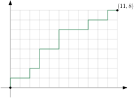

---
# try also 'default' to start simple
theme: seriph
# random image from a curated Unsplash collection by Anthony
# like them? see https://unsplash.com/collections/94734566/slidev
background: https://cover.sli.dev
# some information about your slides (markdown enabled)
title: 排列组合与递推计数
# apply UnoCSS classes to the current slide
class: text-center
# https://sli.dev/features/drawing
drawings:
  persist: false
# slide transition: https://sli.dev/guide/animations.html#slide-transitions
transition: slide-left
# enable MDC Syntax: https://sli.dev/features/mdc
mdc: true
# duration of the presentation
duration: 35min
lineNumbers: true
colorSchema: light
---

# 排列组合与递推计数


---

# 内容

- 加法原理和乘法原理
- 排列与组合
- 计算组合数
- 递推计数
- 十二重计数法

---
layout: section
---

# 第一节

<p> </p>

加法原理和乘法原理


---


# 加法原理

<p> </p>

也称**分类计数原理**。

设一些东西被分成了 $n$ 堆，这些堆从 $1$ 到 $n$ 编号，第 $i$ 堆里有 $a_i$ 个东西，那么这些东西个数是
$$a_1 + a_2 + \dots + a_n.$$

---

# 乘法原理

<p> </p>

也称**分步计数原理**。

设做一件事有 $n$ 个步骤，完成第 $i$ 个步骤有 $a_i$ 种方法，那么做这件事一共有 $a_1 \times a_2 \times \dots \times a_n$ 种方法。

<div class=example>

从 $A$ 到 $B$ 有 $3$ 条不同的道路，从 $B$ 到 $C$ 有 $2$ 条不同的道路，如下图所示。从 $A$ 经 $B$ 到 $C$ 的道路数为
$$3 \times 2 = 6.$$


</div>

---


# 应用乘法原理的例子


<div class=example>

从 $0,1,2,3,4$ 中选取四个不同的数字，能组成多少个不同四位数？  

最小的四位数是 $1000$，最大的四位数是 $9999$。

</div>

<div v-click>

答案是 $4 \times 4 \times 3 \times 2 = 96$。

</div>

<div v-click class=example>

把 $2n$ 个人两两配对，有多少种方法？

</div>

<div v-click>

答案是 $(2n-1)\times(2n-3) \times \dots \times 1$。

</div>

<div v-click>

另一种解法，答案是 $(2n)! / (2^{n} n!)$。

</div>

<!-- 

通常约定阶乘的优先级高于乘。

（2n)! / 2^n = 1 * 1 * 3 * 2 * 5 * 3 ... * (2n - 1) * n 
  所以 (2n)! / (2^n n!) = 1 * 3 * 5 * ... * (2n - 1)
 -->


---

# 例题
Divide 01 String [yukicoder 2541](https://yukicoder.me/problems/no/2541)

给你一个长为 $N$ 的 01 串 $S$。  
把 $S$ 分成若干段有 $2^{N-1}$ 种方法。其中有多少种方法满足：每一段里至少有一个 1？

输出答案模 $998244353$。

$2 \le N \le 2\times 10^5$

<div class="grid grid-cols-2 gap-10">

<div>


```txt [输入]{*}{lines:false}
3
101
```

```txt [输出]{*}{lines:false}
3
```

</div>

<div>


```txt [输入]{*}{lines:false}
3
010
```

```txt [输出]{*}{lines:false}
1
```

</div>

</div>

---

# 分析

- 开头和末尾连续的 0 不能切断。
- 夹在两个 1 之间的连续的 0 最多切一刀。
- 两个相邻的 1 之间可以切断也可以不切断。

总之，如果某两个1之间夹着 $k$ 个连续的 0，即形如
$$
1\underbrace{0\cdots 0}_{k\ 个\ 0}1,
$$
那么这一段上有 $k+1$ 个空隙。对于这一段，可以选择一个空隙切断或者一个都不切，一共有 $k+2$ 种选择。

注意：若 $S$ 里全是 0，则答案是 $0$。

---

# 代码

```cpp
const int mod = 998244353;

int main() {
  int n; cin >> n;
  string s; cin >> s;
  int last = -1; // 上一个1的位置
  long long prod = 1;
  for (int i = 0; i < n; i++) {
    if (s[i] == '1') {
      if (last != -1)
        prod = prod * (i - last + 1) % mod;
      last = i;
    }
  }
  if (last == -1)
    prod = 0;
  cout << prod << '\n';
  return 0;
}
```

---
layout: section
---

# 第二节

<p> </p>

排列与组合

---

<div class=definition>

一些东西排成一行叫作一个**排列**（permutation）。排列是讲顺序的。

从 $n$ 个不同东西中取出 $r$ 个排成一行（$r \le n$），所有可能得到的排列的个数，叫做**排列数**。  
记作 $P(n, r)$ 或 $\mathrm{P}_n^r$ 或 $\mathrm{A}_n^{r}$。我们有
$$
P(n, r) = n\times (n - 1) \times \dots \times (n - r + 1).
$$
</div>

<div v-click class=proof>

应用乘法原理。排列的第一项有 $n$ 个选择，不论选什么作第一项，第二项有 $n-1$ 个选择，……，不论前 $r-1$ 项选什么，第 $r$ 项有 $n-(r-1)$ 个选择。
</div>


<div v-click class=topic-box>

- $n$ 个东西的（全）排列的数量是 $P(n,n) = n \times (n-1) \times \dots \times 1 = n!$。
- 我们约定 $P(n, 0) = 1$。
- 用阶乘记号 $P(n, r) = n!/(n - r)!$。 
</div>

<!-- 乘法原理的直接应用 -->
<!-- 介绍阶乘记号 -->

---

<div class=definition>

一些东西叫作一个**组合**（combination）。组合是不讲顺序的。

从 $n$ 个不同东西中取出 $r$ 个，可能的结果有多少种？  
我们把这个数量叫作**组合数**，记作 ${n \choose r}$ 或 $\mathrm{C}_n^r$。${n\choose r}$ 读作“$n$ 选 $r$”。  
我们有
$$
{n\choose r} = {P(n, r)\over r!} = {n(n-1) \cdots (n - r + 1) \over r!} = {n!\over r!(n-r)!}.
$$
</div>

<div v-click class=proof>

从 $n$ 个东西中选 $r$ 个出来排成一行，每个排列都可通过下列两步生成，并且方法唯一：
1. 从 $n$ 个东西中选择 $r$ 个。
2. 把所选的 $r$ 个东西按某个顺序排列。

做第一步的方法数是 ${n\choose r}$，做第二步的方法数是 $P(r, r) = r!$。  
根据乘法原理，我们有 $P(n, r) = r! \cdot {n\choose r}$.
</div>

---

<div class=topic topic=对称恒等式>

$$
{n\choose r} = {n \choose n - r}, \qquad 0 \le r \le n.
$$

</div>

证明：从组合数公式 ${n\choose r} = {n!\over r!(n-r)!}$ 看，${n \choose n-r}$ 相比 ${n\choose r}$ 无非是交换分母上 $r!$ 和 $(n-r)!$ 的位置。

我们再给出一个**组合证明**：从 $n$ 个元素里选 $r$ 个，所选的 $r$ 个元素和未选的 $(n-r)$ 个元素一一对应。


<div class=topic topic="加法公式（帕斯卡公式）"> 

$$
{n\choose r} = {n-1 \choose r} + {n - 1 \choose r - 1}, \qquad 1 \le r \le n.
$$

</div>


证明：从 $n$ 个不同的东西里选 $r$ 个，选法可以分成两类
- 不选第一个东西，从其余 $n-1$ 个东西里选 $r$ 个，有 ${n-1 \choose r}$ 种方法。
- 选第一个东西，再从其余 $n-1$ 个东西里选 $r-1$ 个，有 ${n-1 \choose r-1}$ 种方法。

---

# 计算组合数

- 组合数很大。${10 \choose 5} = 252$，${20 \choose 10} = 184756$，${32 \choose 16}=601080390$（$10^8$），  
${40\choose 20} = 137846528820$（$10^{11}$），${64 \choose 32}=1832624140942590534$（$10^{18}$）。
- 所以通常我们只需要计算组合数模某个较大的素数 $p$（比如 $10^9+7$）。

- 加法公式 ${n\choose r} = {n-1 \choose r} + {n - 1 \choose r - 1}$ 可以看作组合数的**递推式**。我们可以利用它来计算组合数。
```cpp
const int mod = 1e9 + 7;
const C[505][505];
for (int i = 0; i <= 500; i++) {
  C[i][0] = 1; // 边界条件
  for (int j = 1; j <= i; j++)
    C[i][j] = (C[i - 1][j] + C[i - 1][j - 1]) % mod;
}
```

- 当 $n$ 较大时，比如 $10^6$，用递推法计算 ${n\choose r}$ 模 $p$ 就太慢了。此时我们可以利用公式 ${n\choose r} = {n! \over (n-r)! r!}$。  
我们预先算出 $1!$ 到 $N!$，和它们在模 $p$ 下的**乘法逆元**。然后就能快速算出 ${n! \over (n-r)! r!}$ 模 $p$。
- 根据**费马小定理**，$x$ 在模 $p$ 下的乘法逆元等于 $x^{p-2}$。可以用**快速幂**计算。

---

# 例题

组合数问题 [洛谷 B3717](https://www.luogu.com.cn/problem/B3717) 

给定整数 $N, T$。回答 $T$ 个询问，每次给出 $n, m$，你要计算 ${n\choose m}$，模 $998244353$。  
输出所有询问结果的按位异或和。

- $1 \le T \le 5\times 10^6$
- $0 \le m \le n \le N \le 5 \times 10^6$
- 时限 2 秒。

---


```cpp
const int mod = 998244353; //是素数
long long inverse(long long x) {
  long long ans = 1;
  int n = mod - 2;
  while (n > 0) {
    if (n & 1) ans = ans * x % mod;
    x = x * x % mod;
    n >>= 1;
  }
  return ans;
}
int main() {
  ios::sync_with_stdio(0);
  cin.tie(0);
  int T, N; cin >> T >> N;
  vector<long long> f(N + 1);
  f[0] = 1;
  for (int i = 1; i <= N; i++)
    f[i] = f[i - 1] * i % mod;
  long long ans = 0;
  while (T--) {
    int n, m; cin >> n >> m;
    ans ^= f[n] * inverse(f[n - m] * f[m] % mod) % mod;
  }
  cout << ans << '\n';
}
```


<!-- :stopwatch: 1.6 s -->

---

优化：注意到 $n!$ 的乘法逆元乘以 $n$ 就是 $(n-1)!$ 的乘法逆元。我们只需要算 $N!$ 的乘法逆元。


```cpp
int main() {
  ios::sync_with_stdio(0);
  cin.tie(0);

  int T, N;
  cin >> T >> N;
  vector<long long> f(N + 1), invf(N + 1);
  f[0] = 1;
  for (int i = 1; i <= N; i++)
    f[i] = f[i - 1] * i % mod;
  invf[N] = inverse(f[N]);
  for (int i = N; i >= 1; i--)
    invf[i - 1] = invf[i] * i % mod;
  long long ans = 0;
  while (T--) {
    int n, m;
    cin >> n >> m;
    ans ^= f[n] * invf[n - m] % mod * invf[m] % mod;
  }
  cout << ans << '\n';
}
```

<!-- :stopwatch: 1.11 s -->

---


<div class=question>

设 $m, n$ 是非负整数。在平面直角坐标系上，从原点 $(0, 0)$ 出发走到 $(m, n)$，每一步可以向右走 $(x, y) \to (x+1, y)$ 或向上走 $(x, y) \to (x, y+1)$。有多少种走法？



</div>

<div v-click>

答案是 ${m + n \choose m}$。

</div>


---


<div class=definition>

一些东西排在圆周上叫作一个**圆排列**。

</div>

如果一个圆排列通过旋转可以变成另一个圆排列，我们认为二者是同一个圆排列。  
例：{.inline} 和 {.inline} 是同一个圆排列。{.inline} 和 {.inline} 不是同一个圆排列。

<div class=topic-box>

- $n$ 个不同的东西的圆排列数是 $(n-1)!$。
- 从 $n$ 个不同的东西中选出 $r$ 个东西的圆排列数是 $P(n,r)/r$。
</div>

---

# 有重复元素的排列

<div class=question>

两个 a 和两个 b 有多少个排列？

</div>

<div v-click>

有 $6$ 个排列：aabb，abab，abba，baab，baba，bbaa。

</div>

<div v-click class=question>

十个 a 和八个 b 有多少个排列？

</div>

<div v-click class=proposition>

$n_1$ 个 $a_1$，$n_2$ 个 $a_2$，……，$n_k$ 个 $a_k$ 有
$$
(n_1 + n_2 + \dots + n_k)!\over n_1!n_2!\cdots n_k!
$$
个排列。

</div>

---

# 可重组合

<div class=question>

从 a，b，c 三个东西中**有放回地**选取两个元素，**不计顺序**，有多少种不同的结果？

</div>

有 6 种结果：aa，bb，cc，ab，ac，bc。

<div v-click class=definition>

设 $S$ 是一个 $n$ 元集。从 $S$ 中有放回地选取 $r$ 个元素，不计顺序，结果称为 $S$ 的一个 **$r$-可重组合**。

</div>

---

<div class=proposition>

$n$-元集的 $r$-可重组合的数量是 ${n+r - 1 \choose r}$。

</div>

<div class=proof>

不失一般性，设 $n$ 元集 $S$ 为 $\set{1, \dots, n}$。把 $S$ 的每个 $r$-可重组合按元素从小到大的顺序写出
$$a_1 a_2 \dots a_r, \quad a_1 \le a_2 \le \dots \le a_r.$$
令
$$
b_i = a_i + i - 1, \quad 1\le i \le r.
$$
不难看出，诸 $b_i$ 互不相同，所以 $\set{b_1, b_2,\dots,b_r}$ 是集合 $T = \set{1, \dots, n + r - 1}$ 的一个 $r$-子集。反过来，对 $T$ 的任一 $r$-子集 $\set{b_1, \dots, b_r}$（$b_1 < \dots <b_r$），由
$$
a_i = b_i - i + 1, \quad 1 \le i \le r
$$
所定出的诸 $a_i$ 的组合就是 $S$ 的一个 $r$-可重组合。因为二者**一一对应**，所以这两种组合的个数相同，而前者的个数是 ${n+r-1\choose r}$。

</div>

---

## 第二个证明


设集合 $S = \set{1, \dots, n}$ 的 $r$-可重组合 $a_1a_2\dots a_r$ 中，$i$ 出现了 $x_i$ 次，则有
$$
r = x_1 + x_2 + \dots + x_n, \quad x_i \ge 0\ (1 \le i \le n).  \tag{$\star$}
$$
反之，$(\star)$ 的任一非负整数解 $(x_1, \dots, x_n)$ 都对应于 $S$ 的唯一一个 $r$-可重组合。因此，$n$ 元集的 $r$-可重组合数就是 $(\star)$ 的非负整数解的个数。

为求 $(\star)$ 的解数，令
$$
y_i = x_i + 1 \quad (1 \le i \le n),
$$
则 $(\star)$ 的解数与
$$
r + n = y_1 + y_2 + \dots + y_n,\quad  y_i \ge 1 \quad(1\le i \le n)
$$
的解数相同。

---

<p> </p>

方程
$$
m = y_1 + y_2 + \dots + y_n,\quad y_i\ge 1\ (1 \le i \le n)\quad  m \ge n \tag{$\blacktriangle$}
$$
的一个解 $(y_1, y_2, \dots, y_n)$ 与下列图形之间有一一对应关系：
$$

\underbrace{\underbrace{*\dots*}_{y_1个点}\overbrace{|\underbrace{*\dots *}_{y_2个点}|\cdots |}^{n-1条竖线}\underbrace{*\dots *}_{y_n个点}}_{m个点}
$$

这样一来，方程 $(\blacktriangle)$ 的解数与上图的可能的个数相同，而后者为 ${m-1\choose n - 1}$。把 $m = n+r$ 代入，得 $(\star)$ 的解数
$$
{n + r - 1 \choose n - 1} = {n+r - 1 \choose r}.
$$

这个方法叫作**隔板法**。

---

$n$-元集的 $r$-组合数与 $r$-可重组合数的表达式很像：
$$
\begin{aligned}
{n\choose r} &= {n(n-1)\dots(n-r+1)\over r!}, \\
{n+r - 1 \choose r} &= {n(n+1) \dots (n+r - 1) \over r!}.
\end{aligned}
$$
二者的分母相同，而分子都是从 $n$ 开始的 $r$ 个数的连乘积，只不过一个是递减的数串，而另一个却是递增的。


为了直观，我们给 $n$-元集的 $r$-可重组合数一个特别的记号，
$$
\gdef\multichoose#1#2{\left(\kern-.3em\left(\genfrac{}{}{0pt}{}{#1}{#2}\right)\kern-.3em\right)}
\multichoose{n}{r} := {n+r-1 \choose r}
$$
读作“$n$ 多选 $r$”。


---
layout: section
---

# 第四节

<p> </p>

二项式定理


---

# $(x+y)^n$ 的展开式

<p> </p>

观察
$$
\begin{aligned}
(x+y)^2 &= (x+y)(x+y) \\
&= x^2 + xy + yx + y^2 \\
&= x^2 + 2xy + y^2 \qquad (根据乘法交换律合并同类项)
\end{aligned}
$$
和
$$
\begin{aligned}
(x+y)^3 &= (x+y)(x+y)(x+y) \\
&= (x^2 + xy + yx + y^2)(x + y) \\
&= x^3 + xyx + yx^2 + y^2x + x^2y + xy^2 + yxy + y^3 \\
&= x^3 + 3x^2y + 3xy^2 + y^3 
\end{aligned}
$$

---


一般地，由
$$
(x+y)^n = \underbrace{(x+y)(x+y) \dots(x+y)}_{n个(x+y)}
$$
可知，
- $(x+y)^n$ 的展开式是从每个括号中各取一个字母的一切可能乘积的和，
- 由于乘法交换律，它的每一项都具有 $x^{k}y^{n-k}$（$k=0, 1, \dots, n$）的形式。

---

# 二项式定理

<div class=theorem>
$$
(x+y)^n = \sum_{k=0}^{n}{n\choose k}x^{k}y^{n-k}, \qquad 整数\, n \ge 0.
$$
</div>

证明：当我们把乘积
$$
(x+y)^n = \underbrace{(x+y)(x+y) \dots(x+y)}_{n个(x+y)}
$$
展开后，每一项都是 $n$ 个因子的乘积，每个因子是 $x$ 或 $y$。有 $k$ 个因子 $x$ 和 $n-k$ 个因子 $y$ 的项的个数，就是合并同类项之后 $x^k y^{n-k}$ 的系数。而这正是从 $n$ 个二项式 $(x+y)$ 中选则 $k$ 个的方法数（这 $k$ 个 $(x+y)$ 贡献因子 $x$），也就是 ${n\choose k}$。

特别地，我们约定，对于任意实数 $x$，$x^0 = 1$，于是 $(x+y)^0 = 1 = {0\choose 0}x^0 y^0$。

组合数 ${n\choose k}$ 也称为<ruby>**二项式系数**<rt>binomial coefficient</rt></ruby>。

---

# 二项式定理的推论

<p> </p>

以 $x = y = 1$ 代入二项式定理，给出
$$
2^n = {n\choose 0} + {n\choose 1} + \dots + {n\choose n}, \quad n \in\Z_{\ge 0}.
$$

而以 $x = -1, y = 1$ 代入二项式定理，给出
$$
0^n = {n\choose 0} - {n\choose 1} + \dots + (-1)^n {n\choose n}, \quad n \in\Z_{\ge 0}. 
$$

以上两个等式表明
$$
{n\choose 0} + {n\choose 2} + \dots = {n\choose 1} + {n\choose 3} + \dots = 2^{n-1},\quad n\in\Z_{\ge 1}. 
$$

---

# 练习

<p> </p>

用组合方法证明下列三个恒等式

$$
2^n = {n\choose 0} + {n\choose 1} + \dots + {n\choose n}, \quad n \in\Z_{\ge 0},
$$

$$
\sum_{i=1}^{n} i {n\choose i} = n \cdot 2^{n-1}, \quad n\in\Z_{\ge 1},
$$

$$
{n\choose 0} + {n\choose 2} + \dots = {n\choose 1} + {n\choose 3} + \dots = 2^{n-1},\quad n\in\Z_{\ge 1}. 
$$

---

# 解析

$$
2^n = {n\choose 0} + {n\choose 1} + \dots + {n\choose n}, \quad n \in\Z_{\ge 0},
$$

等号左右都是 $n$ 元集的子集数量。

$$
\sum_{i=1}^{n} i {n\choose i} = n \cdot 2^{n-1}, \quad n\in\Z_{\ge 1},
$$

等号左边是 $n$ 元集的所有非空子集的元素个数之和。对元素 $x$，有 $2^{n-1}$ 个子集含 $x$。所以 $n\cdot 2^{n-1}$ 也是 $n$ 元集的所有非空子集的元素个数之和。

---

$$
{n\choose 0} + {n\choose 2} + \dots = {n\choose 1} + {n\choose 3} + \dots = 2^{n-1},\quad n\in\Z_{\ge 1}. 
$$

设 $X=\set{1,2,\dots, n}$，$A=\set{S\subseteq X : |S|\,为偶数且\,1\in S}$，$B=\set{S\subseteq X: |S|\, 为奇数且\, 1\in S}$，$C=\set{S\subseteq X : |S|\,为偶数且\, 1\not\in S}$，$D=\set{S\subseteq X : |S|\,为奇数且\, 1\not\in S}$。

考虑映射 $f:A\to D$ 为 $f(S) = S\smallsetminus x$，显然 $f$ 为双射，所以 $|A|=|D|$。类似地，有 $|B|=|C|$。因此
$$
\sum_{k为奇数} {n\choose k} = |B| + |D| = |A|+|C| \sum_{k为偶数} = {n\choose k}.
$$

---


<p> </p>

把二项式系数排列成如下三角形
$$
\begin{matrix}
&&&&& {0\choose 0} \\
&&&&{1\choose 0} & &{1\choose 1} \\
&&&{2\choose 0} & & {2\choose 1} & &{2\choose 2} \\
&&{3\choose 0}  & & {3\choose 1} && {3\choose 2} && {3\choose 3} \\
&{4\choose 0} && {4\choose 1} && {4\choose 2} && {4\choose 3} && {4\choose 4} \\
\dots&&&&&\cdots &&&&&\dots
\end{matrix}
$$


即
$$
\begin{matrix}
&&&&& 1 \\
&&&&1 & &1 \\
&&&1 & & 2 & & 1 \\
&&1 & & 3 && 3 && 1 \\
&1 && 4 && 6 && 4 && 1 \\
\dots&&&&&\cdots &&&&&\dots
\end{matrix}
$$


称为**杨辉三角**或帕斯卡三角。


---
layout: section
---

# 第五节

<p> </p>

递推计数

---

<div class=question>

有 $N$ 个东西，编号 $1$ 到 $N$。

要从中选一些，可以一个都不选，编号相邻的两个东西（$i$ 和 $i+1$）不能都选。有多少种方法？
</div>

<div v-click>

考虑递推。
定义 $f[n]$ 为从 $n$ 个东西里选时的方法数，$n = 0, 1, 2, \dots$。
- 边界条件：$f[0] = 1$，$f[1] = 2$。
- 递推式：$f[n] = f[n-1] + f[n-2]$，$n \ge 2$。

</div>

<div v-click class=topic topic=重新表述>

有多少个长为 $N$ 的 01 序列 $A=(A_1, \dots, A_N)$ 满足
- 对于每个 $i = 1, \dots, N-1$ 都有 $A_i$ 和 $A_{i+1}$ 不都等于 1。
</div>


---

# 例题

Distinct Adjacent [abc307_e](https://atcoder.jp/contests/abc307/tasks/abc307_e)

有 $N$ 个人，从 $1$ 到 $N$ 编号，站成一圈。

我们要给每个人一个 $0$ 到 $M-1$ 之间的整数（包括 $0$ 和 $M-1$）。做这件事有 $M^N$ 种方法，其中有多少种方法满足相邻的两个人的数不同？

输出答案模 $998244353$。

$2 \leq N,M \leq 10^6$。

<!-- <div v-click class=topic topic=重新表述>

给定正整数 $N, M$。求有多少个长为 $N$ 的整数序列 $A = (A_1, \dots, A_N)$ 满足
- $0 \le A_i \le M - 1$
- $A_i \ne A_{i+1}$
- $A_1 \ne A_N$

</div> -->

---

考虑递推。
- 令 $f[n]$ 为有 $n$ 个人时的答案，$n \ge 2$。
- 边界条件：$f[2] = M(M-1)$。

设给编号为 $i$ 的人的数是 $x_i$，$1 \le i \le n$。

## 解法一

<div class="grid grid-cols-2 gap-4">

<div>

若 $n$（$n \ge 3$）个人站成一条线，而非一个圆，答案是 $M(M-1)^{n-1}$，从中扣除 $x_1 = x_n$ 情况就是 $n$ 个人站成一个圆的答案。而 $x_n=x_1$ 时，不妨把第 $n$ 个人和第 $1$ 个人[当成一个人]{.emph}，化为 $n-1$ 个人站成一个圆的情形。所以有
$$
f[n] = M(M-1)^{n-1} - f[n-1].
$$
若定义 $f[1] = 0$，则上式对 $n=2$ 也成立。
</div>

{h=50}

</div>

---

```cpp [解法一]
const int mod = 998244353;

int main() {
  int N, M;
  cin >> N >> M;
  long long ans = 0;
  long long prod = M;
  for (int i = 2; i <= N; i++) {
    prod = prod * (M - 1) % mod;
    ans = prod - ans;
  }
  ans %= mod;
  if (ans < 0) ans += mod;
  cout << ans << '\n';
}
```


---

## 解法二

假想第 $n$ 个人是在已经有 $n-1$ 个人站成一圈的情况下加进去的。


分两类：
- $x_{n-1} = x_{1}$，相当于有 $n-2$ 个人站成一圈，此时 $x_n$ 有 $M-1$ 种取值。
- $x_{n-1} \ne x_{1}$，相当于有 $n-1$ 个人站成一圈，此时 $x_n$ 有 $M-2$ 种取值。

综上，有递推式
$$
f[n] = (M-1)f[n-2] + (M-2)f[n-1], \qquad n\ge 4.
$$
若定义 $f[1] = 0$，则上式对 $n=3$ 也成立；
若再定义 $f[0] = M$，则上式对 $n=2$ 也成立。

---

```cpp [解法二]
const int mod = 998244353;

int main() {
  int N, M;
  cin >> N >> M;
  vector<long long> f(N + 1);
  f[0] = M;
  f[1] = 0;
  for (int i = 2; i <= N; i++)
    f[i] = ((M - 1) * f[i - 2] + (M - 2) * f[i - 1]) % mod;
  cout << f[N] << '\n';
}
```

---

<div class=definition>

设序列 $P=(P_1, \dots, P_N)$ 是 $1, 2, \dots, N$ 的一个排列。如果对每个 $i = 1, \dots, N$ 都有 $P_i \ne i$，则称 $P$ 是一个**错位排列**。

我们把 $1, 2,\dots, N$ 的错位排列的数量记作 $D_N$。
</div>

- $D_1 = 0$
- $D_2 = 1$：$(2, 1)$
- $D_3 = 2$：$(2, 3, 1)$，$(3, 1, 2)$

---

<div class=question>

如何计算 $D_n$？
</div>

考虑递推。我们可以按下述方法得到一个错位排列。
1. 确定 $1$ 的位置。设 $1$ 排在第 $i$ 位（$2 \le i \le n$）。
2. 确定 $i$ 的位置。分两种情况
    - $i$ 排在第 $1$ 位。此时还剩 $n-2$ 个数，每个数都有一个禁止位置，有 $D_{n-2}$ 个排列。
    - $i$ 不排在第 $1$ 位。此时还剩 $n-1$ 个数，每个数都有一个禁止位置，有 $D_{n-1}$ 个排列。

于是我们得到递推式
$$
D_n = (n-1) \cdot (D_{n-2} + D_{n-1}).
$$

边界条件：$D_0 = 1$，$D_1 = 0$。

---

# 例题

<p> </p>

有 $n$ 条绳子。每条绳子有两个绳头，总共有 $2n$ 个绳头。  
将 $2n$ 个绳头任意两两相连，有 $(2n-1)(2n-3) \dots 1$ 种配对方案。

对于每个 $k = 1, 2, \dots, n$，计算有多少种配对方案满足：最终恰好形成 $k$ 个圈。

你需要将结果对 $998244353$ 取模。

$1 \le n \le 1000$。


---

考虑递推。

- $f[i][j]$：把前 $i$ 条绳子系成 $j$ 个圈，有多少种方法？

<div class=topic topic=分类>

- 第 $i$ 条绳子自成一个圈。转移到 $f[i - 1][j - 1]$。
- 第 $i$ 条绳子在一个大圈里。  
解开第 $i$ 条绳子的两头所在的两个节，然后把剩下的两个绳头系起来，就变成把前 $i-1$ 条绳子系成 $j$ 个圈的情形。  
反过来想，把前 $i-1$ 条绳子两两系起来，形成 $i-1$ 个结。选一个结，解开，把第 $i$ 条绳子接进去。有 $(i-1) \cdot 2$ 种方法。
</div>

于是我们得到递推式
$$
f[i][j] = f[i - 1][j - 1] + f[i - 1][j] \cdot (i-1) \cdot 2.
$$

边界条件：$f[0][0] = 1$.

---

# 例题

Gerald and Giant Chess [CF559C](https://codeforces.com/problemset/problem/559/C)

有一个 $h\times w$ 的棋盘，上面的每个格子被涂成黑色或白色。有 $n$ 个黑格子，第 $i$ 个黑格子的位置是 $(r_i, c_i)$。

要把一个棋子从左上角的格子移动到右下角的格子，每一步只能向下或向右移动到相邻的格子里，但不能经过黑色格子。求移动棋子的方法数，模 $10^9+7$。


- $1 \le h, w \le 10^5$
- $1 \le n \le 2000$


---

# 解法


- 把终点 $(h, w)$ 也当成黑格子。
- 对黑格子 $(r, c)$，设从 $(1, 1)$ 到 $(r, c)$ [不经过别的黑色格子]{.emph}的方法数是 $f(r, c)$，
  $$
  f(r, c) = {r+c-2 \choose r-1} - \sum_{\substack{黑格子 (x, y):\\从(1,1) 到(r,c)可能经过(x,y)}} f(x,y) {r-x+c-y \choose r - x}.
  $$
- 以上式为递推式，我们就得到一个**递推算法**。
- 上式中的求和是把从 $(1,1)$ 到 $(r, c)$ [中途经过黑格子]{.emph}的路径按照经过的第一个黑格子**分类**。

---

```cpp
long long fact[maxn];//阶乘
long long choose(int n, int k) {//组合数
  return fact[n] * inverse(fact[k] * fact[n - k] % mod) % mod;
}
void solve() {
  fact[0] = 1;
  for (int i = 1; i <= 2e5; i++)
    fact[i] = fact[i - 1] * i % mod;
  int h, w, n; cin >> h >> w >> n;
  vector<pair<int, int>> a(n);
  for (int i = 0; i < n; i++) cin >> a[i].first >> a[i].second;
  sort(a.begin(), a.end());
  a.push_back({h, w});

  vector<long long> f(n + 1);
  for (int i = 0; i <= n; i++) {
    f[i] = choose(a[i].first + a[i].second - 2, a[i].first - 1);
    for (int j = 0; j < i; j++)
      if (a[j].second <= a[i].second)
        f[i] -= f[j] * choose(a[i].first + a[i].second - a[j].first - a[j].second,
                              a[i].first - a[j].first) % mod;
    f[i] %= mod;
  }
  if (f[n] < 0) f[n] += mod;
  cout << f[n] << '\n';
}
```

---
layout: section
---

# 第六节

<p> </p>

十二重计数


---

<div class=question>

把 $n$ 个球放进 $x$ 个盒子里，有多少种方法？

</div>

这个问题有 12 种具体的问法：
- 球的属性：互异（区别）或全同（不区别）
- 盒子的属性：互异或全同
- 对如何放球加的限制：
    - 无限制
    - 每个盒子里至多有一个球
    - 每个盒子里至少有一个球

---

我们把 12 个问题和答案列表如下

| $n$ 个球 | $x$ 个盒子 | 无限制 | 至多一个球 | 至少一个球 |
| :--- | :--- | :--- | :--- | :--- |
| 区别 | 区别 | $x^n$ | $P(x,n)$ | $x!S(n,x)$ |
| 不区别 | 区别 | $\multichoose{x}{n}$ | $x \choose n$ | $\multichoose{x}{n-x}$ |
| 区别 | 不区别 | $\sum_{k=0}^{x}S(n,k)$ | $[n \le x]$ | $S(n,x)$ |
| 不区别 | 不区别 | $\sum_{k=0}^{x} p_k(n)$ | $[n \le x]$ | $p_x(n)$ |


- $S(n,x)$ 表示把一个 $n$-元集划分为 $x$ 个非空子集的方法数，称为**第二类斯特林数**。约定 $S(0, 0) = 1$。

- 若 $n\le x$ 则 $[n\le x] = 1$，否则 $[n\le x] = 0$。这种记号称为**艾弗森括号**。
- $p_k(n)$ 表示把正整数 $n$ 拆分为 $k$ 个正整数（不计顺序）的方法数。
约定 $p_0(0) = 1$。

