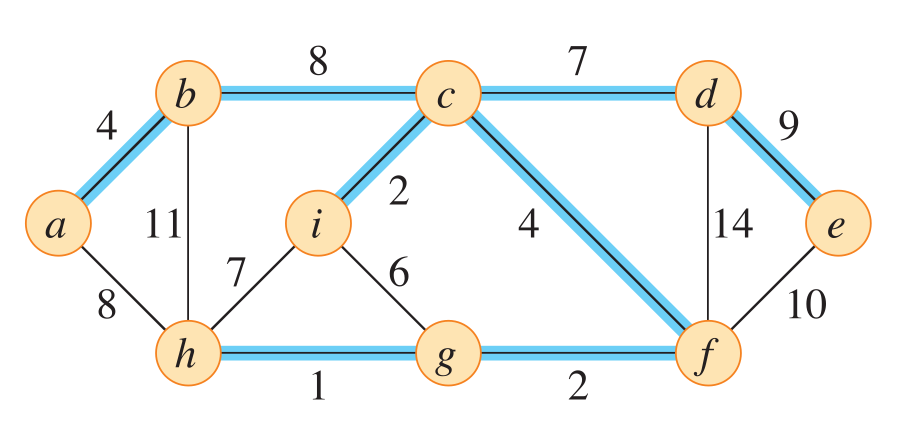
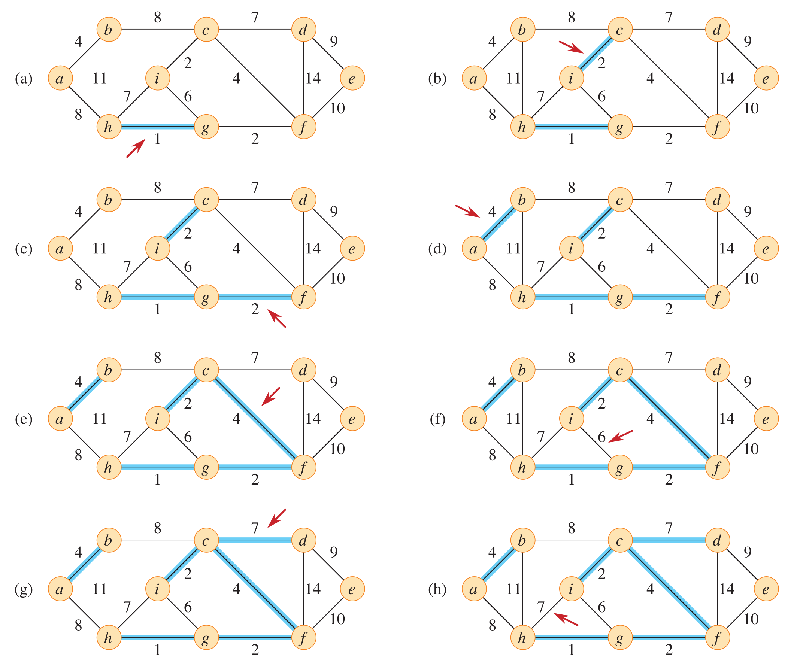
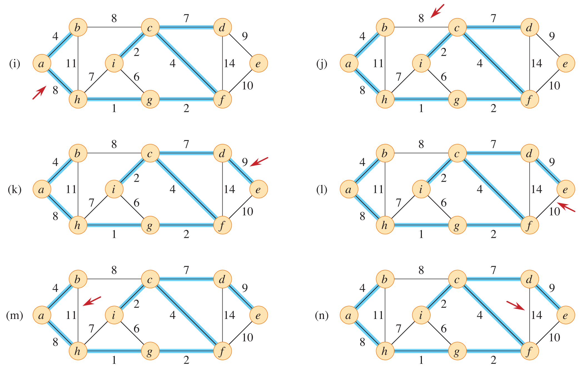
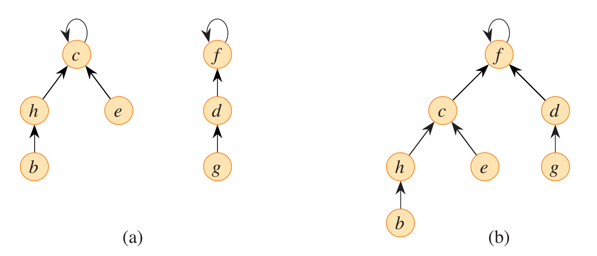
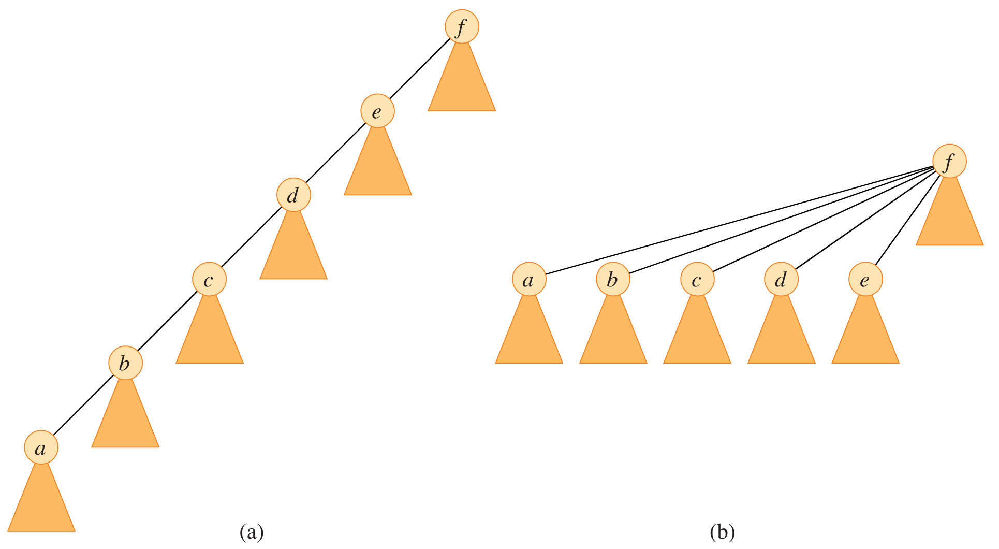
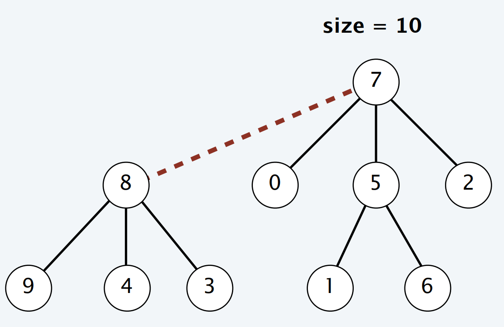

---
# try also 'default' to start simple
theme: seriph
# some information about your slides (markdown enabled)
title: 生成树问题
info: |
  ## Slidev Starter Template
  Presentation slides for developers.

  Learn more at [Sli.dev](https://sli.dev)
# apply UnoCSS classes to the current slide
class: text-center
# https://sli.dev/features/drawing
drawings:
  persist: false
# slide transition: https://sli.dev/guide/animations.html#slide-transitions
transition: slide-left
# enable MDC Syntax: https://sli.dev/features/mdc
mdc: true
# duration of the presentation
duration: 35min
colorSchema: light
lineNumbers: true
---

# 生成树问题


---

# 内容

- 最小生成树
- 最小瓶颈生成树

---
layout: section
---

# 最小生成树

Minimum Spanning Tree，MST

---
layout: two-cols
layoutClass: gap-4
---



::right::

输入：

无向图 $G=(V,E)$

边权 $w: E \to \R$

输出：

$n-1$ 条边，构成 $G$ 的生成树，且边权之和最小。

---

# Kruskal 算法


- 初始化：把边按权值从小到大排序 $(e_1, \dots, e_m)$。空图 $(V, \varnothing)$。
- 加边：对于每个 $i = 1, \dots, m$，若 $e_i$ 的两个端点不连通就把 $e_i$ 加入。


---
layout: two-cols-header
layoutClass: gap-8
---

# Kruskal 算法

::left::



::right::



---
layout: section
---

# 并查集

---
layout: two-cols
---



::right::

```cpp
struct dsu {
  vector<int> parent;
  dsu(int n) : parent(n, -1) {} //编号从0开始
  int find(int x) {
    while (parent[x] != -1)
      x = parent[x];
    return x;
  }
  bool unite(int x, int y) {
    x = find(x);
    y = find(y);
    if (x == y)
      return false;
    parent[x] = y;
    return true;
  }
};
```

---
layout: two-cols-header
layoutClass: gap-4
---


# 路径压缩


::left::




::right::

```cpp
struct dsu {
  vector<int> parent;
  dsu(int n) : parent(n, -1) {} //编号从0开始
  int find(int x) {
    return parent[x] == -1 ? x : parent[x] = find(parent[x]);
  }
  bool unite(int x, int y) {
    x = find(x);
    y = find(y);
    if (x == y)
      return false;
    parent[x] = y;
    return true;
  }
};
```


---
layout: two-cols-header
layoutClass: gap-4
---
# Link by size

::left::



- 维护每个树（集合）的 size（节点数）。
- 合并树时，把 size 较小的树连向 size 较大的树。

::right::

```cpp
struct dsu {
  vector<int> ps; // parent or size
  dsu(int n) : ps(n, -1) {} //编号从0开始
  int find(int x) {
    return ps[x] < 0 ? x : ps[x] = find(ps[x]);
  }
  bool unite(int x, int y) {
    x = find(x);
    y = find(y);
    if (x == y)
      return false;
    if (ps[x] < ps[y]) // link by size
      swap(x, y);
    ps[y] += ps[x];
    ps[x] = y;
    return true;
  }
};
```

---
layout: two-cols-header
---

# 并查集的时间复杂度

::left::


Robert Tarjan

::right::


设有 $n$ 个元素和 $m$ 个 find 操作。

<div class=topic-box>

只使用路径压缩，最坏情况下运行时间是 $O(n + f\cdot (1 + \log_{2 + m/n} n))$。
</div>

- 通常足够快。

<div class=topic-box>

设 $m \ge n$。使用路径压缩和 link by size，最坏情况下运行时间是 $O(m\cdot\alpha(m,n))$。

</div>

- $\alpha(m, n)$ 是一个增长极其缓慢的函数，对于人类能想象的 $n$ 和 $m$，$\alpha(m, n)$ 不超过 $4$。

---
layout: section
---

# 例题


---

# 道路修复

[洛谷P14362](https://www.luogu.com.cn/problem/P14362)


C 国的交通系统由 $n$ 座城市与 $m$ 条连接两座城市的双向道路构成，第 $i$ 条道路连接城市 $u_i$ 和 $v_i$。**任意两座城市都能通过若干条道路相互到达。**

近期由于一场大地震，所有 $m$ 条道路都被破坏了，修复第 $i$ 条道路的费用为 $w_i$。与此同时，C 国还有 $k$ 个准备进行城市化改造的乡镇。对于第 $j$ 个乡镇，C 国对其进行改造的费用为 $c_j$。在改造完第 $j$ 个乡镇后，可以在这个乡镇与原来的 $n$ 座城市间建造若干条道路，其中在它与城市 $i$ 之间建造一条道路的费用为 $a_{j,i}$。C 国可以在这 $k$ 个乡镇中选择**任意多个**进行改造，也可以不选择任何乡镇进行改造。

C 国政府希望以最低的费用将**原有**的 $n$ 座城市两两连通，也即任意两座原有的城市都能通过若干条修复或新建造的道路相互到达。求将原有的 $n$ 座城市两两连通的最小费用。


- $1 \leq n \leq 10^4$，$1 \leq m \leq 10^6$，$0 \leq k \leq 10$
- $1 \leq u_i, v_i \leq n$，$u_i \neq v_i$，$0 \leq w_i \leq 10^9$
- $0 \leq c_j, a_{j, i} \leq 10^9$

---

<div class=topic-box>

$1 \leq n \leq 10^4$，$1 \leq m \leq 10^6$，$0 \leq k \leq 10$

</div>

- $n$ 不大，$m$ 较大，$k$ 很小。

<div v-click>

暴力算法
- 枚举对哪些乡镇进行改造。设选 $t$ 个乡镇进行改造。
  - 问题变成求一个有 $n + t$ 个点和 $m + tn$ 条边的图的 MST。
  - 用 Kruskal 算法求 MST。
  - 计算总费用。
</div>

<div v-click>

时间：$O(2^k (n + m\log m))$

和 $n$ 相比，$t$ 很小，和 $m$ 相比，$tn$ 不大；所以时间的表达式里把它们省略了。 
</div>

<!-- -->


---

考虑 Kruskal 算法加边的过程：先把边排序，然后加边。
<div class=topic-box>

- 原有的 $m$ 条边至多有 $n-1$ 条可能被加到 MST 中。
- 如果我们指定排序时 $m$ 条边的顺序，那么这 $n-1$ 条边是确定的。就是没有新建边时 MST 里的边。
- 我们把这 $n-1$ 条可以找出来。
- 其余的边用不着。
</div>

<div v-click>

不那么暴力的暴力算法
- 找出只用 $m$ 条旧边时 MST 里的 $n-1$ 条边。
- 枚举对哪些乡镇进行改造。设选 $t$ 个乡镇进行改造。
  - 问题变成求一个有 $n + t$ 个点和 $n-1 + tn$ 条边的图的 MST。
  - 用 Kruskal 算法求 MST。
  - 计算总费用

</div>

<div v-click>

时间：$O(m \log m + 2^{k}(n + kn \log kn))$

</div>

<!-- 还是会超时 -->


---

<div class=topic topic=优化>

不要每次求 MST 都重新排序。

</div>


<div v-click class=algorithm>

- 找出只用 $m$ 条旧边时 MST 里的 $n-1$ 条边。
- **把选出的 $n-1$ 条旧边和 $kn$ 条可能新建的边放一起排序**，得到列表 $L$。
- 枚举对哪些乡镇进行改造。设选 $t$ 个乡镇进行改造。
  - 问题变成求一个有 $n + t$ 个点和 $n-1 + tn$ 条边的图的 MST。
  - 用 Kruskal 算法求 MST
    - 枚举列表 $L$ 里的边，跳过不可用的边（一个端点是未改造的村庄），往图里加。
  - 计算总费用。
</div>

<div v-click>

时间：$O(m \log m + kn \log kn + 2^k kn)$
</div>

---
layout: two-cols
layoutClass: gap-8
---


```cpp
struct Edge { int u, v, w; };
bool cmp(Edge x, Edge y) { return x.w < y.w; }
int main() {
  int n, m, k; cin >> n >> m >> k;
  vector<Edge> e(m);
  for (int i = 0; i < m; i++) {
    int u, v, w; cin >> u >> v >> w;
    e[i] = {u - 1, v - 1, w}; //点的编号从0开始
  }
  sort(e.begin(), e.end(), cmp);
  dsu g(n);
  vector<Edge> f;
  long long ans = 0;
  for (Edge t : e)
    if (g.unite(t.u, t.v)) {
      ans += t.w;
      f.push_back(t);
    }
  vector<int> c(k);
  for (int i = 0; i < k; i++) {
    cin >> c[i];
    for (int j = 0; j < n; j++) {
      int w; cin >> w;
      f.push_back({n + i, j, w});
    }
  }
  sort(f.begin(), f.end(), cmp);
```

::right::

```cpp {*}{startLine:28}
  for (int s = 1; s < 1 << k; s++) {
    long long sum = 0;
    dsu gg(n + k);
    int ne = n + __builtin_popcount(s) - 1;
    for (Edge t : f) {
      if (t.u >= n && (s >> t.u - n & 1) == 0)
        continue;
      if (gg.unite(t.u, t.v)) {
        sum += t.w;
        ne--;
        if (ne == 0) break;
      }
    }
    for (int i = 0; i < k; i++)
      if (s >> i & 1)
        sum += c[i];
    ans = min(ans, sum);
  }
  cout << ans << '\n';
}
```

---

<div class=question>

设 $G$ 是一个连通的带权无向图，$(u, v)$ 是 $G$ 上的一条边，权值是 $w$。  
如何判断是否存在一个包含边 $(u, v)$ 的最小生成树？
</div>

<div v-click class=proposition>

边 $(u, v)$ 不在 $G$ 的任何一个 MST 中当且仅当 $G$ 上存在一条连接 $u, v$ 的路径，上面的边的权值都小于 $w$。
</div>

---

# 最小公倍树

[洛谷P8207](https://www.luogu.com.cn/problem/P8207)

给定正整数 $L, R$。集合 $V = \set{L, L + 1, \dots, R}$，考虑完全图 $G(V, E)$。

边 $(u, v)$ 的权值是 $u, v$ 的最小公倍数 $\lcm(u, v)$。

求 $G$ 的最小生成树的权值。

$1 \le L \le R \le 10^6$ 且 $R - L \le 10^5$。

---

设 $L \le u < v \le R$。考虑边 $(u, v)$，它的权值是 $\lcm(u, v) = uv/\gcd(u,v)$。

设 $d = \gcd(u, v)$。我们注意到
- $u, v$ 都是 $d$ 的倍数。
- $L, \dots, R$ 中第一个 $d$ 的倍数是 $\lceil L/d \rceil \cdot d$。把它记作 $M(d)$。  
我们有 $M(d) \le u$，$\gcd(M(d), u) \ge d$，$\gcd(M(d), v) \ge d$。
- 如果 $M(d) < u$，那么边 $(u, M(d))$ 和边 $(v, M(d))$ 的权值都比边 $(u, v)$ 的权值小。  
此时边 $(u, v)$ 不可能在 MST 里。

<div v-click class=proposition>

最小生成树里的边 $(u, v)$ 满足 $u = M(\gcd(u, v))$。
</div>

<div v-click class=topic-box>

我们需要考虑的边只有 $(M(d), kd, M(d)\cdot k)$。$d$ 取遍 $\gcd(u, v)$ 的可能值。

</div>
---

```cpp
struct Edge {
  int u, v;
  long long w;
};

int comp(Edge x, Edge y) { return x.w < y.w; }

int main() {
  int l, r; cin >> l >> r;
  dsu g(r + 1);
  vector<Edge> e;
  for (int d = 1; d <= r; d++) {
    int t = (l + d - 1) / d;
    int i = t * d; // i是l,l+1,...,r第一个d的倍数
    for (int j = i + d; j <= r; j += d)
      e.push_back({i, j, (long long) t * j});
  }
  sort(e.begin(), e.end(), comp);
  long long ans = 0;
  for (Edge t : e)
    if (g.unite(t.u, t.v))
      ans += t.w;
  cout << ans << '\n';
  return 0;
}
```
